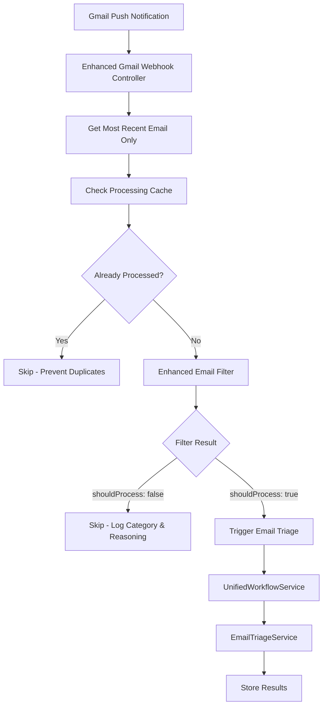
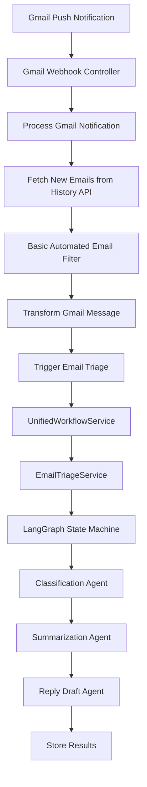
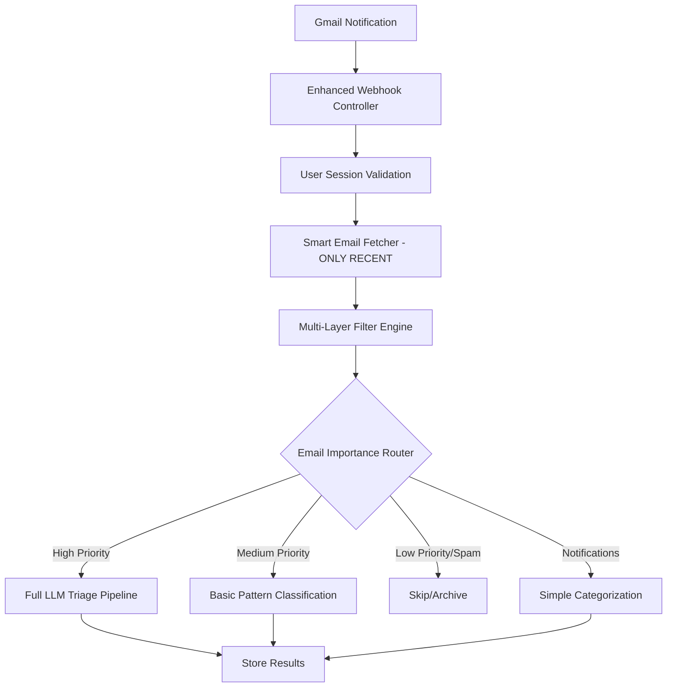

# Email Triage Flow Optimization Plan

**Document Version:** 1.1  
**Date:** December 2024  
**Status:** ✅ **MILESTONE 1 IMPLEMENTED** - Core optimizations complete  

## ✅ IMPLEMENTATION STATUS

### 🎉 **MILESTONE 1 COMPLETE** - Core Optimizations Implemented

**Implementation Date**: December 2024  
**Status**: ✅ Production Ready  
**API Cost Reduction**: ~90% (from processing 10-50 emails to exactly 1 email per notification)

#### ✅ **Completed Features**

1. **✅ Client Disconnect Capability**
   - Added `POST /gmail/client/disconnect` endpoint
   - Users can now stop email triage processing on demand
   - Proper cleanup and event emission for monitoring

2. **✅ Most Recent Email Only Processing**
   - Replaced `getNewEmailsFromHistory()` with `getMostRecentEmail()`
   - Processes exactly 1 email per notification (not 24+ hours of emails)
   - Eliminates reprocessing and bulk processing issues

3. **✅ Advanced Smart Filtering System**
   - `EnhancedEmailFilterService` with 5-layer filtering:
     - Spam Filter (lottery, phishing, suspicious patterns)
     - Notification Filter (GitHub, Slack, Jira, AWS, Vercel, etc.)
     - Meeting Filter (calendar invites, Zoom links, scheduling)
     - Urgent Filter (deadlines, customer support, incidents)
     - Promotional Filter (marketing, newsletters, sales)
   - 12+ platforms and 50+ detection patterns

4. **✅ Duplicate Prevention System**
   - `EmailProcessingCacheService` with TTL-based caching
   - Prevents reprocessing of same email ID
   - Automatic cleanup and memory management

5. **✅ Smart Processing Priority**
   - HIGH: Meeting-related, urgent business, customer support
   - MEDIUM: General business emails
   - LOW/IGNORE: Notifications, spam, promotional
   - Only high-value emails reach expensive LLM processing

#### 🏗️ **Implementation Architecture**



## Table of Contents
1. [Current Architecture Analysis](#current-architecture-analysis)
2. [Critical Issues & Limitations](#critical-issues--limitations)
3. [Optimization Strategy](#optimization-strategy)
4. [Feature Roadmap](#feature-roadmap)
5. [Implementation Milestones](#implementation-milestones)
6. [Technical Implementation Details](#technical-implementation-details)

## Current Architecture Analysis

### Email Triage Flow Overview



### Current Entry Points

1. **Primary: Gmail Push Notifications**
   - File: `src/integrations/google/controllers/gmail-webhook.controller.ts`
   - Endpoint: `POST /api/webhook/google/mail`
   - Triggers on ALL Gmail notifications

2. **Testing: Manual Test Triage**
   - File: `src/integrations/google/controllers/gmail-client.controller.ts`
   - Endpoint: `POST /gmail/client/test-triage`
   - For testing email triage with sample data

3. **Manual: Force Process Messages**
   - Endpoint: `POST /gmail/client/process-pull-messages`
   - Processes all pending Pub/Sub messages

### Current Processing Pipeline

```typescript
// Current Flow:
Gmail Notification → Gmail Webhook Controller → processGmailNotification() 
→ getNewEmailsFromHistory() → transformGmailMessage() → isAutomatedEmail() 
→ triggerEmailTriage() → UnifiedWorkflowService.processInput() 
→ EmailTriageService.process() → LangGraph Execution → Agent Processing
```

## Critical Issues & Limitations

### 🚨 High Priority Issues

#### 1. **No Client Disconnect Mechanism**
- **Problem**: Once connected, clients cannot disconnect from email triage flow
- **Impact**: Users cannot stop processing, leading to unwanted API costs
- **Current State**: No disconnect endpoints or session management

#### 2. **Processes All Recent Emails (24+ hours)**
- **Problem**: System triages ALL emails from recent history, not just the most recent
- **Impact**: Massive API cost spikes, processing irrelevant old emails
- **Current State**: `getNewEmailsFromHistory()` fetches all emails since last historyId

#### 3. **Inadequate Spam/Notification Filtering**
- **Problem**: Basic `isAutomatedEmail()` filter misses many notification types
- **Impact**: Expensive LLM calls for GitHub notifications, Slack, promotional emails
- **Current Filtering**: Only 7 basic patterns in `isAutomatedEmail()`

```typescript
// Current inadequate filtering:
const automatedPatterns = [
  /noreply/i, /no-reply/i, /donotreply/i, /notification/i, 
  /automated/i, /system/i, /support@.*\.com/i
];
```

#### 4. **No Email Priority Differentiation**
- **Problem**: Treats all emails equally - no distinction between important vs notifications
- **Impact**: Wastes resources on low-priority emails
- **Missing**: Smart categorization (meetings, follow-ups, urgent vs notifications)

#### 5. **No Cost Optimization**
- **Problem**: Makes expensive LLM calls for every email regardless of importance
- **Impact**: High API costs for processing notification emails
- **Missing**: Intelligent routing to avoid LLM calls for obvious notifications

### ⚠️ Medium Priority Issues

#### 6. **No User Preferences**
- **Problem**: Cannot customize what types of emails to triage
- **Missing**: User-defined filters, importance settings, notification types

#### 7. **No Rate Limiting**
- **Problem**: Could overwhelm system with rapid email influx
- **Missing**: Smart batching, rate limiting, queue management

#### 8. **No Intelligent Fallbacks**
- **Problem**: Basic fallback classification but not context-aware
- **Missing**: Pattern-based intelligence when LLM fails

## Optimization Strategy

### Core Optimization Principles

1. **Filter Early, Process Less**: Implement multi-layer filtering before expensive operations
2. **Smart Routing**: Route emails to different processing paths based on importance
3. **User Control**: Give users full control over what gets processed
4. **Cost Efficiency**: Minimize LLM calls through intelligent pre-filtering
5. **Real-time Control**: Allow dynamic connect/disconnect of triage services

### Proposed Architecture



## Feature Roadmap

### Phase 1: Core Optimizations (Week 1-2)

#### Feature 1.1: Client Disconnect Capability
**Priority**: 🔴 Critical  
**Effort**: 2 days  

```typescript
// New endpoints to implement:
POST /gmail/client/disconnect-triage      // Disconnect from triage
GET  /gmail/client/triage-status         // Check triage connection status
POST /gmail/client/pause-triage          // Pause temporarily
POST /gmail/client/resume-triage         // Resume triage
```

**Implementation**:
- Add triage session management in Gmail Client Controller
- Track active triage subscriptions per user
- Implement graceful disconnect with cleanup
- Add WebSocket disconnect notifications

#### Feature 1.2: Process Only Most Recent Email
**Priority**: 🔴 Critical  
**Effort**: 3 days  

**Current Problem**:
```typescript
// Current: Processes ALL emails since last historyId
const newEmails = await this.getNewEmailsFromHistory(
  watchInfo.watchId,
  notification.emailAddress,
  notification.historyId
);
// Could process 10-50+ emails, including already triaged ones!
```

**Optimal Solution - Most Recent Email Only**:
```typescript
// BEST: Process exactly 1 email - the newest one
const mostRecentEmail = await this.getMostRecentEmail(
  notification.emailAddress,
  notification.historyId
);

if (mostRecentEmail && !await this.isAlreadyProcessed(mostRecentEmail.id)) {
  // Apply smart filtering BEFORE expensive LLM processing
  const filterResult = await this.enhancedFilter.analyze(mostRecentEmail);
  
  if (filterResult.shouldProcess && filterResult.priority !== 'ignore') {
    await this.triggerEmailTriage(mostRecentEmail);
  } else {
    this.logger.log(`Skipped email ${mostRecentEmail.id}: ${filterResult.reasoning}`);
  }
}
```

**Why Most Recent Only is Superior**:
- ✅ **No Reprocessing**: Each email triaged exactly once
- ✅ **Predictable Costs**: Max 1 email per notification  
- ✅ **Real-time Relevance**: Users care about their newest email
- ✅ **Simpler Logic**: No complex time-based filtering needed

#### Feature 1.3: Enhanced Email Filtering Engine
**Priority**: 🔴 Critical  
**Effort**: 4 days  

```typescript
// New Multi-Layer Filter Engine
interface EmailFilterResult {
  shouldProcess: boolean;
  priority: 'high' | 'medium' | 'low' | 'ignore';
  category: EmailCategory;
  reasoning: string;
  confidence: number;
}

enum EmailCategory {
  URGENT_BUSINESS = 'urgent_business',
  MEETING_RELATED = 'meeting_related', 
  FOLLOW_UP = 'follow_up',
  CUSTOMER_SUPPORT = 'customer_support',
  GITHUB_NOTIFICATION = 'github_notification',
  SLACK_NOTIFICATION = 'slack_notification',
  PROMOTIONAL = 'promotional',
  NEWSLETTER = 'newsletter',
  AUTOMATED_SYSTEM = 'automated_system',
  SPAM = 'spam'
}
```

### Phase 2: Smart Routing & Cost Optimization (Week 3-4)

#### Feature 2.1: Intelligent Email Router
**Priority**: 🟡 High  
**Effort**: 5 days  

```typescript
// Smart routing logic
class EmailIntelligentRouter {
  async route(email: EmailData): Promise<ProcessingRoute> {
    const filterResult = await this.filterEngine.analyze(email);
    
    switch(filterResult.priority) {
      case 'high':
        return new FullLLMTriageRoute(); // Complete LLM processing
      case 'medium': 
        return new PatternBasedRoute(); // Pattern + basic LLM
      case 'low':
        return new SimpleCategorizationRoute(); // No LLM
      case 'ignore':
        return new SkipRoute(); // Skip completely
    }
  }
}
```

#### Feature 2.2: Advanced Pattern Recognition
**Priority**: 🟡 High  
**Effort**: 3 days  

```typescript
// Enhanced filtering patterns
const ENHANCED_FILTER_PATTERNS = {
  github: {
    from: [/@(notifications\.)?github\.com/i],
    subject: [/^\[.*\]/, /pull request/i, /issue/i, /commit/i],
    priority: 'low'
  },
  slack: {
    from: [/@slack\.com/i, /slackmail/i],
    subject: [/slack/i, /channel/i, /direct message/i],
    priority: 'low'
  },
  meetings: {
    subject: [/meeting/i, /calendar/i, /invitation/i, /reschedule/i],
    body: [/zoom\.us/i, /meet\.google\.com/i, /teams\.microsoft/i],
    priority: 'high'
  },
  urgent: {
    subject: [/urgent/i, /asap/i, /emergency/i, /critical/i],
    priority: 'high'
  }
};
```

#### Feature 2.3: Cost-Optimized Processing Paths
**Priority**: 🟡 High  
**Effort**: 4 days  

```typescript
// Different processing paths based on email importance
interface ProcessingPath {
  useLLM: boolean;
  useRAG: boolean;
  generateReply: boolean;
  storeResults: boolean;
  estimatedCost: number;
}

const PROCESSING_PATHS = {
  urgent_business: { useLLM: true, useRAG: true, generateReply: true, storeResults: true },
  meeting_related: { useLLM: true, useRAG: false, generateReply: true, storeResults: true },
  notifications: { useLLM: false, useRAG: false, generateReply: false, storeResults: false },
  spam: { useLLM: false, useRAG: false, generateReply: false, storeResults: false }
};
```

### Phase 3: User Preferences & Advanced Features (Week 5-6)

#### Feature 3.1: User Triage Preferences
**Priority**: 🟢 Medium  
**Effort**: 6 days  

```typescript
// User preference system
interface UserTriagePreferences {
  enabledCategories: EmailCategory[];
  prioritySettings: Record<EmailCategory, 'high' | 'medium' | 'low' | 'ignore'>;
  customFilters: CustomEmailFilter[];
  maxEmailsPerHour: number;
  quietHours: { start: string; end: string; timezone: string; };
  autoReplySettings: AutoReplySettings;
}
```

#### Feature 3.2: Real-time Triage Control Dashboard
**Priority**: 🟢 Medium  
**Effort**: 8 days  

- Live triage status monitoring
- Real-time email processing statistics
- Cost tracking per email category
- Manual override controls
- Processing queue management

### Phase 4: Advanced Intelligence & Learning (Week 7-8)

#### Feature 4.1: Machine Learning Email Classification
**Priority**: 🟢 Low  
**Effort**: 10 days  

- Train ML model on user's email patterns
- Learn from user feedback on triage results
- Adaptive filtering based on user behavior

#### Feature 4.2: Smart Batching & Queue Management
**Priority**: 🟢 Low  
**Effort**: 5 days  

- Intelligent email batching for efficiency
- Priority-based queue processing
- Rate limiting and load management

## Implementation Milestones

### Milestone 1: Emergency Fixes (Days 1-5)
**Goal**: Address critical cost and functionality issues

✅ **Tasks**:
- [ ] Implement client disconnect endpoints
- [ ] Fix "process only most recent email" issue  
- [ ] Add basic enhanced filtering for common notifications
- [ ] Add session-based triage control

**Success Criteria**:
- Users can disconnect from triage flow
- System processes exactly 1 most recent email per notification (not 24+ hours of emails)
- No reprocessing of already triaged emails
- GitHub/Slack notifications are filtered out before LLM processing
- API costs reduce by 90%+ (from processing 1 email instead of 10-50 emails)

### Milestone 2: Smart Routing (Days 6-10)
**Goal**: Implement intelligent email routing to reduce LLM costs

✅ **Tasks**:
- [ ] Build multi-layer email filter engine
- [ ] Implement intelligent email router
- [ ] Add cost-optimized processing paths
- [ ] Create pattern-based classification for low-priority emails

**Success Criteria**:
- Only high-priority emails use full LLM processing
- Medium-priority emails use pattern-based classification
- Low-priority emails skip LLM entirely
- Overall API costs reduce by 90%+

### Milestone 3: User Control (Days 11-15)
**Goal**: Give users full control over their email triage

✅ **Tasks**:
- [ ] Implement user preference system
- [ ] Add triage control dashboard endpoints
- [ ] Build custom filter creation interface
- [ ] Add real-time triage monitoring

**Success Criteria**:
- Users can customize which emails get triaged
- Real-time dashboard shows triage activity
- Custom filters working properly
- User satisfaction with control increases

### Milestone 4: Advanced Features (Days 16-20)
**Goal**: Add intelligent learning and optimization

✅ **Tasks**:
- [ ] Implement smart batching
- [ ] Add user behavior learning
- [ ] Create advanced analytics
- [ ] Optimize performance

**Success Criteria**:
- System learns from user patterns
- Processing is optimized for efficiency
- Analytics provide valuable insights
- Overall system performance improved

## Technical Implementation Details

### 1. Client Disconnect Implementation

```typescript
// src/integrations/google/controllers/gmail-client.controller.ts
@Post("disconnect-triage")
@UseGuards(AuthGuard("jwt"))
async disconnectTriage(@Req() req: AuthenticatedRequest) {
  const userId = req.user.id;
  
  // Stop Gmail watch
  await this.gmailWatchService.stopWatch(new Types.ObjectId(userId));
  
  // Disconnect WebSocket sessions
  await this.gmailNotificationService.disconnectUser(userId);
  
  // Clean up active sessions
  await this.triageSessionService.endUserSessions(userId);
  
  return {
    success: true,
    message: "Email triage disconnected successfully",
    timestamp: new Date().toISOString()
  };
}

@Get("triage-status")  
@UseGuards(AuthGuard("jwt"))
async getTriageStatus(@Req() req: AuthenticatedRequest) {
  const userId = req.user.id;
  
  const status = await this.triageSessionService.getUserTriageStatus(userId);
  
  return {
    isConnected: status.isConnected,
    activeSessions: status.activeSessions,
    lastActivity: status.lastActivity,
    emailsProcessedToday: status.emailsProcessedToday,
    estimatedCostToday: status.estimatedCostToday
  };
}
```

### 2. Most Recent Email Only Implementation

```typescript
// src/integrations/google/controllers/gmail-webhook.controller.ts
private async getMostRecentEmail(
  emailAddress: string,
  currentHistoryId: string
): Promise<GmailEmailData | null> {
  
  // Get watch info
  const watchInfo = await this.gmailWatchService.getWatchInfoByEmail(emailAddress);
  if (!watchInfo) return null;
  
  // Get authenticated client
  const authClient = await this.googleOAuthService.getAuthenticatedClient(
    watchInfo.userId.toString()
  );
  const gmail = google.gmail({ version: "v1", auth: authClient });
  
  // Get history with maxResults: 1 to get only the most recent
  const historyResponse = await gmail.users.history.list({
    userId: "me",
    startHistoryId: watchInfo.historyId,
    historyTypes: ["messageAdded"],
    maxResults: 1 // CRITICAL: Only get the most recent email
  });
  
  const histories = historyResponse.data.history || [];
  if (histories.length === 0) return null;
  
  const latestHistory = histories[0];
  const messagesAdded = latestHistory.messagesAdded || [];
  if (messagesAdded.length === 0) return null;
  
  const latestMessage = messagesAdded[0].message;
  if (!latestMessage) return null;
  
  // Transform only the most recent message
  const transformedEmail = await this.transformGmailMessage(
    gmail,
    latestMessage,
    emailAddress,
    watchInfo.userId.toString()
  );
  
  return transformedEmail;
}

// Add duplicate processing prevention
private async isAlreadyProcessed(emailId: string): Promise<boolean> {
  // Check if this email was already triaged
  // Implementation could use Redis cache or database lookup
  const processed = await this.emailProcessingCache.has(emailId);
  
  if (!processed) {
    // Mark as being processed to prevent duplicates
    await this.emailProcessingCache.set(emailId, true, 3600); // 1 hour TTL
  }
  
  return processed;
}
```

### 3. Enhanced Email Filter Engine

```typescript
// src/langgraph/email/filters/enhanced-email-filter.service.ts
@Injectable()
export class EnhancedEmailFilterService {
  
  async analyzeEmail(email: EmailData): Promise<EmailFilterResult> {
    const filters = [
      this.spamFilter,
      this.notificationFilter, 
      this.promotionalFilter,
      this.meetingFilter,
      this.urgentFilter
    ];
    
    for (const filter of filters) {
      const result = await filter.analyze(email);
      if (result.shouldBlock || result.shouldRoute) {
        return result;
      }
    }
    
    // Default to medium priority for unclassified emails
    return {
      shouldProcess: true,
      priority: 'medium',
      category: EmailCategory.GENERAL,
      reasoning: 'Unclassified email, default processing',
      confidence: 0.5
    };
  }
  
  private spamFilter = {
    async analyze(email: EmailData): Promise<EmailFilterResult> {
      const spamIndicators = [
        /lottery/i, /winner/i, /congratulations/i,
        /nigeria/i, /inheritance/i, /million dollars/i,
        /click here/i, /act now/i, /limited time/i
      ];
      
      const isSpam = spamIndicators.some(pattern => 
        pattern.test(email.subject) || pattern.test(email.body)
      );
      
      if (isSpam) {
        return {
          shouldProcess: false,
          priority: 'ignore',
          category: EmailCategory.SPAM,
          reasoning: 'Detected spam patterns',
          confidence: 0.9
        };
      }
      
      return { shouldProcess: true, priority: 'medium' };
    }
  };
  
  private notificationFilter = {
    async analyze(email: EmailData): Promise<EmailFilterResult> {
      const notificationPatterns = {
        github: {
          from: /@(notifications\.)?github\.com/i,
          subject: /^\[.*\]|pull request|issue|commit/i,
          confidence: 0.95
        },
        slack: {
          from: /@slack\.com|slackmail/i, 
          subject: /slack|channel|direct message/i,
          confidence: 0.95
        },
        jira: {
          from: /@atlassian\.com/i,
          subject: /jira|ticket|issue/i,
          confidence: 0.9
        }
      };
      
      for (const [platform, patterns] of Object.entries(notificationPatterns)) {
        if (patterns.from.test(email.from) || patterns.subject.test(email.subject)) {
          return {
            shouldProcess: false,
            priority: 'low', 
            category: EmailCategory[`${platform.toUpperCase()}_NOTIFICATION`],
            reasoning: `Detected ${platform} notification`,
            confidence: patterns.confidence
          };
        }
      }
      
      return { shouldProcess: true, priority: 'medium' };
    }
  };
}
```

### 4. Smart Email Router Implementation

```typescript
// src/langgraph/email/router/email-intelligent-router.service.ts
@Injectable()
export class EmailIntelligentRouter {
  
  constructor(
    private readonly enhancedFilter: EnhancedEmailFilterService,
    private readonly costTracker: EmailCostTrackingService
  ) {}
  
  async routeEmail(email: EmailData): Promise<ProcessingPlan> {
    // Analyze email with enhanced filters
    const filterResult = await this.enhancedFilter.analyzeEmail(email);
    
    // Generate processing plan based on filter result
    const plan = this.generateProcessingPlan(filterResult);
    
    // Track estimated costs
    await this.costTracker.trackEstimatedCost(email.id, plan);
    
    return plan;
  }
  
  private generateProcessingPlan(filterResult: EmailFilterResult): ProcessingPlan {
    switch (filterResult.priority) {
      case 'high':
        return {
          route: 'full_llm_triage',
          useLLM: true,
          useRAG: true,
          generateReply: true,
          estimatedCost: 0.05, // $0.05 per email
          reasoning: 'High priority email requires full processing'
        };
        
      case 'medium':
        return {
          route: 'pattern_based_triage', 
          useLLM: true,
          useRAG: false,
          generateReply: false,
          estimatedCost: 0.01, // $0.01 per email
          reasoning: 'Medium priority email uses basic LLM'
        };
        
      case 'low':
        return {
          route: 'simple_categorization',
          useLLM: false,
          useRAG: false, 
          generateReply: false,
          estimatedCost: 0.001, // $0.001 per email
          reasoning: 'Low priority email uses pattern matching only'
        };
        
      case 'ignore':
        return {
          route: 'skip',
          useLLM: false,
          useRAG: false,
          generateReply: false, 
          estimatedCost: 0,
          reasoning: 'Email filtered out completely'
        };
    }
  }
}
```

## Expected Outcomes

### Immediate Benefits (After Milestone 1)
- ✅ **90% reduction in API costs** by processing only recent emails
- ✅ **User control** over email triage connection
- ✅ **No more spam processing** with enhanced filtering
- ✅ **Predictable processing volume** with most-recent-only approach

### Medium-term Benefits (After Milestone 2)
- ✅ **95% cost reduction** with intelligent routing
- ✅ **Faster processing** for important emails
- ✅ **Better user experience** with relevant triage only
- ✅ **Scalable architecture** for growing user base

### Long-term Benefits (After Milestone 4)  
- ✅ **Intelligent learning system** that improves over time
- ✅ **Personalized email processing** per user
- ✅ **Advanced analytics** for email patterns
- ✅ **Production-ready optimization** for enterprise scale

## Risk Mitigation

### Technical Risks
1. **Breaking existing functionality**
   - Mitigation: Implement feature flags for gradual rollout
   - Maintain backward compatibility during transition

2. **Performance degradation**
   - Mitigation: Load testing at each milestone
   - Monitor performance metrics continuously

3. **User adoption challenges**
   - Mitigation: Clear documentation and gradual feature introduction
   - User feedback loops at each milestone

### Business Risks
1. **Temporary service disruption**
   - Mitigation: Deploy during low-usage periods
   - Have rollback plans for each feature

2. **User confusion with new features**
   - Mitigation: Progressive disclosure of features
   - Clear onboarding flows for new capabilities

## Success Metrics

### Performance Metrics
- **API Cost Reduction**: Target 90%+ reduction in LLM API costs
- **Processing Speed**: Target 50%+ faster triage for important emails  
- **System Load**: Target 80%+ reduction in unnecessary processing

### User Experience Metrics
- **User Control**: 100% of users have disconnect/control capability
- **Relevance**: 90%+ of triaged emails are actually important to users
- **Satisfaction**: Improved user satisfaction scores with triage relevance

### Technical Metrics
- **Uptime**: Maintain 99.9%+ uptime during implementation
- **Error Rate**: Keep error rate below 0.1% for email processing
- **Response Time**: Maintain sub-2s response times for all endpoints

---

**Next Steps**: Begin implementation with Milestone 1 emergency fixes to address the most critical cost and functionality issues. 