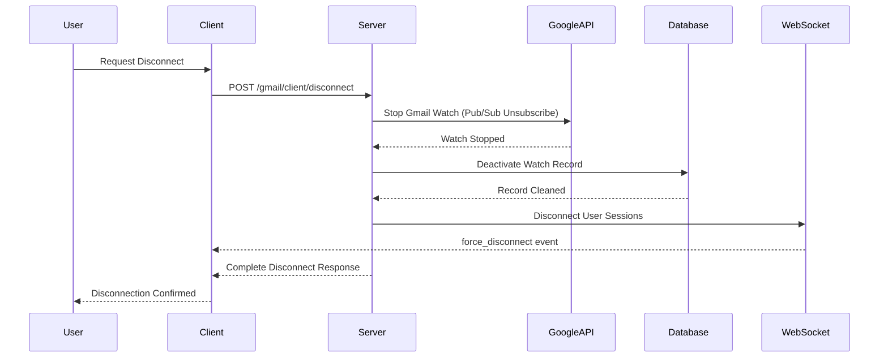
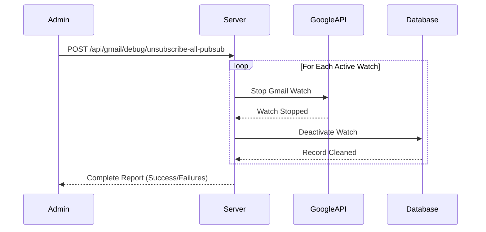

# Gmail Pub/Sub Disconnect & Unsubscribe Functionality

**Document Version:** 1.0  
**Date:** December 2024  
**Status:** Production Ready  

## Overview

This document outlines the enhanced Gmail Pub/Sub disconnect functionality that allows users to completely unsubscribe from Google Pub/Sub notifications and provides admin capabilities to manage all subscriptions.

## 🚀 New Features Implemented

### 1. **Enhanced User Disconnect** 
- **Endpoint**: `POST /gmail/client/disconnect`
- **Complete Pub/Sub Unsubscription**: Not just watch stopping, but full Google API unsubscription
- **WebSocket Session Management**: Disconnects all user WebSocket sessions
- **Database Cleanup**: Removes watch records from database
- **Processing Cache Cleanup**: Clears user-specific processing data

### 2. **Admin Nuclear Unsubscribe**
- **Endpoint**: `POST /api/gmail/debug/unsubscribe-all-pubsub`
- **Unsubscribes ALL Users**: Stops all Gmail watches and Pub/Sub subscriptions
- **Comprehensive Cleanup**: Database, Google API, and session management
- **Detailed Reporting**: Complete success/failure tracking per user

### 3. **WebSocket Force Disconnect**
- **New Event**: `force_disconnect`
- **User-Specific Disconnection**: Disconnect sessions for specific users
- **Real-time Notification**: Clients receive immediate disconnect notification

## Technical Implementation

### Enhanced User Disconnect Flow



### Admin Nuclear Unsubscribe Flow



## API Endpoints

### 1. User Disconnect
```bash
POST /gmail/client/disconnect
Authorization: Bearer <JWT_TOKEN>
Content-Type: application/json
```

**Response:**
```json
{
  "success": true,
  "message": "Successfully disconnected from email triage and Pub/Sub notifications",
  "userId": "user_123",
  "userEmail": "user@company.com",
  "actions": {
    "gmailWatchStopped": true,
    "googleApiWatchStopped": true,
    "databaseCleaned": true,
    "websocketSessionsCleared": true,
    "processingCacheCleared": true
  },
  "details": {
    "watchInfo": {
      "watchId": "12345",
      "googleEmail": "user@company.com",
      "historyId": "67890",
      "isActive": false,
      "notificationsReceived": 15
    },
    "errors": []
  },
  "nextSteps": {
    "status": "fully_disconnected",
    "description": "You are now completely disconnected from email triage and Google Pub/Sub notifications",
    "recommendations": [
      "No more email notifications will be sent to our servers",
      "Your Gmail access tokens remain active for other operations",
      "To reconnect: POST /gmail/client/setup-notifications",
      "To revoke all access: Use Google Account settings"
    ]
  }
}
```

### 2. Admin Nuclear Unsubscribe
```bash
POST /api/gmail/debug/unsubscribe-all-pubsub
Authorization: Bearer <JWT_TOKEN>
Content-Type: application/json
```

**Response:**
```json
{
  "success": true,
  "message": "Nuclear unsubscribe completed successfully - 5 Gmail watches stopped and Pub/Sub unsubscribed",
  "summary": {
    "totalWatchesFound": 5,
    "googleApiUnsubscribed": 5,
    "databaseCleaned": 5,
    "authenticationFailed": 0,
    "errors": []
  },
  "details": {
    "processedWatches": [
      {
        "watchId": "12345",
        "googleEmail": "user1@company.com",
        "userId": "user_123",
        "googleApiStopped": true,
        "databaseCleaned": true,
        "authenticationValid": true,
        "error": null
      }
    ],
    "failedWatches": []
  },
  "impact": {
    "description": "All Gmail push notifications to this server have been stopped",
    "pubsubStatus": "All user Pub/Sub subscriptions have been terminated",
    "userImpact": "Users will no longer receive email triage notifications",
    "recovery": "Users must re-setup notifications individually using POST /gmail/client/setup-notifications"
  },
  "nextSteps": {
    "immediate": [
      "Monitor server logs to confirm no more push notifications are received",
      "Check Google Cloud Console Pub/Sub subscriptions for any remaining subscriptions",
      "Notify users that email triage has been disabled"
    ],
    "recovery": [
      "Users can re-enable email triage using POST /gmail/client/setup-notifications",
      "Consider implementing user notification system to inform about the reset",
      "Monitor system for proper re-activation by users"
    ]
  }
}
```

## WebSocket Events

### New Force Disconnect Event
```typescript
interface ForceDisconnectEventDTO {
  reason: string;
  userEmail: string;
  timestamp: string;
}

// Example:
{
  "reason": "User requested disconnect from email triage",
  "userEmail": "user@company.com",
  "timestamp": "2024-12-20T10:35:00.000Z"
}
```

### Client Handling
```typescript
socket.on('force_disconnect', (data: ForceDisconnectEventDTO) => {
  console.log('Force disconnected by server:', data);
  // Handle forced disconnection
  this.handleForceDisconnect(data);
});
```

## Technical Components Added

### 1. Enhanced Gmail Client Controller
**File**: `src/integrations/google/controllers/gmail-client.controller.ts`
- **Method**: `disconnectFromEmailTriage()`
- **Features**: Complete Pub/Sub unsubscription, WebSocket management, database cleanup

### 2. Admin Debug Controller
**File**: `src/integrations/google/controllers/gmail-debug.controller.ts`
- **Method**: `unsubscribeAllPubSubNotifications()`
- **Features**: Nuclear option to unsubscribe all users

### 3. WebSocket Gateway Enhancement
**File**: `src/integrations/google/services/gmail-notification.gateway.ts`
- **Method**: `disconnectUserSessions()`
- **Features**: Force disconnect specific user sessions

### 4. Notification Service Enhancement
**File**: `src/integrations/google/services/gmail-notification.service.ts`
- **Method**: `disconnectUserSessions()`
- **Features**: Service layer for user session management

## Security & Safety Features

### User Disconnect Safety
- ✅ **Graceful Degradation**: Partial success if some steps fail
- ✅ **Detailed Error Reporting**: Specific failure reasons
- ✅ **Event Emission**: Monitoring and WebSocket notifications
- ✅ **Authentication Required**: JWT token validation

### Admin Nuclear Option Safety
- ⚠️ **Requires Admin Access**: JWT authentication required
- ⚠️ **Comprehensive Logging**: Detailed operation logging
- ⚠️ **Rollback Guidance**: Clear recovery instructions
- ⚠️ **Impact Assessment**: Clear warning about consequences

## Monitoring & Logging

### User Disconnect Logs
```
🔌 DISCONNECT: User user_123 (user@company.com) disconnecting from email triage and Pub/Sub notifications
✅ DISCONNECT: Stopped Gmail watch via Google API (Pub/Sub unsubscribed) for user: user_123
✅ DISCONNECT: Cleaned up database watch for user: user_123
✅ DISCONNECT: Cleared WebSocket sessions for: user@company.com
🎯 DISCONNECT SUMMARY for user_123:
  - Gmail watch stopped: true
  - Google API watch stopped (Pub/Sub unsubscribed): true
  - Database cleaned: true
  - WebSocket sessions cleared: true
  - Processing cache cleared: true
  - Errors: 0
```

### Admin Nuclear Logs
```
🚨 ADMIN: Starting nuclear unsubscribe - stopping ALL Gmail watches and Pub/Sub subscriptions
📊 Found 5 active watches to unsubscribe
🛑 Processing watch for: user1@company.com (12345)
✅ Stopped Gmail watch (Pub/Sub unsubscribed) for: user1@company.com
✅ Deactivated database watch for: user1@company.com
🎯 NUCLEAR UNSUBSCRIBE SUMMARY:
  - Total watches found: 5
  - Google API unsubscribed: 5
  - Database cleaned: 5
  - Authentication failed: 0
  - Errors: 0
```

## Usage Examples

### User Disconnect (Client-Side)
```typescript
// Complete disconnect from email triage
const disconnectFromEmailTriage = async () => {
  try {
    const response = await fetch('/gmail/client/disconnect', {
      method: 'POST',
      headers: {
        'Authorization': `Bearer ${authToken}`,
        'Content-Type': 'application/json'
      }
    });
    
    const result = await response.json();
    
    if (result.success) {
      console.log('Successfully disconnected:', result.message);
      // Handle successful disconnection
      handleDisconnectSuccess(result);
    } else {
      console.error('Disconnect failed:', result.message);
      // Handle partial failure
      handleDisconnectPartialFailure(result);
    }
  } catch (error) {
    console.error('Disconnect error:', error);
    // Handle complete failure
    handleDisconnectError(error);
  }
};
```

### Admin Nuclear Unsubscribe
```bash
# Stop all Gmail watches and Pub/Sub subscriptions for all users
curl -X POST https://your-server.com/api/gmail/debug/unsubscribe-all-pubsub \
  -H "Authorization: Bearer $ADMIN_JWT_TOKEN" \
  -H "Content-Type: application/json"
```

## Migration & Rollback

### Before Using Nuclear Option
1. **Notify Users**: Inform users about the planned disconnection
2. **Backup Data**: Ensure user watch configurations are backed up
3. **Monitor Impact**: Prepare monitoring for the aftermath

### After Nuclear Unsubscribe
1. **Verify Silence**: Confirm no more push notifications in logs
2. **User Communication**: Notify users they need to re-setup
3. **Monitor Re-connections**: Track user re-activation rates

### Recovery Process
```bash
# Users must individually re-setup notifications
POST /gmail/client/setup-notifications
```

## Troubleshooting

### Common Issues

#### User Disconnect Fails
- **Check Authentication**: Verify JWT token is valid
- **Check Google API**: Ensure user's Google tokens are still valid
- **Check Database**: Verify watch record exists

#### Admin Nuclear Fails
- **Check Admin Permissions**: Verify admin-level JWT token
- **Check Bulk Operations**: Some users may have expired tokens
- **Check Google Quotas**: Verify API rate limits not exceeded

### Error Codes
- **401**: Authentication failed
- **404**: No active watch found (may be success)
- **403**: Insufficient permissions (admin operations)
- **500**: Internal server error

## Future Enhancements

### Planned Features
1. **Selective Admin Disconnect**: Disconnect specific users by email
2. **Scheduled Disconnections**: Time-based disconnection scheduling
3. **User Notification System**: Automatic user notification of disconnections
4. **Reconnection Analytics**: Track user reconnection patterns

### Monitoring Improvements
1. **Dashboard Integration**: Real-time disconnect monitoring
2. **Alert System**: Notifications for mass disconnections
3. **Usage Analytics**: Track disconnect reasons and patterns

## Conclusion

The enhanced Gmail Pub/Sub disconnect functionality provides:
- ✅ **Complete User Control**: Users can fully disconnect from Pub/Sub notifications
- ✅ **Admin Management**: Nuclear option for emergency situations
- ✅ **Production Ready**: Comprehensive error handling and logging
- ✅ **WebSocket Integration**: Real-time client notifications
- ✅ **Security Focused**: Proper authentication and authorization

This implementation ensures users have complete control over their email triage subscriptions while providing administrators with powerful management capabilities for system-wide operations. 