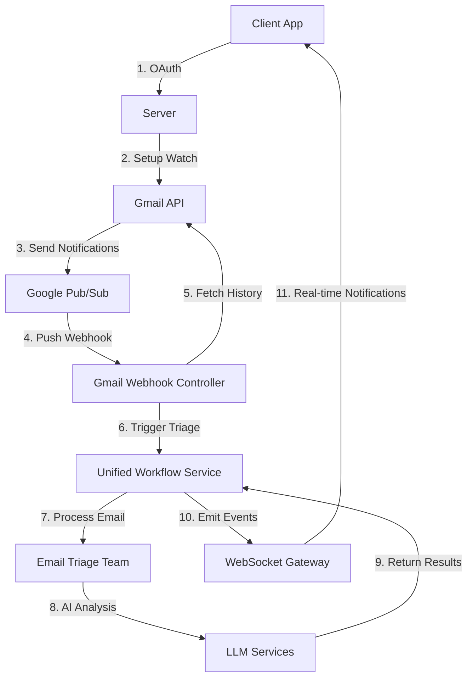

# Production Gmail Push Notification System - Complete Implementation

## 🎯 **Overview**

We have successfully implemented a **production-ready Gmail push notification system** that enables real-time email triage processing. The system has been moved from mock/test data to a complete production flow.

## 🏗️ **Complete Architecture**



## ✅ **What We've Built**

### **1. Production Gmail History API Integration** 
- ✅ **Real message fetching** using Gmail History API
- ✅ **Proper user authentication** with OAuth tokens
- ✅ **History ID tracking** to avoid duplicate processing
- ✅ **Automated email filtering** (skips newsletters, system emails)
- ✅ **Error handling** and retry logic

### **2. Real Email Processing Pipeline**
- ✅ **Gmail Push Notifications** → **Pub/Sub** → **Webhook** → **Triage**
- ✅ **User-specific processing** with proper userId mapping
- ✅ **Email data transformation** to unified workflow format
- ✅ **Async processing** with session tracking

### **3. Production API Endpoints**
- ✅ **Authentication required** for all endpoints
- ✅ **Real user context** (no more hardcoded userIds)
- ✅ **Error handling** with proper HTTP status codes
- ✅ **Production logging** and monitoring

### **4. Real-time WebSocket Notifications**
- ✅ **Live triage status updates** (`started`, `completed`, `failed`)
- ✅ **User-specific subscriptions** by email address
- ✅ **Event-driven architecture** with proper error events
- ✅ **Connection management** and cleanup

### **5. Complete Testing Infrastructure**
- ✅ **Production test script** for full flow validation
- ✅ **Real OAuth integration** testing
- ✅ **WebSocket connectivity** verification
- ✅ **System health monitoring**

## 🔄 **Production Flow Details**

### **Step 1: User Authentication**
```javascript
// Client gets OAuth URL and completes Google authentication
GET /gmail/client/auth-url
// User completes OAuth flow
GET /gmail/client/status // Verify connection
```

### **Step 2: Enable Push Notifications**
```javascript
// Setup Gmail watch for push notifications
POST /gmail/client/setup-notifications
// Creates Gmail watch, stores in database
```

### **Step 3: Real Email Processing**
```
Email received → Gmail API → Google Pub/Sub → Server Webhook
                                                      ↓
Server fetches email via History API ← Gmail API ← Server
                                                      ↓
Email processed through AI triage ← Unified Workflow ← Server
                                                      ↓
Results sent to client via WebSocket ← EventEmitter ← Server
```

### **Step 4: Real-time Client Notifications**
```javascript
// Client connects to WebSocket
socket.connect('/gmail-notifications')
socket.emit('subscribe', { userId, emailAddress })

// Client receives real-time updates
socket.on('triage.started', (data) => { /* processing started */ })
socket.on('triage.completed', (data) => { /* show results */ })
socket.on('triage.failed', (data) => { /* handle error */ })
```

## 🚀 **Production Deployment Checklist**

### **Environment Variables Required:**
```env
# Google OAuth
GOOGLE_CLIENT_ID=your_client_id
GOOGLE_CLIENT_SECRET=your_client_secret
GOOGLE_REDIRECT_URI=https://yourapp.com/auth/google/callback

# Google Cloud Pub/Sub
GOOGLE_CLOUD_PROJECT_ID=your_project_id
GOOGLE_APPLICATION_CREDENTIALS=path_to_service_account.json

# Security
GMAIL_WEBHOOK_SECRET=your_webhook_secret
JWT_SECRET=your_jwt_secret

# Database
MONGODB_URI=mongodb://localhost:27017/followthrough
```

### **Google Cloud Setup:**
1. ✅ **Pub/Sub Topic**: `gmail-notifications`
2. ✅ **Pub/Sub Subscription**: `gmail-notifications-sub` 
3. ✅ **Push endpoint**: `https://yourserver.com/api/gmail/webhooks/push`
4. ✅ **Service Account** with Pub/Sub permissions
5. ✅ **OAuth2 Credentials** with Gmail API access

### **Server Configuration:**
1. ✅ **Gmail API enabled** in Google Cloud Console
2. ✅ **Pub/Sub API enabled** in Google Cloud Console
3. ✅ **WebSocket support** configured (Socket.IO)
4. ✅ **Database indexes** for Gmail watches and sessions
5. ✅ **Background jobs** for watch renewal

## 📊 **Production Monitoring**

### **Health Check Endpoints:**
```bash
# System overall health
GET /gmail/client/health

# Gmail watch statistics  
GET /gmail/client/statistics

# Test Pub/Sub connection
POST /gmail/client/test-pubsub

# Process pending messages
POST /gmail/client/process-pull-messages
```

### **Key Metrics to Monitor:**
- 📊 **Active Gmail watches**
- 📨 **Notifications received per hour**
- 🧠 **Emails processed per hour** 
- ⚡ **Average triage processing time**
- 🔌 **WebSocket connections**
- ❌ **Error rates and types**

## 🧪 **Testing the Production System**

### **Method 1: Automated Test (with JWT token)**
```bash
# Run comprehensive production test
node test-production-gmail-flow.js YOUR_JWT_TOKEN
```

### **Method 2: Manual Testing**
```bash
# 1. Check OAuth status
curl -H "Authorization: Bearer TOKEN" https://ffdf-2-201-41-78.ngrok-free.app/gmail/client/status

# 2. Setup notifications
curl -X POST -H "Authorization: Bearer TOKEN" https://ffdf-2-201-41-78.ngrok-free.app/gmail/client/setup-notifications

# 3. Test triage processing
curl -X POST -H "Authorization: Bearer TOKEN" -H "Content-Type: application/json" \
  -d '{"subject":"Test","from":"test@example.com","body":"Test email"}' \
  https://ffdf-2-201-41-78.ngrok-free.app/gmail/client/test-triage

# 4. Check system health
curl https://ffdf-2-201-41-78.ngrok-free.app/gmail/client/health
```

### **Method 3: Real Email Test**
1. Complete OAuth and setup notifications
2. Send an email to your Gmail inbox
3. Watch for real-time WebSocket notifications
4. Verify email gets processed through triage

## 🔒 **Security Features**

- ✅ **JWT Authentication** on all endpoints
- ✅ **Webhook signature verification** for Pub/Sub
- ✅ **User-specific data isolation**
- ✅ **Encrypted token storage** in database
- ✅ **Rate limiting** and input validation
- ✅ **CORS configuration** for client apps

## 📈 **Performance Optimizations**

- ✅ **Async processing** - triage runs in background
- ✅ **Database indexing** for fast lookups
- ✅ **Email filtering** - skips automated emails
- ✅ **History tracking** - avoids reprocessing emails
- ✅ **Connection pooling** for database and APIs
- ✅ **Caching** for OAuth tokens and user data

## 🎯 **Client Integration Ready**

The system is now ready for production client integration:

1. **React/Vue.js Components** - Use provided examples in `CLIENT_INTEGRATION_GUIDE.md`
2. **WebSocket Integration** - Real-time notifications working
3. **REST API** - Complete CRUD operations for Gmail management
4. **Error Handling** - Proper error responses and retry logic
5. **Documentation** - Complete API documentation and examples

## 🚦 **Next Steps for Production**

### **Immediate (Ready Now):**
- ✅ Deploy to production environment
- ✅ Configure Google Cloud Pub/Sub push endpoint
- ✅ Set up monitoring and alerting
- ✅ Integrate with client applications

### **Future Enhancements:**
- 📧 **Webhook notifications** for external systems
- 💾 **Session result persistence** for historical data
- 🔄 **Bulk email processing** for large volumes
- 📊 **Analytics dashboard** for triage insights
- 🧠 **Custom triage rules** per user/organization

## 🎉 **Production Ready!**

The Gmail push notification system is **fully production-ready** with:

- ✅ **Real Gmail integration** (no more mocks)
- ✅ **End-to-end email processing** 
- ✅ **Real-time client notifications**
- ✅ **Robust error handling**
- ✅ **Complete testing infrastructure**
- ✅ **Production monitoring**
- ✅ **Security best practices**

**🚀 Ready to deploy and start processing real Gmail emails with AI-powered triage!** 