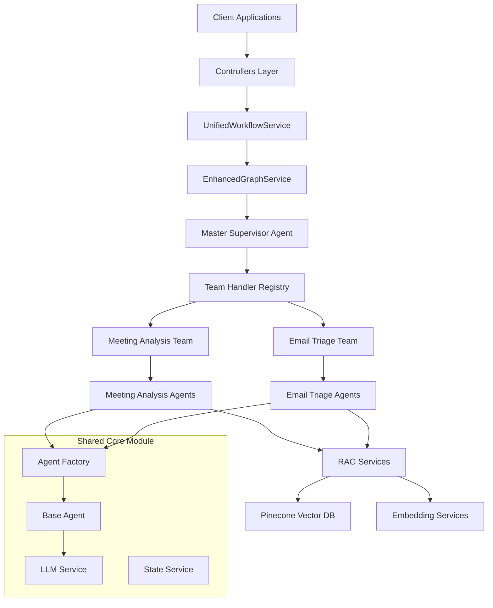
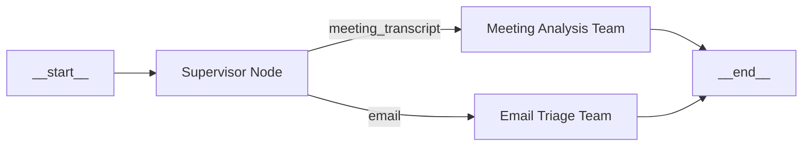
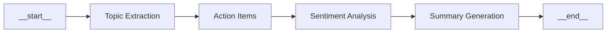
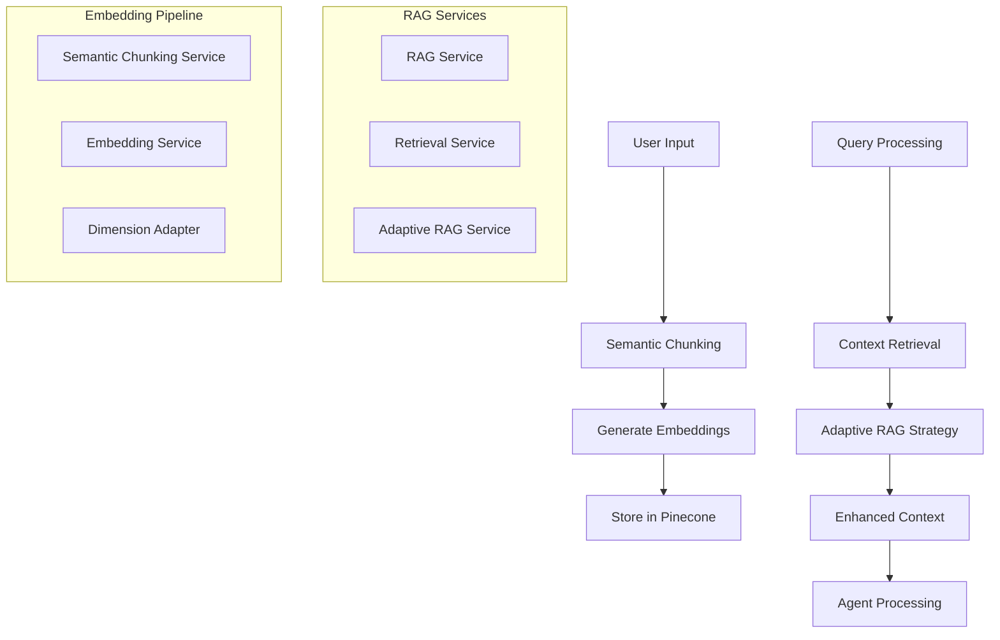

# Agentic Workflows Architecture Overview

## Table of Contents
1. [System Architecture](#system-architecture)
2. [Module Organization](#module-organization)
3. [Core Components](#core-components)
4. [Agent Types & Hierarchies](#agent-types--hierarchies)
5. [Graph Execution Flow](#graph-execution-flow)
6. [RAG Integration](#rag-integration)
7. [Data Flow & State Management](#data-flow--state-management)
8. [Team Handler Pattern](#team-handler-pattern)

## System Architecture

Our agentic workflow system is built on a hierarchical, modular architecture that leverages NestJS's dependency injection, LangGraph for workflow orchestration, and RAG (Retrieval-Augmented Generation) for enhanced context.

### High-Level Architecture Diagram



## Module Organization

### 1. SharedCoreModule
**Purpose**: Provides ALL shared services and eliminates circular dependencies

```typescript
// src/shared/shared-core.module.ts
@Module({
  providers: [
    // Core infrastructure
    LlmService,
    StateService,
    EmbeddingService,
    
    // Pinecone services
    PineconeService,
    DimensionAdapterService,
    
    // Individual agents
    TopicExtractionAgent,
    ActionItemAgent,
    SentimentAnalysisAgent,
    SummaryAgent,
    ParticipationAgent,
    ContextIntegrationAgent,
    MasterSupervisorAgent,
    
    // RAG services
    RagService,
    RetrievalService,
    AdaptiveRagService,
    
    // Agent factory
    AgentFactory,
  ]
})
export class SharedCoreModule {}
```

### 2. LanggraphCoreModule
**Purpose**: Provides graph execution and team coordination services

```typescript
// src/langgraph/core/core.module.ts
@Module({
  providers: [
    EnhancedGraphService,
    GraphExecutionService,
    TeamHandlerRegistry,
  ]
})
export class LanggraphCoreModule {}
```

### 3. Feature Modules
- **MeetingAnalysisModule**: Meeting-specific workflows
- **EmailWorkflowModule**: Email triage workflows

## Core Components

### 1. Enhanced Graph Service
The central orchestrator that manages the master supervisor graph.

```typescript
// Key responsibilities:
- Building and maintaining the master supervisor graph
- Processing input through appropriate teams
- Managing routing between specialized teams
- Handling error scenarios and fallbacks
```

**Graph Initialization Flow:**
```
OnModuleInit() → buildMasterSupervisorGraph() → Graph stored for reuse
```

### 2. Team Handler Registry
A registry pattern that maps team names to their handlers.

```typescript
// src/langgraph/core/team-handler-registry.service.ts
@Injectable()
export class TeamHandlerRegistry {
  registerHandler(teamName: string, handler: TeamHandler): void
  getHandler(teamName: string): TeamHandler | undefined
}
```

### 3. Unified Workflow Service
High-level service that coordinates entire workflow execution.

```typescript
// Main workflow coordination:
1. Session management (MongoDB storage)
2. Progress tracking and WebSocket updates
3. Input routing to appropriate teams
4. Result aggregation and storage
```

## Agent Types & Hierarchies

### Agent Hierarchy Structure

```
MasterSupervisorAgent (Level 1)
├── Meeting Analysis Team (Level 2)
│   ├── TopicExtractionAgent (Level 3)
│   ├── ActionItemAgent (Level 3)
│   ├── SentimentAnalysisAgent (Level 3)
│   ├── SummaryAgent (Level 3)
│   ├── ParticipationAgent (Level 3)
│   └── ContextIntegrationAgent (Level 3)
└── Email Triage Team (Level 2)
    ├── EmailClassificationAgent (Level 3)
    ├── EmailSummarizationAgent (Level 3)
    └── EmailReplyDraftAgent (Level 3)
```

### 1. Base Agent
All agents inherit from `BaseAgent` which provides:

```typescript
export class BaseAgent {
  protected readonly name: string;
  protected readonly systemPrompt: string;
  protected readonly llmOptions: LLMOptions;
  
  // Core methods:
  async processMessage(content: string): Promise<string>
  async processState(state: any): Promise<any>
  protected getChatModel(): BaseChatModel
}
```

### 2. Specialized Agents
Each specialized agent extends `BaseAgent` with domain-specific logic:

```typescript
// Example: TopicExtractionAgent
@Injectable()
export class TopicExtractionAgent extends BaseAgent {
  async extractTopics(transcript: string): Promise<Topic[]> {
    // Specialized topic extraction logic
  }
}
```

### 3. RAG-Enhanced Agents
Some agents have RAG capabilities for enhanced context:

```typescript
@Injectable()
export class RagTopicExtractionAgent extends BaseAgent {
  constructor(
    @Inject(RAG_SERVICE) private readonly ragService: RagService
  ) {}
  
  async extractTopicsWithContext(transcript: string): Promise<Topic[]> {
    // Retrieve relevant context
    const context = await this.ragService.getContext(transcript);
    // Enhanced extraction with context
  }
}
```

## Graph Execution Flow

### 1. Master Supervisor Graph Flow



### 2. Meeting Analysis Graph Flow



### 3. Execution Phases

**Phase 1: Initialization**
```typescript
// Module starts up
EnhancedGraphService.onModuleInit()
  → buildMasterSupervisorGraph()
  → Graph structure created and cached
```

**Phase 2: Request Processing**
```typescript
// Client request comes in
Controller.analyzeTranscript(dto)
  → UnifiedWorkflowService.processInput()
  → EnhancedGraphService.processMasterSupervisorInput()
  → Graph execution with routing
```

**Phase 3: Team Execution**
```typescript
// Specialized team processing
TeamHandler.process(input)
  → Agent graph execution
  → Results aggregation
  → State updates
```

## RAG Integration

### RAG Architecture



### RAG Service Features

1. **Semantic Chunking**: Intelligent text splitting based on semantic boundaries
2. **Adaptive Retrieval**: Dynamic strategy selection based on query complexity
3. **Dimension Adaptation**: Automatic handling of embedding dimension mismatches
4. **Context Enhancement**: Enriching agent inputs with relevant historical data

### RAG Usage Patterns

```typescript
// 1. Document Storage
await ragService.processDocumentsForRag([{
  id: 'meeting-123',
  content: transcript,
  metadata: { type: 'meeting_transcript', date: '2024-01-15' }
}]);

// 2. Context Retrieval
const context = await ragService.getContext(query, {
  indexName: 'meeting-analysis',
  namespace: 'transcripts',
  topK: 5,
  minScore: 0.7
});

// 3. State Enhancement
const enhancedState = await ragService.enhanceStateWithContext(
  state, query, options
);
```

## Data Flow & State Management

### 1. State Types

**Supervisor State:**
```typescript
interface SupervisorState {
  input: any;           // Original input data
  routing: {            // Routing decisions
    team: string;
    confidence: number;
  };
  result: any;          // Final results
  error?: any;          // Error information
}
```

**Meeting Analysis State:**
```typescript
interface MeetingAnalysisState {
  meetingId: string;
  transcript: string;
  topics: Topic[];
  actionItems: ActionItem[];
  sentiment: SentimentAnalysis;
  summary: MeetingSummary;
  stage: string;
  error?: any;
}
```

### 2. State Flow

```
Initial Input → Supervisor State → Team State → Agent State → Results
```

Each level maintains its own state structure while passing relevant data down the hierarchy.

### 3. Session Management

```typescript
// Session lifecycle
1. Session Creation (UUID generation)
2. MongoDB Storage (session metadata)
3. Progress Tracking (WebSocket updates)
4. Result Storage (final state persistence)
5. Session Cleanup (configurable retention)
```

## Team Handler Pattern

### Interface Definition

```typescript
export interface TeamHandler<TInput = any, TOutput = any> {
  process(input: TInput): Promise<TOutput>;
  getTeamName(): string;
  canHandle?(input: any): Promise<boolean>;
}
```

### Implementation Pattern

```typescript
@Injectable()
export class MeetingAnalysisService implements TeamHandler {
  async process(input: any): Promise<MeetingAnalysisState> {
    // 1. Input validation and preprocessing
    // 2. RAG context retrieval (if enabled)
    // 3. Graph construction and execution
    // 4. Result aggregation and formatting
    // 5. Error handling and fallbacks
  }
  
  getTeamName(): string {
    return 'meeting_analysis';
  }
}
```

### Registration Pattern

```typescript
// In module initialization
export class MeetingAnalysisModule implements OnModuleInit {
  async onModuleInit() {
    this.teamHandlerRegistry.registerHandler(
      'meeting_analysis',
      this.meetingAnalysisService
    );
  }
}
```

## Key Design Patterns

### 1. Hierarchical Routing
- Master supervisor routes to appropriate teams
- Teams coordinate specialized agents
- Agents focus on specific tasks

### 2. Factory Pattern
- `AgentFactory` creates and manages agent instances
- Consistent agent configuration and initialization
- Easy testing and mocking

### 3. Registry Pattern
- `TeamHandlerRegistry` manages team routing
- Dynamic team registration and discovery
- Loose coupling between supervisor and teams

### 4. Builder Pattern
- Graph builders construct workflow graphs
- Reusable graph construction logic
- Separation of graph structure from execution

### 5. Dependency Injection
- NestJS DI container manages all dependencies
- Clear separation of concerns
- Easy testing and configuration

## Performance Considerations

### 1. Graph Caching
- Master supervisor graph built once on startup
- Reused for all requests to avoid reconstruction overhead

### 2. Agent Reuse
- Agents are singletons managed by the factory
- No agent recreation per request

### 3. RAG Optimization
- Semantic chunking for better context boundaries
- Adaptive retrieval strategies
- Embedding dimension adaptation

### 4. State Management
- Minimal state copying
- Efficient state transitions
- Progress tracking without overhead

This architecture provides a scalable, maintainable foundation for complex agentic workflows while maintaining clear separation of concerns and enabling easy extension with new agent types and capabilities. 