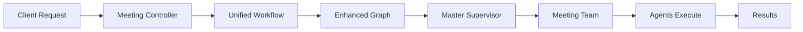

# Developer Onboarding Guide

## Getting Started with Agentic Workflows

This guide provides a step-by-step approach to understanding and working with our agentic workflow system. Follow this guide to get up to speed quickly and start contributing effectively.

## Prerequisites

### Required Knowledge
- TypeScript/JavaScript proficiency
- NestJS framework basics
- Understanding of dependency injection
- Basic knowledge of LLMs and embeddings
- MongoDB and vector databases concepts

### System Requirements
- Node.js 18+
- MongoDB instance
- Pinecone account (for RAG features)
- OpenAI API key

## Step 1: Environment Setup

### 1.1 Clone and Install

```bash
git clone <repository-url>
cd followthrough-server
yarn install
```

### 1.2 Environment Configuration

Create `.env` file:

```env
# Database
MONGODB_URI=mongodb://localhost:27017/followthrough

# OpenAI
OPENAI_API_KEY=your_openai_api_key

# Pinecone (Optional - for RAG features)
PINECONE_API_KEY=your_pinecone_key
PINECONE_ENVIRONMENT=your_environment
PINECONE_INDEX_MEETING=meeting-analysis
PINECONE_INDEX_EMAIL=email-analysis

# RAG Configuration
RAG_ENABLED=true
USE_SEMANTIC_CHUNKING=true
EMBEDDING_MODEL=text-embedding-3-large
EMBEDDING_DIMENSIONS=1024

# Application
NODE_ENV=development
PORT=3000
LOG_LEVEL=debug
```

### 1.3 Start Development Server

```bash
# Start MongoDB (if running locally)
mongod

# Start the application
yarn start:dev
```

## Step 2: Understanding the Architecture

### 2.1 Module Structure

```
src/
├── shared/shared-core.module.ts     # All shared services and agents
├── langgraph/
│   ├── core/                        # Graph execution and team coordination
│   ├── agents/                      # Individual agent implementations
│   ├── meeting-analysis/            # Meeting workflow
│   └── unified-workflow.service.ts  # Main coordination service
├── rag/                             # RAG services
├── embedding/                       # Chunking and embedding services
└── pinecone/                       # Vector database integration
```

### 2.2 Key Concepts

**Agents**: Specialized AI components that perform specific tasks
**Teams**: Collections of agents that work together
**Graphs**: Workflow definitions that connect agents
**RAG**: Retrieval-Augmented Generation for enhanced context

## Step 3: Your First Agent

### 3.1 Create a Simple Agent

```typescript
// src/langgraph/agents/my-first.agent.ts
import { Injectable } from "@nestjs/common";
import { BaseAgent } from "./base-agent";
import { LlmService } from "../llm/llm.service";

export interface MyAnalysisResult {
  summary: string;
  sentiment: 'positive' | 'neutral' | 'negative';
  confidence: number;
}

@Injectable()
export class MyFirstAgent extends BaseAgent {
  constructor(llmService: LlmService) {
    super(llmService, {
      name: "MyFirstAgent",
      systemPrompt: `You are a text analysis agent. Analyze text and provide:
        1. A brief summary
        2. Overall sentiment
        3. Confidence score (0-1)
        
        Respond in JSON format.`,
      llmOptions: {
        temperature: 0.3,
        model: "gpt-4o"
      }
    });
  }

  async analyzeText(text: string): Promise<MyAnalysisResult> {
    this.logger.log(`Analyzing text of length ${text.length}`);
    
    const prompt = `Analyze this text: "${text}"`;
    const response = await this.processMessage(prompt);
    
    return this.parseResponse(response);
  }

  private parseResponse(response: string): MyAnalysisResult {
    try {
      const parsed = JSON.parse(response);
      return {
        summary: parsed.summary || "No summary available",
        sentiment: parsed.sentiment || "neutral",
        confidence: Math.max(0, Math.min(1, parsed.confidence || 0))
      };
    } catch (error) {
      this.logger.error(`Error parsing response: ${error.message}`);
      return {
        summary: "Analysis failed",
        sentiment: "neutral",
        confidence: 0
      };
    }
  }

  // For LangGraph integration
  async processState(state: any): Promise<any> {
    const text = state.text || state.content || "";
    const analysis = await this.analyzeText(text);
    
    return {
      ...state,
      myAnalysis: analysis
    };
  }
}
```

### 3.2 Register Your Agent

```typescript
// In shared/shared-core.module.ts
import { MyFirstAgent } from '../langgraph/agents/my-first.agent';

@Module({
  providers: [
    // ... existing providers
    MyFirstAgent,
  ],
  exports: [
    // ... existing exports
    MyFirstAgent,
  ]
})
export class SharedCoreModule {}
```

### 3.3 Add to Agent Factory

```typescript
// In langgraph/agents/agent.factory.ts
export class AgentFactory {
  constructor(
    // ... existing dependencies
    private readonly myFirstAgent: MyFirstAgent,
  ) {}

  getMyFirstAgent(): MyFirstAgent {
    return this.myFirstAgent;
  }
}
```

## Step 4: Testing Your Agent

### 4.1 Unit Test

```typescript
// src/langgraph/agents/my-first.agent.spec.ts
import { Test } from '@nestjs/testing';
import { MyFirstAgent } from './my-first.agent';
import { LlmService } from '../llm/llm.service';

describe('MyFirstAgent', () => {
  let agent: MyFirstAgent;
  let mockLlmService: jest.Mocked<LlmService>;

  beforeEach(async () => {
    mockLlmService = {
      getChatModel: jest.fn().mockReturnValue({
        invoke: jest.fn().mockResolvedValue({
          content: JSON.stringify({
            summary: "Test summary",
            sentiment: "positive",
            confidence: 0.8
          })
        })
      })
    } as any;

    const module = await Test.createTestingModule({
      providers: [
        MyFirstAgent,
        { provide: LlmService, useValue: mockLlmService }
      ]
    }).compile();

    agent = module.get<MyFirstAgent>(MyFirstAgent);
  });

  it('should analyze text correctly', async () => {
    const result = await agent.analyzeText("This is a great product!");
    
    expect(result.summary).toBe("Test summary");
    expect(result.sentiment).toBe("positive");
    expect(result.confidence).toBe(0.8);
  });
});
```

### 4.2 Integration Test

```typescript
// Create a simple endpoint to test your agent
@Controller('test')
export class TestController {
  constructor(private readonly agentFactory: AgentFactory) {}

  @Post('my-agent')
  async testMyAgent(@Body() { text }: { text: string }) {
    const agent = this.agentFactory.getMyFirstAgent();
    return agent.analyzeText(text);
  }
}
```

Test with curl:
```bash
curl -X POST http://localhost:3000/test/my-agent \
  -H "Content-Type: application/json" \
  -d '{"text": "This is a great product that I really enjoy using!"}'
```

## Step 5: Understanding Existing Workflows

### 5.1 Meeting Analysis Flow



**Key Files to Study**:
1. `src/langgraph/meeting-analysis/meeting-analysis.controller.ts`
2. `src/langgraph/meeting-analysis/meeting-analysis.service.ts`
3. `src/langgraph/meeting-analysis/meeting-analysis-graph.builder.ts`

### 5.2 Trace a Request

Add debugging to understand the flow:

```typescript
// In your .env
LOG_LEVEL=debug

// Watch the logs
yarn start:dev | grep -E "(Meeting|Agent|Graph)"
```

Make a test request:
```bash
curl -X POST http://localhost:3000/api/meeting-analysis \
  -H "Content-Type: application/json" \
  -H "Authorization: Bearer your_token" \
  -d '{
    "transcript": "Today we discussed the new product launch. Alice will handle marketing by Friday.",
    "metadata": {"title": "Product Launch Meeting"}
  }'
```

## Step 6: Working with RAG

### 6.1 Store Documents

```typescript
// Example: Store meeting data for future retrieval
async storeTestData() {
  const documents = [{
    id: 'test-meeting-1',
    content: 'We discussed quarterly goals and budget allocation for Q2.',
    metadata: {
      type: 'meeting_transcript',
      date: '2024-01-15',
      participants: ['Alice', 'Bob']
    }
  }];

  await this.ragService.processDocumentsForRag(documents, {
    indexName: 'meeting-analysis',
    namespace: 'transcripts',
    useSemanticChunking: true
  });
}
```

### 6.2 Retrieve Context

```typescript
// Example: Get relevant context
async getRelevantContext(query: string) {
  const context = await this.ragService.getContext(query, {
    indexName: 'meeting-analysis',
    namespace: 'transcripts',
    topK: 3,
    minScore: 0.7
  });
  
  console.log(`Found ${context.length} relevant documents`);
  return context;
}
```

## Step 7: Development Workflow

### 7.1 Daily Development

```bash
# 1. Pull latest changes
git pull origin main

# 2. Install any new dependencies
yarn install

# 3. Start development server
yarn start:dev

# 4. Run tests
yarn test

# 5. Check code quality
yarn lint
```

### 7.2 Adding New Features

1. **Create Feature Branch**
   ```bash
   git checkout -b feature/my-new-agent
   ```

2. **Implement Agent** (follow patterns from existing agents)

3. **Add Tests** (unit and integration)

4. **Update Documentation** (if needed)

5. **Create Pull Request**

### 7.3 Debugging Tips

**Common Issues**:

1. **Agent Not Found in Factory**
   ```typescript
   // Ensure agent is injected in constructor
   constructor(
     private readonly myAgent: MyAgent, // ✅ Add this
   ) {}
   
   // And has a getter method
   getMyAgent(): MyAgent {
     return this.myAgent; // ✅ Add this
   }
   ```

2. **RAG Context Not Working**
   ```typescript
   // Check if RAG is enabled
   console.log('RAG enabled:', this.ragEnabled);
   
   // Verify documents were stored
   const stats = await this.pineconeService.getIndexStats();
   console.log('Index stats:', stats);
   ```

3. **LLM Responses Inconsistent**
   ```typescript
   // Lower temperature for more consistent responses
   llmOptions: {
     temperature: 0.1, // ✅ More consistent
     model: "gpt-4o"
   }
   
   // Add better response validation
   private validateResponse(response: any): boolean {
     return response && typeof response === 'object' && response.field;
   }
   ```

## Step 8: Best Practices

### 8.1 Agent Development

```typescript
// ✅ Good: Single responsibility
class TopicExtractionAgent extends BaseAgent {
  async extractTopics(text: string): Promise<Topic[]> {
    // Only handles topic extraction
  }
}

// ❌ Bad: Multiple responsibilities  
class AnalysisAgent extends BaseAgent {
  async doEverything(text: string): Promise<any> {
    // Handles topics, sentiment, summaries, etc.
  }
}
```

### 8.2 Error Handling

```typescript
// ✅ Good: Graceful degradation
async processWithFallback(input: string): Promise<Result> {
  try {
    return await this.primaryMethod(input);
  } catch (error) {
    this.logger.error(`Primary method failed: ${error.message}`);
    return this.fallbackMethod(input);
  }
}
```

### 8.3 Testing Strategy

```typescript
// ✅ Test with realistic data
const realisticTranscript = `
  Alice: Good morning everyone. Let's start with the Q1 review.
  Bob: The sales numbers look good, we're up 15% from last quarter.
  Alice: That's great! What about the marketing campaign?
  Charlie: We'll launch it next week, targeting our key demographics.
`;

// ✅ Test error conditions
it('should handle empty input gracefully', async () => {
  const result = await agent.analyze('');
  expect(result.error).toBeDefined();
});
```

## Step 9: Advanced Topics

### 9.1 Creating Custom Graph Flows

```typescript
// Example: Custom workflow for your use case
@Injectable()
export class MyCustomGraphBuilder extends BaseGraphBuilder<MyState> {
  protected buildNodes(): Record<string, Function> {
    return {
      start: this.startNode.bind(this),
      process: this.processNode.bind(this),
      end: this.endNode.bind(this)
    };
  }

  protected defineEdges(graph: any): void {
    graph.addEdge('start', 'process');
    graph.addEdge('process', 'end');
  }
}
```

### 9.2 Team Handler Implementation

```typescript
// Example: Custom team handler
@Injectable() 
export class MyCustomTeamHandler implements TeamHandler {
  async process(input: any): Promise<any> {
    // Your custom processing logic
    return this.customProcessing(input);
  }

  getTeamName(): string {
    return 'my_custom_team';
  }
}
```

## Next Steps

1. **Read the Architecture Guide** - Understand the full system design
2. **Study Existing Agents** - Look at `TopicExtractionAgent`, `SummaryAgent`
3. **Experiment with RAG** - Try storing and retrieving different types of content
4. **Build Your First Feature** - Create an agent for your specific use case
5. **Contribute Back** - Share improvements and new capabilities

## Getting Help

- **Documentation**: Check the other guides in `guides/agentic-workflows/`
- **Code Examples**: Look at existing agents and their tests
- **Debug Mode**: Set `LOG_LEVEL=debug` to see detailed execution flow
- **Team**: Ask questions in team channels or code reviews

Happy coding! 🚀 