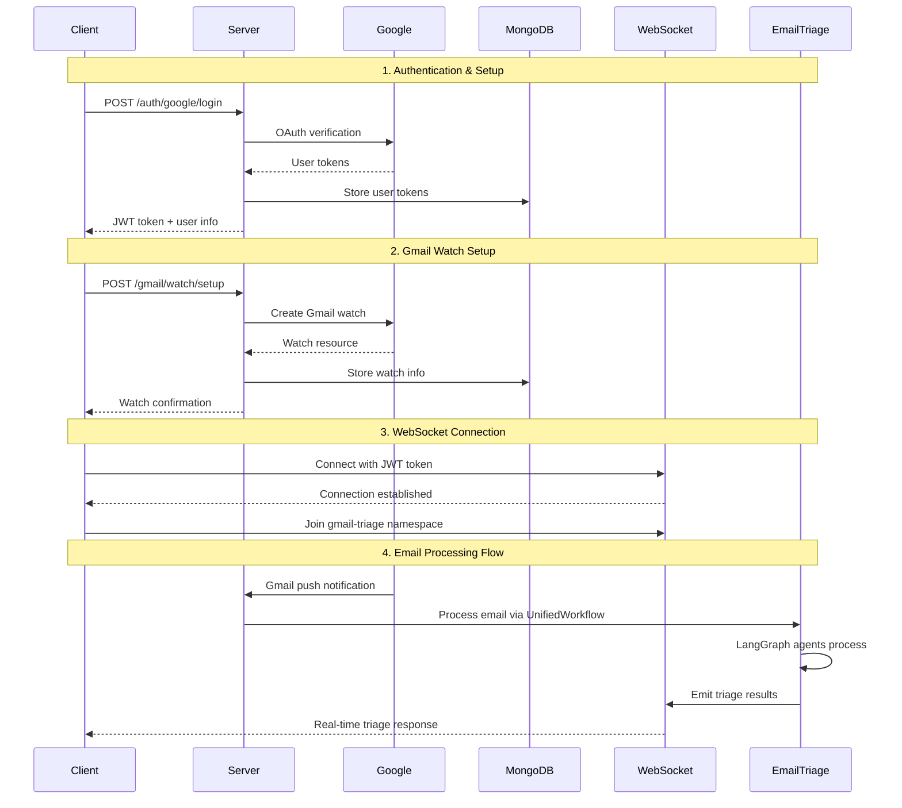

# Email Triage Client Integration Guide

## Overview

This guide provides complete integration instructions for connecting clients to the email triage flow, including Google OAuth authentication, Gmail watch setup, WebSocket communication, and handling triage responses.

## 🔄 **Complete Flow Diagram**



## 🔐 **1. Authentication Flow**

### Google OAuth Setup

**Step 1: Initialize Google OAuth**
```typescript
// Client-side OAuth initialization
const googleAuth = {
  clientId: 'your-google-client-id',
  redirectUri: 'http://localhost:3000/auth/callback',
  scope: [
    'https://www.googleapis.com/auth/gmail.readonly',
    'https://www.googleapis.com/auth/gmail.modify',
    'https://www.googleapis.com/auth/userinfo.email',
    'https://www.googleapis.com/auth/userinfo.profile'
  ].join(' ')
};

// Redirect to Google OAuth
const authUrl = `https://accounts.google.com/o/oauth2/v2/auth?` +
  `client_id=${googleAuth.clientId}&` +
  `redirect_uri=${encodeURIComponent(googleAuth.redirectUri)}&` +
  `response_type=code&` +
  `scope=${encodeURIComponent(googleAuth.scope)}&` +
  `access_type=offline&` +
  `prompt=consent`;

window.location.href = authUrl;
```

**Step 2: Handle OAuth Callback**
```typescript
// After OAuth redirect, exchange code for tokens
const exchangeCodeForTokens = async (code: string) => {
  const response = await fetch('/api/auth/google/callback', {
    method: 'POST',
    headers: { 'Content-Type': 'application/json' },
    body: JSON.stringify({ code })
  });

  const data = await response.json();
  return data;
};
```

### Authentication Response DTOs

```typescript
// Authentication Response
interface AuthResponse {
  success: boolean;
  user: {
    id: string;
    email: string;
    name: string;
    picture?: string;
  };
  tokens: {
    accessToken: string;
    refreshToken: string;
    expiresAt: string;
  };
  jwtToken: string; // For API authentication
}

// Error Response
interface AuthErrorResponse {
  success: false;
  error: {
    code: string;
    message: string;
    details?: any;
  };
}
```

## 📧 **2. Gmail Watch Setup**

### Setup Gmail Push Notifications

```typescript
// Setup Gmail watch for push notifications
const setupGmailWatch = async (jwtToken: string) => {
  const response = await fetch('/api/gmail/watch/setup', {
    method: 'POST',
    headers: {
      'Authorization': `Bearer ${jwtToken}`,
      'Content-Type': 'application/json'
    },
    body: JSON.stringify({
      topicName: 'projects/your-project/topics/gmail-triage',
      labelIds: ['INBOX'], // Watch inbox only
      labelFilterAction: 'include'
    })
  });

  const data = await response.json();
  return data;
};
```

### Gmail Watch Response DTOs

```typescript
// Gmail Watch Setup Response
interface GmailWatchResponse {
  success: boolean;
  watch: {
    id: string;
    topicName: string;
    expiration: string;
    createdAt: string;
  };
  message: string;
}

// Gmail Watch Error Response
interface GmailWatchErrorResponse {
  success: false;
  error: {
    code: 'WATCH_SETUP_FAILED' | 'INSUFFICIENT_PERMISSIONS' | 'QUOTA_EXCEEDED';
    message: string;
    details?: any;
  };
}
```

## 🔌 **3. WebSocket Connection**

### Fix for "Invalid namespace" Error

Your WebSocket error is due to namespace mismatch. Here's the fix:

**Server-side (Gmail Notification Gateway):**
```typescript
// src/integrations/google/services/gmail-notification.gateway.ts
@WebSocketGateway({
  namespace: '/gmail-triage', // Ensure this namespace exists
  cors: {
    origin: process.env.CLIENT_URL || 'http://localhost:3000',
    credentials: true
  }
})
export class GmailNotificationGateway {
  @WebSocketServer()
  server: Server;

  @SubscribeMessage('join-gmail-triage')
  handleJoinGmailNotifications(
    @ConnectedSocket() client: Socket,
    @MessageBody() data: { userId: string; token: string }
  ) {
    try {
      // Verify JWT token
      const decoded = jwt.verify(data.token, process.env.JWT_SECRET);
      
      // Join user to their personal room
      client.join(`user:${data.userId}`);
      
      client.emit('joined-gmail-triage', {
        success: true,
        message: 'Successfully joined Gmail notifications',
        userId: data.userId
      });
    } catch (error) {
      client.emit('join-error', {
        success: false,
        message: 'Failed to join Gmail notifications',
        error: error.message
      });
    }
  }
}
```

**Client-side WebSocket Connection:**
```typescript
import { io, Socket } from 'socket.io-client';

class EmailTriageClient {
  private socket: Socket;
  private jwtToken: string;
  private userId: string;

  constructor(jwtToken: string, userId: string) {
    this.jwtToken = jwtToken;
    this.userId = userId;
    
    // Connect to the specific namespace
    this.socket = io('http://localhost:3001/gmail-triage', {
      auth: {
        token: jwtToken
      },
      transports: ['websocket', 'polling']
    });

    this.setupEventListeners();
  }

  private setupEventListeners() {
    // Connection events
    this.socket.on('connect', () => {
      console.log('Connected to gmail-triage namespace:', this.socket.id);
      this.joinGmailNotifications();
    });

    this.socket.on('disconnect', (reason) => {
      console.log('Disconnected:', reason);
    });

    this.socket.on('connect_error', (error) => {
      console.error('Connection error:', error);
    });

    // Join confirmation
    this.socket.on('joined-gmail-triage', (data) => {
      console.log('Successfully joined Gmail notifications:', data);
    });

    this.socket.on('join-error', (error) => {
      console.error('Failed to join Gmail notifications:', error);
    });

    // Email triage events
    this.socket.on('gmail.notification.received', this.handleGmailNotification.bind(this));
    this.socket.on('email.triage.started', this.handleTriageStarted.bind(this));
    this.socket.on('email.triage.progress', this.handleTriageProgress.bind(this));
    this.socket.on('email.triage.completed', this.handleTriageCompleted.bind(this));
    this.socket.on('email.triage.failed', this.handleTriageFailed.bind(this));
  }

  private joinGmailNotifications() {
    this.socket.emit('join-gmail-triage', {
      userId: this.userId,
      token: this.jwtToken
    });
  }

  // Event handlers
  private handleGmailNotification(data: GmailNotificationEvent) {
    console.log('📧 New Gmail notification:', data);
  }

  private handleTriageStarted(data: EmailTriageStartedEvent) {
    console.log('🚀 Email triage started:', data);
  }

  private handleTriageProgress(data: EmailTriageProgressEvent) {
    console.log('⏳ Email triage progress:', data);
  }

  private handleTriageCompleted(data: EmailTriageCompletedEvent) {
    console.log('✅ Email triage completed:', data);
    this.processTriageResults(data);
  }

  private handleTriageFailed(data: EmailTriageFailedEvent) {
    console.error('❌ Email triage failed:', data);
  }

  private processTriageResults(data: EmailTriageCompletedEvent) {
    const { classification, summary, replyDraft } = data.result;
    
    // Process results in your application
    console.log('Triage Results:', {
      priority: classification.priority,
      category: classification.category,
      summary: summary.briefSummary,
      suggestedReply: replyDraft.body
    });
  }

  public disconnect() {
    if (this.socket.connected) {
      this.socket.disconnect();
    }
  }
}
```

## 📨 **4. Email Triage Event DTOs**

### WebSocket Event Types

```typescript
// Gmail Notification Event (when new email arrives)
interface GmailNotificationEvent {
  type: 'gmail.notification.received';
  data: {
    emailId: string;
    threadId: string;
    historyId: string;
    userId: string;
    timestamp: string;
  };
}

// Email Triage Started Event
interface EmailTriageStartedEvent {
  type: 'email.triage.started';
  sessionId: string;
  emailId: string;
  emailAddress: string;
  subject: string;
  from: string;
  timestamp: string;
  source: string;
}

// Email Triage Progress Event
interface EmailTriageProgressEvent {
  type: 'email.triage.progress';
  sessionId: string;
  emailId: string;
  currentStep: 'initialization' | 'classification' | 'summarization' | 'reply_generation' | 'finalization';
  progress: number; // 0-100
  message: string;
  timestamp: string;
}

// Email Triage Completed Event (Main Result)
interface EmailTriageCompletedEvent {
  type: 'email.triage.completed';
  sessionId: string;
  emailId: string;
  emailAddress: string;
  subject: string;
  result: EmailTriageResult;
  classification: EmailClassification;
  summary: EmailSummary;
  replyDraft: EmailReplyDraft;
  retrievedContext?: RagContext;
  processingMetadata: ProcessingMetadata;
  timestamp: string;
  source: string;
  langGraph: boolean;
}

// Email Triage Failed Event
interface EmailTriageFailedEvent {
  type: 'email.triage.failed';
  sessionId: string;
  emailId: string;
  emailAddress: string;
  subject: string;
  error: string;
  timestamp: string;
  source: string;
}
```

### Email Triage Result DTOs

```typescript
// Complete Email Triage Result
interface EmailTriageResult {
  sessionId: string;
  emailId: string;
  classification: EmailClassification;
  summary: EmailSummary;
  replyDraft: EmailReplyDraft;
  status: 'completed' | 'failed' | 'partial';
  completedAt: string;
}

// Email Classification Result
interface EmailClassification {
  priority: 'urgent' | 'high' | 'normal' | 'low';
  category: 'bug_report' | 'feature_request' | 'question' | 'complaint' | 'praise' | 'other';
  reasoning: string;
  confidence: number; // 0-1
  tags?: string[];
  estimatedResponseTime?: string;
}

// Email Summary Result
interface EmailSummary {
  briefSummary: string;
  keyPoints: string[];
  sentiment: 'positive' | 'negative' | 'neutral' | 'mixed';
  problem?: string;
  context?: string;
  ask?: string;
  urgencyIndicators?: string[];
}

// Email Reply Draft Result
interface EmailReplyDraft {
  subject: string;
  body: string;
  tone: 'professional' | 'friendly' | 'formal' | 'empathetic';
  confidence: number; // 0-1
  nextSteps?: string[];
  requiresHumanReview: boolean;
  suggestedActions?: string[];
}

// RAG Context (if available)
interface RagContext {
  retrievedDocuments: Array<{
    content: string;
    source: string;
    relevanceScore: number;
  }>;
  totalDocuments: number;
  searchQuery: string;
}

// Processing Metadata
interface ProcessingMetadata {
  processingTime: number; // milliseconds
  agentsUsed: string[];
  fallbacksTriggered?: string[];
  ragEnabled: boolean;
  modelVersions: Record<string, string>;
}
```

## 🔧 **5. Complete React Client Implementation**

```typescript
// EmailTriageDashboard.tsx
import React, { useEffect, useState, useCallback } from 'react';
import { EmailTriageClient } from './services/EmailTriageService';

interface EmailTriageState {
  isConnected: boolean;
  isAuthenticated: boolean;
  watchSetup: boolean;
  notifications: EmailTriageCompletedEvent[];
  currentTriage?: EmailTriageProgressEvent;
}

export const EmailTriageDashboard: React.FC = () => {
  const [state, setState] = useState<EmailTriageState>({
    isConnected: false,
    isAuthenticated: false,
    watchSetup: false,
    notifications: []
  });

  const [client, setClient] = useState<EmailTriageClient | null>(null);

  // Initialize authentication
  const handleGoogleAuth = useCallback(async () => {
    try {
      const authUrl = `https://accounts.google.com/o/oauth2/v2/auth?` +
        `client_id=${process.env.REACT_APP_GOOGLE_CLIENT_ID}&` +
        `redirect_uri=${encodeURIComponent(window.location.origin + '/auth/callback')}&` +
        `response_type=code&` +
        `scope=${encodeURIComponent('https://www.googleapis.com/auth/gmail.readonly https://www.googleapis.com/auth/gmail.modify')}&` +
        `access_type=offline&` +
        `prompt=consent`;
      
      window.location.href = authUrl;
    } catch (error) {
      console.error('Authentication failed:', error);
    }
  }, []);

  // Setup Gmail watch
  const setupGmailWatch = useCallback(async (jwtToken: string) => {
    try {
      const response = await fetch('/api/gmail/watch/setup', {
        method: 'POST',
        headers: {
          'Authorization': `Bearer ${jwtToken}`,
          'Content-Type': 'application/json'
        }
      });

      const data = await response.json();
      if (data.success) {
        setState(prev => ({ ...prev, watchSetup: true }));
      }
    } catch (error) {
      console.error('Gmail watch setup failed:', error);
    }
  }, []);

  // Initialize WebSocket client
  const initializeClient = useCallback((jwtToken: string, userId: string) => {
    const triageClient = new EmailTriageClient(jwtToken, userId);
    
    // Setup custom event handlers
    triageClient.socket.on('connect', () => {
      setState(prev => ({ ...prev, isConnected: true }));
    });

    triageClient.socket.on('disconnect', () => {
      setState(prev => ({ ...prev, isConnected: false }));
    });

    triageClient.socket.on('email.triage.progress', (data: EmailTriageProgressEvent) => {
      setState(prev => ({ ...prev, currentTriage: data }));
    });

    triageClient.socket.on('email.triage.completed', (data: EmailTriageCompletedEvent) => {
      setState(prev => ({
        ...prev,
        notifications: [...prev.notifications, data],
        currentTriage: undefined
      }));
    });

    setClient(triageClient);
  }, []);

  // Handle OAuth callback
  useEffect(() => {
    const urlParams = new URLSearchParams(window.location.search);
    const code = urlParams.get('code');
    
    if (code) {
      fetch('/api/auth/google/callback', {
        method: 'POST',
        headers: { 'Content-Type': 'application/json' },
        body: JSON.stringify({ code })
      })
      .then(response => response.json())
      .then((data: AuthResponse) => {
        if (data.success) {
          localStorage.setItem('jwtToken', data.jwtToken);
          localStorage.setItem('userId', data.user.id);
          
          setState(prev => ({ ...prev, isAuthenticated: true }));
          setupGmailWatch(data.jwtToken);
          initializeClient(data.jwtToken, data.user.id);
        }
      })
      .catch(error => console.error('Token exchange failed:', error));
    }
  }, [setupGmailWatch, initializeClient]);

  // Cleanup
  useEffect(() => {
    return () => {
      if (client) {
        client.disconnect();
      }
    };
  }, [client]);

  return (
    <div className="email-triage-dashboard">
      <h1>Email Triage Dashboard</h1>
      
      {/* Status Panel */}
      <div className="status-panel">
        <div className={`status-item ${state.isAuthenticated ? 'success' : 'pending'}`}>
          Authentication: {state.isAuthenticated ? 'Connected' : 'Not Connected'}
        </div>
        <div className={`status-item ${state.watchSetup ? 'success' : 'pending'}`}>
          Gmail Watch: {state.watchSetup ? 'Active' : 'Not Setup'}
        </div>
        <div className={`status-item ${state.isConnected ? 'success' : 'error'}`}>
          WebSocket: {state.isConnected ? 'Connected' : 'Disconnected'}
        </div>
      </div>

      {/* Authentication Button */}
      {!state.isAuthenticated && (
        <button onClick={handleGoogleAuth} className="auth-button">
          Connect Gmail Account
        </button>
      )}

      {/* Current Triage Progress */}
      {state.currentTriage && (
        <div className="current-triage">
          <h3>Processing Email: {state.currentTriage.emailId}</h3>
          <div className="progress-bar">
            <div 
              className="progress-fill" 
              style={{ width: `${state.currentTriage.progress}%` }}
            />
          </div>
          <p>Step: {state.currentTriage.currentStep}</p>
          <p>{state.currentTriage.message}</p>
        </div>
      )}

      {/* Triage Results */}
      <div className="triage-results">
        <h3>Recent Email Triage Results</h3>
        {state.notifications.map((notification, index) => (
          <EmailTriageCard key={index} data={notification} />
        ))}
      </div>
    </div>
  );
};

// Individual triage result card
const EmailTriageCard: React.FC<{ data: EmailTriageCompletedEvent }> = ({ data }) => {
  const { result } = data;
  
  return (
    <div className="triage-card">
      <div className="triage-header">
        <h4>{data.subject}</h4>
        <span className="from">From: {data.emailAddress}</span>
        <span className={`priority priority-${result.classification.priority}`}>
          {result.classification.priority.toUpperCase()}
        </span>
      </div>
      
      <div className="triage-content">
        {/* Classification */}
        <div className="section">
          <h5>Classification</h5>
          <p><strong>Category:</strong> {result.classification.category}</p>
          <p><strong>Confidence:</strong> {(result.classification.confidence * 100).toFixed(1)}%</p>
          <p><strong>Reasoning:</strong> {result.classification.reasoning}</p>
        </div>

        {/* Summary */}
        <div className="section">
          <h5>Summary</h5>
          <p>{result.summary.briefSummary}</p>
          <ul>
            {result.summary.keyPoints.map((point, i) => (
              <li key={i}>{point}</li>
            ))}
          </ul>
        </div>

        {/* Suggested Reply */}
        <div className="section">
          <h5>Suggested Reply</h5>
          <div className="reply-draft">
            <p><strong>Subject:</strong> {result.replyDraft.subject}</p>
            <p><strong>Tone:</strong> {result.replyDraft.tone}</p>
            <div className="reply-body">
              {result.replyDraft.body}
            </div>
          </div>
        </div>
      </div>
    </div>
  );
};
```

## 🔒 **6. Security & Token Management**

### Do you need new encryption tokens?

**YES**, you should generate new encryption tokens for the new MongoDB collections:

```bash
# Generate new secrets
openssl rand -base64 32  # JWT_SECRET
openssl rand -base64 32  # GMAIL_WEBHOOK_SECRET
openssl rand -base64 32  # WEBSOCKET_SECRET
openssl rand -base64 32  # ENCRYPTION_KEY (for sensitive data)
```

Add to your `.env`:
```env
# Authentication
JWT_SECRET=your-new-jwt-secret-32-chars
JWT_EXPIRES_IN=24h

# Gmail Integration  
GMAIL_WEBHOOK_SECRET=your-new-webhook-secret-32-chars
GMAIL_ENCRYPTION_KEY=your-new-encryption-key-32-chars

# WebSocket
WEBSOCKET_SECRET=your-new-websocket-secret-32-chars

# MongoDB Connection (if changed)
MONGODB_ENCRYPTION_KEY=your-mongodb-encryption-key-32-chars
```

### Token Refresh Service

```typescript
class TokenService {
  private jwtToken: string | null = null;
  private refreshTimer: NodeJS.Timeout | null = null;

  constructor() {
    this.jwtToken = localStorage.getItem('jwtToken');
    this.setupTokenRefresh();
  }

  private setupTokenRefresh() {
    if (this.jwtToken) {
      const payload = JSON.parse(atob(this.jwtToken.split('.')[1]));
      const expiresAt = payload.exp * 1000;
      const refreshTime = expiresAt - Date.now() - (5 * 60 * 1000);
      
      if (refreshTime > 0) {
        this.refreshTimer = setTimeout(() => {
          this.refreshToken();
        }, refreshTime);
      }
    }
  }

  private async refreshToken() {
    try {
      const response = await fetch('/api/auth/refresh', {
        method: 'POST',
        headers: { 'Authorization': `Bearer ${this.jwtToken}` }
      });

      const data = await response.json();
      if (data.success) {
        this.jwtToken = data.jwtToken;
        localStorage.setItem('jwtToken', data.jwtToken);
        this.setupTokenRefresh();
      }
    } catch (error) {
      console.error('Token refresh failed:', error);
      this.logout();
    }
  }

  public getToken(): string | null {
    return this.jwtToken;
  }

  public logout() {
    localStorage.removeItem('jwtToken');
    localStorage.removeItem('userId');
    if (this.refreshTimer) {
      clearTimeout(this.refreshTimer);
    }
    window.location.href = '/login';
  }
}
```

## 🚀 **7. Quick Start Example**

```typescript
// main.ts - Complete working example
import { EmailTriageClient } from './EmailTriageClient';

async function main() {
  try {
    // 1. Check for existing auth
    const jwtToken = localStorage.getItem('jwtToken');
    const userId = localStorage.getItem('userId');
    
    if (!jwtToken || !userId) {
      console.log('Please authenticate first');
      // Redirect to Google OAuth
      return;
    }

    // 2. Setup Gmail watch (if not already done)
    const watchResponse = await fetch('/api/gmail/watch/setup', {
      method: 'POST',
      headers: {
        'Authorization': `Bearer ${jwtToken}`,
        'Content-Type': 'application/json'
      }
    });

    const watchData = await watchResponse.json();
    console.log('Gmail watch setup:', watchData.success ? '✅' : '❌');

    // 3. Connect to WebSocket
    const client = new EmailTriageClient(jwtToken, userId);

    // 4. Handle triage results
    client.socket.on('email.triage.completed', (data: EmailTriageCompletedEvent) => {
      console.log('📧 New email processed:', {
        subject: data.subject,
        from: data.emailAddress,
        priority: data.result.classification.priority,
        category: data.result.classification.category,
        summary: data.result.summary.briefSummary,
        confidence: (data.result.classification.confidence * 100).toFixed(1) + '%',
        suggestedReply: data.result.replyDraft.body
      });
    });

    console.log('✅ Email triage client ready!');
    console.log('Waiting for new emails...');

  } catch (error) {
    console.error('❌ Setup failed:', error);
  }
}

main();
```

## 🐛 **8. Troubleshooting Common Issues**

### WebSocket Connection Issues

1. **"Invalid namespace" Error**: Use `/gmail-triage` namespace
2. **Connection Refused**: Check server WebSocket gateway is running
3. **Authentication Failed**: Verify JWT token is valid and not expired

### Gmail Watch Issues

1. **Permission Denied**: Ensure OAuth scopes include Gmail access
2. **Topic Not Found**: Verify Google Pub/Sub topic exists
3. **Watch Expired**: Renew Gmail watch periodically

### Missing Triage Results

1. **No WebSocket Events**: Check client is joined to correct namespace
2. **Empty Results**: Verify EmailTriageService is processing correctly
3. **Delayed Results**: Check server logs for processing errors

This comprehensive guide provides everything needed to integrate with your email triage system. The WebSocket namespace issue should be resolved, and the new encryption tokens will secure your MongoDB collections. 