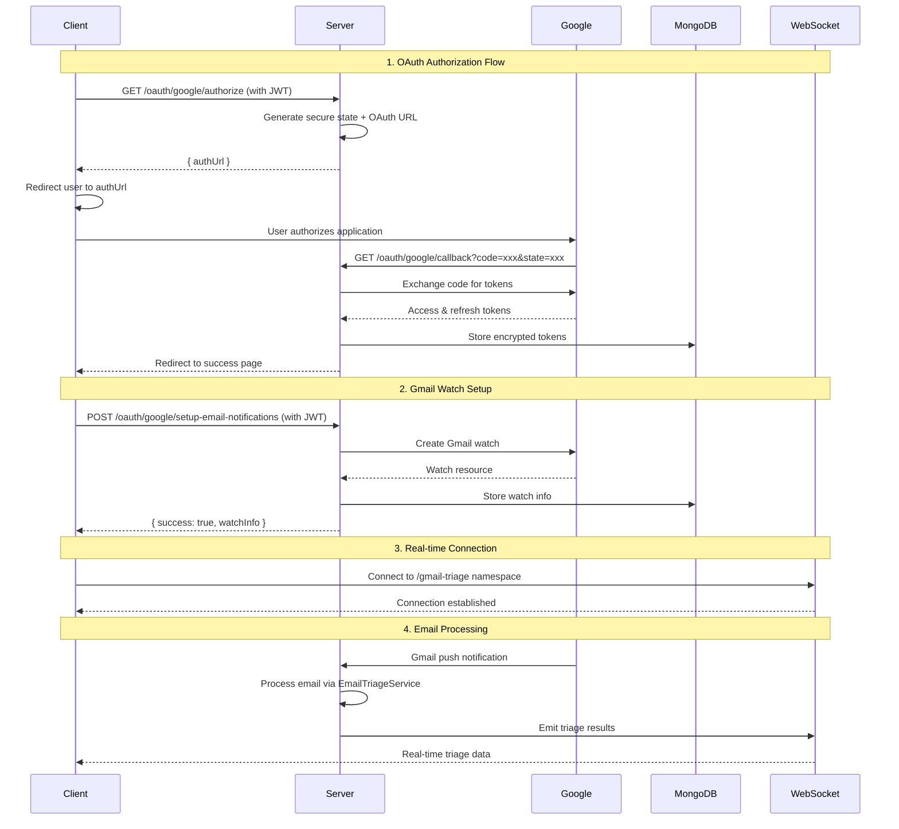

# Email Triage Client OAuth Integration Guide

## Overview

This guide shows how clients integrate with Google OAuth using your server-side OAuth implementation. Your server handles all OAuth complexity, token management, and Gmail watch setup, providing simple REST endpoints for client integration.

## 🔄 **Server-Side OAuth Flow**



## 🔐 **1. OAuth Authorization Flow**

### Step 1: Get Google OAuth URL

**Client Request:**
```typescript
// Get OAuth authorization URL from your server
const getGoogleAuthUrl = async (jwtToken: string) => {
  const response = await fetch('/api/oauth/google/authorize', {
    method: 'GET',
    headers: {
      'Authorization': `Bearer ${jwtToken}`,
      'Content-Type': 'application/json'
    }
  });

  const data = await response.json();
  return data;
};
```

**Server Response:**
```typescript
interface GoogleAuthUrlResponse {
  success: boolean;
  authUrl: string;
  message: string;
}

// Example response
{
  "success": true,
  "authUrl": "https://accounts.google.com/o/oauth2/v2/auth?client_id=xxx&redirect_uri=xxx&response_type=code&scope=xxx&access_type=offline&state=xxx&prompt=consent",
  "message": "Redirect user to this URL to authorize Google access"
}
```

### Step 2: Redirect User to Google

```typescript
// Redirect user to Google OAuth consent screen
const initiateGoogleAuth = async (jwtToken: string) => {
  try {
    const authResponse = await getGoogleAuthUrl(jwtToken);
    
    if (authResponse.success) {
      // Redirect user to Google OAuth consent screen
      window.location.href = authResponse.authUrl;
    } else {
      throw new Error('Failed to get OAuth URL');
    }
  } catch (error) {
    console.error('OAuth initiation failed:', error);
  }
};
```

### Step 3: Handle OAuth Callback

Your server automatically handles the OAuth callback at `/oauth/google/callback`. The server will redirect the user back to your client with success or error parameters.

**Client Callback Handler:**
```typescript
// Handle OAuth callback redirect from server
const handleOAuthCallback = () => {
  const urlParams = new URLSearchParams(window.location.search);
  
  // Check for success
  const authSuccess = urlParams.get('google_auth_success');
  const userEmail = urlParams.get('email');
  
  // Check for errors
  const authError = urlParams.get('google_auth_error');
  
  if (authSuccess === 'true') {
    console.log('✅ OAuth successful for:', decodeURIComponent(userEmail || ''));
    // Proceed to setup Gmail notifications
    setupGmailNotifications();
  } else if (authError) {
    console.error('❌ OAuth failed:', authError);
    handleOAuthError(authError);
  }
};
```

### Step 4: Check OAuth Status

```typescript
// Check current OAuth connection status
const checkOAuthStatus = async (jwtToken: string) => {
  const response = await fetch('/api/oauth/google/status', {
    method: 'GET',
    headers: {
      'Authorization': `Bearer ${jwtToken}`,
      'Content-Type': 'application/json'
    }
  });

  const data = await response.json();
  return data;
};
```

**OAuth Status Response:**
```typescript
interface OAuthStatusResponse {
  success: boolean;
  isConnected: boolean;
  expiresAt?: string;
  needsRefresh?: boolean;
  scopes?: string[];
  userInfo?: {
    googleEmail: string;
    googleName?: string;
    googlePicture?: string;
  };
}

// Example response
{
  "success": true,
  "isConnected": true,
  "expiresAt": "2024-12-19T10:30:00.000Z",
  "needsRefresh": false,
  "scopes": [
    "https://www.googleapis.com/auth/userinfo.email",
    "https://www.googleapis.com/auth/gmail.readonly",
    "https://www.googleapis.com/auth/gmail.modify"
  ],
  "userInfo": {
    "googleEmail": "user@gmail.com",
    "googleName": "John Doe",
    "googlePicture": "https://lh3.googleusercontent.com/..."
  }
}
```

## 📧 **2. Gmail Watch Setup**

### Setup Gmail Notifications

```typescript
// Setup Gmail push notifications for email triage
const setupGmailNotifications = async (jwtToken: string) => {
  const response = await fetch('/api/oauth/google/setup-email-notifications', {
    method: 'POST',
    headers: {
      'Authorization': `Bearer ${jwtToken}`,
      'Content-Type': 'application/json'
    },
    body: JSON.stringify({
      labelIds: ['INBOX'], // Optional: defaults to ['INBOX']
      labelFilterBehavior: 'INCLUDE' // Optional: defaults to 'INCLUDE'
    })
  });

  const data = await response.json();
  return data;
};
```

**Gmail Watch Setup Response:**
```typescript
interface GmailWatchSetupResponse {
  success: boolean;
  message: string;
  watchInfo: {
    watchId: string;
    topicName: string;
    expiration: string;
    labelIds: string[];
    isActive: boolean;
    createdAt: string;
  };
}

// Example response
{
  "success": true,
  "message": "Gmail notifications enabled successfully",
  "watchInfo": {
    "watchId": "1234567890",
    "topicName": "projects/your-project/topics/gmail-triage",
    "expiration": "2024-12-26T10:30:00.000Z",
    "labelIds": ["INBOX"],
    "isActive": true,
    "createdAt": "2024-12-19T10:30:00.000Z"
  }
}
```

### Check Gmail Notification Status

```typescript
// Check if Gmail notifications are enabled
const checkGmailNotificationStatus = async (jwtToken: string) => {
  const response = await fetch('/api/oauth/google/email-notification-status', {
    method: 'GET',
    headers: {
      'Authorization': `Bearer ${jwtToken}`,
      'Content-Type': 'application/json'
    }
  });

  const data = await response.json();
  return data;
};
```

## 🔌 **3. WebSocket Connection for Real-time Results**

After setting up Gmail notifications, connect to WebSocket for real-time email triage results:

```typescript
import { io, Socket } from 'socket.io-client';

class EmailTriageClient {
  private socket: Socket;
  private jwtToken: string;
  private userId: string;

  constructor(jwtToken: string, userId: string) {
    this.jwtToken = jwtToken;
    this.userId = userId;
    
    // Connect to gmail-triage namespace
    this.socket = io('http://localhost:3001/gmail-triage', {
      auth: {
        token: jwtToken
      },
      transports: ['websocket', 'polling']
    });

    this.setupEventListeners();
  }

  private setupEventListeners() {
    // Connection events
    this.socket.on('connect', () => {
      console.log('✅ Connected to gmail-triage namespace:', this.socket.id);
      this.joinGmailTriage();
    });

    this.socket.on('disconnect', (reason) => {
      console.log('❌ Disconnected:', reason);
    });

    this.socket.on('connect_error', (error) => {
      console.error('🔌 Connection error:', error);
    });

    // Join confirmation events
    this.socket.on('joined-gmail-triage', (data) => {
      console.log('🎯 Successfully joined Gmail triage:', data);
    });

    this.socket.on('join-error', (error) => {
      console.error('❌ Failed to join Gmail triage:', error);
    });

    // Email triage events
    this.socket.on('gmail.notification.received', this.handleGmailNotification.bind(this));
    this.socket.on('email.triage.started', this.handleTriageStarted.bind(this));
    this.socket.on('email.triage.progress', this.handleTriageProgress.bind(this));
    this.socket.on('email.triage.completed', this.handleTriageCompleted.bind(this));
    this.socket.on('email.triage.failed', this.handleTriageFailed.bind(this));
  }

  private joinGmailTriage() {
    this.socket.emit('join-gmail-triage', {
      userId: this.userId,
      token: this.jwtToken
    });
  }

  // Event handlers
  private handleGmailNotification(data: any) {
    console.log('📧 New Gmail notification:', data);
  }

  private handleTriageStarted(data: any) {
    console.log('🚀 Email triage started:', data);
  }

  private handleTriageProgress(data: any) {
    console.log('⏳ Email triage progress:', data);
  }

  private handleTriageCompleted(data: any) {
    console.log('✅ Email triage completed:', data);
    this.processTriageResults(data);
  }

  private handleTriageFailed(data: any) {
    console.error('❌ Email triage failed:', data);
  }

  private processTriageResults(data: any) {
    const { classification, summary, replyDraft } = data.result;
    
    console.log('📊 Triage Results:', {
      emailId: data.emailId,
      subject: data.subject,
      from: data.emailAddress,
      priority: classification.priority,
      category: classification.category,
      confidence: (classification.confidence * 100).toFixed(1) + '%',
      summary: summary.briefSummary,
      suggestedReply: replyDraft.body
    });
  }

  public disconnect() {
    if (this.socket.connected) {
      this.socket.disconnect();
    }
  }
}
```

## 🔧 **4. Complete React Integration Example**

```typescript
// hooks/useEmailTriageOAuth.ts
import { useState, useEffect, useCallback } from 'react';
import { EmailTriageClient } from '../services/EmailTriageClient';

interface OAuthState {
  isAuthenticated: boolean;
  isGoogleConnected: boolean;
  isGmailWatchSetup: boolean;
  isWebSocketConnected: boolean;
  userInfo?: any;
  watchInfo?: any;
  triageResults: any[];
  loading: boolean;
  error?: string;
}

export const useEmailTriageOAuth = () => {
  const [state, setState] = useState<OAuthState>({
    isAuthenticated: false,
    isGoogleConnected: false,
    isGmailWatchSetup: false,
    isWebSocketConnected: false,
    triageResults: [],
    loading: true
  });

  const [client, setClient] = useState<EmailTriageClient | null>(null);
  const jwtToken = localStorage.getItem('jwtToken');

  // Initialize OAuth flow
  const initializeOAuth = useCallback(async () => {
    if (!jwtToken) {
      setState(prev => ({ ...prev, loading: false }));
      return;
    }

    setState(prev => ({ ...prev, isAuthenticated: true, loading: true }));

    try {
      // Check OAuth status
      const oauthStatus = await checkOAuthStatus(jwtToken);
      
      if (oauthStatus.success && oauthStatus.isConnected) {
        setState(prev => ({ 
          ...prev, 
          isGoogleConnected: true,
          userInfo: oauthStatus.userInfo
        }));

        // Check Gmail notification status
        const gmailStatus = await checkGmailNotificationStatus(jwtToken);
        
        if (gmailStatus.success && gmailStatus.isEnabled) {
          setState(prev => ({ 
            ...prev, 
            isGmailWatchSetup: true,
            watchInfo: gmailStatus.watchInfo
          }));

          // Initialize WebSocket
          initializeWebSocketClient();
        }
      }

      // Handle OAuth callback
      handleOAuthCallback();
      
    } catch (error) {
      console.error('OAuth initialization failed:', error);
      setState(prev => ({ ...prev, error: 'Failed to initialize OAuth' }));
    } finally {
      setState(prev => ({ ...prev, loading: false }));
    }
  }, [jwtToken]);

  // OAuth functions
  const checkOAuthStatus = async (token: string) => {
    const response = await fetch('/api/oauth/google/status', {
      method: 'GET',
      headers: {
        'Authorization': `Bearer ${token}`,
        'Content-Type': 'application/json'
      }
    });
    return response.json();
  };

  const checkGmailNotificationStatus = async (token: string) => {
    const response = await fetch('/api/oauth/google/email-notification-status', {
      method: 'GET',
      headers: {
        'Authorization': `Bearer ${token}`,
        'Content-Type': 'application/json'
      }
    });
    return response.json();
  };

  const initiateGoogleAuth = async () => {
    if (!jwtToken) return;

    try {
      const response = await fetch('/api/oauth/google/authorize', {
        method: 'GET',
        headers: {
          'Authorization': `Bearer ${jwtToken}`,
          'Content-Type': 'application/json'
        }
      });

      const data = await response.json();
      
      if (data.success) {
        window.location.href = data.authUrl;
      }
    } catch (error) {
      console.error('OAuth initiation failed:', error);
      setState(prev => ({ ...prev, error: 'Failed to start OAuth flow' }));
    }
  };

  const setupGmailNotifications = async () => {
    if (!jwtToken) return;

    try {
      const response = await fetch('/api/oauth/google/setup-email-notifications', {
        method: 'POST',
        headers: {
          'Authorization': `Bearer ${jwtToken}`,
          'Content-Type': 'application/json'
        },
        body: JSON.stringify({
          labelIds: ['INBOX'],
          labelFilterBehavior: 'INCLUDE'
        })
      });

      const data = await response.json();
      
      if (data.success) {
        setState(prev => ({ 
          ...prev, 
          isGmailWatchSetup: true,
          watchInfo: data.watchInfo
        }));
        
        initializeWebSocketClient();
      }
    } catch (error) {
      console.error('Gmail setup failed:', error);
      setState(prev => ({ ...prev, error: 'Failed to setup Gmail notifications' }));
    }
  };

  const initializeWebSocketClient = () => {
    if (!jwtToken) return;

    const userId = localStorage.getItem('userId');
    if (!userId) return;

    const triageClient = new EmailTriageClient(jwtToken, userId);
    
    triageClient.socket.on('connect', () => {
      setState(prev => ({ ...prev, isWebSocketConnected: true }));
    });

    triageClient.socket.on('disconnect', () => {
      setState(prev => ({ ...prev, isWebSocketConnected: false }));
    });

    triageClient.socket.on('email.triage.completed', (data: any) => {
      setState(prev => ({
        ...prev,
        triageResults: [...prev.triageResults, data]
      }));
    });

    setClient(triageClient);
  };

  const handleOAuthCallback = () => {
    const urlParams = new URLSearchParams(window.location.search);
    const authSuccess = urlParams.get('google_auth_success');
    const authError = urlParams.get('google_auth_error');
    const userEmail = urlParams.get('email');

    if (authSuccess === 'true') {
      console.log('✅ OAuth successful for:', decodeURIComponent(userEmail || ''));
      setState(prev => ({ ...prev, isGoogleConnected: true }));
      
      // Clear URL parameters
      window.history.replaceState({}, document.title, window.location.pathname);
      
      // Setup Gmail notifications
      setupGmailNotifications();
    } else if (authError) {
      console.error('❌ OAuth failed:', authError);
      setState(prev => ({ ...prev, error: `OAuth failed: ${authError}` }));
    }
  };

  // Initialize on mount
  useEffect(() => {
    initializeOAuth();
    
    // Cleanup WebSocket on unmount
    return () => {
      if (client) {
        client.disconnect();
      }
    };
  }, []);

  return {
    ...state,
    initiateGoogleAuth,
    setupGmailNotifications,
    refresh: initializeOAuth
  };
};
```

**React Component:**
```typescript
// components/EmailTriageSetup.tsx
import React from 'react';
import { useEmailTriageOAuth } from '../hooks/useEmailTriageOAuth';

export const EmailTriageSetup: React.FC = () => {
  const {
    isAuthenticated,
    isGoogleConnected,
    isGmailWatchSetup,
    isWebSocketConnected,
    userInfo,
    watchInfo,
    triageResults,
    loading,
    error,
    initiateGoogleAuth,
    setupGmailNotifications,
    refresh
  } = useEmailTriageOAuth();

  if (loading) {
    return <div className="loading">Setting up email triage...</div>;
  }

  return (
    <div className="email-triage-setup">
      <h1>Email Triage Setup</h1>
      
      {error && (
        <div className="error-banner">
          <p>❌ {error}</p>
          <button onClick={refresh}>Retry</button>
        </div>
      )}

      {/* Connection Status */}
      <div className="connection-status">
        <div className={`status-item ${isAuthenticated ? 'success' : 'error'}`}>
          🔐 JWT Auth: {isAuthenticated ? '✅ Connected' : '❌ Not Connected'}
        </div>
        
        <div className={`status-item ${isGoogleConnected ? 'success' : 'pending'}`}>
          🔗 Google OAuth: {isGoogleConnected ? '✅ Connected' : '⏳ Not Connected'}
          {userInfo && <span> ({userInfo.googleEmail})</span>}
        </div>
        
        <div className={`status-item ${isGmailWatchSetup ? 'success' : 'pending'}`}>
          📧 Gmail Watch: {isGmailWatchSetup ? '✅ Active' : '⏳ Not Setup'}
          {watchInfo && <span> (expires: {new Date(watchInfo.expiration).toLocaleDateString()})</span>}
        </div>
        
        <div className={`status-item ${isWebSocketConnected ? 'success' : 'error'}`}>
          🔌 WebSocket: {isWebSocketConnected ? '✅ Connected' : '❌ Disconnected'}
        </div>
      </div>

      {/* Action Buttons */}
      <div className="action-buttons">
        {!isAuthenticated && (
          <div className="auth-required">
            <p>Please log in to continue with email triage setup.</p>
          </div>
        )}

        {isAuthenticated && !isGoogleConnected && (
          <button onClick={initiateGoogleAuth} className="oauth-button">
            🔗 Connect Google Account
          </button>
        )}

        {isGoogleConnected && !isGmailWatchSetup && (
          <button onClick={setupGmailNotifications} className="setup-button">
            📧 Setup Gmail Notifications
          </button>
        )}

        {isGoogleConnected && isGmailWatchSetup && (
          <div className="ready-status">
            <p>✅ Email triage is ready! Waiting for new emails...</p>
          </div>
        )}
      </div>

      {/* Recent Triage Results */}
      {triageResults.length > 0 && (
        <div className="triage-results">
          <h3>Recent Email Triage Results ({triageResults.length})</h3>
          {triageResults.slice(-5).map((result, index) => (
            <div key={index} className="triage-result-card">
              <h4>{result.subject}</h4>
              <p><strong>From:</strong> {result.emailAddress}</p>
              <p><strong>Priority:</strong> {result.result.classification.priority}</p>
              <p><strong>Category:</strong> {result.result.classification.category}</p>
              <p><strong>Summary:</strong> {result.result.summary.briefSummary}</p>
              {result.result.replyDraft && (
                <details>
                  <summary>Suggested Reply</summary>
                  <p>{result.result.replyDraft.body}</p>
                </details>
              )}
            </div>
          ))}
        </div>
      )}
    </div>
  );
};
```

## 🔐 **5. OAuth Management Features**

### Test OAuth Connection

```typescript
const testOAuthConnection = async (jwtToken: string) => {
  const response = await fetch('/api/oauth/google/test', {
    method: 'GET',
    headers: {
      'Authorization': `Bearer ${jwtToken}`,
      'Content-Type': 'application/json'
    }
  });
  return response.json();
};
```

### Refresh OAuth Tokens

```typescript
const refreshOAuthTokens = async (jwtToken: string) => {
  const response = await fetch('/api/oauth/google/refresh', {
    method: 'POST',
    headers: {
      'Authorization': `Bearer ${jwtToken}`,
      'Content-Type': 'application/json'
    }
  });
  return response.json();
};
```

### Revoke OAuth Access

```typescript
const revokeOAuthAccess = async (jwtToken: string) => {
  const response = await fetch('/api/oauth/google/revoke', {
    method: 'DELETE',
    headers: {
      'Authorization': `Bearer ${jwtToken}`,
      'Content-Type': 'application/json'
    }
  });
  return response.json();
};
```

## 🚀 **6. Quick Start Example**

```typescript
// Quick setup for development/testing
async function quickSetupEmailTriage() {
  const jwtToken = localStorage.getItem('jwtToken');
  const userId = localStorage.getItem('userId');
  
  if (!jwtToken || !userId) {
    console.log('❌ Please authenticate first');
    return;
  }

  try {
    console.log('🚀 Starting email triage setup...');
    
    // 1. Check OAuth status
    const oauthStatus = await fetch('/api/oauth/google/status', {
      headers: { 'Authorization': `Bearer ${jwtToken}` }
    }).then(r => r.json());
    
    if (!oauthStatus.isConnected) {
      console.log('🔗 Need to connect to Google OAuth');
      // This will redirect to Google
      const authUrl = await fetch('/api/oauth/google/authorize', {
        headers: { 'Authorization': `Bearer ${jwtToken}` }
      }).then(r => r.json());
      
      window.location.href = authUrl.authUrl;
      return;
    }

    // 2. Check Gmail watch status
    const gmailStatus = await fetch('/api/oauth/google/email-notification-status', {
      headers: { 'Authorization': `Bearer ${jwtToken}` }
    }).then(r => r.json());
    
    if (!gmailStatus.isEnabled) {
      console.log('📧 Setting up Gmail notifications...');
      await fetch('/api/oauth/google/setup-email-notifications', {
        method: 'POST',
        headers: { 
          'Authorization': `Bearer ${jwtToken}`,
          'Content-Type': 'application/json'
        },
        body: JSON.stringify({ labelIds: ['INBOX'] })
      });
    }

    // 3. Connect to WebSocket
    console.log('🔌 Connecting to WebSocket...');
    const client = new EmailTriageClient(jwtToken, userId);

    client.socket.on('email.triage.completed', (data) => {
      console.log('📧 Email triaged:', {
        subject: data.subject,
        priority: data.result.classification.priority,
        summary: data.result.summary.briefSummary
      });
    });

    console.log('✅ Email triage setup complete!');
    
  } catch (error) {
    console.error('❌ Setup failed:', error);
  }
}

// Run the setup
quickSetupEmailTriage();
```

## 🎯 **Summary**

Your server-side OAuth implementation provides:

- ✅ **Secure OAuth Flow**: Server handles all Google OAuth complexity
- ✅ **Token Management**: Automatic encryption, refresh, and storage
- ✅ **Gmail Watch Setup**: Automated push notification configuration  
- ✅ **Real-time Integration**: WebSocket connection for triage results
- ✅ **Error Handling**: Comprehensive error management and recovery
- ✅ **Status Monitoring**: Complete connection status tracking

**Client Integration Steps:**

1. **Authenticate with JWT** - Get user authenticated first
2. **Call `/oauth/google/authorize`** - Get OAuth URL from server  
3. **Redirect to Google** - User grants permissions
4. **Handle callback** - Server processes and redirects back
5. **Setup Gmail watch** - Call `/oauth/google/setup-email-notifications`
6. **Connect WebSocket** - Join `/gmail-triage` namespace for real-time results

Your server handles all the complex OAuth token management, Gmail API integration, and email processing automatically! 🚀 