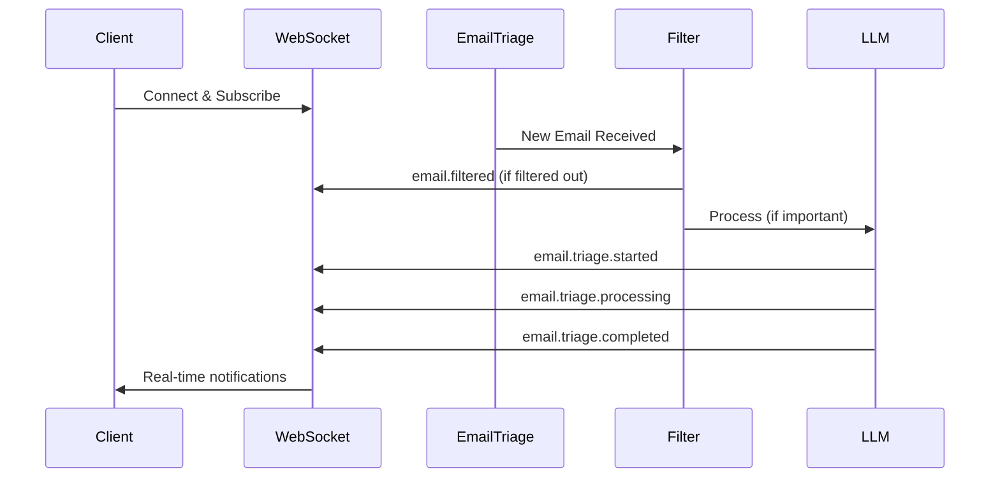

# Email Triage WebSocket Technical Integration Guide

**Document Version:** 1.1  
**Date:** December 2024  
**Status:** Production Ready  

## Table of Contents
1. [Overview](#overview)
2. [WebSocket Connection Setup](#websocket-connection-setup)
3. [Message Types & DTOs](#message-types--dtos)
4. [Client Implementation Examples](#client-implementation-examples)
5. [Error Handling & Reconnection](#error-handling--reconnection)
6. [Testing & Debugging](#testing--debugging)

## Overview

The Email Triage WebSocket Gateway provides real-time notifications for the optimized email triage flow. This technical guide covers the WebSocket connection details, message types, and data structures required for client integration.

### **WebSocket Event Flow**



### **Technical Features**
- **Real-time Event Stream**: Instant notifications via Socket.IO
- **Filtered Email Tracking**: Visibility into smart filtering decisions
- **Processing State Management**: Track triage progress through stages
- **Disconnect Capability**: User-controlled triage session management
- **Error Handling**: Comprehensive failure notifications

## WebSocket Connection Setup

### **Connection Details**
```typescript
const WEBSOCKET_CONFIG = {
  namespace: '/gmail-triage',
  url: 'ws://localhost:3000/gmail-triage', // Development
  // url: 'wss://your-production-domain.com/gmail-triage', // Production
  options: {
    transports: ['websocket'],
    autoConnect: true,
    reconnection: true,
    reconnectionAttempts: 5,
    reconnectionDelay: 1000,
  }
};
```

### **Basic Connection (Socket.IO)**
```typescript
import { io, Socket } from 'socket.io-client';

class EmailTriageWebSocketClient {
  private socket: Socket;
  
  constructor(private userEmail: string, private userId: string) {
    this.socket = io(WEBSOCKET_CONFIG.url, WEBSOCKET_CONFIG.options);
    this.setupEventListeners();
  }

  connect(): Promise<void> {
    return new Promise((resolve, reject) => {
      this.socket.on('connected', (data) => {
        console.log('✅ Connected to email triage notifications:', data);
        this.subscribeToNotifications();
        resolve();
      });

      this.socket.on('connect_error', (error) => {
        console.error('❌ WebSocket connection failed:', error);
        reject(error);
      });
    });
  }

  private subscribeToNotifications(): void {
    this.socket.emit('subscribe', {
      userId: this.userId,
      emailAddress: this.userEmail
    });

    this.socket.on('subscribed', (data) => {
      console.log('✅ Subscribed to notifications:', data);
    });
  }
}
```

## Message Types & DTOs

### **1. Connection Events**

#### **Connected Event**
```typescript
interface ConnectedEventDTO {
  message: string;
  clientId: string;
  timestamp: string;
}

// Example:
{
  "message": "Connected to Gmail notifications",
  "clientId": "socket_abc123",
  "timestamp": "2024-12-20T10:30:00.000Z"
}
```

#### **Subscribed Event**
```typescript
interface SubscribedEventDTO {
  message: string;
  userId: string;
  emailAddress: string;
  rooms: string[];
  timestamp: string;
}

// Example:
{
  "message": "Successfully subscribed to notifications",
  "userId": "user_123",
  "emailAddress": "user@company.com",
  "rooms": ["user:user_123", "email:user@company.com"],
  "timestamp": "2024-12-20T10:30:05.000Z"
}
```

### **2. Email Processing Events**

#### **🆕 Email Filtered Event** (New Optimization)
```typescript
interface EmailFilteredEventDTO {
  emailId: string;
  emailAddress: string;
  subject: string;
  from: string;
  category: EmailCategory;
  priority: 'high' | 'medium' | 'low' | 'ignore';
  reasoning: string;
  confidence: number;
  timestamp: string;
  source: string;
}

enum EmailCategory {
  URGENT_BUSINESS = 'urgent_business',
  MEETING_RELATED = 'meeting_related',
  FOLLOW_UP = 'follow_up',
  CUSTOMER_SUPPORT = 'customer_support',
  GITHUB_NOTIFICATION = 'github_notification',
  SLACK_NOTIFICATION = 'slack_notification',
  JIRA_NOTIFICATION = 'jira_notification',
  PROMOTIONAL = 'promotional',
  NEWSLETTER = 'newsletter',
  AUTOMATED_SYSTEM = 'automated_system',
  SPAM = 'spam',
  GENERAL = 'general'
}

// Example - GitHub notification filtered out:
{
  "emailId": "msg_abc123",
  "emailAddress": "developer@company.com",
  "subject": "[Repository] Pull request #42 was merged",
  "from": "notifications@github.com",
  "category": "github_notification",
  "priority": "ignore",
  "reasoning": "Detected GitHub notification",
  "confidence": 0.95,
  "timestamp": "2024-12-20T10:30:10.000Z",
  "source": "gmail_push"
}

// Example - Meeting email prioritized:
{
  "emailId": "msg_def456",
  "emailAddress": "manager@company.com",
  "subject": "Tomorrow's team meeting - Zoom link",
  "from": "ceo@company.com",
  "category": "meeting_related",
  "priority": "high",
  "reasoning": "Detected meeting-related content",
  "confidence": 0.9,
  "timestamp": "2024-12-20T10:30:15.000Z",
  "source": "gmail_push"
}
```

#### **Email Received Event**
```typescript
interface EmailReceivedEventDTO {
  type: 'email.received';
  emailId: string;
  emailAddress: string;
  subject: string;
  from: string;
  to: string;
  bodyPreview: string;
  timestamp: string;
  fullEmail: {
    id: string;
    threadId: string;
    metadata: EmailMetadata;
    bodyLength: number;
  };
}

interface EmailMetadata {
  subject: string;
  from: string;
  to: string;
  timestamp: string;
  headers?: any;
  gmailSource: boolean;
  messageId: string;
  labels?: string[];
  userId: string;
}

// Example:
{
  "type": "email.received",
  "emailId": "msg_xyz789",
  "emailAddress": "user@company.com",
  "subject": "Urgent: Server maintenance tonight",
  "from": "ops@company.com",
  "to": "user@company.com",
  "bodyPreview": "Hi team, We need to perform emergency server maintenance tonight from 11 PM to 2 AM. Please ensure all critical processes are...",
  "timestamp": "2024-12-20T10:30:20.000Z",
  "fullEmail": {
    "id": "msg_xyz789",
    "threadId": "thread_456",
    "metadata": {
      "subject": "Urgent: Server maintenance tonight",
      "from": "ops@company.com",
      "to": "user@company.com",
      "timestamp": "2024-12-20T10:30:20.000Z",
      "gmailSource": true,
      "messageId": "CABc123@mail.gmail.com",
      "labels": ["INBOX", "IMPORTANT"],
      "userId": "user_123"
    },
    "bodyLength": 1250
  }
}
```

### **3. Triage Processing Events**

#### **Triage Started Event**
```typescript
interface TriageStartedEventDTO {
  type: 'triage.started';
  emailId: string;
  emailAddress: string;
  subject: string;
  from: string;
  timestamp: string;
  source: string;
}

// Example:
{
  "type": "triage.started",
  "emailId": "msg_xyz789",
  "emailAddress": "user@company.com",
  "subject": "Urgent: Server maintenance tonight",
  "from": "ops@company.com",
  "timestamp": "2024-12-20T10:30:25.000Z",
  "source": "gmail_push"
}
```

#### **Triage Processing Event**
```typescript
interface TriageProcessingEventDTO {
  type: 'triage.processing';
  sessionId: string;
  emailId: string;
  emailAddress: string;
  subject: string;
  status: string;
  timestamp: string;
  source: string;
}

// Example:
{
  "type": "triage.processing",
  "sessionId": "session_abc123",
  "emailId": "msg_xyz789",
  "emailAddress": "user@company.com",
  "subject": "Urgent: Server maintenance tonight",
  "status": "processing",
  "timestamp": "2024-12-20T10:30:30.000Z",
  "source": "gmail_push"
}
```

#### **Triage Completed Event**
```typescript
interface TriageCompletedEventDTO {
  type: 'triage.completed';
  sessionId: string;
  emailId: string;
  emailAddress: string;
  result: TriageResult;
  timestamp: string;
  source: string;
}

#### **🆕 Enhanced Triage Results Event (NEW)**
```typescript
interface TriageResultsEventDTO {
  type: 'triage.results';
  sessionId: string;
  emailId: string;
  emailAddress: string;
  subject: string;
  from: string;
  // Complete triage analysis results
  classification: {
    priority: 'urgent' | 'high' | 'normal' | 'low';
    category: 'bug_report' | 'feature_request' | 'question' | 'complaint' | 'praise' | 'other';
    reasoning: string;
    confidence: number;
  };
  summary: {
    problem: string;
    context: string;
    ask: string;
    summary: string;
  };
  replyDraft: {
    subject: string;
    body: string;
    tone: 'professional' | 'friendly' | 'urgent';
    next_steps: string[];
  };
  retrievedContext?: Array<{
    id: string;
    content: string;
    metadata?: any;
    score?: number;
    namespace?: string;
  }>;
  processingMetadata?: {
    startedAt?: string;
    ragEnhanced?: boolean;
    agentsUsed?: string[];
    performanceMetrics?: {
      contextRetrievalMs?: number;
      classificationMs?: number;
      summarizationMs?: number;
      replyDraftMs?: number;
      totalProcessingMs?: number;
    };
  };
  contextRetrievalResults?: {
    totalQueries: number;
    totalDocuments: number;
    namespaces: string[];
    retrievalDuration?: number;
    retrievedAt?: string;
  };
  userToneProfile?: any;
  databaseSessionId?: string;
  timestamp: string;
  source: string;
  langGraph: boolean;
}

interface TriageResult {
  classification: {
    category: string;
    priority: string;
    confidence: number;
    reasoning: string;
  };
  summary: {
    content: string;
    keyPoints: string[];
    wordCount: number;
  };
  actionItems: Array<{
    task: string;
    priority: 'high' | 'medium' | 'low';
    dueDate?: string;
    assignee?: string;
  }>;
  suggestedReply: {
    tone: string;
    content: string;
    confidence: number;
  };
  metadata: {
    processingTimeMs: number;
    agentsUsed: string[];
    tokensUsed: number;
  };
}

// Example:
{
  "type": "triage.completed",
  "sessionId": "session_abc123",
  "emailId": "msg_xyz789",
  "emailAddress": "user@company.com",
  "result": {
    "classification": {
      "category": "urgent_business",
      "priority": "high",
      "confidence": 0.92,
      "reasoning": "Contains urgent maintenance notification with specific timeline"
    },
    "summary": {
      "content": "Emergency server maintenance scheduled tonight from 11 PM to 2 AM. Team needs to prepare critical processes and ensure backup systems are ready.",
      "keyPoints": [
        "Emergency maintenance window: 11 PM - 2 AM tonight",
        "Critical processes need preparation",
        "Backup systems should be verified"
      ],
      "wordCount": 156
    },
    "actionItems": [
      {
        "task": "Verify backup systems are operational",
        "priority": "high",
        "dueDate": "2024-12-20T22:00:00.000Z"
      },
      {
        "task": "Notify team about maintenance window",
        "priority": "high",
        "dueDate": "2024-12-20T18:00:00.000Z"
      },
      {
        "task": "Prepare rollback plan if needed",
        "priority": "medium",
        "dueDate": "2024-12-20T21:00:00.000Z"
      }
    ],
    "suggestedReply": {
      "tone": "professional",
      "content": "Thanks for the heads up on the maintenance window. I'll ensure our team is prepared and will verify our backup systems are ready. Will there be any specific monitoring required during the maintenance?",
      "confidence": 0.88
    },
    "metadata": {
      "processingTimeMs": 3500,
      "agentsUsed": ["classification", "summarization", "action-items", "reply-draft"],
      "tokensUsed": 1250
    }
  },
  "timestamp": "2024-12-20T10:30:45.000Z",
  "source": "gmail_push"
}

// 🆕 Enhanced Triage Results Example (NEW):
{
  "type": "triage.results",
  "sessionId": "session_abc123",
  "emailId": "msg_xyz789",
  "emailAddress": "user@company.com",
  "subject": "Urgent: Production server issues",
  "from": "ops@company.com",
  "classification": {
    "priority": "urgent",
    "category": "bug_report",
    "reasoning": "Email contains urgent production issue requiring immediate attention",
    "confidence": 0.95
  },
  "summary": {
    "problem": "Production server experiencing intermittent crashes affecting user sessions",
    "context": "Issue started after latest deployment, impacting B2B customer workflows",
    "ask": "Requesting immediate investigation and hotfix deployment",
    "summary": "Critical production issue requiring urgent engineering response and system stabilization"
  },
  "replyDraft": {
    "subject": "Re: Urgent: Production server issues - Immediate Action",
    "body": "Thank you for reporting this critical issue. I'm escalating this immediately to our engineering team for urgent resolution. We'll prioritize a hotfix deployment and keep you updated on our progress. Our team is already investigating the root cause related to the recent deployment.",
    "tone": "professional",
    "next_steps": [
      "Escalate to engineering team immediately",
      "Investigate deployment-related root cause",
      "Prepare emergency hotfix deployment",
      "Monitor system stability post-fix"
    ]
  },
  "retrievedContext": [
    {
      "id": "pattern-123",
      "content": "Similar deployment issue resolved by rolling back database migration",
      "metadata": { "source": "previous_incidents", "relevance": 0.88 },
      "score": 0.88,
      "namespace": "email-patterns"
    }
  ],
  "processingMetadata": {
    "startedAt": "2024-12-20T10:30:00.000Z",
    "ragEnhanced": true,
    "agentsUsed": ["classification", "summarization", "reply-draft"],
    "performanceMetrics": {
      "contextRetrievalMs": 180,
      "classificationMs": 850,
      "summarizationMs": 1100,
      "replyDraftMs": 950,
      "totalProcessingMs": 3500
    }
  },
  "contextRetrievalResults": {
    "totalQueries": 3,
    "totalDocuments": 12,
    "namespaces": ["email-patterns", "incident-history"],
    "retrievalDuration": 180,
    "retrievedAt": "2024-12-20T10:30:01.000Z"
  },
  "databaseSessionId": "session_abc123",
  "timestamp": "2024-12-20T10:30:45.000Z",
  "source": "langgraph_stategraph_service",
  "langGraph": true
}
```

#### **Triage Failed Event**
```typescript
interface TriageFailedEventDTO {
  type: 'triage.failed';
  emailId: string;
  emailAddress: string;
  subject: string;
  error: string;
  timestamp: string;
  source: string;
}

// Example:
{
  "type": "triage.failed",
  "emailId": "msg_error123",
  "emailAddress": "user@company.com",
  "subject": "Failed processing email",
  "error": "LLM service temporarily unavailable",
  "timestamp": "2024-12-20T10:30:50.000Z",
  "source": "gmail_push"
}
```

### **4. System Events**

#### **🆕 Triage Disconnected Event** (New Feature)
```typescript
interface TriageDisconnectedEventDTO {
  userId: string;
  timestamp: string;
  source: string;
}

// Example:
{
  "userId": "user_123",
  "timestamp": "2024-12-20T10:35:00.000Z",
  "source": "user_request"
}
```

#### **🆕 Force Disconnect Event** (New Feature)
```typescript
interface ForceDisconnectEventDTO {
  reason: string;
  userEmail: string;
  timestamp: string;
}

// Example:
{
  "reason": "User requested disconnect from email triage",
  "userEmail": "user@company.com",
  "timestamp": "2024-12-20T10:35:00.000Z"
}
```

#### **System Notification Event**
```typescript
interface SystemNotificationEventDTO {
  type: string;
  message: string;
  timestamp: string;
}

// Example:
{
  "type": "info",
  "message": "Email triage system updated with enhanced filtering",
  "timestamp": "2024-12-20T10:40:00.000Z"
}
```

## Client Implementation Examples

### **Basic WebSocket Client Implementation**

```typescript
import { io, Socket } from 'socket.io-client';

interface EmailTriageState {
  isConnected: boolean;
  notifications: EmailNotification[];
  processingEmails: Map<string, TriageProcessingEventDTO>;
  filteredEmails: EmailFilteredEventDTO[];
  triageResults?: Map<string, TriageResultsEventDTO>; // 🆕 Complete triage results by emailId
}

interface EmailNotification {
  id: string;
  type: string;
  data: any;
  timestamp: string;
}

class EmailTriageWebSocketClient {
  private socket: Socket | null = null;
  private state: EmailTriageState = {
    isConnected: false,
    notifications: [],
    processingEmails: new Map(),
    filteredEmails: [],
    triageResults: new Map() // 🆕 Initialize triage results map
  };

  constructor(
    private userEmail: string,
    private userId: string,
    private onStateChange: (state: EmailTriageState) => void
  ) {}

  connect(): void {
    this.socket = io('ws://localhost:3000/gmail-triage', {
      transports: ['websocket'],
      autoConnect: true
    });

    this.setupEventListeners();
  }

  private setupEventListeners(): void {
    if (!this.socket) return;

    // Connection events
    this.socket.on('connected', (data: ConnectedEventDTO) => {
      console.log('Connected:', data);
      this.updateState({ isConnected: true });
      this.subscribe();
    });

    this.socket.on('subscribed', (data: SubscribedEventDTO) => {
      console.log('Subscribed:', data);
    });

    // Email processing events
    this.socket.on('email.filtered', (data: EmailFilteredEventDTO) => {
      this.addFilteredEmail(data);
      this.addNotification('filtered', data);
    });

    this.socket.on('email.received', (data: EmailReceivedEventDTO) => {
      this.addNotification('received', data);
    });

    this.socket.on('triage.started', (data: TriageStartedEventDTO) => {
      this.addNotification('triage_started', data);
    });

    this.socket.on('triage.processing', (data: TriageProcessingEventDTO) => {
      this.addProcessingEmail(data);
    });

    this.socket.on('triage.completed', (data: TriageCompletedEventDTO) => {
      this.removeProcessingEmail(data.emailId);
      this.addNotification('triage_completed', data);
    });

    // 🆕 Handle enhanced triage results (NEW)
    this.socket.on('triage.results', (data: TriageResultsEventDTO) => {
      this.removeProcessingEmail(data.emailId);
      this.addTriageResults(data);
      this.addNotification('triage_results', data);
    });

    this.socket.on('triage.failed', (data: TriageFailedEventDTO) => {
      this.removeProcessingEmail(data.emailId);
      this.addNotification('triage_failed', data);
    });

    this.socket.on('triage.disconnected', (data: any) => {
      console.log('Triage disconnected:', data);
    });

    this.socket.on('force_disconnect', (data: any) => {
      console.log('Force disconnected by server:', data);
      // Handle forced disconnection (user disconnected from another session)
      this.isManualDisconnect = true;
      this.onEvent('connection', { 
        status: 'force_disconnected', 
        reason: data.reason,
        timestamp: data.timestamp 
      });
    });
  }

  private subscribe(): void {
    if (!this.socket?.connected) return;

    this.socket.emit('subscribe', {
      userId: this.userId,
      emailAddress: this.userEmail
    });
  }

  async disconnect(): Promise<void> {
    try {
      // Call server disconnect endpoint
      const response = await fetch('/gmail/client/disconnect', {
        method: 'POST',
        headers: {
          'Authorization': `Bearer ${localStorage.getItem('token')}`,
          'Content-Type': 'application/json'
        }
      });
      
      const result = await response.json();
      console.log('Disconnected from triage:', result);
      
      // Unsubscribe from WebSocket
      if (this.socket) {
        this.socket.emit('unsubscribe', {
          userId: this.userId,
          emailAddress: this.userEmail
        });
        this.socket.disconnect();
      }
    } catch (error) {
      console.error('Disconnect failed:', error);
    }
  }

  private updateState(updates: Partial<EmailTriageState>): void {
    this.state = { ...this.state, ...updates };
    this.onStateChange(this.state);
  }

  private addNotification(type: string, data: any): void {
    const notification: EmailNotification = {
      id: data.emailId || data.sessionId || Date.now().toString(),
      type,
      data,
      timestamp: data.timestamp || new Date().toISOString()
    };

    this.updateState({
      notifications: [...this.state.notifications, notification]
    });
  }

  private addFilteredEmail(data: EmailFilteredEventDTO): void {
    this.updateState({
      filteredEmails: [...this.state.filteredEmails, data]
    });
  }

  private addProcessingEmail(data: TriageProcessingEventDTO): void {
    const newProcessing = new Map(this.state.processingEmails);
    newProcessing.set(data.emailId, data);
    this.updateState({ processingEmails: newProcessing });
  }

  private removeProcessingEmail(emailId: string): void {
    const newProcessing = new Map(this.state.processingEmails);
    newProcessing.delete(emailId);
    this.updateState({ processingEmails: newProcessing });
  }

  // 🆕 Handle complete triage results (NEW)
  private addTriageResults(data: TriageResultsEventDTO): void {
    // Store complete triage results for the email
    const triageResults = new Map(this.state.triageResults || new Map());
    triageResults.set(data.emailId, {
      sessionId: data.sessionId,
      emailId: data.emailId,
      classification: data.classification,
      summary: data.summary,
      replyDraft: data.replyDraft,
      retrievedContext: data.retrievedContext,
      processingMetadata: data.processingMetadata,
      contextRetrievalResults: data.contextRetrievalResults,
      userToneProfile: data.userToneProfile,
      databaseSessionId: data.databaseSessionId,
      timestamp: data.timestamp,
      source: data.source,
      langGraph: data.langGraph,
    });
    
    this.updateState({ triageResults });
  }

  getState(): EmailTriageState {
    return { ...this.state };
  }

  isConnected(): boolean {
    return this.socket?.connected || false;
  }
}

// Usage Example:
const client = new EmailTriageWebSocketClient(
  'user@company.com',
  'user_123',
  (state) => {
    // Handle state changes in your application
    console.log('State updated:', state);
    // Update your UI based on the new state
  }
);

client.connect();
```

### **Disconnect from Triage**

```typescript
// Server endpoint call to disconnect
async function disconnectFromEmailTriage(): Promise<void> {
  const response = await fetch('/gmail/client/disconnect', {
    method: 'POST',
    headers: {
      'Authorization': `Bearer ${authToken}`,
      'Content-Type': 'application/json'
    }
  });
  
  const result = await response.json();
  console.log('Disconnect result:', result);
  
  // WebSocket unsubscribe
  socket.emit('unsubscribe', {
    userId: 'user_123',
    emailAddress: 'user@company.com'
  });
}
```

### **Event Type Classification**

```typescript
// Categorize events for your UI
function categorizeNotification(type: string): {
  category: 'connection' | 'processing' | 'result' | 'error';
  priority: 'high' | 'medium' | 'low';
} {
  switch (type) {
    case 'connected':
    case 'subscribed':
    case 'triage.disconnected':
      return { category: 'connection', priority: 'low' };
      
    case 'email.received':
    case 'triage.started':
    case 'triage.processing':
      return { category: 'processing', priority: 'medium' };
      
    case 'email.filtered':
      return { category: 'processing', priority: 'low' };
      
    case 'triage.completed':
      return { category: 'result', priority: 'high' };
      
    case 'triage.failed':
      return { category: 'error', priority: 'high' };
      
    default:
      return { category: 'processing', priority: 'medium' };
  }
}
```

## Error Handling & Reconnection

### **Robust WebSocket Client**

```typescript
class RobustEmailTriageClient {
  private socket: Socket | null = null;
  private reconnectAttempts = 0;
  private maxReconnectAttempts = 5;
  private reconnectDelay = 1000;
  private isManualDisconnect = false;

  constructor(
    private userEmail: string,
    private userId: string,
    private onEvent: (event: string, data: any) => void
  ) {}

  connect(): void {
    if (this.socket?.connected) {
      console.log('Already connected');
      return;
    }

    this.socket = io('ws://localhost:3000/gmail-triage', {
      transports: ['websocket'],
      autoConnect: true,
      reconnection: false // Handle reconnection manually
    });

    this.setupEventListeners();
  }

  private setupEventListeners(): void {
    if (!this.socket) return;

    this.socket.on('connect', () => {
      console.log('✅ WebSocket connected');
      this.reconnectAttempts = 0;
      this.subscribeToNotifications();
      this.onEvent('connection', { status: 'connected' });
    });

    this.socket.on('disconnect', (reason) => {
      console.log('🔴 WebSocket disconnected:', reason);
      this.onEvent('connection', { status: 'disconnected', reason });
      
      if (!this.isManualDisconnect) {
        this.handleReconnection();
      }
    });

    this.socket.on('connect_error', (error) => {
      console.error('❌ WebSocket connection error:', error);
      this.onEvent('connection', { status: 'error', error: error.message });
      
      if (!this.isManualDisconnect) {
        this.handleReconnection();
      }
    });

    // Email triage events
    this.socket.on('email.filtered', (data) => {
      this.onEvent('email.filtered', data);
    });

    this.socket.on('email.received', (data) => {
      this.onEvent('email.received', data);
    });

    this.socket.on('triage.started', (data) => {
      this.onEvent('triage.started', data);
    });

    this.socket.on('triage.processing', (data) => {
      this.onEvent('triage.processing', data);
    });

    this.socket.on('triage.completed', (data) => {
      this.onEvent('triage.completed', data);
    });

    this.socket.on('triage.failed', (data) => {
      this.onEvent('triage.failed', data);
    });
  }

  private subscribeToNotifications(): void {
    if (!this.socket?.connected) return;

    this.socket.emit('subscribe', {
      userId: this.userId,
      emailAddress: this.userEmail
    });
  }

  private handleReconnection(): void {
    if (this.reconnectAttempts >= this.maxReconnectAttempts) {
      console.error('❌ Max reconnection attempts reached');
      this.onEvent('connection', { 
        status: 'failed', 
        message: 'Max reconnection attempts reached' 
      });
      return;
    }

    this.reconnectAttempts++;
    const delay = this.reconnectDelay * Math.pow(2, this.reconnectAttempts - 1);

    console.log(`⏳ Attempting reconnection ${this.reconnectAttempts}/${this.maxReconnectAttempts} in ${delay}ms`);
    
    setTimeout(() => {
      if (!this.isManualDisconnect) {
        this.connect();
      }
    }, delay);
  }

  disconnect(): void {
    this.isManualDisconnect = true;
    
    if (this.socket) {
      this.socket.emit('unsubscribe', {
        userId: this.userId,
        emailAddress: this.userEmail
      });
      
      this.socket.disconnect();
      this.socket = null;
    }
    
    this.onEvent('connection', { status: 'disconnected', manual: true });
  }

  isConnected(): boolean {
    return this.socket?.connected || false;
  }
}
```

## Testing & Debugging

### **WebSocket Testing Utility**

```typescript
class EmailTriageWebSocketTester {
  private client: RobustEmailTriageClient;
  private events: Array<{ event: string; data: any; timestamp: string }> = [];

  constructor(userEmail: string, userId: string) {
    this.client = new RobustEmailTriageClient(
      userEmail,
      userId,
      this.handleEvent.bind(this)
    );
  }

  private handleEvent(event: string, data: any): void {
    const logEntry = {
      event,
      data,
      timestamp: new Date().toISOString()
    };
    
    this.events.push(logEntry);
    console.log(`📡 WebSocket Event:`, logEntry);
  }

  async runTests(): Promise<void> {
    console.log('🧪 Starting WebSocket tests...');

    // Test 1: Connection
    console.log('Test 1: Connection');
    this.client.connect();
    await this.wait(2000);

    // Test 2: Send test message
    console.log('Test 2: Test message');
    if (this.client.isConnected()) {
      // Trigger test notification from server
      await fetch('/gmail/client/test-push-notification', {
        method: 'POST',
        headers: {
          'Authorization': `Bearer ${localStorage.getItem('token')}`,
          'Content-Type': 'application/json'
        }
      });
    }
    await this.wait(3000);

    // Test 3: Disconnect
    console.log('Test 3: Disconnect');
    this.client.disconnect();
    await this.wait(1000);

    console.log('🧪 Tests completed. Events received:', this.events.length);
    this.printEventSummary();
  }

  private printEventSummary(): void {
    const eventCounts = this.events.reduce((acc, event) => {
      acc[event.event] = (acc[event.event] || 0) + 1;
      return acc;
    }, {} as Record<string, number>);

    console.table(eventCounts);
  }

  private wait(ms: number): Promise<void> {
    return new Promise(resolve => setTimeout(resolve, ms));
  }

  getEvents(): Array<{ event: string; data: any; timestamp: string }> {
    return [...this.events];
  }
}

// Usage in browser console:
// const tester = new EmailTriageWebSocketTester('user@company.com', 'user_123');
// tester.runTests();
```

### **Event Logging for Development**

```typescript
// Simple event logger for debugging WebSocket events
class EmailTriageEventLogger {
  private events: Array<{
    event: string;
    data: any;
    timestamp: number;
    category: string;
  }> = [];

  logEvent(eventType: string, data: any): void {
    const category = this.categorizeEvent(eventType);
    
    this.events.push({
      event: eventType,
      data: { ...data },
      timestamp: Date.now(),
      category
    });

    // Console output with categorization
    console.group(`[${category.toUpperCase()}] ${eventType}`);
    console.log('Data:', data);
    console.log('Time:', new Date().toISOString());
    console.groupEnd();
  }

  private categorizeEvent(eventType: string): string {
    if (eventType.includes('connected') || eventType.includes('subscribed')) {
      return 'connection';
    }
    if (eventType.includes('filtered')) {
      return 'filtering';
    }
    if (eventType.includes('triage')) {
      return 'processing';
    }
    if (eventType.includes('failed') || eventType.includes('error')) {
      return 'error';
    }
    return 'general';
  }

  getEventsByCategory(category: string): any[] {
    return this.events.filter(event => event.category === category);
  }

  getRecentEvents(count: number = 10): any[] {
    return this.events.slice(-count);
  }

  exportLogs(): string {
    return JSON.stringify(this.events, null, 2);
  }

  clearLogs(): void {
    this.events = [];
  }
}

// Usage in your WebSocket client:
const logger = new EmailTriageEventLogger();

socket.on('email.filtered', (data) => {
  logger.logEvent('email.filtered', data);
  // Your handling logic
});
```

## Summary

This technical guide provides the essential WebSocket integration details for the optimized email triage system:

### **Technical Components Provided**
- **Complete TypeScript DTOs** for all WebSocket message types
- **WebSocket client implementation** with connection management
- **Event handling patterns** for all notification types
- **Error handling & reconnection** logic with exponential backoff
- **Testing utilities** for debugging and development
- **Event categorization** for proper client-side processing

### **Key WebSocket Events**
- **Connection Events**: `connected`, `subscribed`, `triage.disconnected`
- **Email Processing**: `email.received`, `email.filtered`, `triage.started`
- **Triage Progress**: `triage.processing`, `triage.completed`, `triage.failed`
- **Smart Filtering**: Real-time filtering decisions with reasoning and confidence scores

### **Integration Requirements**
1. **Dependencies**: `socket.io-client` for WebSocket communication
2. **Authentication**: Bearer token authentication for disconnect endpoint
3. **Configuration**: WebSocket server URL and user identification
4. **Event Handling**: Implement handlers for all event types based on your design system

### **Server Endpoints**
- **WebSocket**: `ws://localhost:3000/gmail-triage` (Socket.IO namespace)
- **Disconnect**: `POST /gmail/client/disconnect` (REST endpoint)
- **Subscribe/Unsubscribe**: Via WebSocket emit events

The optimized email triage system provides **90% cost reduction** through intelligent filtering with complete technical visibility into the process. 