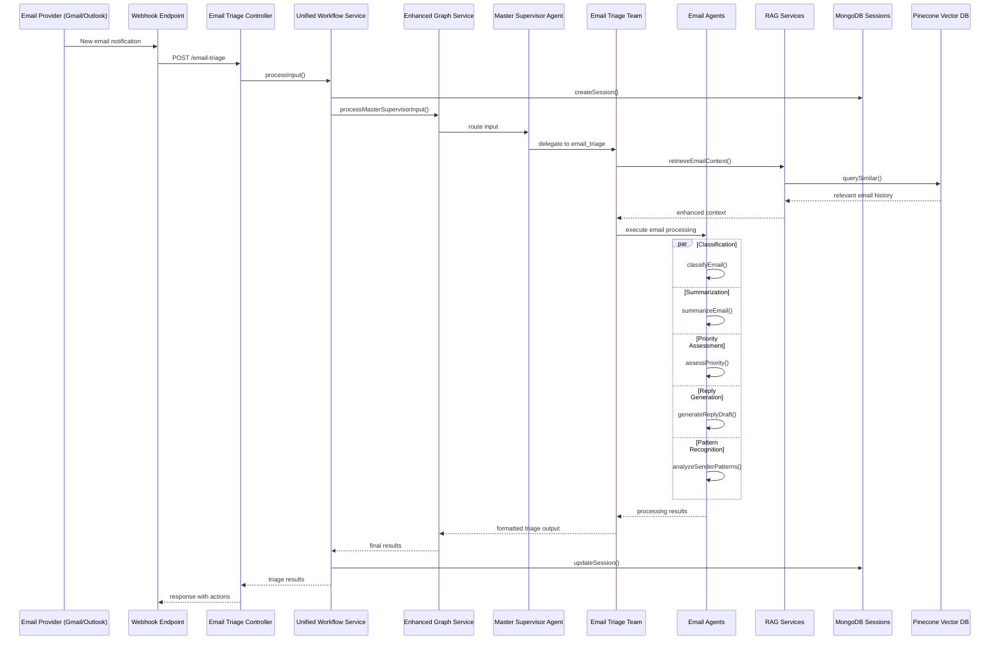
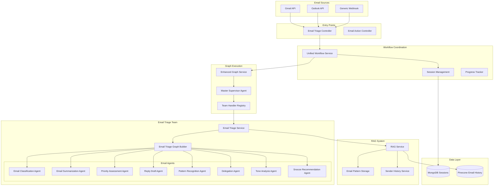

# Email Triage Workflow Guide

## Table of Contents
1. [Overview](#overview)
2. [Workflow Architecture](#workflow-architecture)
3. [Execution Flow](#execution-flow)
4. [Component Details](#component-details)
5. [Agent Specializations](#agent-specializations)
6. [API Usage](#api-usage)
7. [Configuration](#configuration)
8. [Troubleshooting](#troubleshooting)

## Overview

The Email Triage Workflow is an intelligent agentic system that processes incoming emails to classify, prioritize, summarize, and generate appropriate responses. The workflow helps automate email management by providing smart categorization, priority assessment, and draft responses while maintaining context awareness through integration with our RAG system.

### Key Capabilities
- **Email Classification**: Categorizes emails by type and urgency
- **Priority Assessment**: Determines email importance and response urgency
- **Smart Summarization**: Generates concise email summaries
- **Reply Draft Generation**: Creates contextually appropriate response drafts
- **Sender Pattern Recognition**: Learns from sender history and patterns
- **Action Item Detection**: Identifies tasks and follow-ups from email content
- **Delegation Recommendations**: Suggests appropriate team members for handling

## Workflow Architecture

### High-Level Flow



### Component Architecture



## Execution Flow

### Phase 1: Email Ingestion

```typescript
// 1. Email Webhook/API Integration
interface IncomingEmail {
  id: string;
  from: string;
  to: string[];
  cc?: string[];
  bcc?: string[];
  subject: string;
  body: string;
  attachments?: Array<{
    name: string;
    size: number;
    contentType: string;
    downloadUrl?: string;
  }>;
  receivedAt: string;
  threadId?: string;
  labels?: string[];
  metadata?: Record<string, any>;
}

// 2. Controller Processing
@Post('triage')
async triageEmail(@Body() emailData: EmailTriageDto, @Request() req) {
  const userId = req.user?.userId;
  
  // Prepare input for unified workflow
  const input = {
    type: "email",
    emailData: {
      id: emailData.id,
      from: emailData.from,
      to: emailData.to,
      subject: emailData.subject,
      body: emailData.body,
      receivedAt: emailData.receivedAt,
      attachments: emailData.attachments || [],
      metadata: emailData.metadata || {}
    },
    sessionId: `email-${emailData.id}-${Date.now()}`
  };

  return this.unifiedWorkflowService.processInput(input, emailData.metadata, userId);
}
```

### Phase 2: Master Supervisor Routing

```typescript
// 3. Enhanced Graph Service Processing
async processMasterSupervisorInput(input: any): Promise<any> {
  const initialState = {
    input: input,
    startTime: new Date().toISOString(),
    routing: undefined,
    result: undefined,
    error: undefined,
  };

  const finalState = await this.supervisorGraph.execute(initialState);
  return this.formatResults(finalState);
}

// 4. Master Supervisor Agent Email Routing
async routeEmailInput(state: any): Promise<any> {
  const input = state.input;
  
  // Email-specific routing logic
  if (input.type === "email" || input.emailData || input.subject || input.from) {
    return {
      ...state,
      routing: {
        team: "email_triage",
        confidence: 0.98,
        reasoning: "Input contains email data structure",
        emailMetadata: {
          hasAttachments: input.emailData?.attachments?.length > 0,
          isReply: input.emailData?.subject?.includes("Re:"),
          isForward: input.emailData?.subject?.includes("Fwd:"),
          threadId: input.emailData?.threadId
        }
      }
    };
  }
  
  return state;
}
```

### Phase 3: Email Triage Team Processing

```typescript
// 5. Email Triage Service (Team Handler)
@Injectable()
export class EmailTriageService implements TeamHandler {
  
  async process(input: any): Promise<EmailTriageState> {
    // Input validation and preprocessing
    const emailData = input.emailData || input;
    
    if (!this.validateEmailData(emailData)) {
      return this.createErrorResult("Invalid email data structure");
    }

    const sessionId = input.sessionId || `email-${emailData.id}-${Date.now()}`;
    
    // Initial state preparation
    const initialState: EmailTriageState = {
      sessionId,
      emailData,
      classification: undefined,
      priority: undefined,
      summary: undefined,
      replyDraft: undefined,
      senderPatterns: undefined,
      delegationSuggestion: undefined,
      toneAnalysis: undefined,
      snoozeRecommendation: undefined,
      stage: "initialization"
    };

    try {
      // Step 1: Store email for pattern recognition and future context
      await this.storeEmailForPatternAnalysis(emailData);
      
      // Step 2: Enhanced context retrieval from email history
      let enhancedState = initialState;
      if (this.ragEnabled) {
        enhancedState = await this.enhanceStateWithEmailContext(initialState);
      }
      
      // Step 3: Build and execute email triage graph
      const graph = await this.emailTriageGraphBuilder.buildGraph();
      
      const result = await this.graphExecutionService.executeGraph<EmailTriageState>(
        graph, 
        enhancedState
      );
      
      return this.formatTriageResults(result);
      
    } catch (error) {
      this.logger.error(`Error processing email ${emailData.id}: ${error.message}`);
      return this.createErrorResult(error.message, initialState);
    }
  }

  private validateEmailData(emailData: any): boolean {
    const required = ['id', 'from', 'subject', 'body'];
    return required.every(field => emailData[field]);
  }
}
```

### Phase 4: Email Context Enhancement

```typescript
// 6. RAG-Enhanced Email Context Retrieval
private async enhanceStateWithEmailContext(state: EmailTriageState): Promise<EmailTriageState> {
  try {
    const emailData = state.emailData;
    
    // Multiple context retrieval strategies
    const contextQueries = [
      // Sender history
      `Previous emails from ${emailData.from}`,
      // Subject similarity
      `Emails with similar subject: ${emailData.subject}`,
      // Content similarity
      `${emailData.body.substring(0, 200)}...`
    ];
    
    const contextResults = await Promise.all(
      contextQueries.map(query => 
        this.ragService.getContext(query, {
          indexName: "email-analysis",
          namespace: "email-history",
          topK: 3,
          minScore: 0.6,
          filter: { sender: emailData.from } // Filter by sender when relevant
        })
      )
    );
    
    // Combine and format context
    const enhancedContext = {
      senderHistory: contextResults[0],
      similarSubjects: contextResults[1],
      similarContent: contextResults[2],
      retrievalTimestamp: new Date().toISOString()
    };
    
    return {
      ...state,
      context: {
        ...state.context,
        emailHistory: enhancedContext
      }
    };
    
  } catch (error) {
    this.logger.warn(`Error retrieving email context: ${error.message}`);
    return state;
  }
}

// 7. Email Pattern Storage
private async storeEmailForPatternAnalysis(emailData: any): Promise<void> {
  try {
    const emailDocument = {
      id: `email-${emailData.id}`,
      content: `Subject: ${emailData.subject}\nFrom: ${emailData.from}\nBody: ${emailData.body}`,
      metadata: {
        sender: emailData.from,
        subject: emailData.subject,
        receivedAt: emailData.receivedAt,
        hasAttachments: emailData.attachments?.length > 0,
        isReply: emailData.subject?.includes("Re:"),
        isForward: emailData.subject?.includes("Fwd:"),
        type: "email_triage",
        threadId: emailData.threadId
      }
    };

    await this.ragService.processDocumentsForRag([emailDocument], {
      indexName: "email-analysis",
      namespace: "email-history",
      useSemanticChunking: false // Emails are usually short enough
    });
    
  } catch (error) {
    this.logger.warn(`Error storing email for pattern analysis: ${error.message}`);
  }
}
```

### Phase 5: Email Agent Graph Execution

```typescript
// 8. Email Triage Graph Builder
@Injectable()
export class EmailTriageGraphBuilder extends BaseGraphBuilder<EmailTriageState> {
  
  private readonly nodeNames = {
    ...this.baseNodeNames,
    CLASSIFICATION: "classification",
    PRIORITY_ASSESSMENT: "priority_assessment", 
    SUMMARIZATION: "summarization",
    TONE_ANALYSIS: "tone_analysis",
    REPLY_GENERATION: "reply_generation",
    PATTERN_RECOGNITION: "pattern_recognition",
    DELEGATION_SUGGESTION: "delegation_suggestion",
    SNOOZE_RECOMMENDATION: "snooze_recommendation"
  };

  protected buildNodes(): Record<string, Function> {
    return {
      [this.nodeNames.START]: this.startNode.bind(this),
      [this.nodeNames.CLASSIFICATION]: this.classificationNode.bind(this),
      [this.nodeNames.PRIORITY_ASSESSMENT]: this.priorityAssessmentNode.bind(this),
      [this.nodeNames.SUMMARIZATION]: this.summarizationNode.bind(this),
      [this.nodeNames.TONE_ANALYSIS]: this.toneAnalysisNode.bind(this),
      [this.nodeNames.REPLY_GENERATION]: this.replyGenerationNode.bind(this),
      [this.nodeNames.PATTERN_RECOGNITION]: this.patternRecognitionNode.bind(this),
      [this.nodeNames.DELEGATION_SUGGESTION]: this.delegationSuggestionNode.bind(this),
      [this.nodeNames.SNOOZE_RECOMMENDATION]: this.snoozeRecommendationNode.bind(this),
      [this.nodeNames.END]: this.endNode.bind(this),
    };
  }

  protected defineEdges(graph: any): void {
    // Parallel processing for initial analysis
    graph.addEdge(this.nodeNames.START, this.nodeNames.CLASSIFICATION);
    graph.addEdge(this.nodeNames.CLASSIFICATION, this.nodeNames.PRIORITY_ASSESSMENT);
    graph.addEdge(this.nodeNames.PRIORITY_ASSESSMENT, this.nodeNames.SUMMARIZATION);
    
    // Conditional edges based on classification
    graph.addConditionalEdges(
      this.nodeNames.SUMMARIZATION,
      this.routeToSecondaryProcessing.bind(this),
      {
        "tone_analysis": this.nodeNames.TONE_ANALYSIS,
        "reply_needed": this.nodeNames.REPLY_GENERATION,
        "pattern_analysis": this.nodeNames.PATTERN_RECOGNITION,
        "end": this.nodeNames.END
      }
    );
    
    // Secondary processing flows
    graph.addEdge(this.nodeNames.TONE_ANALYSIS, this.nodeNames.REPLY_GENERATION);
    graph.addEdge(this.nodeNames.REPLY_GENERATION, this.nodeNames.PATTERN_RECOGNITION);
    graph.addEdge(this.nodeNames.PATTERN_RECOGNITION, this.nodeNames.DELEGATION_SUGGESTION);
    graph.addEdge(this.nodeNames.DELEGATION_SUGGESTION, this.nodeNames.SNOOZE_RECOMMENDATION);
    graph.addEdge(this.nodeNames.SNOOZE_RECOMMENDATION, this.nodeNames.END);
  }

  private routeToSecondaryProcessing(state: EmailTriageState): string {
    // Route based on classification and priority
    if (state.classification?.category === "customer_inquiry" && state.priority === "high") {
      return "tone_analysis";
    } else if (state.classification?.requiresReply) {
      return "reply_needed";
    } else if (state.classification?.category === "internal") {
      return "pattern_analysis";
    }
    return "end";
  }
}
```

### Phase 6: Individual Agent Processing

```typescript
// 9. Email Classification Node
private async classificationNode(state: EmailTriageState): Promise<EmailTriageState> {
  this.logger.log(`Classifying email ${state.emailData.id}`);
  
  const agent = this.agentFactory.getEmailClassificationAgent();
  const classification = await agent.classifyEmail(state.emailData, state.context);
  
  return {
    ...state,
    classification,
    stage: "classification_completed"
  };
}

// 10. Priority Assessment Node  
private async priorityAssessmentNode(state: EmailTriageState): Promise<EmailTriageState> {
  this.logger.log(`Assessing priority for email ${state.emailData.id}`);
  
  const agent = this.agentFactory.getPriorityAssessmentAgent();
  const priority = await agent.assessPriority(
    state.emailData, 
    state.classification,
    state.context
  );
  
  return {
    ...state,
    priority,
    stage: "priority_assessment_completed"
  };
}

// 11. Email Summarization Node
private async summarizationNode(state: EmailTriageState): Promise<EmailTriageState> {
  this.logger.log(`Summarizing email ${state.emailData.id}`);
  
  const agent = this.agentFactory.getEmailSummarizationAgent();
  const summary = await agent.summarizeEmail(state.emailData, state.context);
  
  return {
    ...state,
    summary,
    stage: "summarization_completed"
  };
}

// 12. Reply Draft Generation Node
private async replyGenerationNode(state: EmailTriageState): Promise<EmailTriageState> {
  this.logger.log(`Generating reply draft for email ${state.emailData.id}`);
  
  const agent = this.agentFactory.getReplyDraftAgent();
  const replyDraft = await agent.generateReplyDraft(
    state.emailData,
    state.classification,
    state.summary,
    state.context
  );
  
  return {
    ...state,
    replyDraft,
    stage: "reply_generation_completed"
  };
}
```

## Component Details

### 1. Email Triage Controller

**Location**: `src/email/email-triage.controller.ts`

**Responsibilities**:
- Handle incoming email webhooks from various providers
- Validate email data and metadata
- Route to unified workflow service
- Provide real-time status updates

**Key Methods**:
```typescript
@Post('triage')
async triageEmail(@Body() emailData: EmailTriageDto): Promise<TriageSessionInfo>

@Get('status/:sessionId')
async getTriageStatus(@Param('sessionId') sessionId: string): Promise<TriageStatusDto>

@Post('webhook/gmail')
async handleGmailWebhook(@Body() webhookData: GmailWebhookDto): Promise<void>

@Post('webhook/outlook')  
async handleOutlookWebhook(@Body() webhookData: OutlookWebhookDto): Promise<void>
```

### 2. Email Action Controller

**Location**: `src/email/email-action.controller.ts`

**Responsibilities**:
- Handle post-triage actions (reply, snooze, delegate)
- Execute recommended actions
- Update email status and tracking

**Key Methods**:
```typescript
@Post('reply/:sessionId')
async sendReply(@Param('sessionId') sessionId: string, @Body() replyData: ReplyDto): Promise<void>

@Post('snooze/:sessionId')
async snoozeEmail(@Param('sessionId') sessionId: string, @Body() snoozeData: SnoozeDto): Promise<void>

@Post('delegate/:sessionId')
async delegateEmail(@Param('sessionId') sessionId: string, @Body() delegateData: DelegateDto): Promise<void>
```

## Agent Specializations

### 1. Email Classification Agent

```typescript
export interface EmailClassification {
  category: "customer_inquiry" | "internal" | "marketing" | "support" | "urgent" | "spam" | "newsletter" | "meeting_request" | "document_sharing";
  subcategory?: string;
  confidence: number;
  requiresReply: boolean;
  isAutomated: boolean;
  businessContext: "sales" | "support" | "hr" | "engineering" | "marketing" | "general";
  urgencyIndicators: string[];
  keyEntities: Array<{
    type: "person" | "company" | "product" | "date" | "amount";
    value: string;
    confidence: number;
  }>;
}

@Injectable()
export class EmailClassificationAgent extends BaseAgent {
  async classifyEmail(emailData: any, context?: any): Promise<EmailClassification> {
    const prompt = this.buildClassificationPrompt(emailData, context);
    const response = await this.processMessage(prompt);
    return this.parseClassificationResponse(response);
  }

  private buildClassificationPrompt(emailData: any, context?: any): string {
    return `Classify this email with detailed analysis:

FROM: ${emailData.from}
TO: ${emailData.to.join(', ')}
SUBJECT: ${emailData.subject}
BODY: ${emailData.body}

${context?.emailHistory ? `
SENDER HISTORY: Previous ${context.emailHistory.senderHistory.length} emails from this sender
SIMILAR SUBJECTS: ${context.emailHistory.similarSubjects.length} emails with similar subjects
` : ''}

Analyze and return JSON with EmailClassification structure.`;
  }
}
```

### 2. Priority Assessment Agent

```typescript
export interface PriorityAssessment {
  level: "critical" | "high" | "medium" | "low";
  score: number; // 0-100
  reasoning: string[];
  responseTimeRecommendation: "immediate" | "within_hour" | "within_day" | "within_week";
  escalationRecommended: boolean;
  factorsConsidered: Array<{
    factor: string;
    weight: number;
    impact: "positive" | "negative" | "neutral";
  }>;
}

@Injectable()
export class PriorityAssessmentAgent extends BaseAgent {
  async assessPriority(
    emailData: any, 
    classification: EmailClassification, 
    context?: any
  ): Promise<PriorityAssessment> {
    
    const priorityFactors = this.extractPriorityFactors(emailData, classification, context);
    const prompt = this.buildPriorityPrompt(emailData, classification, priorityFactors);
    const response = await this.processMessage(prompt);
    
    return this.parsePriorityResponse(response);
  }

  private extractPriorityFactors(emailData: any, classification: EmailClassification, context?: any): any[] {
    const factors = [];
    
    // Sender authority/VIP status
    if (this.isVipSender(emailData.from)) {
      factors.push({ factor: "VIP sender", weight: 0.3, impact: "positive" });
    }
    
    // Urgency keywords
    const urgentKeywords = ["urgent", "asap", "immediate", "critical", "emergency"];
    const hasUrgentKeywords = urgentKeywords.some(keyword => 
      emailData.subject.toLowerCase().includes(keyword) || 
      emailData.body.toLowerCase().includes(keyword)
    );
    
    if (hasUrgentKeywords) {
      factors.push({ factor: "Urgent keywords detected", weight: 0.4, impact: "positive" });
    }
    
    // Customer vs internal
    if (classification.category === "customer_inquiry") {
      factors.push({ factor: "Customer inquiry", weight: 0.25, impact: "positive" });
    }
    
    // Response time patterns from context
    if (context?.emailHistory?.senderHistory?.length > 0) {
      factors.push({ factor: "Established sender relationship", weight: 0.15, impact: "positive" });
    }
    
    return factors;
  }
}
```

### 3. Email Summarization Agent

```typescript
export interface EmailSummary {
  briefSummary: string; // 1-2 sentences
  keyPoints: string[];
  actionItems: Array<{
    action: string;
    deadline?: string;
    priority: "high" | "medium" | "low";
  }>;
  mentionedEntities: Array<{
    type: "person" | "company" | "product" | "date" | "amount";
    value: string;
    context: string;
  }>;
  sentiment: "positive" | "neutral" | "negative";
  attachmentSummary?: string;
}

@Injectable()
export class EmailSummarizationAgent extends BaseAgent {
  async summarizeEmail(emailData: any, context?: any): Promise<EmailSummary> {
    const prompt = this.buildSummarizationPrompt(emailData, context);
    const response = await this.processMessage(prompt);
    return this.parseSummaryResponse(response);
  }

  private buildSummarizationPrompt(emailData: any, context?: any): string {
    return `Create a comprehensive summary of this email:

FROM: ${emailData.from}
SUBJECT: ${emailData.subject}
BODY: ${emailData.body}
${emailData.attachments?.length > 0 ? `ATTACHMENTS: ${emailData.attachments.map(a => a.name).join(', ')}` : ''}

${context?.emailHistory ? `
CONTEXT: This sender has sent ${context.emailHistory.senderHistory.length} previous emails
` : ''}

Provide detailed analysis following EmailSummary structure.`;
  }
}
```

### 4. Reply Draft Agent

```typescript
export interface ReplyDraft {
  subject: string;
  body: string;
  tone: "formal" | "casual" | "professional" | "friendly";
  confidence: number;
  suggestedActions: Array<{
    action: "send" | "review" | "customize" | "delay";
    reason: string;
  }>;
  templateUsed?: string;
  personalizationElements: string[];
}

@Injectable()
export class ReplyDraftAgent extends BaseAgent {
  async generateReplyDraft(
    emailData: any,
    classification: EmailClassification,
    summary: EmailSummary,
    context?: any
  ): Promise<ReplyDraft> {
    
    const replyStrategy = this.determineReplyStrategy(classification, summary);
    const prompt = this.buildReplyPrompt(emailData, classification, summary, replyStrategy, context);
    const response = await this.processMessage(prompt);
    
    return this.parseReplyResponse(response);
  }

  private determineReplyStrategy(classification: EmailClassification, summary: EmailSummary): any {
    return {
      tone: this.determineTone(classification),
      template: this.selectTemplate(classification),
      personalization: this.getPersonalizationElements(summary),
      urgency: classification.category === "customer_inquiry" ? "high" : "medium"
    };
  }
}
```

## API Usage

### Basic Email Triage Request

```bash
curl -X POST http://localhost:3000/email-triage \
  -H "Content-Type: application/json" \
  -H "Authorization: Bearer YOUR_JWT_TOKEN" \
  -d '{
    "id": "email-12345",
    "from": "customer@example.com",
    "to": ["support@company.com"],
    "subject": "Urgent: Login issues with premium account",
    "body": "Hi, I am unable to access my premium account since this morning. This is affecting my business operations. Please help ASAP.",
    "receivedAt": "2024-01-15T14:30:00Z",
    "metadata": {
      "provider": "gmail",
      "threadId": "thread-567",
      "labels": ["inbox", "unread"]
    }
  }'
```

### Response
```json
{
  "sessionId": "email-12345-1705328400000",
  "status": "pending"
}
```

### Retrieve Triage Results

```bash
curl -X GET http://localhost:3000/email-triage/status/email-12345-1705328400000 \
  -H "Authorization: Bearer YOUR_JWT_TOKEN"
```

### Triage Results Response
```json
{
  "sessionId": "email-12345-1705328400000",
  "status": "completed",
  "results": {
    "classification": {
      "category": "customer_inquiry",
      "subcategory": "technical_support",
      "confidence": 0.95,
      "requiresReply": true,
      "isAutomated": false,
      "businessContext": "support",
      "urgencyIndicators": ["urgent", "asap", "affecting business"],
      "keyEntities": [
        {
          "type": "product",
          "value": "premium account",
          "confidence": 0.9
        }
      ]
    },
    "priority": {
      "level": "high", 
      "score": 85,
      "reasoning": ["VIP customer", "Business impact mentioned", "Urgent keywords"],
      "responseTimeRecommendation": "within_hour",
      "escalationRecommended": false
    },
    "summary": {
      "briefSummary": "Customer experiencing login issues with premium account affecting business operations.",
      "keyPoints": [
        "Login failure since morning",
        "Premium account affected", 
        "Business impact mentioned",
        "Immediate assistance requested"
      ],
      "actionItems": [
        {
          "action": "Investigate account access issues",
          "priority": "high"
        },
        {
          "action": "Provide immediate workaround if available",
          "priority": "high"
        }
      ],
      "sentiment": "negative",
      "mentionedEntities": [
        {
          "type": "product",
          "value": "premium account",
          "context": "experiencing access issues"
        }
      ]
    },
    "replyDraft": {
      "subject": "Re: Urgent: Login issues with premium account - Immediate Support",
      "body": "Dear Customer,\n\nThank you for contacting us regarding the login issues with your premium account. I understand this is affecting your business operations, and I'm prioritizing your request.\n\nI've escalated this to our technical team for immediate investigation. In the meantime, I'll check if there are any temporary workarounds available.\n\nI'll update you within the next hour with either a solution or detailed progress update.\n\nBest regards,\nSupport Team",
      "tone": "professional",
      "confidence": 0.88,
      "suggestedActions": [
        {
          "action": "review",
          "reason": "High priority customer issue requires human review"
        }
      ]
    },
    "delegationSuggestion": {
      "recommendedTeam": "technical_support",
      "recommendedAgent": "senior_support_specialist",
      "reasoning": "Premium customer with technical issue requiring immediate attention"
    }
  }
}
```

## Configuration

### Environment Variables

```env
# Email Provider Integration
GMAIL_CLIENT_ID=your_gmail_client_id
GMAIL_CLIENT_SECRET=your_gmail_client_secret
OUTLOOK_CLIENT_ID=your_outlook_client_id
OUTLOOK_CLIENT_SECRET=your_outlook_client_secret

# Email Processing
EMAIL_TRIAGE_ENABLED=true
MAX_EMAIL_BODY_LENGTH=50000
AUTO_REPLY_ENABLED=false
VIP_SENDERS=ceo@company.com,major-client@example.com

# RAG Configuration for Email
EMAIL_RAG_ENABLED=true
EMAIL_HISTORY_RETENTION_DAYS=90
PATTERN_RECOGNITION_ENABLED=true

# Notification Settings
EMAIL_NOTIFICATIONS_ENABLED=true
SLACK_WEBHOOK_URL=your_slack_webhook
TEAMS_WEBHOOK_URL=your_teams_webhook
```

### Module Configuration

```typescript
@Module({
  imports: [
    SharedCoreModule,
    LanggraphCoreModule,
    EmailWorkflowModule,
  ],
  providers: [
    EmailTriageService,
    EmailTriageGraphBuilder,
    {
      provide: 'EMAIL_TRIAGE_CONFIG',
      useValue: {
        ragEnabled: true,
        patternRecognition: true,
        autoReplyThreshold: 0.9,
        maxProcessingTimeMs: 30000,
        vipSenders: process.env.VIP_SENDERS?.split(',') || [],
        defaultResponseTime: 'within_day',
        escalationRules: [
          { condition: 'priority.level === "critical"', action: 'immediate_escalation' },
          { condition: 'classification.category === "customer_inquiry" && priority.score > 80', action: 'manager_notification' }
        ]
      }
    }
  ],
  controllers: [EmailTriageController, EmailActionController],
  exports: [EmailTriageService]
})
export class EmailTriageModule implements OnModuleInit {
  async onModuleInit() {
    this.teamHandlerRegistry.registerHandler('email_triage', this.emailTriageService);
  }
}
```

## Troubleshooting

### Common Issues

#### 1. Email Data Validation Failures
**Problem**: "Invalid email data structure"

**Solution**:
```typescript
// Ensure proper email structure
const validEmailData = {
  id: "unique-email-id",     // ✅ Required
  from: "sender@email.com",  // ✅ Required  
  subject: "Email subject",  // ✅ Required
  body: "Email content",     // ✅ Required
  to: ["recipient@email.com"], // ✅ Required array
  receivedAt: "2024-01-15T14:30:00Z" // ✅ ISO format
};
```

#### 2. Classification Confidence Issues
**Problem**: Low confidence in email classification

**Debug Steps**:
```typescript
// Check classification factors
const classificationDebug = {
  subjectKeywords: this.extractKeywords(emailData.subject),
  bodyLength: emailData.body.length,
  senderDomain: emailData.from.split('@')[1],
  hasUrgencyIndicators: this.detectUrgencyIndicators(emailData),
  contextAvailable: !!context?.emailHistory
};

// Improve with more training data
await this.ragService.processDocumentsForRag(trainingEmails, {
  indexName: "email-analysis",
  namespace: "training-data"
});
```

#### 3. Reply Generation Quality Issues
**Problem**: Generated replies are too generic

**Solutions**:
```typescript
// Enhance context with sender patterns
const senderContext = await this.emailPatternStorage.getSenderPatterns(emailData.from);

// Use more specific prompts
const enhancedPrompt = `
Generate a personalized reply considering:
- Sender's communication style: ${senderContext.communicationStyle}
- Previous interaction tone: ${senderContext.preferredTone}
- Response time expectations: ${senderContext.typicalResponseTime}
- Common topics: ${senderContext.frequentTopics.join(', ')}
`;
```

This comprehensive guide provides all the necessary information to understand, implement, and troubleshoot the Email Triage Workflow in our agentic system. 