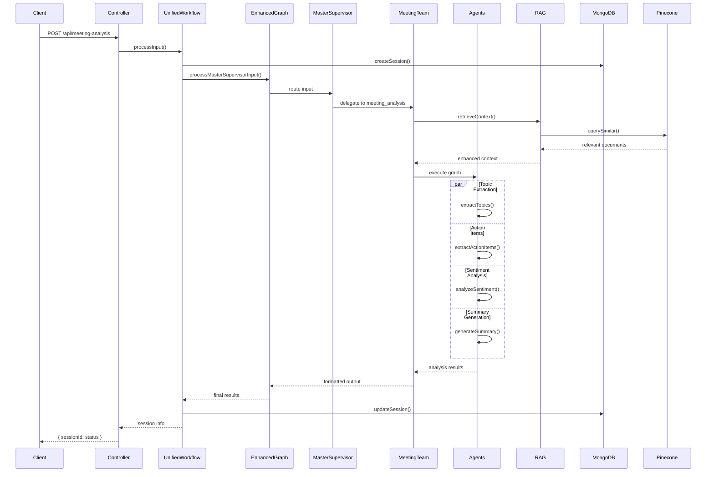
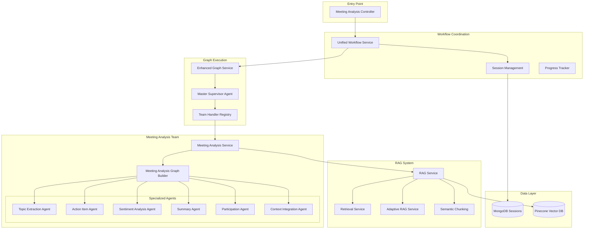

# Meeting Analysis Workflow Guide

## Table of Contents
1. [Overview](#overview)
2. [Workflow Architecture](#workflow-architecture)
3. [Execution Flow](#execution-flow)
4. [Component Details](#component-details)
5. [RAG Integration](#rag-integration)
6. [API Usage](#api-usage)
7. [Configuration](#configuration)
8. [Troubleshooting](#troubleshooting)

## Overview

The Meeting Analysis Workflow is a sophisticated agentic system that processes meeting transcripts through multiple specialized agents to extract insights, generate summaries, and identify action items. The workflow leverages RAG (Retrieval-Augmented Generation) for enhanced context awareness and maintains session state throughout the analysis process.

### Key Capabilities
- **Topic Extraction**: Identifies main discussion themes and their relevance
- **Action Item Detection**: Extracts tasks, deadlines, and assignees
- **Sentiment Analysis**: Analyzes emotional tone and participant engagement
- **Summary Generation**: Creates comprehensive meeting summaries
- **Context Integration**: Uses historical data for enhanced analysis
- **Participation Analysis**: Tracks speaker contributions and engagement levels

## Workflow Architecture

### High-Level Flow



### Component Architecture



## Execution Flow

### Phase 1: Request Initialization

```typescript
// 1. Client Request
const analysisRequest = {
  transcript: "Meeting transcript content...",
  metadata: {
    title: "Product Planning Meeting",
    participants: ["Alice", "Bob", "Charlie"],
    date: "2024-01-15T10:00:00Z"
  }
};

// 2. Controller Processing
@Post()
async analyzeTranscript(@Body() dto: AnalyzeTranscriptDto, @Request() req) {
  const userId = req.user?.userId;
  
  // Prepare input for unified workflow
  const input = {
    type: "meeting_transcript",
    transcript: dto.transcript,
    participants: dto.metadata?.participants || [],
    meetingTitle: dto.metadata?.title || "Untitled Meeting",
    date: dto.metadata?.date || new Date().toISOString(),
  };

  return this.unifiedWorkflowService.processInput(input, dto.metadata, userId);
}
```

### Phase 2: Session Management

```typescript
// 3. Unified Workflow Processing
async processInput(input: any, metadata?: Record<string, any>, userId?: string) {
  // Generate unique session ID
  const sessionId = uuidv4();
  
  // Create session in MongoDB
  const sessionData: Partial<Session> = {
    sessionId,
    userId: userId || "system",
    status: "pending",
    startTime: new Date(),
    transcript: input.transcript,
    metadata: metadata || {},
  };
  
  await this.sessionRepository.createSession(sessionData);
  
  // Initialize progress tracking
  this.initProgress(sessionId);
  this.publishProgressUpdate(sessionId, "initialization", 0, "pending", "Starting workflow");
  
  // Delegate to master supervisor
  setImmediate(() => this.runMasterSupervisorWorkflow(sessionId, input, metadata, userId));
  
  return { sessionId, status: "pending" };
}
```

### Phase 3: Master Supervisor Routing

```typescript
// 4. Enhanced Graph Service Processing
async processMasterSupervisorInput(input: any): Promise<any> {
  const initialState = {
    input: input,
    startTime: new Date().toISOString(),
    routing: undefined,
    result: undefined,
    error: undefined,
  };

  // Execute pre-built supervisor graph
  const finalState = await this.supervisorGraph.execute(initialState);
  
  return this.formatResults(finalState);
}

// 5. Master Supervisor Agent Routing
async route(state: any): Promise<any> {
  const input = state.input;
  
  // Determine routing based on input type
  if (input.type === "meeting_transcript" || input.transcript) {
    return {
      ...state,
      routing: {
        team: "meeting_analysis",
        confidence: 0.95,
        reasoning: "Input contains meeting transcript data"
      }
    };
  }
  
  // Handle other input types...
}
```

### Phase 4: Meeting Analysis Team Processing

```typescript
// 6. Meeting Analysis Service (Team Handler)
async process(input: any): Promise<MeetingAnalysisState> {
  // Input validation and preprocessing
  let transcript = input.content || input.transcript || input.text || '';
  transcript = String(transcript || '').trim();
  
  if (!transcript || transcript.length === 0) {
    return this.createErrorResult("No transcript content found");
  }

  const meetingId = input.metadata?.meetingId || uuidv4();
  
  // Initial state preparation
  const initialState: MeetingAnalysisState = {
    meetingId,
    transcript,
    context: input.metadata || {},
  };

  try {
    // Step 1: Store transcript for future RAG retrieval
    await this.storeMeetingTranscriptForRag(meetingId, transcript, input.metadata);
    
    // Step 2: Enhanced RAG context retrieval
    let enhancedState = initialState;
    if (this.ragEnabled) {
      enhancedState = await this.enhanceStateWithRagContext(initialState);
    }
    
    // Step 3: Build and execute analysis graph
    const graph = await this.meetingAnalysisGraphBuilder.buildGraph();
    this.graphExecutionService.attachProgressTracker(graph, meetingId);
    
    const result = await this.graphExecutionService.executeGraph<MeetingAnalysisState>(
      graph, 
      enhancedState
    );
    
    return this.formatAnalysisResults(result, transcript);
    
  } catch (error) {
    this.logger.error(`Error analyzing meeting ${meetingId}: ${error.message}`);
    return this.createErrorResult(error.message, initialState);
  }
}
```

### Phase 5: RAG Context Enhancement

```typescript
// 7. RAG Context Retrieval
private async enhanceStateWithRagContext(state: MeetingAnalysisState): Promise<MeetingAnalysisState> {
  try {
    // Determine retrieval strategy using adaptive RAG
    const retrievalStrategy = await this.adaptiveRagService.determineRetrievalStrategy(
      state.transcript.substring(0, 500)
    );
    
    // Retrieve relevant context
    const retrievalOptions = {
      indexName: "meeting-analysis",
      namespace: "transcripts",
      topK: retrievalStrategy.settings.topK || 5,
      minScore: retrievalStrategy.settings.minScore || 0.7,
    };
    
    const documents = await this.ragService.getContext(
      state.transcript,
      retrievalOptions
    );
    
    // Enhance state with retrieved context
    if (documents.length > 0) {
      return {
        ...state,
        context: {
          ...state.context,
          retrievedContext: {
            documents,
            contextText: this.formatContextForAnalysis(documents),
            timestamp: new Date().toISOString(),
            adaptiveStrategy: retrievalStrategy.strategy,
            retrievalSettings: retrievalStrategy.settings,
          },
        },
      };
    }
    
    return state;
  } catch (error) {
    this.logger.warn(`Error retrieving RAG context: ${error.message}`);
    return state; // Continue without RAG context
  }
}
```

### Phase 6: Agent Graph Execution

```typescript
// 8. Meeting Analysis Graph Builder
async buildGraph(): Promise<any> {
  const graph = this.createGraph();
  const nodes = this.buildNodes();
  
  this.addNodesToGraph(graph, nodes);
  this.defineEdges(graph);
  
  return graph;
}

// Node definitions
protected buildNodes(): Record<string, Function> {
  return {
    [this.nodeNames.START]: this.startNode.bind(this),
    [this.nodeNames.TOPIC_EXTRACTION]: this.topicExtractionNode.bind(this),
    [this.nodeNames.ACTION_ITEM_EXTRACTION]: this.actionItemExtractionNode.bind(this),
    [this.nodeNames.SENTIMENT_ANALYSIS]: this.sentimentAnalysisNode.bind(this),
    [this.nodeNames.SUMMARY_GENERATION]: this.summaryGenerationNode.bind(this),
    [this.nodeNames.END]: this.endNode.bind(this),
  };
}

// Sequential flow definition
protected defineEdges(graph: any): void {
  graph.addEdge(this.nodeNames.START, this.nodeNames.TOPIC_EXTRACTION);
  graph.addEdge(this.nodeNames.TOPIC_EXTRACTION, this.nodeNames.ACTION_ITEM_EXTRACTION);
  graph.addEdge(this.nodeNames.ACTION_ITEM_EXTRACTION, this.nodeNames.SENTIMENT_ANALYSIS);
  graph.addEdge(this.nodeNames.SENTIMENT_ANALYSIS, this.nodeNames.SUMMARY_GENERATION);
  graph.addEdge(this.nodeNames.SUMMARY_GENERATION, this.nodeNames.END);
}

// Individual node implementations
private async topicExtractionNode(state: MeetingAnalysisState): Promise<MeetingAnalysisState> {
  this.logger.log(`Extracting topics for meeting ${state.meetingId}`);
  
  const agent = this.agentFactory.getTopicExtractionAgent();
  const topics = await agent.extractTopics(state.transcript);
  
  return {
    ...state,
    topics,
    stage: "topic_extraction_completed"
  };
}

private async actionItemExtractionNode(state: MeetingAnalysisState): Promise<MeetingAnalysisState> {
  this.logger.log(`Extracting action items for meeting ${state.meetingId}`);
  
  const agent = this.agentFactory.getActionItemAgent();
  const actionItems = await agent.extractActionItems(state.transcript, state.topics);
  
  return {
    ...state,
    actionItems,
    stage: "action_items_completed"
  };
}

private async sentimentAnalysisNode(state: MeetingAnalysisState): Promise<MeetingAnalysisState> {
  this.logger.log(`Analyzing sentiment for meeting ${state.meetingId}`);
  
  const agent = this.agentFactory.getSentimentAnalysisAgent();
  const sentiment = await agent.analyzeSentiment(state.transcript);
  
  return {
    ...state,
    sentiment,
    stage: "sentiment_analysis_completed"
  };
}

private async summaryGenerationNode(state: MeetingAnalysisState): Promise<MeetingAnalysisState> {
  this.logger.log(`Generating summary for meeting ${state.meetingId}`);
  
  const agent = this.agentFactory.getSummaryAgent();
  const summary = await agent.generateSummary(state.transcript, {
    topics: state.topics,
    actionItems: state.actionItems,
    sentiment: state.sentiment
  });
  
  return {
    ...state,
    summary,
    stage: "summary_completed"
  };
}
```

## Component Details

### 1. Meeting Analysis Controller

**Location**: `src/langgraph/meeting-analysis/meeting-analysis.controller.ts`

**Responsibilities**:
- Handle HTTP requests for meeting analysis
- Validate input data (DTOs)
- Extract user authentication information
- Delegate to UnifiedWorkflowService
- Return session information for tracking

**Key Methods**:
```typescript
@Post()
async analyzeTranscript(@Body() dto: AnalyzeTranscriptDto, @Request() req): Promise<SessionInfo>

@Get(':sessionId')  
async getAnalysisResults(@Param('sessionId') sessionId: string, @Request() req): Promise<AnalysisResultDto>
```

### 2. Meeting Analysis Service (Team Handler)

**Location**: `src/langgraph/meeting-analysis/meeting-analysis.service.ts`

**Responsibilities**:
- Implement TeamHandler interface for meeting analysis
- Manage transcript preprocessing and validation
- Coordinate RAG context enhancement
- Execute agent graph and aggregate results
- Handle error scenarios and fallbacks

**Key Features**:
- RAG-enhanced context retrieval
- Semantic chunking for transcript storage
- Progress tracking and monitoring
- Comprehensive error handling
- Result validation and formatting

### 3. Meeting Analysis Graph Builder

**Location**: `src/langgraph/meeting-analysis/meeting-analysis-graph.builder.ts`

**Responsibilities**:
- Construct the agent execution graph
- Define node relationships and flow
- Integrate with AgentFactory for agent access
- Provide graph templates for different analysis types

### 4. Specialized Agents

#### Topic Extraction Agent
```typescript
// Extracts main discussion themes
export interface Topic {
  name: string;
  relevance: number;
  keyPoints: string[];
  participants: string[];
  timeSegments?: { start: string; end: string; }[];
}
```

#### Action Item Agent
```typescript
// Identifies tasks and responsibilities
export interface ActionItem {
  task: string;
  assignee: string;
  deadline: string;
  priority: "low" | "medium" | "high";
  status: "open" | "in_progress" | "completed";
  context: string;
}
```

#### Sentiment Analysis Agent
```typescript
// Analyzes emotional tone and engagement
export interface SentimentAnalysis {
  overall: number; // -1 to 1
  segments: Array<{
    text: string;
    sentiment: number;
    confidence: number;
    speaker?: string;
  }>;
}
```

#### Summary Agent
```typescript
// Generates comprehensive meeting summaries
export interface MeetingSummary {
  meetingTitle: string;
  summary: string;
  keyDecisions: string[];
  participants: string[];
  duration?: string;
  nextSteps?: string[];
}
```

## RAG Integration

### Document Storage Flow

```typescript
// 1. Transcript Chunking
private async storeMeetingTranscriptForRag(
  meetingId: string,
  transcript: string,
  metadata?: Record<string, any>
): Promise<void> {
  // Use semantic chunking for better boundaries
  const chunks = await this.ragService.chunkText(transcript, {
    chunkSize: 1000,
    chunkOverlap: 200,
    useSemanticChunking: true,
  });

  // 2. Document Processing
  const documents = chunks.map((chunk, index) => ({
    id: `${meetingId}-chunk-${index}`,
    content: chunk,
    metadata: {
      meetingId,
      chunkIndex: index,
      totalChunks: chunks.length,
      timestamp: new Date().toISOString(),
      type: "meeting_transcript",
      ...metadata,
    },
  }));

  // 3. RAG Storage
  await this.ragService.processDocumentsForRag(documents, {
    indexName: "meeting-analysis",
    namespace: "transcripts",
    useSemanticChunking: true,
  });
}
```

### Context Retrieval Flow

```typescript
// 1. Adaptive Strategy Selection
const retrievalStrategy = await this.adaptiveRagService.determineRetrievalStrategy(
  transcript.substring(0, 500)
);

// 2. Context Retrieval
const documents = await this.ragService.getContext(transcript, {
  indexName: "meeting-analysis",
  namespace: "transcripts",
  topK: retrievalStrategy.settings.topK || 5,
  minScore: retrievalStrategy.settings.minScore || 0.7,
});

// 3. Context Integration
const contextText = this.formatContextForAnalysis(documents);
```

### RAG-Enhanced Agent Processing

```typescript
// Agents can access enhanced context
const enhancedPrompt = `
CURRENT TRANSCRIPT:
${transcript}

RELEVANT HISTORICAL CONTEXT:
${state.context?.retrievedContext?.contextText || 'None'}

TASK: Extract topics considering both current content and historical patterns.
Focus on recurring themes and new developments.
`;
```

## API Usage

### Basic Analysis Request

```bash
curl -X POST http://localhost:3000/api/meeting-analysis \
  -H "Content-Type: application/json" \
  -H "Authorization: Bearer YOUR_JWT_TOKEN" \
  -d '{
    "transcript": "Meeting started at 10 AM. Alice presented the Q1 results...",
    "metadata": {
      "title": "Q1 Review Meeting",
      "participants": ["Alice", "Bob", "Charlie"],
      "date": "2024-01-15T10:00:00Z",
      "duration": "60 minutes"
    }
  }'
```

### Response
```json
{
  "sessionId": "123e4567-e89b-12d3-a456-426614174000",
  "status": "pending"
}
```

### Retrieve Results

```bash
curl -X GET http://localhost:3000/api/meeting-analysis/123e4567-e89b-12d3-a456-426614174000 \
  -H "Authorization: Bearer YOUR_JWT_TOKEN"
```

### Results Response
```json
{
  "sessionId": "123e4567-e89b-12d3-a456-426614174000",
  "status": "completed",
  "results": {
    "transcript": "Meeting started at 10 AM...",
    "topics": [
      {
        "name": "Q1 Financial Results",
        "relevance": 0.95,
        "keyPoints": ["Revenue increased 15%", "Costs under budget"],
        "participants": ["Alice", "Bob"]
      }
    ],
    "actionItems": [
      {
        "task": "Prepare Q2 budget proposal",
        "assignee": "Bob",
        "deadline": "2024-01-30",
        "priority": "high",
        "status": "open"
      }
    ],
    "sentiment": {
      "overall": 0.7,
      "segments": [
        {
          "text": "Great results this quarter",
          "sentiment": 0.8,
          "confidence": 0.9,
          "speaker": "Alice"
        }
      ]
    },
    "summary": {
      "meetingTitle": "Q1 Review Meeting",
      "summary": "The team reviewed Q1 performance with positive results...",
      "keyDecisions": ["Proceed with Q2 expansion plan"],
      "participants": ["Alice", "Bob", "Charlie"],
      "nextSteps": ["Prepare Q2 budget", "Schedule follow-up"]
    }
  },
  "metadata": {
    "processingTime": "45 seconds",
    "ragEnhanced": true,
    "agentsUsed": ["topic_extraction", "action_items", "sentiment", "summary"]
  }
}
```

## Configuration

### Environment Variables

```env
# RAG Configuration
RAG_ENABLED=true
USE_SEMANTIC_CHUNKING=true
PINECONE_INDEX_NAME=meeting-analysis

# LLM Configuration
OPENAI_API_KEY=your_openai_key
DEFAULT_MODEL=gpt-4o
DEFAULT_TEMPERATURE=0.3

# Database Configuration
MONGODB_URI=mongodb://localhost:27017/followthrough
SESSION_RETENTION_DAYS=30

# Progress Tracking
WEBSOCKET_ENABLED=true
PROGRESS_UPDATE_INTERVAL=5000
```

### Module Configuration

```typescript
// Meeting Analysis Module Configuration
@Module({
  imports: [
    SharedCoreModule,     // Provides all agents and RAG services
    LanggraphCoreModule,  // Provides graph execution services
    InfrastructureModule, // Provides database and storage
  ],
  providers: [
    MeetingAnalysisService,
    MeetingAnalysisGraphBuilder,
    {
      provide: 'MEETING_ANALYSIS_CONFIG',
      useValue: {
        ragEnabled: true,
        semanticChunking: true,
        maxTranscriptLength: 100000,
        chunkSize: 1000,
        chunkOverlap: 200,
        progressTracking: true,
      }
    }
  ],
  controllers: [MeetingAnalysisController],
  exports: [MeetingAnalysisService, MeetingAnalysisGraphBuilder]
})
export class MeetingAnalysisModule implements OnModuleInit {
  async onModuleInit() {
    // Register team handler
    this.teamHandlerRegistry.registerHandler(
      'meeting_analysis',
      this.meetingAnalysisService
    );
  }
}
```

## Troubleshooting

### Common Issues

#### 1. Transcript Content Not Found
**Problem**: "No transcript content found in input"

**Solution**:
```typescript
// Ensure transcript is provided in correct format
const request = {
  transcript: "Your meeting content here", // ✅ Correct
  // Not: content: "...", text: "...", body: "..." // ❌ Wrong keys
  metadata: { /* ... */ }
};
```

#### 2. RAG Context Retrieval Fails
**Problem**: RAG enhancement not working

**Debug Steps**:
```typescript
// Check RAG service status
const ragStatus = await this.ragService.healthCheck();

// Verify Pinecone connection
const indexStats = await this.pineconeService.getIndexStats();

// Check if documents exist
const queryResult = await this.ragService.getContext("test query", {
  indexName: "meeting-analysis",
  namespace: "transcripts",
  topK: 1
});
```

#### 3. Agent Processing Failures
**Problem**: Individual agents failing

**Debug Approach**:
```typescript
// Test agents individually
const agent = this.agentFactory.getTopicExtractionAgent();
const result = await agent.extractTopics(transcript);

// Check LLM service connectivity
const llmHealth = await this.llmService.healthCheck();

// Validate agent configuration
const config = agent.getConfiguration();
```

#### 4. Session Not Found
**Problem**: Cannot retrieve analysis results

**Troubleshooting**:
```typescript
// Check session exists in database
const session = await this.sessionRepository.findBySessionId(sessionId);

// Verify user permissions
const hasAccess = await this.sessionRepository.userHasAccess(sessionId, userId);

// Check session status
if (session?.status === 'failed') {
  // Handle failed session
  const errorDetails = session.metadata?.error;
}
```

### Performance Optimization

#### 1. Large Transcript Handling
```typescript
// For transcripts > 50KB, use chunked processing
if (transcript.length > 50000) {
  const chunks = await this.semanticChunkingService.chunkDocumentSemantically({
    id: meetingId,
    content: transcript,
    metadata
  });
  
  // Process chunks in parallel
  const results = await Promise.all(
    chunks.map(chunk => this.processChunk(chunk))
  );
  
  return this.mergeChunkResults(results);
}
```

#### 2. Caching Strategy
```typescript
// Cache frequent queries
const cacheKey = `analysis:${this.hashInput(transcript)}`;
const cached = await this.cacheManager.get(cacheKey);

if (cached) {
  return cached;
}

const result = await this.processAnalysis(transcript);
await this.cacheManager.set(cacheKey, result, 3600); // 1 hour cache
```

This comprehensive guide provides all the details needed to understand, use, and troubleshoot the Meeting Analysis Workflow in our agentic system. 