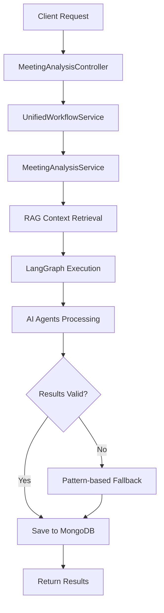

# Production-Ready Meeting Analysis Architecture

## Overview

This document outlines the production-grade meeting analysis system built with LangGraph, designed as a foundation for both meeting analysis and the upcoming email triage migration.

## System Architecture

### Core Components

#### 1. **UnifiedWorkflowService** 
- **Location**: `src/langgraph/unified-workflow.service.ts`
- **Purpose**: Master orchestrator that routes inputs to specialized teams
- **Key Features**:
  - LangGraph StateGraph-based routing
  - Session management and progress tracking
  - Team handler registry integration
  - Comprehensive error handling

#### 2. **MeetingAnalysisService**
- **Location**: `src/langgraph/meeting-analysis/meeting-analysis.service.ts`
- **Purpose**: Specialized team handler for meeting transcript analysis
- **Key Features**:
  - RAG-enhanced analysis with Pinecone integration
  - LangGraph StateGraph workflow execution
  - Intelligent fallback mechanisms
  - Production-grade error handling and logging

#### 3. **LangGraph Workflow Nodes**
Sequential processing pipeline:
1. **Initialization** - Setup and validation
2. **Context Retrieval** - RAG-enhanced context gathering
3. **Topic Extraction** - AI-powered topic identification
4. **Action Item Extraction** - Task and assignment extraction
5. **Sentiment Analysis** - Meeting tone and sentiment analysis
6. **Summary Generation** - Comprehensive meeting summary
7. **Document Storage** - Persist results for future RAG
8. **Finalization** - Complete processing and cleanup

## Production Features

### 1. **Intelligent Fallback System**
- **Primary**: RAG-enhanced AI agents
- **Fallback**: Pattern-based text analysis
- **Ensures**: Always produces meaningful results

### 2. **RAG Integration**
- **Storage**: Automatic transcript chunking and Pinecone storage
- **Retrieval**: Context-aware similar meeting retrieval
- **Enhancement**: Historical context for improved analysis

### 3. **Session Management**
- **Tracking**: Real-time progress updates
- **Persistence**: MongoDB session storage
- **Retrieval**: Clean API for result access

### 4. **Error Handling**
- **Graceful Degradation**: Continue analysis on component failures
- **Comprehensive Logging**: Detailed execution tracking
- **Recovery**: Automatic fallback activation

## API Endpoints

### Meeting Analysis
```typescript
POST /api/meeting-analysis
Authorization: Bearer <JWT_TOKEN>
Content-Type: application/json

{
  "transcript": "Meeting content...",
  "metadata": {
    "title": "Weekly Planning",
    "participants": ["Alice", "Bob"],
    "date": "2024-01-15T14:00:00Z"
  }
}

Response:
{
  "sessionId": "session-xxx",
  "status": "completed",
  "result": { /* analysis results */ }
}
```

### Result Retrieval
```typescript
GET /api/meeting-analysis/{sessionId}
Authorization: Bearer <JWT_TOKEN>

Response:
{
  "sessionId": "session-xxx",
  "status": "completed",
  "topics": [...],
  "actionItems": [...],
  "summary": {...},
  "sentiment": {...}
}
```

## Data Flow



## Key Optimizations

### 1. **Removed Debug Code**
- Eliminated excessive logging
- Cleaned up development artifacts
- Optimized for production performance

### 2. **Streamlined Fallbacks**
- Enhanced pattern-based extraction
- Improved topic and action item detection
- Generalized for broader meeting types

### 3. **Modular Architecture**
- Clear separation of concerns
- Reusable components for email triage
- Consistent error handling patterns

### 4. **Performance Optimizations**
- Efficient RAG chunking strategy
- Optimized database operations
- Reduced memory footprint

## Environment Requirements

```bash
# Core LLM Configuration
OPENAI_API_KEY=sk-proj-...
DEFAULT_LLM_MODEL=gpt-4o
LLM_PROVIDER=openai
AGENT_TEMPERATURE=0.1

# Authentication
JWT_TOKEN=eyJhbGciOiJIUzI1NiIs...

# Database
MONGODB_URI=mongodb://localhost:27017/followthrough

# Vector Storage
PINECONE_API_KEY=your-pinecone-key
PINECONE_ENVIRONMENT=your-environment
```

## Testing Strategy

### 1. **Integration Testing**
```bash
# Test complete workflow
curl -X POST http://localhost:3000/api/meeting-analysis \
  -H "Authorization: Bearer $JWT_TOKEN" \
  -H "Content-Type: application/json" \
  -d '{"transcript": "...", "metadata": {...}}'
```

### 2. **Component Testing**
- Individual agent testing
- RAG retrieval validation
- Fallback mechanism verification

### 3. **Performance Testing**
- Concurrent request handling
- Large transcript processing
- Memory usage monitoring

## Migration Foundation

This architecture serves as the foundation for email triage migration with:

### 1. **Reusable Components**
- `UnifiedWorkflowService` for routing
- Session management patterns
- RAG integration framework
- Error handling strategies

### 2. **Consistent Patterns**
- TeamHandler interface implementation
- LangGraph StateGraph workflows
- Progress tracking mechanisms
- Result storage patterns

### 3. **Scalable Design**
- Modular team registration
- Independent workflow execution
- Shared infrastructure components

## Next Steps for Email Triage

1. **Create EmailTriageService** implementing TeamHandler
2. **Define email-specific LangGraph nodes**
3. **Implement email-specific agents**
4. **Reuse session management and RAG patterns**
5. **Leverage existing fallback strategies**

## Monitoring and Observability

### 1. **Logging Strategy**
- Structured logging with context
- Performance metrics tracking
- Error rate monitoring

### 2. **Health Checks**
- Component availability checks
- Database connectivity validation
- External service monitoring

### 3. **Metrics Collection**
- Processing time tracking
- Success/failure rates
- Resource utilization monitoring

This production-ready architecture provides a robust, scalable foundation for intelligent meeting analysis and serves as the blueprint for expanding to email triage and other agentic workflows. 