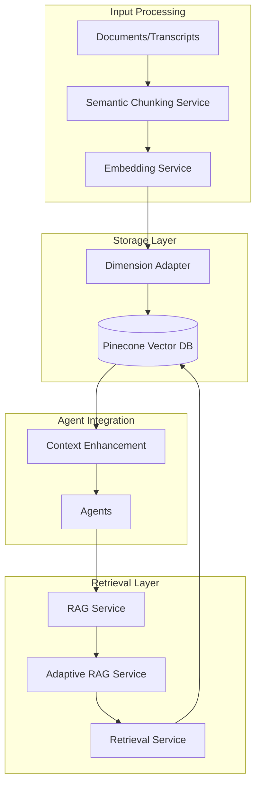

# RAG System Guide

## Overview

Our RAG (Retrieval-Augmented Generation) system enhances agent capabilities by providing relevant context from historical data. It uses semantic chunking, embedding generation, and vector similarity search to retrieve pertinent information during analysis.

## Architecture



## Core Components

### 1. RAG Service
**Location**: `src/rag/rag.service.ts`

Main interface for RAG operations:

```typescript
@Injectable()
export class RagService implements IRagService {
  // Document processing and storage
  async processDocumentsForRag(documents: Document[], options: RagOptions): Promise<string[]>
  
  // Context retrieval
  async getContext(query: string, options: RetrievalOptions): Promise<RetrievedDocument[]>
  
  // Text chunking
  async chunkText(text: string, options: ChunkingOptions): Promise<string[]>
  
  // State enhancement
  async enhanceStateWithContext<T>(state: T, query: string): Promise<T & { retrievedContext: RetrievedContext }>
}
```

### 2. Semantic Chunking Service
**Location**: `src/embedding/semantic-chunking.service.ts`

Intelligent text splitting based on semantic boundaries:

```typescript
export interface SemanticChunkingOptions {
  similarityThreshold: number;    // 0.75 default
  minChunkSize: number;          // 3 sentences minimum
  maxChunkSize: number;          // 15 sentences maximum
  rebalanceChunks: boolean;      // Optimize chunk sizes
  addContextPrefix: boolean;     // Add previous context
  parsingStrategy: 'basic' | 'advanced' | 'semantic';
}

@Injectable()
export class SemanticChunkingService {
  async chunkDocumentSemantically(document: Document, options?: SemanticChunkingOptions): Promise<ChunkedDocument[]>
}
```

### 3. Adaptive RAG Service
**Location**: `src/rag/adaptive-rag.service.ts`

Dynamic retrieval strategy selection:

```typescript
export interface RetrievalStrategy {
  strategy: 'vector' | 'keyword' | 'hybrid';
  settings: {
    topK: number;
    minScore: number;
    vectorWeight?: number;
    keywordWeight?: number;
  };
}

@Injectable()
export class AdaptiveRagService {
  async determineRetrievalStrategy(query: string): Promise<RetrievalStrategy>
}
```

## Embedding Configuration

### Supported Models

```typescript
// OpenAI Embeddings (Default)
const embeddingModels = {
  'text-embedding-3-large': { dimensions: 3072, maxTokens: 8191 },
  'text-embedding-3-small': { dimensions: 1536, maxTokens: 8191 },
  'text-embedding-ada-002': { dimensions: 1536, maxTokens: 8191 }
};

// Configuration
const embeddingConfig = {
  model: 'text-embedding-3-large',
  dimensions: 1024, // Reduced for Pinecone compatibility
  batchSize: 100,   // Process in batches
  retryAttempts: 3
};
```

### Dimension Adaptation

The system automatically adapts embedding dimensions:

```typescript
@Injectable()
export class DimensionAdapterService {
  adaptDimension(embedding: number[]): number[] {
    const targetDim = this.getTargetDimension(); // 1024
    
    if (embedding.length > targetDim) {
      return embedding.slice(0, targetDim); // Truncate
    } else if (embedding.length < targetDim) {
      return [...embedding, ...new Array(targetDim - embedding.length).fill(0)]; // Pad
    }
    
    return embedding;
  }
}
```

## Chunking Strategies

### 1. Traditional Chunking
Fixed-size chunks with overlap:

```typescript
const traditionalOptions = {
  chunkSize: 1000,      // Characters
  chunkOverlap: 200,    // Overlap between chunks
  splitOnSentences: true
};
```

### 2. Semantic Chunking
Content-aware chunking:

```typescript
const semanticOptions = {
  similarityThreshold: 0.75,  // Similarity for grouping
  minChunkSize: 3,           // Minimum sentences
  maxChunkSize: 15,          // Maximum sentences
  rebalanceChunks: true,     // Optimize sizes
  addContextPrefix: true     // Include previous context
};

// Usage
const chunks = await this.semanticChunkingService.chunkDocumentSemantically(
  document,
  semanticOptions
);
```

## Usage Patterns

### 1. Document Storage

```typescript
// Meeting transcript storage
async storeMeetingTranscript(meetingId: string, transcript: string) {
  const documents = [{
    id: meetingId,
    content: transcript,
    metadata: {
      type: 'meeting_transcript',
      meetingId,
      timestamp: new Date().toISOString()
    }
  }];

  return this.ragService.processDocumentsForRag(documents, {
    indexName: 'meeting-analysis',
    namespace: 'transcripts',
    useSemanticChunking: true
  });
}

// Email storage
async storeEmail(emailData: any) {
  const documents = [{
    id: `email-${emailData.id}`,
    content: `Subject: ${emailData.subject}\nFrom: ${emailData.from}\nBody: ${emailData.body}`,
    metadata: {
      type: 'email',
      sender: emailData.from,
      subject: emailData.subject,
      receivedAt: emailData.receivedAt
    }
  }];

  return this.ragService.processDocumentsForRag(documents, {
    indexName: 'email-analysis',
    namespace: 'email-history',
    useSemanticChunking: false // Emails are typically short
  });
}
```

### 2. Context Retrieval

```typescript
// Basic retrieval
const context = await this.ragService.getContext(query, {
  indexName: 'meeting-analysis',
  namespace: 'transcripts',
  topK: 5,
  minScore: 0.7
});

// Adaptive retrieval
const strategy = await this.adaptiveRagService.determineRetrievalStrategy(query);
const adaptiveContext = await this.ragService.getContext(query, {
  indexName: 'meeting-analysis',
  namespace: 'transcripts',
  topK: strategy.settings.topK,
  minScore: strategy.settings.minScore
});

// With metadata filtering
const filteredContext = await this.ragService.getContext(query, {
  indexName: 'email-analysis',
  namespace: 'email-history',
  topK: 3,
  minScore: 0.6,
  filter: { sender: 'specific@email.com' }
});
```

### 3. State Enhancement

```typescript
// Enhance agent state with RAG context
async enhanceWithContext<T>(state: T, query: string): Promise<T> {
  const enhancedState = await this.ragService.enhanceStateWithContext(
    state,
    query,
    {
      indexName: 'meeting-analysis',
      namespace: 'transcripts',
      topK: 5,
      minScore: 0.7
    }
  );
  
  return enhancedState;
}

// Usage in agent
async processWithRAG(transcript: string): Promise<AnalysisResult> {
  const initialState = { transcript, topics: [], actionItems: [] };
  
  const enhancedState = await this.enhanceWithContext(
    initialState,
    `Similar topics to: ${transcript.substring(0, 200)}`
  );
  
  // Process with enhanced context
  return this.analyzeWithContext(enhancedState);
}
```

## Index Configuration

### Pinecone Indexes

```typescript
const indexConfigurations = {
  'meeting-analysis': {
    dimension: 1024,
    metric: 'cosine',
    namespaces: ['transcripts', 'summaries', 'topics', 'action-items']
  },
  'email-analysis': {
    dimension: 1024,
    metric: 'cosine', 
    namespaces: ['email-history', 'patterns', 'templates']
  }
};
```

### Environment Configuration

```env
# RAG Configuration
RAG_ENABLED=true
USE_SEMANTIC_CHUNKING=true

# Embedding Settings
EMBEDDING_MODEL=text-embedding-3-large
EMBEDDING_DIMENSIONS=1024
PINECONE_DIMENSIONS=1024

# Pinecone Configuration
PINECONE_API_KEY=your_api_key
PINECONE_ENVIRONMENT=your_environment
PINECONE_INDEX_MEETING=meeting-analysis
PINECONE_INDEX_EMAIL=email-analysis

# Chunking Settings
DEFAULT_CHUNK_SIZE=1000
DEFAULT_CHUNK_OVERLAP=200
SEMANTIC_SIMILARITY_THRESHOLD=0.75
```

## Best Practices

### 1. Chunking Strategy Selection

```typescript
// Choose based on content type
const chunkingStrategy = (contentType: string, contentLength: number) => {
  if (contentType === 'email' || contentLength < 2000) {
    return { useSemanticChunking: false }; // Simple splitting for short content
  } else if (contentType === 'meeting_transcript' || contentLength > 10000) {
    return { 
      useSemanticChunking: true,
      semanticOptions: {
        similarityThreshold: 0.75,
        minChunkSize: 3,
        maxChunkSize: 15
      }
    };
  }
  return { useSemanticChunking: true }; // Default to semantic
};
```

### 2. Query Optimization

```typescript
// Optimize queries for better retrieval
const optimizeQuery = (originalQuery: string, context?: any): string => {
  // Add context keywords
  const contextKeywords = context?.previousTopics?.map(t => t.name).join(' ') || '';
  
  // Expand query with synonyms
  const expandedQuery = `${originalQuery} ${contextKeywords}`;
  
  // Limit query length
  return expandedQuery.substring(0, 500);
};
```

### 3. Performance Optimization

```typescript
// Batch processing for large documents
async processLargeDocument(document: LargeDocument): Promise<void> {
  const chunks = await this.chunkLargeContent(document.content);
  
  // Process in batches to avoid rate limits
  const batchSize = 10;
  for (let i = 0; i < chunks.length; i += batchSize) {
    const batch = chunks.slice(i, i + batchSize);
    await this.processBatch(batch);
    await this.delay(100); // Rate limiting
  }
}

// Cache frequent queries
private queryCache = new Map<string, RetrievedDocument[]>();

async getCachedContext(query: string, options: RetrievalOptions): Promise<RetrievedDocument[]> {
  const cacheKey = `${query}:${JSON.stringify(options)}`;
  
  if (this.queryCache.has(cacheKey)) {
    return this.queryCache.get(cacheKey)!;
  }
  
  const result = await this.ragService.getContext(query, options);
  this.queryCache.set(cacheKey, result);
  
  return result;
}
```

### 4. Error Handling

```typescript
async robustRAGRetrieval(query: string, options: RetrievalOptions): Promise<RetrievedDocument[]> {
  try {
    return await this.ragService.getContext(query, options);
  } catch (error) {
    this.logger.warn(`RAG retrieval failed: ${error.message}`);
    
    // Fallback strategies
    if (error.message.includes('index not found')) {
      return []; // Continue without context
    } else if (error.message.includes('rate limit')) {
      await this.delay(1000);
      return this.robustRAGRetrieval(query, { ...options, topK: Math.min(options.topK || 5, 3) });
    }
    
    return []; // Graceful degradation
  }
}
```

## Monitoring and Debugging

### 1. RAG Metrics

```typescript
interface RAGMetrics {
  retrievalLatency: number;
  contextRelevance: number;
  chunkingEfficiency: number;
  embeddingQuality: number;
}

// Track performance
async trackRAGPerformance(query: string, retrievedDocs: RetrievedDocument[]): Promise<RAGMetrics> {
  return {
    retrievalLatency: this.measureLatency(),
    contextRelevance: this.calculateRelevanceScore(query, retrievedDocs),
    chunkingEfficiency: this.measureChunkQuality(),
    embeddingQuality: this.assessEmbeddingQuality()
  };
}
```

### 2. Debug Utilities

```typescript
// Debug RAG pipeline
async debugRAGPipeline(document: Document): Promise<DebugInfo> {
  const chunks = await this.ragService.chunkText(document.content);
  const embeddings = await Promise.all(
    chunks.map(chunk => this.embeddingService.generateEmbedding(chunk))
  );
  
  return {
    originalLength: document.content.length,
    chunkCount: chunks.length,
    averageChunkSize: chunks.reduce((sum, chunk) => sum + chunk.length, 0) / chunks.length,
    embeddingDimensions: embeddings[0]?.length || 0,
    processingTime: Date.now() - startTime
  };
}
```

This guide provides the essential information for understanding and working with our RAG system effectively. 