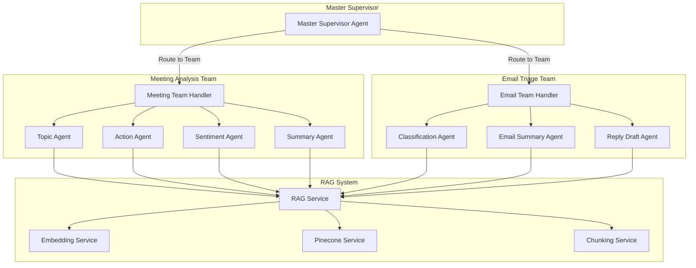

# FollowThrough AI - Agentic Workflows Documentation 🚀

Welcome to the comprehensive documentation for FollowThrough AI's advanced agentic workflow system. This platform implements a sophisticated hierarchical multi-agent architecture for intelligent automation of meeting analysis, email triage, and workflow orchestration.

## 🎯 Quick Navigation

### For New Users
- **🚀 [Installation & Setup](../../README.md#-quick-start)** - Start here to get the system running
- **👨‍💻 [Developer Onboarding](./DEVELOPER-ONBOARDING.md)** - Step-by-step guide for new developers

### For System Understanding
- **🏗️ [Architecture Overview](./ARCHITECTURE-OVERVIEW.md)** - Complete system design and patterns
- **🤖 [Agent Development Guide](./AGENT-DEVELOPMENT-GUIDE.md)** - Build and extend AI agents

### For Specific Workflows
- **📊 [Meeting Analysis Workflow](./MEETING-ANALYSIS-WORKFLOW.md)** - Transcript processing and insights
- **📧 [Email Triage Workflow](./EMAIL-TRIAGE-WORKFLOW.md)** - Email classification and automation
- **📅 [Calendar Workflow Development Guide](./CALENDAR-WORKFLOW-DEVELOPMENT-GUIDE.md)** - Calendar integration and meeting orchestration
- **🧠 [RAG System Guide](./RAG-SYSTEM-GUIDE.md)** - Vector search and knowledge retrieval

## 🏛️ System Architecture at a Glance



## 🔄 Core Workflows

### Meeting Analysis Pipeline
1. **Transcript Input** → Master Supervisor routes to Meeting Analysis Team
2. **Parallel Processing** → Topic extraction, action items, sentiment analysis  
3. **RAG Enhancement** → Semantic search for relevant context
4. **Summary Generation** → Comprehensive meeting insights
5. **Result Delivery** → Structured analysis with real-time updates

### Email Triage Pipeline  
1. **Email Input** → Master Supervisor routes to Email Triage Team
2. **Classification** → Priority and category determination
3. **Context Retrieval** → Similar email patterns and user preferences
4. **Response Generation** → Tone-adapted reply drafts
5. **Action Routing** → Delegation, snoozing, or immediate response

## 📈 Key Performance Features

- **⚡ Sub-second routing** via Master Supervisor pattern
- **🔄 Parallel processing** for 3x faster analysis
- **🧠 Contextual accuracy** through adaptive RAG retrieval
- **📊 Real-time progress** tracking with WebSocket updates
- **🔧 Extensible architecture** for new agent types and workflows

## 🛠️ Development Quick Start

**Prerequisites Setup:**
1. Follow the [main installation guide](../../README.md#-quick-start) to set up the project
2. Ensure MongoDB, OpenAI API, and Pinecone are configured

**Your First Agent:**
```typescript
// 1. Create a new agent
export class MyCustomAgent extends BaseAgent {
  async processState(state: any): Promise<any> {
    // Your agent logic here
    return { ...state, myResult: "processed" };
  }
}

// 2. Register as a team handler
export class MyTeamService implements TeamHandler {
  getTeamName(): string { return "my_team"; }
  
  async process(input: any): Promise<any> {
    return await this.myAgent.processState(input);
  }
}

// 3. Test with the unified workflow
const result = await unifiedWorkflowService.processInput({
  type: "my_custom_type",
  content: "test data"
});
```

## 📚 Detailed Guides

### Foundation Knowledge
- **[Architecture Overview](./ARCHITECTURE-OVERVIEW.md)** - System design, patterns, and data flow
- **[Developer Onboarding](./DEVELOPER-ONBOARDING.md)** - Environment setup and first contributions

### Agent Development  
- **[Agent Development Guide](./AGENT-DEVELOPMENT-GUIDE.md)** - Creating specialized agents and RAG integration
- **[RAG System Guide](./RAG-SYSTEM-GUIDE.md)** - Vector embeddings, semantic chunking, and retrieval

### Workflow Implementation
- **[Meeting Analysis Workflow](./MEETING-ANALYSIS-WORKFLOW.md)** - End-to-end meeting processing
- **[Email Triage Workflow](./EMAIL-TRIAGE-WORKFLOW.md)** - Email automation and intelligent responses
- **[Calendar Workflow Development Guide](./CALENDAR-WORKFLOW-DEVELOPMENT-GUIDE.md)** - Calendar integration development roadmap

## 🎯 Common Use Cases

### For Product Teams
- **Meeting Intelligence**: Automated action item tracking and decision logging
- **Email Automation**: Intelligent customer support and internal communication routing

### For Engineering Teams  
- **Agent Extension**: Build domain-specific agents for custom workflows
- **Integration Development**: Connect new external services and data sources

### For Operations Teams
- **Workflow Monitoring**: Real-time processing insights and performance optimization  
- **System Administration**: Health monitoring and scaling guidance

## 🔍 API Quick Reference

### Meeting Analysis
```bash
POST /langgraph/meeting-analysis/analyze
{
  "transcript": "your meeting transcript",
  "metadata": { "meeting_id": "001", "participants": ["Alice", "Bob"] }
}
```

### Email Triage
```bash  
POST /email/triage
{
  "emailData": {
    "body": "email content",
    "metadata": { "subject": "...", "from": "..." }
  }
}
```

### Unified Workflow
```bash
POST /workflow/process
{
  "type": "meeting_transcript", 
  "content": "...",
  "metadata": {}
}
```

## 🎯 What You'll Learn

By working through these guides, you'll master:

- **🏗️ Hierarchical agent architectures** with supervisor patterns
- **🧠 RAG-enhanced AI systems** with semantic search and contextual retrieval  
- **⚡ Real-time workflow orchestration** with progress tracking
- **🔧 Extensible service design** for custom agents and integrations
- **📊 Production-ready monitoring** and performance optimization

## 🚦 Getting Started Paths

Choose your path based on your role and immediate needs:

### 🔧 **Developers** → Start with [Developer Onboarding](./DEVELOPER-ONBOARDING.md)
Set up your environment, understand the codebase, and build your first agent

### 🏗️ **Architects** → Start with [Architecture Overview](./ARCHITECTURE-OVERVIEW.md)  
Understand system design, integration patterns, and scalability considerations

### 📊 **Product Managers** → Start with [Meeting Analysis](./MEETING-ANALYSIS-WORKFLOW.md)
See the platform capabilities and business value in action

### 🧠 **AI Engineers** → Start with [RAG System Guide](./RAG-SYSTEM-GUIDE.md)
Deep dive into vector embeddings, semantic chunking, and retrieval strategies

---

**Ready to begin?** Install the system using our [main setup guide](../../README.md#-quick-start), then jump to any specific guide based on your needs! 🚀 