```mermaid

graph TB
    subgraph "Calendar Orchestration Hub - LangGraph"
        CalendarWorkflow[Calendar Workflow Service]
        CalendarState[(Calendar Session Storage)]
        AutonomyEngine[Progressive Autonomy Engine]
        
        subgraph "Calendar Agents - LangGraph Pattern"
            PreMeetingAgent[Pre-Meeting Context Agent]
            PostMeetingAgent[Post-Meeting Orchestration Agent]
            AutonomyAgent[Autonomy Management Agent]
            SchedulingAgent[Intelligent Scheduling Agent]
        end
    end
    
    subgraph "Google Workspace Ecosystem"
        GoogleCalendar[Google Calendar API]
        GoogleMeet[Google Meet Sessions]
        Gmail[Gmail API]
        GoogleDrive[Google Drive Storage]
        GoogleWebhooks[Google Webhooks]
    end
    
    subgraph "Existing LangGraph Workflows"
        MeetingAnalysis[Meeting Analysis Workflow]
        EmailTriage[Email Triage Workflow]
        RAGSystem[RAG System]
    end
    
    subgraph "Development Testing Infrastructure"
        TestUsers[Google Workspace Test Users]
        AudioGeneration[Audio Generation Service]
        TestMeetings[Real Google Meet Sessions]
        TestTranscripts[Google Meet Transcripts]
        ValidationFramework[Test Validation Framework]
    end
    
    subgraph "Database & Storage - MongoDB"
        CalendarSessions[(Calendar Workflow Sessions)]
        MeetingSessions[(Meeting Analysis Sessions)]
        EmailSessions[(Email Triage Sessions)]
        PineconeRAG[(Pinecone Vector DB)]
    end
    
    %% Calendar Orchestration Flow
    GoogleCalendar -->|"Event Created/Updated"| CalendarWorkflow
    GoogleWebhooks -->|"Real-time Updates"| CalendarWorkflow
    CalendarWorkflow --> PreMeetingAgent
    CalendarWorkflow --> PostMeetingAgent
    CalendarWorkflow --> AutonomyAgent
    CalendarWorkflow --> SchedulingAgent
    
    %% Pre-Meeting Intelligence
    PreMeetingAgent -->|"Context Query"| RAGSystem
    PreMeetingAgent -->|"Brief Generation"| EmailTriage
    PreMeetingAgent -->|"Calendar Optimization"| GoogleCalendar
    
    %% Meeting Execution (Both Real and Test)
    GoogleMeet -->|"Real Meetings"| MeetingAnalysis
    TestMeetings -->|"Test with Generated Audio"| MeetingAnalysis
    AudioGeneration -->|"Multi-speaker Audio"| TestMeetings
    
    %% Post-Meeting Orchestration
    MeetingAnalysis -->|"Analysis Results"| PostMeetingAgent
    PostMeetingAgent -->|"Follow-up Emails"| EmailTriage
    PostMeetingAgent -->|"Schedule Follow-ups"| GoogleCalendar
    PostMeetingAgent -->|"Update Calendar"| GoogleCalendar
    
    %% Autonomy Management
    AutonomyAgent -->|"Approval Requests"| Gmail
    AutonomyAgent -->|"Autonomous Actions"| GoogleCalendar
    AutonomyEngine --> AutonomyAgent
    
    %% Testing and Validation
    TestUsers --> TestMeetings
    TestMeetings --> TestTranscripts
    TestTranscripts --> ValidationFramework
    ValidationFramework -->|"Accuracy Metrics"| CalendarWorkflow
    
    %% State Management
    CalendarWorkflow --> CalendarSessions
    CalendarSessions --> CalendarSessions
    RAGSystem --> PineconeRAG
    
    %% Cross-workflow Integration
    EmailTriage --> EmailSessions
    MeetingAnalysis --> MeetingSessions
    
    %% Styling
    classDef calendar fill:#e3f2fd,stroke:#1976d2,stroke-width:3px
    classDef google fill:#e8f5e8,stroke:#4caf50,stroke-width:2px
    classDef workflows fill:#f3e5f5,stroke:#9c27b0,stroke-width:2px
    classDef testing fill:#fff3e0,stroke:#ff9800,stroke-width:2px
    classDef storage fill:#fce4ec,stroke:#e91e63,stroke-width:2px
    
    class CalendarWorkflow,PreMeetingAgent,PostMeetingAgent,AutonomyAgent,SchedulingAgent calendar
    class GoogleCalendar,GoogleMeet,Gmail,GoogleDrive,GoogleWebhooks google
    class MeetingAnalysis,EmailTriage,RAGSystem workflows
    class TestUsers,AudioGeneration,TestMeetings,TestTranscripts,ValidationFramework testing
    class CalendarSessions,MeetingSessions,EmailSessions,PineconeRAG storage

```

# 🗓️ Calendar Module LangGraph Migration Guide

## 🎯 **MISSION STATEMENT**

Transform the calendar module into a fully integrated LangGraph workflow that creates an end-to-end meeting processing pipeline: Google Calendar → Pre-meeting Brief → **Real User Meeting** → Transcript Analysis → Follow-up Actions.

## 📊 **CURRENT STATE ANALYSIS**

### ✅ **What We Have**
- Basic calendar module with Google Calendar integration
- 3 existing agents: MeetingContextAgent, MeetingBriefAgent, FollowUpOrchestrationAgent  
- TeamHandler interface implementation
- Google OAuth integration
- Partial state management
- **Audio generation system (for testing only)**

### ❌ **What Needs Migration**
- Calendar workflow in wrong location (`src/calendar/` → `src/langgraph/calendar/`)
- Inconsistent state management (doesn't follow email triage pattern)
- No integration with meeting analysis pipeline
- Missing post-meeting analysis triggers
- Limited RAG enhancement
- No persistent session storage

---

## 🎪 **PRODUCTION vs TESTING CLARIFICATION**

### 🏭 **Production Flow (Real Users)**
```
Google Calendar Event Created
→ Pre-meeting brief generated (RAG-enhanced)
→ **Real users have actual meeting**
→ Meeting recordings/transcripts from Google Meet
→ Transcript processed through meeting analysis
→ Follow-up actions automatically generated
→ Emails/tasks created as needed
```

### 🧪 **Enhanced Development Testing Flow**
```
Test transcript files
→ Audio generation (multi-speaker realistic audio)
→ **Real Google Workspace meeting created with test users**
→ **Generated audio played as input in actual Google Meet session**
→ **Google Meet records the session like a real meeting**
→ **Real Google Meet transcript/recording extracted**
→ Transcript processed through meeting analysis (same as production)
→ Follow-up actions generated (same as production)
→ Complete end-to-end validation
```

**🎯 Key Testing Innovation**: We create **real Google Meet sessions** with test users and feed our generated audio into those meetings. This allows us to test the complete Google Workspace integration pipeline with controlled, known content while using the actual Google Meet recording and transcription infrastructure.

### 🔧 **Testing Infrastructure Requirements**

#### **Google Workspace Test Environment**
- Multiple test Google Workspace accounts (representing different meeting participants)
- Real Google Calendar integration with test accounts
- Google Meet sessions with recording enabled
- Audio input system to feed generated audio into live meetings

#### **Audio Simulation Setup**
```typescript
// Enhanced testing workflow
interface TestMeetingSetup {
  testUsers: GoogleWorkspaceUser[];        // Real test accounts
  meetingEvent: GoogleCalendarEvent;       // Real calendar event
  generatedAudio: MultiSpeakerAudioFile;   // From our audio generation
  meetingDuration: number;                 // Controlled timing
  expectedParticipants: ParticipantRole[]; // Known roles for validation
}
```

---

## 🚀 **MIGRATION ROADMAP**

### **🔧 Phase 1: LangGraph Architecture Migration** (Days 1-3)

#### **Milestone 1.1: Core Infrastructure Setup**

**📂 Create New Module Structure**
```bash
mkdir -p src/langgraph/calendar/{agents,interfaces,repositories,services,schemas}
```

**📋 Tasks:**
1. **Move CalendarWorkflowService**
   - Source: `src/calendar/services/calendar-workflow.service.ts`
   - Target: `src/langgraph/calendar/calendar-workflow.service.ts`
   - Update: Implement proper LangGraph patterns

2. **Create CalendarWorkflowModule**
   - Path: `src/langgraph/calendar/calendar-workflow.module.ts`
   - Purpose: LangGraph module with proper dependencies
   - Integration: SharedCoreModule, database modules

3. **Implement State Interface**
   ```typescript
   // src/langgraph/calendar/interfaces/calendar-workflow-state.interface.ts
   export interface CalendarWorkflowState {
     sessionId: string;
     userId: string;
     eventId: string;
     
     // Event data
     calendarEvent: CalendarEvent;
     meetingStatus: 'scheduled' | 'started' | 'ended';
     
     // Analysis results
     preContext: PreMeetingContext | null;
     meetingBrief: MeetingBrief | null;
     meetingTranscript: string | null; // From real meeting
     analysisResult: MeetingAnalysisResult | null;
     followUpPlan: FollowUpPlan | null;
     
     // Workflow control
     stage: string;
     currentStep: string;
     progress: number;
     error: string | null;
     
     // Context and metadata
     context: Record<string, any>;
     metadata: Record<string, any>;
     processingMetadata: {
       agentsUsed: string[];
       ragEnhanced: boolean;
       performanceMetrics: Record<string, number>;
     };
   }
   ```

#### **Milestone 1.2: State Persistence & Session Management**

**📋 Tasks:**
1. **Create MongoDB Schema**
   ```typescript
   // src/langgraph/calendar/schemas/calendar-workflow-session.schema.ts
   export const CalendarWorkflowSessionSchema = new Schema({
     sessionId: { type: String, required: true, unique: true },
     userId: { type: String, required: true },
     eventId: { type: String, required: true },
     
     // Event data
     calendarEvent: { type: Object, required: true },
     meetingStatus: { 
       type: String, 
       enum: ['scheduled', 'started', 'ended'],
       default: 'scheduled'
     },
     
     // Analysis results  
     preContext: { type: Object, default: null },
     meetingBrief: { type: Object, default: null },
     meetingTranscript: { type: String, default: null }, // Real meeting transcript
     analysisResult: { type: Object, default: null },
     followUpPlan: { type: Object, default: null },
     
     // Workflow state
     stage: { type: String, default: 'initialized' },
     currentStep: { type: String, default: 'start' },
     progress: { type: Number, default: 0 },
     error: { type: String, default: null },
     
     // Metadata
     context: { type: Object, default: {} },
     metadata: { type: Object, default: {} },
     processingMetadata: {
       agentsUsed: [String],
       ragEnhanced: { type: Boolean, default: false },
       performanceMetrics: { type: Object, default: {} },
       startTime: { type: Date, default: Date.now },
       endTime: Date
     }
   });
   ```

2. **Implement Repository**
   ```typescript
   // src/langgraph/calendar/repositories/calendar-workflow-session.repository.ts
   @Injectable()
   export class CalendarWorkflowSessionRepository {
     async createSession(state: CalendarWorkflowState): Promise<CalendarWorkflowSession>
     async updateSession(sessionId: string, updates: Partial<CalendarWorkflowState>): Promise<CalendarWorkflowSession>
     async getSession(sessionId: string): Promise<CalendarWorkflowSession | null>
     async getSessionsByUser(userId: string): Promise<CalendarWorkflowSession[]>
     async getSessionsByEvent(eventId: string): Promise<CalendarWorkflowSession[]>
     async deleteSession(sessionId: string): Promise<boolean>
     
     // Analytics queries
     async getCompletedSessions(userId: string): Promise<CalendarWorkflowSession[]>
     async getSessionStats(userId: string): Promise<SessionStats>
   }
   ```

#### **Milestone 1.3: Agent Migration & Enhancement**

**📋 Tasks:**
1. **Migrate & Enhance PreMeetingContextAgent**
   ```typescript
   // src/langgraph/calendar/agents/pre-meeting-context.agent.ts
   @Injectable()
   export class PreMeetingContextAgent extends BaseAgent<CalendarWorkflowState> {
     async processState(state: CalendarWorkflowState): Promise<CalendarWorkflowState> {
       // RAG-enhanced context gathering
       // Historical meeting analysis
       // Participant behavior patterns
       // Topic prediction
     }
     
     private async gatherRAGContext(event: CalendarEvent): Promise<PreMeetingContext>
     private async analyzeHistoricalMeetings(participantEmails: string[]): Promise<MeetingHistory>
     private async predictMeetingTopics(event: CalendarEvent): Promise<TopicPredictions>
   }
   ```

2. **Enhance MeetingBriefAgent**
   ```typescript
   // src/langgraph/calendar/agents/meeting-brief-generation.agent.ts
   @Injectable() 
   export class MeetingBriefGenerationAgent extends BaseAgent<CalendarWorkflowState> {
     async processState(state: CalendarWorkflowState): Promise<CalendarWorkflowState> {
       // Generate comprehensive meeting brief
       // Include RAG-enhanced context
       // Create agenda suggestions
       // Participant preparation items
     }
   }
   ```

3. **Create PostMeetingOrchestrationAgent**
   ```typescript
   // src/langgraph/calendar/agents/post-meeting-orchestration.agent.ts
   @Injectable()
   export class PostMeetingOrchestrationAgent extends BaseAgent<CalendarWorkflowState> {
     async processState(state: CalendarWorkflowState): Promise<CalendarWorkflowState> {
       // Process real meeting transcript/recording
       // Trigger meeting analysis workflow
       // Process analysis results
       // Generate follow-up plan
       // Coordinate with email triage if needed
     }
     
     private async processMeetingRecording(recordingData: MeetingRecording): Promise<string>
     private async triggerMeetingAnalysis(transcript: string): Promise<MeetingAnalysisResult>
     private async generateFollowUpPlan(analysisResult: MeetingAnalysisResult): Promise<FollowUpPlan>
   }
   ```

---

### **🔗 Phase 2: Real Meeting Integration** (Days 4-7)

#### **Milestone 2.1: Google Meet Integration**

**📋 Tasks:**
1. **Create GoogleMeetingTrackerService**
   ```typescript
   // src/langgraph/calendar/services/google-meeting-tracker.service.ts
   @Injectable()
   export class GoogleMeetingTrackerService {
     // Real production methods
     async trackMeetingStart(eventId: string): Promise<void>
     async trackMeetingEnd(eventId: string): Promise<void>
     async extractMeetingTranscript(eventId: string): Promise<string | null>
     async extractMeetingRecording(eventId: string): Promise<Buffer | null>
     async getMeetingRecordingStatus(eventId: string): Promise<RecordingStatus>
     
     // Development/testing only
     async simulateRealMeetingWithTestData(eventId: string, transcriptFile: string): Promise<void>
   }
   ```

2. **Implement Real Meeting Analysis Trigger**
   ```typescript
   // src/langgraph/calendar/services/meeting-analysis-trigger.service.ts
   @Injectable()
   export class MeetingAnalysisTriggerService {
     async triggerAnalysisFromRealMeeting(
       sessionId: string, 
       meetingRecording: MeetingRecording
     ): Promise<MeetingAnalysisResult>
     
     async triggerAnalysisFromTranscript(
       sessionId: string,
       transcript: string
     ): Promise<MeetingAnalysisResult>
     
     private async prepareMeetingAnalysisInput(
       session: CalendarWorkflowSession,
       meetingData: MeetingRecording | string
     ): Promise<MeetingAnalysisInput>
   }
   ```

#### **Milestone 2.2: Workflow Integration & Communication**

**📋 Tasks:**
1. **Implement Real Meeting Workflow Chaining**
   ```typescript
   // Integration points in CalendarWorkflowService
   async processRealMeetingEnd(eventId: string, meetingData: MeetingRecording): Promise<void> {
     // 1. Get session and calendar event data
     // 2. Extract transcript from real meeting recording
     // 3. Trigger meeting analysis workflow with real data
     // 4. Process analysis results
     // 5. Generate follow-up actions
     // 6. Trigger email workflow if needed
   }
   
   // Separate testing method
   async simulateMeetingForTesting(eventId: string, testTranscript: string): Promise<void> {
     // Only for development/testing
   }
   ```

2. **Create Event-Driven Architecture**
   ```typescript
   // Event types for inter-workflow communication
   export interface CalendarWorkflowEvents {
     'calendar.meeting.started': { sessionId: string; eventId: string };
     'calendar.meeting.ended': { sessionId: string; eventId: string; recordingData: MeetingRecording };
     'calendar.analysis.completed': { sessionId: string; result: MeetingAnalysisResult };
     'calendar.followup.generated': { sessionId: string; plan: FollowUpPlan };
   }
   ```

#### **Milestone 2.3: Enhanced Testing Infrastructure**

**📋 Tasks:**
1. **Google Workspace Test Environment Setup**
   ```typescript
   // Service for managing test meeting sessions
   @Injectable()
   export class TestMeetingOrchestrationService {
     async createTestMeeting(setup: TestMeetingSetup): Promise<TestMeetingSession>
     async startAudioPlayback(meetingId: string, audioFile: string): Promise<void>
     async monitorMeetingProgress(meetingId: string): Promise<MeetingProgress>
     async extractTestMeetingResults(meetingId: string): Promise<MeetingRecording>
   }
   
   // Test user management
   @Injectable()
   export class TestUserManagementService {
     async createTestUsers(count: number): Promise<GoogleWorkspaceUser[]>
     async scheduleTestMeeting(users: GoogleWorkspaceUser[], setup: TestMeetingSetup): Promise<GoogleCalendarEvent>
     async joinUsersToMeeting(users: GoogleWorkspaceUser[], meetingUrl: string): Promise<void>
   }
   ```

2. **Audio Integration for Live Meetings**
   ```typescript
   // Service to feed generated audio into real Google Meet sessions
   @Injectable()
   export class MeetingAudioInjectionService {
     async setupAudioInput(meetingId: string): Promise<AudioInputChannel>
     async playGeneratedAudio(channel: AudioInputChannel, audioFile: Buffer): Promise<void>
     async synchronizeAudioWithMeeting(meetingId: string, audioFile: Buffer): Promise<void>
     async monitorAudioPlayback(channel: AudioInputChannel): Promise<PlaybackStatus>
   }
   ```

3. **Enhanced Google OAuth Scopes**
   ```typescript
   // Required scopes for real meeting access and testing
   const REQUIRED_SCOPES = [
     'https://www.googleapis.com/auth/calendar.readonly',
     'https://www.googleapis.com/auth/calendar.events',
     'https://www.googleapis.com/auth/drive.readonly', // For meeting recordings
     'https://www.googleapis.com/auth/meetings.space.readonly', // For Google Meet data
     'https://www.googleapis.com/auth/meetings.space.created', // For creating test meetings
   ];
   ```

4. **Meeting Recording Access Service**
   ```typescript
   // Service to access real Google Meet recordings (works for both production and test meetings)
   @Injectable()
   export class GoogleMeetRecordingService {
     async getMeetingRecording(meetId: string): Promise<MeetingRecording>
     async getTranscriptFromRecording(recordingUrl: string): Promise<string>
     async checkRecordingAvailability(eventId: string): Promise<boolean>
     
     // Enhanced for testing
     async getTestMeetingRecording(testMeetingId: string): Promise<MeetingRecording>
     async validateTestMeetingTranscript(recording: MeetingRecording, expectedContent: string): Promise<ValidationResult>
   }
   ```

---

### **🚀 Phase 3: Advanced Features & Polish** (Days 8-10)

#### **Milestone 3.1: Enhanced RAG Integration**

**📋 Tasks:**
1. **Implement Meeting Context RAG**
   - Historical meeting embeddings
   - Participant interaction patterns
   - Topic trend analysis
   - Meeting outcome predictions

2. **Create Intelligent Brief Generation**
   - Context-aware agenda suggestions
   - Participant-specific preparation items
   - Risk assessment and mitigation
   - Time management recommendations

#### **Milestone 3.2: Autonomous Follow-up System**

**📋 Tasks:**
1. **Automated Action Item Generation**
   ```typescript
   async generateActionItems(analysisResult: MeetingAnalysisResult): Promise<ActionItem[]> {
     // Extract commitments and decisions from real meeting
     // Assign owners and due dates
     // Prioritize by importance and urgency
     // Create calendar events for follow-ups
   }
   ```

2. **Integration with External Systems**
   - Jira ticket creation
   - Slack message drafting
   - Email follow-up generation
   - Calendar event scheduling

---

## 🔧 **IMPLEMENTATION CHECKLIST**

### **Phase 1 Deliverables** ✅ **COMPLETED**
- [x] Calendar workflow moved to `src/langgraph/calendar/`
- [x] New CalendarWorkflowModule created with proper dependencies
- [x] MongoDB schema and repository implemented with comprehensive CRUD operations
- [x] All agents migrated and enhanced with BaseAgent pattern
- [x] State management follows email triage pattern with session persistence
- [x] Comprehensive error handling and logging implemented
- [x] REST API endpoints with authentication and validation
- [x] Event-driven architecture with NestJS EventEmitter integration
- [x] Linting errors resolved and code quality improved

### **Phase 1 Summary - What We've Built** 🎯

#### **Core Infrastructure**
✅ **Complete Calendar Workflow System:**
- `CalendarWorkflowService` with full LangGraph pattern implementation
- `CalendarWorkflowState` interface with comprehensive workflow tracking
- MongoDB persistence with `CalendarWorkflowSession` schema
- Repository with analytics, filtering, and session management
- REST API controller with 6 endpoints for complete workflow management

#### **Enhanced AI Agents**
✅ **PreMeetingContextAgent** - RAG-enhanced context gathering with:
- Historical meeting analysis and participant behavior patterns
- AI-powered topic prediction with confidence scoring
- Risk assessment and mitigation strategies
- Preparation recommendations with priority levels

✅ **MeetingBriefGenerationAgent** - Context-aware brief generation with:
- Structured agenda enhancement and optimization
- Participant-specific preparation guidelines
- Time management and scheduling recommendations
- Multi-format delivery options (email, Slack, calendar)

#### **Database & Session Management**
✅ **MongoDB Integration:**
- Comprehensive workflow session storage
- User statistics and analytics capabilities
- Performance metrics tracking
- Advanced querying with pagination and filtering

#### **API & Integration**
✅ **REST API Controller:**
- Workflow lifecycle management (start, status, cancel)
- User statistics and analytics endpoints
- Test infrastructure with sample data
- Complete Swagger/OpenAPI documentation

---

### **🚀 Phase 2: Real Meeting Integration** (Next Steps)

#### **Milestone 2.1: Google Meet Integration** 

**📋 High Priority Tasks:**
- [ ] **Create GoogleMeetingTrackerService**
  ```typescript
  // Track real meeting lifecycle
  async trackMeetingStart(eventId: string): Promise<void>
  async trackMeetingEnd(eventId: string): Promise<void>
  async extractMeetingTranscript(eventId: string): Promise<string | null>
  ```

- [ ] **Implement MeetingAnalysisTriggerService**
  ```typescript
  // Bridge calendar workflow with meeting analysis
  async triggerAnalysisFromRealMeeting(sessionId: string, meetingRecording: MeetingRecording): Promise<MeetingAnalysisResult>
  ```

- [ ] **Enhanced Google OAuth Scopes**
  ```typescript
  // Add required scopes for meeting access
  'https://www.googleapis.com/auth/drive.readonly', // For meeting recordings
  'https://www.googleapis.com/auth/meetings.space.readonly', // For Google Meet data
  ```

**📋 Medium Priority Tasks:**
- [ ] **Real Meeting Workflow Integration**
  - Event-driven communication between Calendar → Meeting Analysis workflows
  - Automatic post-meeting analysis trigger
  - Follow-up action generation and routing

- [ ] **Meeting Recording Access Service**
  ```typescript
  // Access real Google Meet recordings
  async getMeetingRecording(meetId: string): Promise<MeetingRecording>
  async getTranscriptFromRecording(recordingUrl: string): Promise<string>
  ```

#### **Milestone 2.2: Enhanced Testing Infrastructure**

**📋 Testing Enhancement Tasks:**
- [ ] **Google Workspace Test Environment Setup**
  - Multiple test Google Workspace accounts
  - Real Google Calendar integration with test accounts
  - Google Meet sessions with recording enabled

- [ ] **Audio Integration for Live Meetings**
  ```typescript
  // Feed generated audio into real Google Meet sessions
  async setupAudioInput(meetingId: string): Promise<AudioInputChannel>
  async playGeneratedAudio(channel: AudioInputChannel, audioFile: Buffer): Promise<void>
  ```

- [ ] **Test Meeting Orchestration Service**
  ```typescript
  // Manage end-to-end test scenarios
  async createTestMeeting(setup: TestMeetingSetup): Promise<TestMeetingSession>
  async monitorMeetingProgress(meetingId: string): Promise<MeetingProgress>
  ```

#### **Milestone 2.3: Workflow Integration & Communication**

**📋 Integration Tasks:**
- [ ] **Event-Driven Workflow Chaining**
  ```typescript
  // Calendar workflow events for inter-module communication
  'calendar.meeting.started': { sessionId: string; eventId: string };
  'calendar.meeting.ended': { sessionId: string; recordingData: MeetingRecording };
  'calendar.analysis.completed': { sessionId: string; result: MeetingAnalysisResult };
  ```

- [ ] **Cross-Workflow State Management**
  - Integration with meeting analysis workflow sessions
  - Shared event bus for workflow coordination
  - Error handling and recovery across workflows

---

### **🎯 Phase 2 Success Metrics**

#### **Production Integration Goals:**
✅ **Complete End-to-End Flow:**
```
Google Calendar Event Created
→ Pre-meeting brief generated (RAG-enhanced) ✅ DONE
→ **Real users have actual meeting** ← PHASE 2 TARGET
→ Google Meet recording/transcript automatically extracted ← PHASE 2 TARGET
→ Transcript processed through meeting analysis ← PHASE 2 TARGET
→ Follow-up actions automatically generated ← PHASE 2 TARGET
→ Emails/tasks created as needed ← PHASE 2 TARGET
```

#### **Enhanced Testing Goals:**
✅ **Development Testing Flow:**
```
Test transcript files ✅ EXISTING
→ Multi-speaker audio generation ✅ EXISTING  
→ **Real Google Meet session creation with test users** ← PHASE 2 TARGET
→ **Generated audio played in live meeting** ← PHASE 2 TARGET
→ **Google Meet recording/transcription (like production)** ← PHASE 2 TARGET
→ Complete workflow validation with real Google infrastructure ← PHASE 2 TARGET
```

---

### **🔧 Phase 2 Implementation Priority**

#### **Week 1 Focus: Core Google Meet Integration**
1. **Day 1-2**: Google Meet recording and transcript access implementation
2. **Day 3**: Meeting analysis workflow integration with real data
3. **Day 4-5**: Event-driven communication between workflows

#### **Week 2 Focus: Enhanced Testing & Validation**
1. **Day 6-7**: Test environment setup with real Google Workspace accounts
2. **Day 8**: Audio injection system for test meetings
3. **Day 9-10**: End-to-end testing and validation framework

---

### **📋 Phase 2 Technical Requirements**

#### **Google Workspace API Access:**
- Google Meet recordings access via Drive API
- Enhanced Calendar API permissions for meeting management
- Google Meet Space API for real-time meeting data

#### **Event Infrastructure:**
- Cross-workflow event bus implementation
- Error handling and recovery mechanisms
- Performance monitoring and metrics collection

#### **Testing Infrastructure:**
- Real Google Workspace test accounts (3-5 accounts minimum)
- Audio processing capabilities for test meeting content
- Validation framework for end-to-end testing accuracy

---

**🎉 PHASE 1 ACHIEVEMENT: We've successfully built a complete, production-ready calendar workflow system with intelligent meeting preparation capabilities. The foundation is solid and ready for real meeting integration!**


