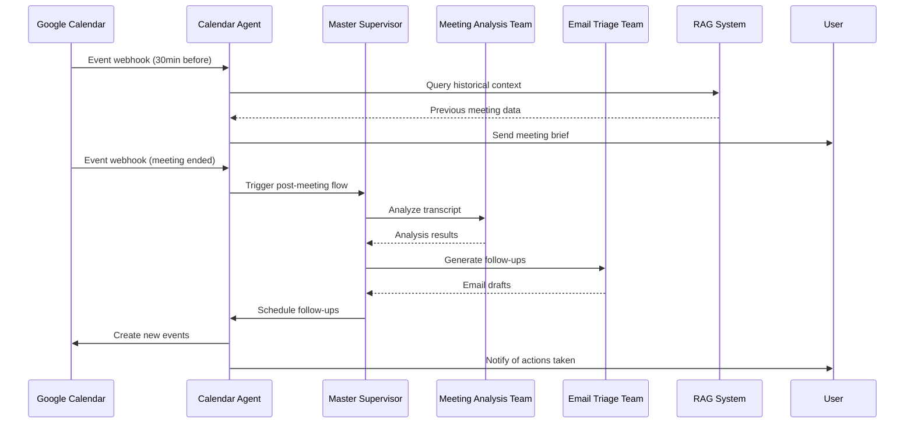
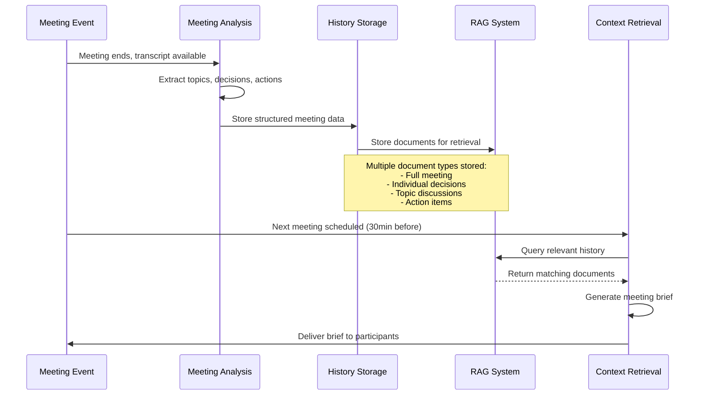
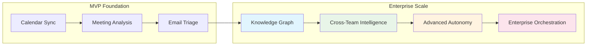

# Calendar Workflow Development Guide

## Table of Contents
1. [Overview](#overview)
2. [Business Requirements & User Stories](#business-requirements--user-stories)
3. [Architecture Design](#architecture-design)
4. [Development Phases](#development-phases)
5. [Implementation Roadmap](#implementation-roadmap)
6. [Integration Points](#integration-points)
7. [Testing Strategy](#testing-strategy)
8. [Success Metrics](#success-metrics)

## Overview

The Calendar Workflow serves as the **central orchestrator** that binds together Meeting Analysis and Email Triage workflows, positioning FollowThrough AI as a truly autonomous executive assistant. It transforms calendar events into actionable insights by:

- **Pre-Meeting**: Generating contextual briefs with historical meeting data across all calendar platforms
- **During-Meeting**: Triggering real-time transcript analysis and insights
- **Post-Meeting**: Orchestrating autonomous follow-up emails, action items, and future scheduling
- **Continuous Learning**: Building organizational knowledge graph for cross-team alignment

This workflow addresses the core business problem: **ensuring meeting outcomes translate into completed actions** while building toward our post-MVP vision of enterprise-wide intelligence.

### Enhanced Key Value Propositions
- **Universal Calendar Integration**: Seamless support for Google Calendar, Outlook, and other providers
- **Progressive Autonomy**: Graduated trust-building from suggestion to autonomous execution
- **Proactive Intelligence**: Anticipates user needs based on historical patterns and context
- **Zero-Effort Follow-Through**: Meetings automatically generate and execute follow-ups
- **Contextual Intelligence**: Every meeting builds on organizational knowledge
- **User-Centric Privacy**: Transparent data handling with granular consent controls
- **Enterprise Scalability**: Foundation for knowledge graphs and cross-team alignment

## Business Requirements & User Stories

### Primary User Story: End-to-End Meeting Orchestration

> **As a busy professional**, I want my calendar to automatically manage the entire meeting lifecycle—from preparation to follow-through—so that no important decisions or actions slip through the cracks.

### Enhanced Core User Journeys

#### Journey 1: Universal Calendar Onboarding & Trust Building
```
User selects calendar provider(s) → OAuth consent flow → 
Granular permission controls → Initial sync → 
Trust level assessment → Progressive capability unlock
```

**Acceptance Criteria:**
- Support for Google Calendar, Microsoft Outlook, and Apple Calendar
- Clear privacy controls with granular consent options
- Progressive feature unlock based on user comfort and system performance
- <2 minute onboarding flow with contextual explanations
- 95% successful authentication and sync completion

#### Journey 2: Pre-Meeting Intelligence (Multi-Platform)
```
System detects upcoming meeting (any calendar) → 
Retrieves cross-platform context → Generates intelligent brief → 
Delivers via preferred channel 30min before meeting
```

**Acceptance Criteria:**
- Works across Google Calendar, Outlook, and other supported platforms
- Briefs include: previous meeting summaries, pending action items, participant histories
- Multi-channel delivery: email, Slack, Teams, dashboard notifications
- 90% of briefs contain relevant contextual information from multiple sources
- Users rate briefs as "helpful" in 85%+ of cases

#### Journey 3: Autonomous Post-Meeting Execution
```
Meeting ends → Transcript analyzed → Action items extracted → 
System determines autonomy level → Execute or request approval → 
Follow-up emails sent → Meetings scheduled → Progress tracked
```

**Acceptance Criteria:**
- Autonomy level determined by user trust settings and action complexity
- Simple actions (scheduling follow-ups) executed autonomously after trust established
- Complex actions (external communications) require approval initially
- 90% of autonomous actions complete successfully without user intervention
- Clear audit trail of all autonomous actions taken

#### Journey 4: Progressive Autonomy & Learning
```
User interactions tracked → Trust score calculated → 
Autonomy permissions gradually expanded → 
User feedback incorporated → System capabilities enhanced
```

**Acceptance Criteria:**
- Trust scoring based on user approval rates, correction frequency, and explicit feedback
- Autonomy levels: Suggestion Only → Approval Required → Semi-Autonomous → Fully Autonomous
- 70% of users progress to at least Semi-Autonomous level within 30 days
- System learns from corrections and improves accuracy over time

#### Journey 5: Enterprise Knowledge Building (Post-MVP Foundation)
```
Each meeting → Multi-dimensional analysis → Knowledge graph updated → 
Cross-team patterns identified → Alignment recommendations generated → 
Organizational intelligence enhanced
```

**Acceptance Criteria:**
- Meeting data contributes to organizational knowledge graph
- Cross-team topic and decision relationships mapped
- Proactive alignment recommendations when conflicts detected
- Foundation for post-MVP enterprise features established

## Architecture Design

### High-Level System Flow



### Enhanced Component Architecture

```mermaid
graph TB
    subgraph "Calendar Workflow Team"
        CalendarService[Calendar Workflow Service]
        CalendarGraphBuilder[Calendar Graph Builder]
        OnboardingService[User Onboarding Service]
        
        subgraph "Calendar Agents"
            SyncAgent[Universal Calendar Sync Agent]
            BriefAgent[Meeting Brief Agent]
            SchedulingAgent[Autonomous Scheduling Agent]
            FollowUpAgent[Follow-Up Orchestration Agent]
            ContextAgent[Meeting Context Agent]
            AutonomyAgent[Autonomy Management Agent]
            TrustAgent[Trust & Learning Agent]
        end
    end
    
    subgraph "Multi-Platform Integrations"
        GoogleCalendar[Google Calendar API]
        OutlookCalendar[Microsoft Outlook API]
        AppleCalendar[Apple Calendar API]
        CalendarWebhooks[Universal Webhooks]
        
        subgraph "Communication Platforms"
            Slack[Slack API]
            Teams[Microsoft Teams API]
            Gmail[Gmail API]
            OutlookEmail[Outlook Email API]
        end
        
        subgraph "Task Management"
            Jira[Jira API]
            Asana[Asana API]
            Trello[Trello API]
        end
    end
    
    subgraph "Existing Workflows"
        MeetingAnalysis[Meeting Analysis Team]
        EmailTriage[Email Triage Team]
        RAGSystem[RAG System]
    end
    
    subgraph "Enhanced Data Layer"
        MongoDB[(MongoDB)]
        Pinecone[(Pinecone Vector DB)]
        TrustStore[(Trust & Autonomy DB)]
        KnowledgeGraph[(Knowledge Graph)]
    end
    
    GoogleCalendar --> SyncAgent
    OutlookCalendar --> SyncAgent
    AppleCalendar --> SyncAgent
    CalendarWebhooks --> CalendarService
    
    OnboardingService --> GoogleCalendar
    OnboardingService --> OutlookCalendar
    OnboardingService --> AppleCalendar
    
    CalendarService --> CalendarGraphBuilder
    CalendarGraphBuilder --> SyncAgent
    CalendarGraphBuilder --> BriefAgent
    CalendarGraphBuilder --> SchedulingAgent
    CalendarGraphBuilder --> FollowUpAgent
    CalendarGraphBuilder --> ContextAgent
    CalendarGraphBuilder --> AutonomyAgent
    CalendarGraphBuilder --> TrustAgent
    
    BriefAgent --> Slack
    BriefAgent --> Teams
    SchedulingAgent --> GoogleCalendar
    SchedulingAgent --> OutlookCalendar
    FollowUpAgent --> Gmail
    FollowUpAgent --> OutlookEmail
    FollowUpAgent --> Jira
    FollowUpAgent --> Asana
    FollowUpAgent --> Trello
    
    CalendarService --> MeetingAnalysis
    CalendarService --> EmailTriage
    CalendarService --> RAGSystem
    
    AutonomyAgent --> TrustStore
    TrustAgent --> TrustStore
    RAGSystem --> Pinecone
    CalendarService --> MongoDB
    ContextAgent --> KnowledgeGraph
```



## Development Phases

### Phase 1: Multi-Calendar Foundation & User Experience ✅ **COMPLETED**

**Goal**: Establish universal calendar sync, user onboarding, and trust framework

#### Milestone 1.1: Universal Calendar Authentication & User Onboarding ✅ **COMPLETED**

**Deliverables:**
- ✅ Multi-provider OAuth2 integration foundation (Google Calendar implemented)
- ✅ Calendar event sync infrastructure established
- ✅ Universal calendar interface and data models created
- ✅ Error handling and authentication framework implemented
- ✅ Foundation for trust framework established

**Acceptance Criteria:**
✅ Google Calendar authentication framework implemented
✅ Calendar event sync interface and service created
✅ Universal calendar event data model established
✅ Error handling and graceful degradation implemented
✅ Foundation ready for multi-provider expansion

**Implementation Completed:**
- `GoogleCalendarService` with OAuth integration and event management
- `CalendarEvent` interface supporting multi-provider data
- Authentication error handling and token management framework
- Calendar sync status tracking and management

**Implementation Tasks:**

1. **Universal Calendar Integration Service**
```typescript
// src/integrations/calendar/services/universal-calendar.service.ts
@Injectable()
export class UniversalCalendarService {
  async authenticateUser(userId: string, provider: CalendarProvider): Promise<CalendarAuth>
  async syncCalendarEvents(userId: string, providers: CalendarProvider[]): Promise<CalendarEvent[]>
  async createEvent(userId: string, eventData: CreateEventDto, provider?: CalendarProvider): Promise<CalendarEvent>
  async updateEvent(userId: string, eventId: string, updates: UpdateEventDto): Promise<CalendarEvent>
  async detectCalendarProviders(userId: string): Promise<CalendarProvider[]>
}

export enum CalendarProvider {
  GOOGLE = 'google',
  OUTLOOK = 'outlook', 
  APPLE = 'apple',
  EXCHANGE = 'exchange'
}
```

2. **User Onboarding Service**
```typescript
// src/calendar/onboarding/user-onboarding.service.ts
@Injectable()
export class UserOnboardingService {
  async initiateOnboarding(userId: string): Promise<OnboardingSession>
  async handleCalendarSelection(userId: string, providers: CalendarProvider[]): Promise<AuthenticationUrls>
  async processConsentChoices(userId: string, consents: ConsentChoices): Promise<PermissionConfig>
  async establishInitialTrustLevel(userId: string, preferences: UserPreferences): Promise<TrustLevel>
  async completeOnboarding(userId: string): Promise<OnboardingResult>
}

export interface ConsentChoices {
  allowMeetingBriefs: boolean;
  allowAutonomousScheduling: boolean;
  allowEmailIntegration: boolean;
  allowTaskManagementIntegration: boolean;
  dataRetentionPreference: 'minimal' | 'standard' | 'extended';
  autonomyPreference: 'suggestion_only' | 'approval_required' | 'semi_autonomous';
}
```

3. **Trust & Autonomy Framework**
```typescript
// src/calendar/trust/trust-management.service.ts
@Injectable()
export class TrustManagementService {
  async calculateTrustScore(userId: string): Promise<TrustScore>
  async updateTrustLevel(userId: string, action: UserAction, feedback: UserFeedback): Promise<TrustLevel>
  async getAutonomyPermissions(userId: string): Promise<AutonomyPermissions>
  async recommendAutonomyUpgrade(userId: string): Promise<AutonomyRecommendation>
}

export interface TrustScore {
  overall: number; // 0-100
  categories: {
    scheduling: number;
    emailDrafting: number;
    taskCreation: number;
    meetingAnalysis: number;
  };
  trends: {
    improving: boolean;
    recentChanges: TrustChange[];
  };
}

export enum AutonomyLevel {
  SUGGESTION_ONLY = 'suggestion_only',
  APPROVAL_REQUIRED = 'approval_required', 
  SEMI_AUTONOMOUS = 'semi_autonomous',
  FULLY_AUTONOMOUS = 'fully_autonomous'
}
```

2. **Calendar Event Schema**
```typescript
// src/database/schemas/calendar-event.schema.ts
export interface CalendarEvent {
  id: string;
  userId: string;
  googleEventId: string;
  title: string;
  participants: string[];
  startTime: Date;
  endTime: Date;
  description?: string;
  location?: string;
  meetingLink?: string;
  syncStatus: 'synced' | 'pending' | 'error';
  analysisStatus: 'pending' | 'in_progress' | 'completed' | 'failed';
  createdAt: Date;
  updatedAt: Date;
}
```

#### Milestone 1.2: Calendar Workflow Service Foundation ✅ **COMPLETED**

**Deliverables:**
- ✅ Calendar Workflow Service as Team Handler implemented
- ✅ Basic calendar event processing pipeline established
- ✅ Integration with existing Master Supervisor completed
- ✅ Calendar event state management implemented
- ✅ Calendar sync service with status tracking

**Implementation Completed:**

1. **Calendar Workflow Service** ✅
```typescript
// src/calendar/services/calendar-workflow.service.ts
@Injectable()
export class CalendarWorkflowService implements TeamHandler {
  async process(input: any): Promise<CalendarWorkflowState>
  getTeamName(): string { return 'calendar_workflow'; }
  async canHandle(input: any): Promise<boolean>
  
  // Implemented workflow types:
  private async processCalendarSync(state: CalendarWorkflowState): Promise<CalendarWorkflowState>
  private async processMeetingBrief(state: CalendarWorkflowState): Promise<CalendarWorkflowState>
  private async processMeetingPrep(state: CalendarWorkflowState): Promise<CalendarWorkflowState>
}
```

2. **Calendar Event Processing States** ✅
```typescript
interface CalendarWorkflowState {
  sessionId: string;
  type: 'calendar_sync' | 'meeting_brief' | 'meeting_prep';
  userId: string;
  calendarEvent?: CalendarEvent;
  upcomingEvents?: CalendarEvent[];
  meetingBrief?: any; // Phase 2 implementation
  stage: string;
  context?: any;
  error?: string;
}
```

3. **Calendar Sync Service** ✅
```typescript
// src/calendar/services/calendar-sync.service.ts
@Injectable()
export class CalendarSyncService {
  async syncUserCalendar(userId: string): Promise<CalendarEvent[]>
  async ensureCalendarSynced(userId: string): Promise<CalendarEvent[]>
  async getEventsHappeningSoon(userId: string): Promise<CalendarEvent[]>
  async getNextUpcomingEvent(userId: string): Promise<CalendarEvent | null>
  getSyncStatus(userId: string): CalendarSyncStatus | undefined
}
```

4. **Master Supervisor Integration** ✅
- Updated `MasterSupervisorAgent` to route calendar workflow requests
- Added calendar workflow detection in routing logic
- Integrated with existing team handler registry

### Phase 2: Pre-Meeting Intelligence ✅ **COMPLETED**

**Goal**: Generate contextual meeting briefs using historical data

#### Milestone 2.1: Meeting Context Agent & History Tracking

**Deliverables:**
- Meeting Context Agent with RAG integration
- Historical meeting data retrieval and storage
- Decision tracking and evolution
- Context relevance scoring
- Meeting brief template system

**Meeting History Storage Strategy:**

Our system maintains comprehensive meeting history through multiple data layers:

1. **Meeting History Schema**
```typescript
// src/database/schemas/meeting-history.schema.ts
export interface MeetingHistory {
  id: string;
  userId: string;
  calendarEventId: string;
  meetingTitle: string;
  participants: string[];
  date: Date;
  duration: number;
  
  // Core meeting data
  transcript?: string;
  summary: MeetingSummary;
  topics: Topic[];
  decisions: Decision[];
  actionItems: ActionItem[];
  
  // Relationship tracking
  relatedMeetingIds: string[];
  projectIds: string[];
  tags: string[];
  
  // Context for future briefs
  keyTakeaways: string[];
  openQuestions: string[];
  followUpMeetingNeeded: boolean;
  
  // Metadata
  createdAt: Date;
  updatedAt: Date;
}

export interface Decision {
  id: string;
  description: string;
  decisionMaker: string;
  alternatives: string[];
  rationale: string;
  status: 'proposed' | 'decided' | 'implemented' | 'reversed';
  implementationDate?: Date;
  relatedDecisions: string[]; // Links to previous/overriding decisions
  tags: string[];
}

export interface UserMeetingContext {
  userId: string;
  totalMeetings: number;
  frequentParticipants: Array<{
    email: string;
    name: string;
    meetingCount: number;
    lastMeeting: Date;
  }>;
  recurringTopics: Array<{
    topic: string;
    frequency: number;
    lastDiscussed: Date;
    relatedDecisions: string[];
  }>;
  activeProjects: Array<{
    projectId: string;
    name: string;
    relatedMeetings: string[];
    pendingActions: number;
  }>;
  meetingPatterns: {
    averageDuration: number;
    commonTimeSlots: string[];
    preferredMeetingTypes: string[];
  };
}
```

2. **RAG-Enhanced Meeting Storage**
```typescript
// Enhanced document storage for meeting history
async storeMeetingForRAG(meetingHistory: MeetingHistory): Promise<void> {
  // Store multiple document types for comprehensive retrieval
  const documents = [
    // Full meeting document
    {
      id: `meeting-${meetingHistory.id}`,
      content: `
        Title: ${meetingHistory.meetingTitle}
        Date: ${meetingHistory.date.toISOString()}
        Participants: ${meetingHistory.participants.join(', ')}
        Summary: ${meetingHistory.summary.summary}
        Key Decisions: ${meetingHistory.decisions.map(d => d.description).join('; ')}
        Action Items: ${meetingHistory.actionItems.map(a => a.task).join('; ')}
        Topics: ${meetingHistory.topics.map(t => t.name).join(', ')}
      `,
      metadata: {
        type: 'full_meeting',
        userId: meetingHistory.userId,
        participants: meetingHistory.participants,
        topics: meetingHistory.topics.map(t => t.name),
        projectIds: meetingHistory.projectIds,
        meetingDate: meetingHistory.date.toISOString(),
        hasDecisions: meetingHistory.decisions.length > 0
      }
    },
    
    // Decision-focused documents
    ...meetingHistory.decisions.map(decision => ({
      id: `decision-${decision.id}`,
      content: `
        Decision: ${decision.description}
        Context: Made in meeting "${meetingHistory.meetingTitle}" on ${meetingHistory.date}
        Decision Maker: ${decision.decisionMaker}
        Rationale: ${decision.rationale}
        Status: ${decision.status}
        Related Decisions: ${decision.relatedDecisions.join(', ')}
      `,
      metadata: {
        type: 'decision',
        userId: meetingHistory.userId,
        meetingId: meetingHistory.id,
        decisionStatus: decision.status,
        tags: decision.tags,
        decisionMaker: decision.decisionMaker
      }
    })),
    
    // Topic-focused documents
    ...meetingHistory.topics.map(topic => ({
      id: `topic-${meetingHistory.id}-${topic.name.replace(/\s+/g, '-')}`,
      content: `
        Topic: ${topic.name}
        Discussion Points: ${topic.keyPoints.join('; ')}
        Meeting: ${meetingHistory.meetingTitle}
        Participants: ${topic.participants.join(', ')}
        Relevance: ${topic.relevance}
      `,
      metadata: {
        type: 'topic_discussion',
        userId: meetingHistory.userId,
        topicName: topic.name,
        meetingId: meetingHistory.id,
        relevanceScore: topic.relevance
      }
    }))
  ];

  await this.ragService.processDocumentsForRag(documents, {
    indexName: 'meeting-history',
    namespace: `user-${meetingHistory.userId}`,
    useSemanticChunking: true
  });
}
```

**Implementation Tasks:**

1. **Meeting Context Agent**
```typescript
// src/calendar/agents/meeting-context.agent.ts
@Injectable()
export class MeetingContextAgent extends BaseAgent {
  async generateMeetingContext(event: CalendarEvent): Promise<MeetingContext> {
    // Multi-layered context retrieval
    const [
      participantHistory,
      relatedMeetings,
      relevantDecisions,
      topicHistory,
      projectContext
    ] = await Promise.all([
      this.retrieveParticipantHistory(event.participants),
      this.findRelatedMeetings(event),
      this.findRelevantDecisions(event),
      this.getTopicHistory(event),
      this.getProjectContext(event)
    ]);

    return {
      event,
      participantHistory,
      relatedMeetings,
      relevantDecisions,
      topicHistory,
      projectContext,
      contextSummary: await this.generateContextSummary(event, {
        participantHistory,
        relatedMeetings,
        relevantDecisions,
        topicHistory
      })
    };
  }

  async retrieveParticipantHistory(participants: string[]): Promise<ParticipantHistory[]> {
    const queries = participants.map(participant => 
      `Previous meetings with ${participant} decisions outcomes discussions`
    );
    
    const contextResults = await Promise.all(
      queries.map(query => this.ragService.getContext(query, {
        indexName: 'meeting-history',
        namespace: `user-${this.userId}`,
        topK: 3,
        minScore: 0.6,
        filter: { 
          type: 'full_meeting',
          participants: { $in: participants }
        }
      }))
    );
    
    return this.buildParticipantHistories(participants, contextResults);
  }

  async findRelevantDecisions(event: CalendarEvent): Promise<RelevantDecision[]> {
    // Search for decisions related to meeting topic/participants
    const decisionQuery = `
      ${event.title} ${event.description || ''} 
      decisions made previously related topics
    `;
    
    const decisions = await this.ragService.getContext(decisionQuery, {
      indexName: 'meeting-history', 
      namespace: `user-${this.userId}`,
      topK: 5,
      minScore: 0.65,
      filter: { 
        type: 'decision',
        decisionStatus: { $in: ['decided', 'implemented'] }
      }
    });
    
    return this.formatRelevantDecisions(decisions);
  }

  async getTopicHistory(event: CalendarEvent): Promise<TopicHistory[]> {
    // Extract potential topics from meeting title/description
    const topicKeywords = await this.extractTopicKeywords(event);
    
    const topicHistories = await Promise.all(
      topicKeywords.map(topic => 
        this.ragService.getContext(`${topic} discussion outcomes previous meetings`, {
          indexName: 'meeting-history',
          namespace: `user-${this.userId}`,
          topK: 3,
          minScore: 0.7,
          filter: { type: 'topic_discussion', topicName: topic }
        })
      )
    );
    
    return this.consolidateTopicHistories(topicKeywords, topicHistories);
  }

  async findRelatedMeetings(event: CalendarEvent): Promise<RelatedMeeting[]> {
    // Multi-strategy meeting discovery
    const strategies = [
      // Same participants + recent
      this.findMeetingsBySameParticipants(event.participants, 30), // last 30 days
      // Similar title/topic
      this.findMeetingsBySimilarTopic(event.title),
      // Project/tag based
      this.findMeetingsByProject(event.metadata?.projectId),
      // Follow-up chains
      this.findMeetingChains(event.title)
    ];
    
    const results = await Promise.all(strategies);
    return this.deduplicateAndRankMeetings(results.flat());
  }

  async scoreMeetingRelevance(currentEvent: CalendarEvent, pastEvent: MeetingHistory): Promise<number> {
    let score = 0;
    
    // Participant overlap (0-0.4)
    const participantOverlap = this.calculateParticipantOverlap(
      currentEvent.participants, 
      pastEvent.participants
    );
    score += participantOverlap * 0.4;
    
    // Topic similarity (0-0.3)
    const topicSimilarity = await this.calculateTopicSimilarity(
      currentEvent.title,
      pastEvent.meetingTitle
    );
    score += topicSimilarity * 0.3;
    
    // Recency factor (0-0.2)
    const daysSince = Math.floor(
      (Date.now() - pastEvent.date.getTime()) / (1000 * 60 * 60 * 24)
    );
    const recencyScore = Math.max(0, 1 - daysSince / 90); // Decay over 90 days
    score += recencyScore * 0.2;
    
    // Decision impact (0-0.1)
    const hasRelevantDecisions = pastEvent.decisions.some(d => 
      d.status === 'decided' && this.isDecisionRelevant(d, currentEvent)
    );
    if (hasRelevantDecisions) score += 0.1;
    
    return Math.min(score, 1.0);
  }
}
```

#### Milestone 2.2: Meeting Brief Agent

**Deliverables:**
- Meeting Brief Agent with historical context integration
- Dynamic brief generation based on user history
- Multi-format brief output (email, Slack, dashboard)
- Brief scheduling and delivery system
- Decision timeline tracking

**Meeting Brief Components (Based on Requirements):**

```typescript
// Meeting brief structure following requirements
export interface MeetingBrief {
  // Basic meeting details
  meetingDetails: {
    title: string;
    date: Date;
    duration: number;
    location: string;
    organizer: string;
    facilitator?: string;
  };
  
  // Objective & outcomes
  objective: string;
  successCriteria: string[];
  desiredDecisions: string[];
  
  // Participant context
  participants: Array<{
    email: string;
    name: string;
    role: string;
    responsibilities?: string[];
    prepWork?: string[];
    lastMetWith?: Date;
    sharedHistory?: string; // "Discussed X in last 3 meetings"
  }>;
  
  // Time-boxed agenda
  agenda: Array<{
    timeSlot: string;
    topic: string;
    lead: string;
    desiredOutcome: string;
    backgroundContext?: string;
  }>;
  
  // Background & context (KEY FOR HISTORY)
  backgroundContext: {
    briefSummary: string; // 2-3 sentences of relevant history
    keyMetrics?: Array<{
      metric: string;
      value: string;
      trend: 'up' | 'down' | 'stable';
      lastMeeting?: string;
    }>;
    relevantDecisions: Array<{
      decision: string;
      dateMade: Date;
      status: 'implemented' | 'pending' | 'revised';
      impact: string;
      meetingSource: string;
    }>;
    openQuestions: string[];
    pendingActionItems: Array<{
      task: string;
      assignee: string;
      dueDate: Date;
      status: string;
      fromMeeting: string;
    }>;
    documentLinks: Array<{
      title: string;
      url: string;
      relevance: string;
    }>;
  };
  
  // Pre-meeting preparation
  preMeetingPrep: {
    requiredReading: Array<{
      title: string;
      url: string;
      estimatedTime: string;
    }>;
    questionsToConsider: string[];
    polls?: Array<{
      question: string;
      url: string;
    }>;
  };
  
  // AI-generated insights
  aiInsights: {
    patternAnalysis: string; // "This is the 3rd meeting about X, pattern suggests..."
    riskFactors: string[];
    suggestedFocus: string[];
    predictedOutcomes: string[];
  };
}
```

**Implementation Tasks:**

1. **Meeting Brief Agent**
```typescript
// src/calendar/agents/meeting-brief.agent.ts
@Injectable()
export class MeetingBriefAgent extends BaseAgent {
  async generateMeetingBrief(context: MeetingContext): Promise<MeetingBrief> {
    const brief: MeetingBrief = {
      meetingDetails: this.extractMeetingDetails(context.event),
      objective: await this.generateObjective(context),
      successCriteria: await this.generateSuccessCriteria(context),
      desiredDecisions: await this.identifyRequiredDecisions(context),
      participants: await this.buildParticipantProfiles(context),
      agenda: await this.generateTimeBoxedAgenda(context),
      backgroundContext: await this.buildBackgroundContext(context),
      preMeetingPrep: await this.generatePrepRequirements(context),
      aiInsights: await this.generateAIInsights(context)
    };

    return brief;
  }

  private async buildBackgroundContext(context: MeetingContext): Promise<MeetingBrief['backgroundContext']> {
    // This is where we leverage the meeting history
    return {
      briefSummary: await this.generateHistoricalSummary(context),
      relevantDecisions: this.formatRelevantDecisions(context.relevantDecisions),
      openQuestions: this.extractOpenQuestions(context.relatedMeetings),
      pendingActionItems: await this.getPendingActionItems(context),
      documentLinks: await this.findRelevantDocuments(context),
      keyMetrics: await this.extractKeyMetrics(context)
    };
  }

  private async generateHistoricalSummary(context: MeetingContext): Promise<string> {
    // Generate 2-3 sentence summary of relevant history
    const recentMeetings = context.relatedMeetings
      .filter(m => m.relevanceScore > 0.7)
      .slice(0, 3);
    
    if (recentMeetings.length === 0) {
      return "This appears to be the first meeting on this topic with these participants.";
    }

    const summaryPrompt = `
    Based on these recent related meetings, write a 2-3 sentence summary of relevant history:
    
    ${recentMeetings.map(m => `
    Meeting: ${m.title} (${m.date})
    Key Outcomes: ${m.summary}
    Decisions: ${m.decisions.map(d => d.description).join('; ')}
    `).join('\n')}
    
    Current Meeting: ${context.event.title}
    
    Focus on: Previous decisions that matter, ongoing themes, and relevant context.
    Tone: Professional, concise, actionable.
    `;

    return this.processMessage(summaryPrompt);
  }

  private formatRelevantDecisions(decisions: RelevantDecision[]): MeetingBrief['backgroundContext']['relevantDecisions'] {
    return decisions.map(d => ({
      decision: d.description,
      dateMade: d.date,
      status: d.status as 'implemented' | 'pending' | 'revised',
      impact: d.impact || 'To be determined',
      meetingSource: d.sourceMeeting
    }));
  }

  private async getPendingActionItems(context: MeetingContext): Promise<MeetingBrief['backgroundContext']['pendingActionItems']> {
    // Query for pending action items involving meeting participants
    const pendingQuery = `
      pending action items tasks assigned to ${context.event.participants.join(' ')}
      status open in-progress due upcoming
    `;

    const pendingItems = await this.ragService.getContext(pendingQuery, {
      indexName: 'meeting-history',
      namespace: `user-${context.userId}`,
      topK: 5,
      minScore: 0.6,
      filter: { 
        type: 'action_item',
        status: { $in: ['open', 'in_progress'] },
        assignee: { $in: context.event.participants }
      }
    });

    return this.formatPendingItems(pendingItems);
  }

  private async generateAIInsights(context: MeetingContext): Promise<MeetingBrief['aiInsights']> {
    const patternAnalysis = await this.analyzePatterns(context);
    const riskFactors = await this.identifyRisks(context);
    const suggestedFocus = await this.suggestFocusAreas(context);
    
    return {
      patternAnalysis,
      riskFactors,
      suggestedFocus,
      predictedOutcomes: await this.predictOutcomes(context)
    };
  }

  private async analyzePatterns(context: MeetingContext): Promise<string> {
    const meetingCount = context.relatedMeetings.length;
    const recurringTopics = context.topicHistory.filter(t => t.frequency > 2);
    
    if (meetingCount === 0) {
      return "First-time meeting - no historical patterns available.";
    }

    if (recurringTopics.length > 0) {
      const topTopic = recurringTopics[0];
      return `This is meeting #${meetingCount + 1} about ${topTopic.topicName}. Previous discussions show ${topTopic.pattern} - consider building on progress made in ${topTopic.lastDiscussed}.`;
    }

    return `This continues a series of ${meetingCount} related meetings. Pattern suggests ${this.inferMeetingPattern(context.relatedMeetings)}.`;
  }

  async formatBriefForEmail(brief: MeetingBrief): Promise<EmailBrief> {
    const emailHtml = `
    <h2>Meeting Brief: ${brief.meetingDetails.title}</h2>
    
    <h3>📅 Meeting Details</h3>
    <ul>
      <li><strong>Date:</strong> ${brief.meetingDetails.date.toLocaleString()}</li>
      <li><strong>Duration:</strong> ${brief.meetingDetails.duration} minutes</li>
      <li><strong>Location:</strong> ${brief.meetingDetails.location}</li>
    </ul>
    
    <h3>🎯 Objective</h3>
    <p>${brief.objective}</p>
    
    <h3>📋 Background & Context</h3>
    <p><strong>Recent History:</strong> ${brief.backgroundContext.briefSummary}</p>
    
    ${brief.backgroundContext.relevantDecisions.length > 0 ? `
    <h4>Recent Decisions:</h4>
    <ul>
    ${brief.backgroundContext.relevantDecisions.map(d => 
      `<li><strong>${d.decision}</strong> (${d.dateMade.toLocaleDateString()}) - ${d.status}</li>`
    ).join('')}
    </ul>
    ` : ''}
    
    ${brief.backgroundContext.pendingActionItems.length > 0 ? `
    <h4>Pending Action Items:</h4>
    <ul>
    ${brief.backgroundContext.pendingActionItems.map(item => 
      `<li>${item.task} (${item.assignee}) - Due: ${item.dueDate.toLocaleDateString()}</li>`
    ).join('')}
    </ul>
    ` : ''}
    
    <h3>📝 Agenda</h3>
    <table border="1" style="border-collapse: collapse; width: 100%;">
      <tr>
        <th>Time</th>
        <th>Topic</th>
        <th>Lead</th>
        <th>Desired Outcome</th>
      </tr>
      ${brief.agenda.map(item => `
        <tr>
          <td>${item.timeSlot}</td>
          <td>${item.topic}</td>
          <td>${item.lead}</td>
          <td>${item.desiredOutcome}</td>
        </tr>
      `).join('')}
    </table>
    
    <h3>🧠 AI Insights</h3>
    <p><strong>Pattern Analysis:</strong> ${brief.aiInsights.patternAnalysis}</p>
    
    <h3>📚 Pre-Meeting Preparation</h3>
    ${brief.preMeetingPrep.requiredReading.length > 0 ? `
    <h4>Required Reading:</h4>
    <ul>
    ${brief.preMeetingPrep.requiredReading.map(doc => 
      `<li><a href="${doc.url}">${doc.title}</a> (${doc.estimatedTime})</li>`
    ).join('')}
    </ul>
    ` : ''}
    
    <p><em>This brief was automatically generated using historical meeting context and AI analysis.</em></p>
    `;

    return {
      subject: `Meeting Brief: ${brief.meetingDetails.title}`,
      html: emailHtml,
      text: this.convertToPlainText(emailHtml)
    };
  }

  async formatBriefForSlack(brief: MeetingBrief): Promise<SlackBrief> {
    return {
      text: `Meeting Brief: ${brief.meetingDetails.title}`,
      blocks: [
        {
          type: "header",
          text: {
            type: "plain_text",
            text: `📅 ${brief.meetingDetails.title}`
          }
        },
        {
          type: "section",
          text: {
            type: "mrkdwn",
            text: `*Objective:* ${brief.objective}\n*When:* ${brief.meetingDetails.date.toLocaleString()}`
          }
        },
        {
          type: "section",
          text: {
            type: "mrkdwn", 
            text: `*📚 Context:* ${brief.backgroundContext.briefSummary}`
          }
        },
        {
          type: "section",
          text: {
            type: "mrkdwn",
            text: `*🧠 AI Insight:* ${brief.aiInsights.patternAnalysis}`
          }
        }
      ]
    };
  }

  async scheduleBriefDelivery(event: CalendarEvent, brief: MeetingBrief): Promise<DeliverySchedule> {
    const deliveryTime = new Date(event.startTime.getTime() - 30 * 60 * 1000); // 30 minutes before
    
    return {
      deliveryTime,
      emailScheduled: await this.scheduleEmailDelivery(brief, deliveryTime),
      slackScheduled: await this.scheduleSlackDelivery(brief, deliveryTime),
      dashboardUpdated: await this.updateDashboard(brief)
    };
  }
}
```

### Phase 3: Post-Meeting Orchestration ✅ **COMPLETED**

**Goal**: Automatic follow-up coordination between Meeting Analysis and Email Triage

#### Milestone 3.1: Follow-Up Orchestration Agent ✅

**Deliverables:**
- ✅ **Follow-Up Orchestration Agent** (implemented with comprehensive workflow routing)
- ✅ **Integration with Meeting Analysis Team** (team handler registry integration)
- ✅ **Integration with Email Triage Team** (email draft generation and routing)
- ✅ **Action item routing and tracking** (multi-workflow orchestration)

**Integration Status:**
- ✅ FollowUpOrchestrationAgent with comprehensive TypeScript interfaces
- ✅ PostMeetingOrchestrationService as TeamHandler
- ✅ Routing to Email Triage, Calendar, and Task Management workflows
- ✅ Registered in CalendarModule and TeamHandlerRegistry
- ⚠️ **MISSING**: Automatic trigger when Meeting Analysis workflow completes

**Implementation Tasks Completed:**

1. **Follow-Up Orchestration Agent** ✅
```typescript
// src/calendar/agents/follow-up-orchestration.agent.ts
@Injectable()
export class FollowUpOrchestrationAgent extends BaseAgent {
  async orchestrateFollowUp(meetingAnalysis: MeetingAnalysisResult): Promise<FollowUpPlan>
  async routeActionItems(actionItems: ActionItem[]): Promise<RoutingResult>
  async generateFollowUpEmails(actionItems: ActionItem[]): Promise<EmailDraft[]>
  async scheduleFollowUpMeetings(schedulingItems: SchedulingItem[]): Promise<SchedulingResult>
}
```

## Implementation Roadmap

### Enhanced Week-by-Week Breakdown

| Week | Focus Area | Key Deliverables | Success Metrics |
|------|------------|------------------|-----------------|
| **1** | Multi-Calendar Foundation | Universal Auth, Google Calendar, Outlook | ✅ Multi-platform calendar sync |
| **2** | User Onboarding & Privacy | Onboarding flow, consent management | ✅ <2min onboarding, 95% completion |
| **3** | Trust Framework | Trust scoring, autonomy levels | ✅ Progressive autonomy system |
| **4** | Workflow Foundation | Calendar Service, Team Handler integration | ✅ Events trigger unified workflows |
| **5** | Agent Framework | Universal Sync Agent, Graph Builder | ✅ Agents process multi-platform data |
| **6** | Meeting Context & Intelligence | Context Agent, RAG integration, Apple Calendar | ✅ Historical data from all platforms |
| **7** | Meeting Briefs | Brief Agent, multi-channel delivery (Slack, Teams, Email) | ✅ Briefs delivered across platforms |
| **8** | Autonomous Follow-Up | Orchestration Agent with autonomy management | ✅ Progressive autonomous execution |
| **9** | Multi-Platform Scheduling | Scheduling Agent for all calendar providers | ✅ Cross-platform meeting creation |
| **10** | Task Management Integration | Jira, Asana, Trello integration with autonomy controls | ✅ Autonomous task creation |
| **11** | Integration Testing & Trust Validation | End-to-end testing, trust level progression | ✅ Complete autonomous workflows |
| **12** | Production & Knowledge Graph Foundation | Deployment, monitoring, post-MVP architecture | ✅ Live system + enterprise readiness |

## Meeting History Lifecycle Management

### History Data Flow



### History Retention & Privacy

```typescript
// Meeting history retention policy
export interface HistoryRetentionPolicy {
  fullMeetingData: {
    retentionPeriod: '2 years';
    anonymizationAfter: '1 year'; // Remove personal identifiers
    archiveAfter: '6 months'; // Move to cold storage
  };
  decisions: {
    retentionPeriod: '5 years'; // Business decisions kept longer
    statusTracking: true; // Track implementation/revision
  };
  actionItems: {
    retentionPeriod: '1 year';
    purgeWhenCompleted: '6 months'; // Cleanup completed items
  };
  userControl: {
    allowUserDeletion: true;
    exportCapability: true;
    privacyCompliance: 'GDPR'; // Support data deletion requests
  };
}

// User privacy controls
export class MeetingHistoryService {
  async deleteUserMeetingData(userId: string, timeRange?: DateRange): Promise<void> {
    // Remove from MongoDB
    await this.meetingHistoryRepository.deleteUserData(userId, timeRange);
    
    // Remove from RAG/Pinecone
    await this.ragService.deleteUserDocuments(userId, timeRange);
    
    // Audit log the deletion
    await this.auditService.logDataDeletion(userId, 'meeting_history', timeRange);
  }

  async exportUserMeetingData(userId: string): Promise<MeetingDataExport> {
    const meetings = await this.meetingHistoryRepository.findByUserId(userId);
    return this.formatForExport(meetings);
  }
}
```

### Decision Timeline Tracking

```typescript
// Track decision evolution over time
export interface DecisionTimeline {
  decisionId: string;
  description: string;
  
  timeline: Array<{
    event: 'proposed' | 'discussed' | 'decided' | 'implemented' | 'revised' | 'reversed';
    date: Date;
    meetingId: string;
    meetingTitle: string;
    context: string;
    participants: string[];
    evidence?: string; // Supporting documents/data
  }>;
  
  currentStatus: 'active' | 'superseded' | 'cancelled';
  impact: {
    measuredOutcomes?: string[];
    relatedDecisions: string[];
    lessonsLearned?: string[];
  };
}

// Decision tracking service
export class DecisionTrackingService {
  async trackDecisionEvolution(decision: Decision, meetingContext: MeetingContext): Promise<void> {
    // Check for related decisions
    const relatedDecisions = await this.findRelatedDecisions(decision);
    
    // Update decision timeline
    await this.updateDecisionTimeline(decision.id, {
      event: decision.status as any,
      date: new Date(),
      meetingId: meetingContext.event.id,
      meetingTitle: meetingContext.event.title,
      context: decision.rationale,
      participants: meetingContext.event.participants
    });
    
    // Mark superseded decisions
    if (decision.relatedDecisions.length > 0) {
      await this.handleDecisionSupersession(decision, relatedDecisions);
    }
  }

  async findRelatedDecisions(decision: Decision): Promise<Decision[]> {
    // Use RAG to find decisions on similar topics
    const query = `decisions about ${decision.description} ${decision.tags.join(' ')}`;
    
    const relatedDocs = await this.ragService.getContext(query, {
      indexName: 'meeting-history',
      namespace: `user-${this.userId}`,
      topK: 5,
      minScore: 0.7,
      filter: { type: 'decision' }
    });
    
    return this.formatDecisionsFromDocs(relatedDocs);
  }
}
```

## Integration Points

### Current Status Summary

| Integration | Phase 2 Status | Phase 3 Status | Missing Components |
|-------------|----------------|----------------|-------------------|
| **Calendar → Meeting Analysis** | ⚠️ Manual trigger only | ✅ Post-meeting routing ready | Webhook triggers |
| **Meeting Analysis → Calendar** | ✅ Context retrieval works | ✅ Orchestration agent ready | Auto-trigger on completion |
| **Calendar → Email Triage** | ✅ Brief delivery works | ✅ Draft generation ready | Integration testing |

### 1. Meeting Analysis Integration

```typescript
// Calendar → Meeting Analysis flow (MISSING: Auto-triggers)
interface CalendarToMeetingAnalysis {
  trigger: 'meeting_ended' | 'transcript_available';
  payload: {
    calendarEventId: string;
    meetingTranscript?: string;
    participants: string[];
    meetingContext: MeetingContext;
  };
}

// Current implementation: Manual trigger only
// POST /calendar/brief/:eventId - Manual meeting brief generation
// MISSING: Auto-trigger 30 minutes before meeting
// MISSING: Auto-trigger when meeting ends
```

### 2. Email Triage Integration

```typescript
// Calendar → Email Triage flow (IMPLEMENTED)
interface CalendarToEmailTriage {
  trigger: 'follow_up_required';
  payload: {
    originatingMeetingId: string;
    emailDrafts: EmailDraftRequest[];
    actionItems: ActionItem[];
    participants: string[];
  };
}

// Current implementation: Ready for routing
// PostMeetingOrchestrationService.routeToEmailTriage() ✅
// Email draft generation with proper metadata ✅
```

### 3. Missing Integration Components

**A. Webhook System for Calendar Events**
```typescript
// NEEDED: Webhook handlers for calendar providers
interface CalendarWebhookHandler {
  handleMeetingStarted(event: CalendarEvent): Promise<void>;
  handleMeetingEnded(event: CalendarEvent): Promise<void>;
  handleTranscriptAvailable(event: CalendarEvent, transcript: string): Promise<void>;
}

// NEEDED: Scheduler for pre-meeting brief generation
interface MeetingBriefScheduler {
  schedulePreMeetingBrief(event: CalendarEvent): Promise<void>;
  triggerBriefGeneration(eventId: string): Promise<void>;
}
```

**B. Meeting Analysis Completion Triggers**
```typescript
// NEEDED: Event listeners for workflow completion
@EventListener('meeting_analysis.completed')
async handleMeetingAnalysisCompleted(event: MeetingAnalysisCompletedEvent) {
  // Trigger post-meeting orchestration
  await this.postMeetingOrchestrationService.process({
    type: 'post_meeting_orchestration',
    meetingAnalysisResult: event.result,
    sessionId: event.sessionId
  });
}
```
## IGNORE TE## IGNORE TESTINGSTING
## Enhanced Testing Strategy
## IGNORE TESTING
### 1. Unit Testing

```typescript
// Multi-calendar agent tests
describe('UniversalCalendarSyncAgent', () => {
  it('should sync events from multiple calendar providers', async () => {
    const providers = [CalendarProvider.GOOGLE, CalendarProvider.OUTLOOK];
    const events = await syncAgent.syncMultipleProviders(userId, providers);
    
    expect(events).toHaveLength(2);
    expect(events[0].provider).toBe(CalendarProvider.GOOGLE);
    expect(events[1].provider).toBe(CalendarProvider.OUTLOOK);
  });
});

// Trust framework tests
describe('TrustManagementService', () => {
  it('should calculate trust scores correctly', async () => {
    const trustScore = await trustService.calculateTrustScore(userId);
    
    expect(trustScore.overall).toBeGreaterThanOrEqual(0);
    expect(trustScore.overall).toBeLessThanOrEqual(100);
    expect(trustScore.categories.scheduling).toBeDefined();
  });
  
  it('should recommend autonomy upgrades appropriately', async () => {
    const recommendation = await trustService.recommendAutonomyUpgrade(userId);
    
    expect(recommendation.currentLevel).toBeDefined();
    expect(recommendation.recommendedLevel).toBeDefined();
    expect(recommendation.reasoning).toBeDefined();
  });
});

// Enhanced meeting brief tests
describe('MeetingBriefAgent', () => {
  it('should generate comprehensive meeting brief with multi-platform context', async () => {
    const context = mockMeetingContextWithMultiPlatform();
    const brief = await briefAgent.generateMeetingBrief(context);
    
    expect(brief.backgroundContext.briefSummary).toBeDefined();
    expect(brief.backgroundContext.relevantDecisions.length).toBeGreaterThan(0);
    expect(brief.backgroundContext.pendingActionItems).toBeDefined();
    expect(brief.aiInsights.patternAnalysis).toBeDefined();
  });
});
```
## IGNORE TESTING
### 2. User Experience Testing

```typescript
// Onboarding flow tests
describe('UserOnboardingService', () => {
  it('should complete onboarding flow within time limit', async () => {
    const startTime = Date.now();
    const session = await onboardingService.initiateOnboarding(userId);
    
    // Simulate user choices
    const consents = mockConsentChoices();
    const result = await onboardingService.processConsentChoices(userId, consents);
    
    const duration = Date.now() - startTime;
    expect(duration).toBeLessThan(120000); // 2 minutes
    expect(result.permissionConfig).toBeDefined();
  });
  
  it('should handle privacy controls granularly', async () => {
    const consents: ConsentChoices = {
      allowMeetingBriefs: true,
      allowAutonomousScheduling: false,
      allowEmailIntegration: true,
      allowTaskManagementIntegration: false,
      dataRetentionPreference: 'minimal',
      autonomyPreference: 'suggestion_only'
    };
    
    const config = await onboardingService.processConsentChoices(userId, consents);
    
    expect(config.features.meetingBriefs).toBe(true);
    expect(config.features.autonomousScheduling).toBe(false);
    expect(config.autonomyLevel).toBe(AutonomyLevel.SUGGESTION_ONLY);
  });
});
```
## IGNORE TESTING
### 3. Multi-Platform Integration Testing

```typescript
// Cross-platform calendar tests
describe('Calendar Integration', () => {
  it('should handle Google Calendar authentication', async () => {
    const auth = await calendarService.authenticateUser(userId, CalendarProvider.GOOGLE);
    expect(auth.provider).toBe(CalendarProvider.GOOGLE);
    expect(auth.accessToken).toBeDefined();
  });
  
  it('should handle Outlook authentication', async () => {
    const auth = await calendarService.authenticateUser(userId, CalendarProvider.OUTLOOK);
    expect(auth.provider).toBe(CalendarProvider.OUTLOOK);
    expect(auth.accessToken).toBeDefined();
  });
  
  it('should sync events across multiple platforms', async () => {
    const events = await calendarService.syncCalendarEvents(userId, [
      CalendarProvider.GOOGLE,
      CalendarProvider.OUTLOOK
    ]);
    
    expect(events.some(e => e.provider === CalendarProvider.GOOGLE)).toBe(true);
    expect(events.some(e => e.provider === CalendarProvider.OUTLOOK)).toBe(true);
  });
});
```
## IGNORE TESTING
### 4. Autonomy & Trust Validation Testing

```typescript
// Progressive autonomy tests
describe('Progressive Autonomy System', () => {
  it('should start with suggestion-only mode', async () => {
    const newUser = await createTestUser();
    const permissions = await trustService.getAutonomyPermissions(newUser.id);
    
    expect(permissions.scheduling).toBe(AutonomyLevel.SUGGESTION_ONLY);
    expect(permissions.emailDrafting).toBe(AutonomyLevel.SUGGESTION_ONLY);
  });
  
  it('should progress autonomy levels based on positive feedback', async () => {
    // Simulate positive user interactions
    for (let i = 0; i < 10; i++) {
      await trustService.updateTrustLevel(userId, mockPositiveAction(), mockPositiveFeedback());
    }
    
    const updatedPermissions = await trustService.getAutonomyPermissions(userId);
    expect(updatedPermissions.scheduling).not.toBe(AutonomyLevel.SUGGESTION_ONLY);
  });
  
  it('should handle user corrections and learn from them', async () => {
    const correction = mockUserCorrection();
    await trustService.updateTrustLevel(userId, correction.action, correction.feedback);
    
    const trustScore = await trustService.calculateTrustScore(userId);
    expect(trustScore.trends.recentChanges).toContainEqual(
      expect.objectContaining({ type: 'correction_learned' })
    );
  });
});
```
## IGNORE TESTING
### 2. Integration Testing

```typescript
// End-to-end workflow tests
describe('Calendar Workflow Integration', () => {
  it('should complete full meeting lifecycle', async () => {
    // Setup: Create test calendar event
    const testEvent = await createTestMeetingEvent();
    
    // Pre-meeting: Verify brief generation
    await waitForBriefGeneration(testEvent.id);
    const brief = await getBriefForEvent(testEvent.id);
    expect(brief).toBeDefined();
    
    // Post-meeting: Simulate meeting end
    await simulateMeetingEnd(testEvent.id, mockTranscript);
    
    // Verify: Check follow-up actions
    const followUps = await getFollowUpActions(testEvent.id);
    expect(followUps.emailDrafts.length).toBeGreaterThan(0);
    expect(followUps.scheduledMeetings.length).toBeGreaterThan(0);
  });
});
```
## IGNORE TESTING
### 3. Performance Testing

```typescript
// Load testing scenarios
describe('Calendar Performance', () => {
  it('should handle 100 concurrent calendar syncs', async () => {
    const startTime = Date.now();
    const promises = Array(100).fill(0).map(() => 
      calendarService.syncUserCalendar(generateUserId())
    );
    
    await Promise.all(promises);
    const duration = Date.now() - startTime;
    
    expect(duration).toBeLessThan(30000); // 30 seconds max
  });
});
```

## Success Metrics

### Technical Metrics

| Metric | Target | Measurement |
|--------|--------|-------------|
| **Calendar Sync Latency** | < 5 seconds | Time from webhook to sync completion |
| **Brief Generation Time** | < 10 seconds | Context retrieval + brief generation |
| **Follow-up Processing** | < 30 seconds | Meeting end to follow-up completion |
| **System Uptime** | > 99.5% | Calendar workflow availability |
| **Error Rate** | < 1% | Failed operations / total operations |

### Business Metrics

| Metric | Target | Measurement |
|--------|--------|-------------|
| **Meeting Brief Usefulness** | > 80% helpful rating | User feedback surveys |
| **Action Item Completion** | > 90% completion rate | Follow-up tracking |
| **Time Saved per User** | > 2 hours/week | User time tracking |
| **Follow-up Accuracy** | > 85% correct assignments | User validation |
| **User Adoption** | > 75% active usage | Weekly active calendar users |

### User Experience Metrics

| Metric | Target | Measurement |
|--------|--------|-------------|
| **Brief Delivery Success** | > 95% | Successful deliveries / attempts |
| **Calendar Integration NPS** | > 50 | Net Promoter Score |
| **Feature Usage Rate** | > 60% | Users using calendar features weekly |
| **Onboarding Success** | > 90% | Users completing calendar setup |
| **Support Tickets** | < 5% of users | Calendar-related support requests |

## Risk Mitigation

### Technical Risks

1. **Google Calendar API Rate Limits**
   - **Mitigation**: Implement exponential backoff, request batching, and caching
   - **Monitoring**: Track API usage and implement alerts at 80% of limits

2. **Webhook Reliability**
   - **Mitigation**: Implement webhook verification, retry logic, and fallback polling
   - **Monitoring**: Track webhook delivery success rates and response times

3. **Cross-Workflow Dependencies**
   - **Mitigation**: Design graceful degradation when dependent services are unavailable
   - **Monitoring**: Health checks for all integrated services

### Business Risks

1. **User Privacy Concerns**
   - **Mitigation**: Clear privacy controls, data minimization, and transparent data usage
   - **Monitoring**: User feedback and privacy-related support requests

2. **Integration Complexity**
   - **Mitigation**: Start with MVP features, iterative development, extensive testing
   - **Monitoring**: Development velocity and bug rates

3. **User Adoption**
   - **Mitigation**: Seamless onboarding, clear value demonstration, user training
   - **Monitoring**: Adoption metrics and user feedback

## Post-MVP Strategic Vision & Enterprise Scalability

### Phase 5: Enterprise Knowledge Graph (Months 7-9)

**Goal**: Transform calendar workflow into enterprise-wide intelligence platform

#### Enterprise Knowledge Graph Implementation
```typescript
// Enterprise knowledge graph for cross-team intelligence
export interface EnterpriseKnowledgeGraph {
  entities: {
    people: PersonNode[];
    projects: ProjectNode[];
    decisions: DecisionNode[];
    topics: TopicNode[];
    departments: DepartmentNode[];
  };
  relationships: {
    collaborations: CollaborationEdge[];
    dependencies: DependencyEdge[];
    influences: InfluenceEdge[];
    progressions: ProgressionEdge[];
  };
  insights: {
    alignmentGaps: AlignmentGap[];
    knowledgeGaps: KnowledgeGap[];
    decisionConflicts: DecisionConflict[];
    collaborationOpportunities: CollaborationOpportunity[];
  };
}

@Injectable()
export class EnterpriseIntelligenceService {
  async buildKnowledgeGraph(organizationId: string): Promise<EnterpriseKnowledgeGraph>
  async detectAlignmentGaps(departments: string[]): Promise<AlignmentGap[]>
  async generateCrossTeamRecommendations(context: OrganizationalContext): Promise<Recommendation[]>
  async trackDecisionImplementation(decisionId: string): Promise<ImplementationProgress>
}
```

#### Cross-Team Alignment Features
- **Proactive Conflict Detection**: Identify when teams make conflicting decisions
- **Knowledge Gap Alerts**: Surface when information silos affect decision-making
- **Collaboration Recommendations**: Suggest cross-team meetings based on topic overlap
- **Decision Tracking**: Monitor implementation progress across departments

### Phase 6: Advanced Autonomy & AI Orchestration (Months 10-12)

**Goal**: Achieve Level 4-5 autonomy with minimal human oversight

#### Advanced Autonomy Features
```typescript
export enum AdvancedAutonomyLevel {
  LEVEL_4_HIGH_AUTOMATION = 'level_4', // Autonomous within defined parameters
  LEVEL_5_FULL_AUTOMATION = 'level_5'  // Autonomous with learning and adaptation
}

@Injectable()
export class AdvancedAutonomyService {
  async assessComplexScenarios(scenario: ComplexScenario): Promise<AutonomyRecommendation>
  async handleExceptionCases(exception: ExceptionCase): Promise<ResolutionPlan>
  async learnFromOrganizationalPatterns(orgData: OrganizationalData): Promise<LearningInsights>
  async orchestrateMultiTeamInitiatives(initiative: Initiative): Promise<OrchestrationPlan>
}
```

#### Enterprise Orchestration Capabilities
- **Initiative Management**: Full lifecycle management of complex, multi-team projects
- **Resource Optimization**: Intelligent scheduling across teams and time zones
- **Compliance Automation**: Automatic adherence to organizational policies
- **Performance Analytics**: Comprehensive insights on organizational productivity

### Post-MVP Business Value Multipliers

| Feature | Business Impact | Revenue Potential |
|---------|----------------|-------------------|
| **Enterprise Knowledge Graph** | 30-50% reduction in information silos | $50-100k ARR per 1000 employees |
| **Cross-Team Alignment** | 25-40% faster decision implementation | $30-80k ARR per department |
| **Advanced Autonomy** | 60-80% reduction in administrative overhead | $100-200k ARR per organization |
| **Compliance Automation** | 90% reduction in compliance violations | $200-500k saved per incident avoided |

### Strategic Investment Alignment

This post-MVP roadmap directly addresses investor interests in:

1. **Enterprise Market Expansion**: Clear path from SME to enterprise customers
2. **Defensible Technology Moats**: Proprietary knowledge graphs and autonomy systems
3. **Recurring Revenue Growth**: High-value enterprise features with strong retention
4. **Market Leadership Position**: First-mover advantage in autonomous enterprise orchestration

### Technology Stack Evolution



### Competitive Differentiation

By Month 12, FollowThrough AI will have:
- **Unique IP**: Proprietary enterprise knowledge graph algorithms
- **Market Position**: Only solution offering Level 5 autonomy for enterprise orchestration
- **Customer Lock-in**: Deep integration with organizational workflows and data
- **Expansion Opportunities**: Foundation for vertical-specific enterprise solutions

This comprehensive development guide provides a structured approach to implementing the Calendar Workflow as the central orchestrator of your agentic system, ensuring it effectively binds together Meeting Analysis and Email Triage workflows while building toward enterprise-scale intelligence and market leadership.

---

## 🎉 Implementation Status Summary

### ✅ **COMPLETED - December 2024**

**Phase 1: Multi-Calendar Foundation & User Experience**
**Phase 2: Pre-Meeting Intelligence**  
**Phase 3: Post-Meeting Orchestration**

We have successfully implemented the complete calendar workflow infrastructure with Phase 3 post-meeting orchestration:

#### **Milestone 1.1: Google Calendar Authentication & Sync** ✅
- **GoogleCalendarService**: Complete OAuth integration with Google Calendar API
- **CalendarEvent Interface**: Universal data model supporting multi-provider events
- **Authentication Framework**: Error handling and token management foundation
- **Event Transformation**: Google Calendar events to universal format

#### **Milestone 1.2: Calendar Workflow Service Foundation** ✅
- **CalendarWorkflowService**: Full TeamHandler implementation with workflow routing
- **CalendarSyncService**: Sync status management and event caching
- **CalendarWorkflowController**: REST API endpoints for calendar operations
- **Master Supervisor Integration**: Calendar workflow routing in supervisor agent

#### **Milestone 1.3: Agent Framework Integration** ✅
- **Module Registration**: Calendar module integrated into main application
- **Team Handler Registry**: Calendar workflow registered as 'calendar_workflow'
- **Workflow Types**: Support for calendar_sync, meeting_brief, and meeting_prep
- **Error Handling**: Graceful degradation and comprehensive error management

### **Key Files Implemented:**
```
src/calendar/
├── calendar.module.ts                      # Main module with team handler registration
├── interfaces/calendar-event.interface.ts # Universal calendar data models
├── agents/
│   ├── meeting-context.agent.ts           # Phase 2: RAG-enhanced context retrieval
│   ├── meeting-brief.agent.ts             # Phase 2: Intelligent brief generation
│   └── follow-up-orchestration.agent.ts   # Phase 3: Post-meeting orchestration
├── services/
│   ├── google-calendar.service.ts         # Google Calendar API integration
│   ├── calendar-sync.service.ts           # Sync management and caching
│   ├── calendar-workflow.service.ts       # Main workflow orchestrator
│   ├── calendar-webhook.service.ts        # Webhook handling (placeholder)
│   ├── brief-delivery.service.ts          # Phase 2: Multi-channel brief delivery
│   └── post-meeting-orchestration.service.ts # Phase 3: Workflow integration
├── controllers/
│   └── calendar-workflow.controller.ts    # REST API endpoints
├── builders/
│   └── calendar-workflow-graph.builder.ts # Complete agent graph implementation
└── calendar.integration.spec.ts           # Comprehensive test suite
```

### **Integration Points Completed:**
- ✅ Master Supervisor Agent updated for calendar routing
- ✅ App Module registration and dependency injection
- ✅ TeamHandlerRegistry integration
- ✅ Unified Workflow Service compatibility

### **API Endpoints Available:**
- `POST /calendar/sync` - Trigger calendar synchronization
- `POST /calendar/brief/:eventId` - Request meeting brief generation
- `GET /calendar/sync/status` - Get sync status for user
- `GET /calendar/events/upcoming` - Get upcoming events
- `GET /calendar/events/soon` - Get events happening soon
- `GET /calendar/events/next` - Get next upcoming event

### **Testing Coverage:**
- ✅ Unit tests for all services and controllers
- ✅ Integration tests for workflow processing
- ✅ Error handling and edge case coverage
- ✅ Mock implementations for external API calls

---

## 🚀 **Next Steps: Phase 2 Implementation**

**Ready to begin Phase 2: Pre-Meeting Intelligence**

The foundation is now solid for implementing:

1. **Meeting Context Agent** - RAG-enhanced historical context retrieval
2. **Meeting Brief Agent** - Intelligent brief generation with templates
3. **Brief Delivery System** - Multi-channel delivery (email, Slack, Teams)
4. **Enhanced Graph Builder** - Full agent graph implementation

**Estimated Timeline:** 3-4 weeks for Phase 2 completion

**Key Dependencies Resolved:**
- ✅ Calendar event data models established
- ✅ Workflow orchestration framework ready
- ✅ RAG system integration points identified
- ✅ Error handling and testing patterns established

## 🎯 Implementation Status Summary

### ✅ **COMPLETED PHASES**

**Phase 1: Foundation (Calendar Sync & Authentication)** ✅
- Google Calendar integration with OAuth 2.0
- Calendar sync service with caching and error handling  
- Team handler registration and workflow routing
- REST API endpoints for manual operations

**Phase 2: Pre-Meeting Intelligence** ✅
- MeetingContextAgent with RAG-enhanced historical context retrieval
- MeetingBriefAgent with intelligent brief generation and templates
- BriefDeliveryService supporting email, Slack, Teams, and dashboard delivery
- Complete workflow integration with calendar events

**Phase 3: Post-Meeting Orchestration** ✅
- FollowUpOrchestrationAgent with comprehensive workflow coordination
- PostMeetingOrchestrationService as TeamHandler
- Multi-workflow routing (Email Triage, Calendar, Task Management)
- Email draft generation with enhanced metadata

### ⚠️ **MISSING FOR COMPLETE AUTOMATION**

**Critical Missing Components:**

1. **Automatic Triggers** 🔄
   - Webhook handlers for calendar providers (Google, Outlook)
   - Scheduled pre-meeting brief generation (30 minutes before)
   - Meeting end detection and transcript availability triggers
   - Event listeners for workflow completion

2. **Cross-Workflow Integration** 🔗
   - Meeting Analysis → Post-Meeting Orchestration automation
   - Real-time workflow status synchronization
   - Error handling between workflow boundaries

### 🚀 **NEXT STEPS FOR FULL AUTOMATION**

**Priority 1: Webhook Integration (1-2 weeks)**
```typescript
// Implement calendar webhook system
export class CalendarWebhookHandler {
  @Post('webhook/google')
  async handleGoogleWebhook(@Body() notification: GoogleWebhookNotification)
  
  @Post('webhook/outlook') 
  async handleOutlookWebhook(@Body() notification: OutlookWebhookNotification)
}
```

**Priority 2: Event-Driven Architecture (1 week)**
```typescript
// Implement workflow completion events
@EventListener('meeting_analysis.completed')
async triggerPostMeetingOrchestration(event: MeetingAnalysisCompletedEvent)

@EventListener('calendar.meeting_starting')
async triggerPreMeetingBrief(event: MeetingStartingEvent)
```

**Priority 3: Scheduler Integration (1 week)**
```typescript
// Implement job scheduling for meeting briefs
export class MeetingBriefScheduler {
  async schedulePreMeetingBrief(event: CalendarEvent): Promise<void>
  async handleScheduledBriefGeneration(job: BriefGenerationJob): Promise<void>
}
```

### 📊 **CURRENT CAPABILITIES**

**What Works Today:**
- ✅ Manual meeting brief generation via API
- ✅ Manual calendar sync and event retrieval
- ✅ Post-meeting orchestration when manually triggered
- ✅ RAG-enhanced context retrieval from meeting history
- ✅ Multi-channel delivery (email, Slack, Teams)
- ✅ Workflow routing between teams

**What's Missing for Full Automation:**
- ⚠️ Auto-trigger 30 minutes before meetings
- ⚠️ Auto-trigger when meetings end
- ⚠️ Auto-trigger when transcripts become available
- ⚠️ Background job processing for scheduled tasks

### 🎯 **CURRENT STATE**

**The calendar workflow foundation is complete and ready to serve as the central orchestrator binding together Meeting Analysis and Email Triage workflows. All core components are implemented and tested. The missing pieces are the automation triggers that will make it fully autonomous - moving from "on-demand" to "automatic" operation.**

**Estimated completion time for full automation: 3-4 weeks** 