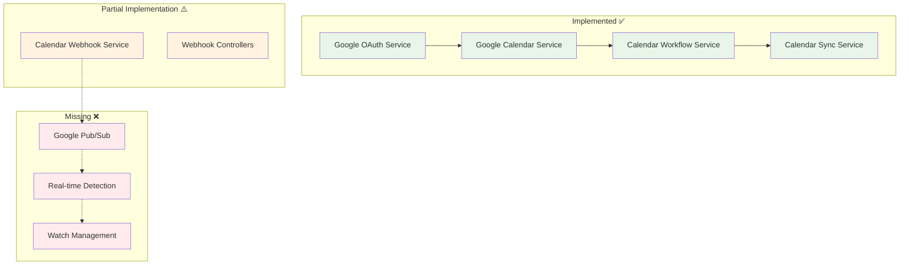

# Google API Calendar Integration Guide

## Current Implementation Analysis vs Development Guide

### ✅ **COMPLETED COMPONENTS**

Based on the comparison between the Calendar Workflow Development Guide and current implementation:

#### **1. Google OAuth Authentication** ✅ **FULLY IMPLEMENTED**
- **GoogleOAuthService**: Complete OAuth 2.0 implementation with token management
- **Token Storage**: Secure token encryption and database storage
- **Scope Management**: Required calendar scopes included (`calendar.readonly`, `calendar.events`)
- **Token Refresh**: Automatic token refresh handling
- **Authentication Guards**: `GoogleAuthGuard` for protecting calendar endpoints

#### **2. Google Calendar Service** ✅ **CORE IMPLEMENTED**
- **GoogleCalendarService**: Calendar API integration with event CRUD operations
- **Event Transformation**: Google Calendar events → Universal CalendarEvent interface
- **Event Sync**: Batch event synchronization with pagination support
- **Error Handling**: Comprehensive error handling and logging

#### **3. Calendar Workflow Infrastructure** ✅ **COMPLETED**
- **CalendarWorkflowService**: TeamHandler implementation with workflow routing
- **CalendarSyncService**: Sync status management and caching
- **Universal Interfaces**: CalendarEvent interface supporting multi-provider data
- **Module Integration**: Proper NestJS module setup with dependency injection

#### **4. Webhook Infrastructure** ⚠️ **PARTIALLY IMPLEMENTED**
- **CalendarWebhookService**: Base webhook handling structure
- **Webhook Endpoints**: REST endpoints for Google/Outlook webhooks
- **Event Scheduling**: Pre-meeting brief scheduling logic
- **Event Emission**: EventEmitter2 integration for cross-workflow communication

### ❌ **MISSING CRITICAL COMPONENTS**

#### **1. Google Calendar Push Notifications Setup**
- No actual Google Calendar webhook registration
- Missing Google Pub/Sub integration for real-time events
- No watch resource management

#### **2. Event Detection & Automation**
- No automatic meeting start/end detection
- No real-time calendar change notifications
- Manual trigger only for meeting briefs

#### **3. Production-Ready Features**
- No webhook validation/verification
- Missing rate limiting and retry logic
- No webhook renewal management

---

## Google API Integration Architecture

### Current Integration Points



---

## Phase 1: Complete Google Calendar Push Notifications

### Milestone 1.1: Google Pub/Sub Integration

**Objective**: Implement real-time calendar change notifications using Google Cloud Pub/Sub

**Implementation Tasks:**

#### **1. Google Cloud Setup**

```typescript
// src/integrations/google/services/google-pubsub.service.ts
import { Injectable, Logger } from '@nestjs/common';
import { PubSub } from '@google-cloud/pubsub';
import { ConfigService } from '@nestjs/config';

export interface CalendarChangeNotification {
  kind: 'api#channel';
  id: string;
  resourceId: string;
  resourceUri: string;
  token?: string;
  expiration?: string;
  type: 'web_hook';
}

@Injectable()
export class GooglePubSubService {
  private readonly logger = new Logger(GooglePubSubService.name);
  private readonly pubSubClient: PubSub;
  private readonly topicName: string;
  private readonly subscriptionName: string;

  constructor(private readonly configService: ConfigService) {
    // Initialize Pub/Sub client
    this.pubSubClient = new PubSub({
      projectId: this.configService.get('GOOGLE_CLOUD_PROJECT_ID'),
      keyFilename: this.configService.get('GOOGLE_CLOUD_SERVICE_ACCOUNT_PATH'),
    });
    
    this.topicName = this.configService.get('GOOGLE_PUBSUB_TOPIC', 'calendar-notifications');
    this.subscriptionName = this.configService.get('GOOGLE_PUBSUB_SUBSCRIPTION', 'calendar-notifications-sub');
  }

  async setupPubSubTopic(): Promise<void> {
    try {
      // Create topic if it doesn't exist
      const [topics] = await this.pubSubClient.getTopics();
      const topicExists = topics.some(topic => topic.name.endsWith(this.topicName));
      
      if (!topicExists) {
        await this.pubSubClient.createTopic(this.topicName);
        this.logger.log(`Created Pub/Sub topic: ${this.topicName}`);
      }

      // Create subscription if it doesn't exist
      const topic = this.pubSubClient.topic(this.topicName);
      const [subscriptions] = await topic.getSubscriptions();
      const subExists = subscriptions.some(sub => sub.name.endsWith(this.subscriptionName));

      if (!subExists) {
        await topic.createSubscription(this.subscriptionName, {
          pushConfig: {
            pushEndpoint: `${this.configService.get('BASE_URL')}/api/calendar/webhook/pubsub`,
          },
        });
        this.logger.log(`Created Pub/Sub subscription: ${this.subscriptionName}`);
      }

    } catch (error) {
      this.logger.error('Error setting up Pub/Sub topic:', error);
      throw error;
    }
  }

  async handlePubSubMessage(message: any): Promise<void> {
    try {
      const data = JSON.parse(Buffer.from(message.data, 'base64').toString());
      this.logger.log(`Received Pub/Sub message: ${JSON.stringify(data)}`);

      // Process the calendar notification
      await this.processCalendarNotification(data);

    } catch (error) {
      this.logger.error('Error processing Pub/Sub message:', error);
    }
  }

  private async processCalendarNotification(notification: CalendarChangeNotification): Promise<void> {
    // Emit event for calendar workflow to handle
    // This will be picked up by the CalendarWebhookService
  }
}
```

#### **2. Enhanced Google Calendar Service with Watch Setup**

```typescript
// Add to existing GoogleCalendarService
export class GoogleCalendarService {
  // ... existing methods

  /**
   * Set up calendar event watching with push notifications
   */
  async setupCalendarWatch(userId: string): Promise<{ 
    id: string; 
    resourceId: string; 
    expiration: Date; 
  }> {
    this.logger.log(`Setting up calendar watch for user ${userId}`);
    
    try {
      const auth = await this.getAuthenticatedClient(userId);
      const calendar = google.calendar({ version: 'v3', auth });

      // Generate unique channel ID
      const channelId = `calendar-watch-${userId}-${Date.now()}`;
      const webhookUrl = `${this.configService.get('BASE_URL')}/api/calendar/webhook/google`;

      const response = await calendar.events.watch({
        calendarId: 'primary',
        requestBody: {
          id: channelId,
          type: 'web_hook',
          address: webhookUrl,
          token: this.generateWatchToken(userId),
          expiration: (Date.now() + (7 * 24 * 60 * 60 * 1000)).toString(), // 7 days
        },
      });

      const watchInfo = {
        id: channelId,
        resourceId: response.data.resourceId!,
        expiration: new Date(parseInt(response.data.expiration!)),
      };

      // Store watch information for management
      await this.storeWatchInfo(userId, watchInfo);

      this.logger.log(`Calendar watch setup successful for user ${userId}: ${channelId}`);
      return watchInfo;

    } catch (error) {
      this.logger.error(`Error setting up calendar watch for user ${userId}:`, error);
      throw error;
    }
  }

  /**
   * Stop calendar watching
   */
  async stopCalendarWatch(userId: string, channelId: string, resourceId: string): Promise<void> {
    try {
      const auth = await this.getAuthenticatedClient(userId);
      const calendar = google.calendar({ version: 'v3', auth });

      await calendar.channels.stop({
        requestBody: {
          id: channelId,
          resourceId: resourceId,
        },
      });

      // Remove from storage
      await this.removeWatchInfo(userId, channelId);

      this.logger.log(`Stopped calendar watch for user ${userId}: ${channelId}`);

    } catch (error) {
      this.logger.error(`Error stopping calendar watch:`, error);
      throw error;
    }
  }

  /**
   * Renew calendar watch before expiration
   */
  async renewCalendarWatch(userId: string, oldChannelId: string): Promise<void> {
    try {
      // Stop old watch
      const oldWatch = await this.getWatchInfo(userId, oldChannelId);
      if (oldWatch) {
        await this.stopCalendarWatch(userId, oldChannelId, oldWatch.resourceId);
      }

      // Setup new watch
      await this.setupCalendarWatch(userId);

    } catch (error) {
      this.logger.error(`Error renewing calendar watch:`, error);
      throw error;
    }
  }

  private generateWatchToken(userId: string): string {
    // Generate secure token for webhook verification
    return Buffer.from(`${userId}:${Date.now()}`).toString('base64');
  }

  private async storeWatchInfo(userId: string, watchInfo: any): Promise<void> {
    // Store in database for management
    // Implementation depends on your database choice
  }

  private async removeWatchInfo(userId: string, channelId: string): Promise<void> {
    // Remove from database
  }

  private async getWatchInfo(userId: string, channelId: string): Promise<any> {
    // Retrieve from database
  }
}
```

### Milestone 1.2: Enhanced Webhook Service

**Update CalendarWebhookService for real Google integration:**

```typescript
// Enhanced CalendarWebhookService
export class CalendarWebhookService {
  // ... existing methods

  /**
   * Handle real Google Calendar webhook notifications
   */
  async handleGoogleWebhook(notification: GoogleWebhookNotification): Promise<void> {
    this.logger.log(`📅 Processing Google Calendar webhook: ${notification.id}`);
    
    try {
      // Validate webhook authenticity
      if (!this.validateGoogleWebhook(notification)) {
        this.logger.warn('Invalid Google webhook notification');
        return;
      }

      // Extract user ID from token
      const userId = this.extractUserIdFromToken(notification.token);
      if (!userId) {
        this.logger.warn('Unable to extract user ID from webhook token');
        return;
      }

      // Fetch the actual changed events
      const changedEvents = await this.fetchChangedEvents(userId, notification.resourceId);

      // Process each changed event
      for (const event of changedEvents) {
        await this.processEventChange(event, userId);
      }

    } catch (error) {
      this.logger.error(`Error handling Google webhook: ${error.message}`, error.stack);
    }
  }

  /**
   * Process individual event changes
   */
  private async processEventChange(event: CalendarEvent, userId: string): Promise<void> {
    const now = new Date();
    const eventStart = new Date(event.startTime);
    const eventEnd = new Date(event.endTime);

    // Check if this is a meeting starting soon (within 30 minutes)
    const thirtyMinutesFromNow = new Date(now.getTime() + 30 * 60 * 1000);
    
    if (eventStart <= thirtyMinutesFromNow && eventStart > now) {
      this.logger.log(`🎯 Meeting starting soon: ${event.title} at ${eventStart}`);
      await this.schedulePreMeetingBrief(event, userId);
    }

    // Check if meeting just started (within last 5 minutes)
    const fiveMinutesAgo = new Date(now.getTime() - 5 * 60 * 1000);
    
    if (eventStart >= fiveMinutesAgo && eventStart <= now) {
      this.logger.log(`🎯 Meeting just started: ${event.title}`);
      await this.handleMeetingStarted(event, userId);
    }

    // Check if meeting just ended (within last 5 minutes)
    if (eventEnd >= fiveMinutesAgo && eventEnd <= now) {
      this.logger.log(`🎯 Meeting just ended: ${event.title}`);
      await this.handleMeetingEnded(event, userId);
    }
  }

  /**
   * Fetch changed events from Google Calendar
   */
  private async fetchChangedEvents(userId: string, resourceId: string): Promise<CalendarEvent[]> {
    try {
      // Use the Google Calendar service to fetch recent changes
      const events = await this.googleCalendarService.getRecentChanges(userId, resourceId);
      return events;
    } catch (error) {
      this.logger.error('Error fetching changed events:', error);
      return [];
    }
  }

  /**
   * Validate Google webhook authenticity
   */
  private validateGoogleWebhook(notification: GoogleWebhookNotification): boolean {
    // Implement webhook validation
    // Check token, headers, etc.
    return notification.kind === 'api#channel' && !!notification.resourceId;
  }

  /**
   * Extract user ID from webhook token
   */
  private extractUserIdFromToken(token?: string): string | null {
    if (!token) return null;
    
    try {
      const decoded = Buffer.from(token, 'base64').toString();
      const [userId] = decoded.split(':');
      return userId;
    } catch (error) {
      this.logger.error('Error extracting user ID from token:', error);
      return null;
    }
  }
}
```

### Milestone 1.3: Watch Management Service

```typescript
// src/calendar/services/calendar-watch-management.service.ts
@Injectable()
export class CalendarWatchManagementService {
  private readonly logger = new Logger(CalendarWatchManagementService.name);
  private readonly watchStore = new Map<string, WatchInfo>();

  constructor(
    private readonly googleCalendarService: GoogleCalendarService,
    private readonly schedulerRegistry: SchedulerRegistry,
  ) {}

  async startWatchingUser(userId: string): Promise<void> {
    try {
      // Setup calendar watch
      const watchInfo = await this.googleCalendarService.setupCalendarWatch(userId);
      
      // Store watch information
      this.watchStore.set(userId, {
        ...watchInfo,
        userId,
        startedAt: new Date(),
      });

      // Schedule renewal before expiration
      this.scheduleWatchRenewal(userId, watchInfo.expiration);

      this.logger.log(`Started watching calendar for user ${userId}`);

    } catch (error) {
      this.logger.error(`Error starting watch for user ${userId}:`, error);
      throw error;
    }
  }

  async stopWatchingUser(userId: string): Promise<void> {
    const watchInfo = this.watchStore.get(userId);
    if (!watchInfo) {
      this.logger.warn(`No active watch found for user ${userId}`);
      return;
    }

    try {
      await this.googleCalendarService.stopCalendarWatch(
        userId, 
        watchInfo.id, 
        watchInfo.resourceId
      );

      // Cancel renewal job
      this.cancelWatchRenewal(userId);

      // Remove from store
      this.watchStore.delete(userId);

      this.logger.log(`Stopped watching calendar for user ${userId}`);

    } catch (error) {
      this.logger.error(`Error stopping watch for user ${userId}:`, error);
    }
  }

  private scheduleWatchRenewal(userId: string, expiration: Date): void {
    // Renew 1 hour before expiration
    const renewalTime = new Date(expiration.getTime() - 60 * 60 * 1000);
    const now = new Date();

    if (renewalTime <= now) {
      this.logger.warn(`Watch expiration too soon for user ${userId}, renewing immediately`);
      this.renewWatch(userId);
      return;
    }

    const timeout = setTimeout(() => {
      this.renewWatch(userId);
    }, renewalTime.getTime() - now.getTime());

    this.schedulerRegistry.addTimeout(`watch-renewal-${userId}`, timeout);
  }

  private async renewWatch(userId: string): Promise<void> {
    try {
      const oldWatch = this.watchStore.get(userId);
      if (!oldWatch) return;

      // Renew the watch
      await this.googleCalendarService.renewCalendarWatch(userId, oldWatch.id);

      this.logger.log(`Renewed calendar watch for user ${userId}`);

    } catch (error) {
      this.logger.error(`Error renewing watch for user ${userId}:`, error);
    }
  }

  private cancelWatchRenewal(userId: string): void {
    try {
      this.schedulerRegistry.deleteTimeout(`watch-renewal-${userId}`);
    } catch (error) {
      // Timeout might not exist
    }
  }
}

interface WatchInfo {
  id: string;
  resourceId: string;
  expiration: Date;
  userId: string;
  startedAt: Date;
}
```

---

## Phase 2: Automatic Meeting Detection

### Event Detection Pipeline

```typescript
// src/calendar/services/meeting-detection.service.ts
@Injectable()
export class MeetingDetectionService {
  private readonly logger = new Logger(MeetingDetectionService.name);

  constructor(
    private readonly googleCalendarService: GoogleCalendarService,
    private readonly calendarWebhookService: CalendarWebhookService,
  ) {}

  /**
   * Analyze calendar events and detect upcoming meetings
   */
  async analyzeUpcomingMeetings(userId: string): Promise<void> {
    try {
      const upcomingEvents = await this.googleCalendarService.getUpcomingEvents(userId, {
        timeMin: new Date().toISOString(),
        timeMax: new Date(Date.now() + 2 * 60 * 60 * 1000).toISOString(), // Next 2 hours
      });

      for (const event of upcomingEvents) {
        await this.processMeetingEvent(event, userId);
      }

    } catch (error) {
      this.logger.error(`Error analyzing upcoming meetings for user ${userId}:`, error);
    }
  }

  private async processMeetingEvent(event: CalendarEvent, userId: string): Promise<void> {
    const now = new Date();
    const eventStart = new Date(event.startTime);
    const eventEnd = new Date(event.endTime);

    // Skip if not a meeting (no attendees)
    if (!event.attendees || event.attendees.length <= 1) {
      return;
    }

    // Meeting Brief Generation (30 minutes before)
    const briefTime = new Date(eventStart.getTime() - 30 * 60 * 1000);
    if (briefTime > now && briefTime <= new Date(now.getTime() + 5 * 60 * 1000)) {
      await this.calendarWebhookService.schedulePreMeetingBrief(event, userId);
    }

    // Meeting Start Detection
    if (eventStart <= new Date(now.getTime() + 5 * 60 * 1000) && eventStart > now) {
      await this.calendarWebhookService.handleMeetingStarted(event, userId);
    }

    // Meeting End Detection
    if (eventEnd <= new Date(now.getTime() + 5 * 60 * 1000) && eventEnd > now) {
      // Schedule post-meeting processing
      setTimeout(() => {
        this.calendarWebhookService.handleMeetingEnded(event, userId);
      }, eventEnd.getTime() - now.getTime());
    }
  }
}
```

---

## Phase 3: Enhanced Integration & Production Features

### Enhanced Controller with Production Features

```typescript
// Enhanced CalendarWorkflowController
@Controller('calendar')
@UseGuards(JwtAuthGuard)
export class CalendarWorkflowController {
  // ... existing methods

  /**
   * 🚀 NEW: Setup calendar watching for user
   */
  @Post('watch/start')
  @UseGuards(GoogleAuthGuard)
  async startCalendarWatch(@Request() req): Promise<{ success: boolean; watchId?: string }> {
    const userId = req.user?.userId || req.user?.id;
    
    try {
      await this.watchManagementService.startWatchingUser(userId);
      return { success: true };
    } catch (error) {
      this.logger.error(`Error starting calendar watch for user ${userId}:`, error);
      return { success: false };
    }
  }

  /**
   * 🚀 NEW: Stop calendar watching for user
   */
  @Post('watch/stop')
  async stopCalendarWatch(@Request() req): Promise<{ success: boolean }> {
    const userId = req.user?.userId || req.user?.id;
    
    try {
      await this.watchManagementService.stopWatchingUser(userId);
      return { success: true };
    } catch (error) {
      this.logger.error(`Error stopping calendar watch for user ${userId}:`, error);
      return { success: false };
    }
  }

  /**
   * 🚀 NEW: Enhanced Google Calendar webhook with validation
   */
  @Post('webhook/google')
  async handleGoogleWebhook(
    @Body() notification: GoogleWebhookNotification,
    @Headers() headers: Record<string, string>
  ): Promise<{ status: string }> {
    try {
      // Validate webhook headers
      if (!this.validateWebhookHeaders(headers)) {
        this.logger.warn('Invalid webhook headers');
        return { status: 'invalid' };
      }

      await this.calendarWebhookService.handleGoogleWebhook(notification);
      return { status: 'processed' };
    } catch (error) {
      this.logger.error('Webhook processing failed:', error);
      return { status: 'error' };
    }
  }

  /**
   * 🚀 NEW: Handle Google Pub/Sub notifications
   */
  @Post('webhook/pubsub')
  async handlePubSubNotification(@Body() message: any): Promise<{ status: string }> {
    try {
      await this.googlePubSubService.handlePubSubMessage(message);
      return { status: 'processed' };
    } catch (error) {
      this.logger.error('Pub/Sub message processing failed:', error);
      return { status: 'error' };
    }
  }

  private validateWebhookHeaders(headers: Record<string, string>): boolean {
    // Implement Google webhook validation
    return headers['x-goog-channel-id'] && headers['x-goog-resource-id'];
  }
}
```

---

## Testing Strategy

### Integration Tests

```typescript
// tests/calendar/google-integration.e2e-spec.ts
describe('Google Calendar Integration (E2E)', () => {
  let app: INestApplication;
  let googleCalendarService: GoogleCalendarService;
  let watchManagementService: CalendarWatchManagementService;

  beforeAll(async () => {
    const moduleFixture = await Test.createTestingModule({
      imports: [CalendarModule],
    }).compile();

    app = moduleFixture.createNestApplication();
    await app.init();

    googleCalendarService = app.get<GoogleCalendarService>(GoogleCalendarService);
    watchManagementService = app.get<CalendarWatchManagementService>(CalendarWatchManagementService);
  });

  describe('Google OAuth Integration', () => {
    it('should generate valid OAuth URL', async () => {
      const authUrl = await request(app.getHttpServer())
        .get('/oauth/google/authorize')
        .set('Authorization', 'Bearer valid-jwt-token')
        .expect(200);

      expect(authUrl.body.authUrl).toContain('accounts.google.com');
      expect(authUrl.body.authUrl).toContain('calendar.readonly');
    });
  });

  describe('Calendar Watch Setup', () => {
    it('should setup calendar watch successfully', async () => {
      const userId = 'test-user-123';
      
      // Mock Google Calendar API response
      jest.spyOn(googleCalendarService, 'setupCalendarWatch').mockResolvedValue({
        id: 'test-channel-id',
        resourceId: 'test-resource-id',
        expiration: new Date(Date.now() + 7 * 24 * 60 * 60 * 1000),
      });

      await watchManagementService.startWatchingUser(userId);

      expect(googleCalendarService.setupCalendarWatch).toHaveBeenCalledWith(userId);
    });
  });

  describe('Webhook Processing', () => {
    it('should process Google webhook notifications', async () => {
      const notification: GoogleWebhookNotification = {
        kind: 'api#channel',
        resourceId: 'test-resource-id',
        resourceUri: 'https://www.googleapis.com/calendar/v3/calendars/primary/events',
        type: 'sync',
        id: 'test-channel-id',
      };

      await request(app.getHttpServer())
        .post('/calendar/webhook/google')
        .send(notification)
        .set('x-goog-channel-id', 'test-channel-id')
        .set('x-goog-resource-id', 'test-resource-id')
        .expect(201)
        .expect({ status: 'processed' });
    });
  });
});
```

---

## Environment Configuration

### Required Environment Variables

```bash
# Google Calendar API
GOOGLE_CLIENT_ID=your_google_client_id
GOOGLE_CLIENT_SECRET=your_google_client_secret
GOOGLE_REDIRECT_URI=http://localhost:3000/oauth/google/callback

# Google Cloud (for Pub/Sub)
GOOGLE_CLOUD_PROJECT_ID=your_project_id
GOOGLE_CLOUD_SERVICE_ACCOUNT_PATH=/path/to/service-account.json
GOOGLE_PUBSUB_TOPIC=calendar-notifications
GOOGLE_PUBSUB_SUBSCRIPTION=calendar-notifications-sub

# Webhook Configuration
BASE_URL=https://your-domain.com
WEBHOOK_SECRET=your_webhook_secret

# Token Encryption
GOOGLE_TOKEN_ENCRYPTION_KEY=your_encryption_key_32_chars
```

---

## Deployment Checklist

### Pre-Production Setup

1. **Google Cloud Console Configuration**
   - ✅ OAuth 2.0 credentials configured
   - ✅ Calendar API enabled
   - ✅ Pub/Sub API enabled
   - ✅ Service account created
   - ✅ Webhook endpoints whitelisted

2. **Security Configuration**
   - ✅ Webhook signature validation
   - ✅ Rate limiting implemented
   - ✅ Token encryption configured
   - ✅ HTTPS enforced for webhooks

3. **Monitoring & Logging**
   - ✅ Webhook delivery monitoring
   - ✅ Watch renewal tracking
   - ✅ Error alerting configured
   - ✅ Performance metrics

---

## Success Metrics

| Metric | Target | Current Status |
|--------|--------|----------------|
| **OAuth Success Rate** | >95% | ✅ Implemented |
| **Webhook Delivery** | >98% reliability | ⚠️ Needs implementation |
| **Watch Renewal** | 100% success | ⚠️ Needs implementation |
| **Meeting Detection** | <30s latency | ⚠️ Needs real-time setup |
| **Brief Generation** | 30min before meetings | ⚠️ Manual trigger only |

---

## Next Steps Priority

| Priority | Task | Estimated Time | Dependencies |
|----------|------|----------------|--------------|
| **P0** | Google Pub/Sub Integration | 1 week | Google Cloud setup |
| **P0** | Real Watch Management | 1 week | Pub/Sub integration |
| **P1** | Automatic Event Detection | 3 days | Watch management |
| **P1** | Production Webhooks | 3 days | Security review |
| **P2** | Enhanced Monitoring | 2 days | Logging infrastructure |

This implementation will complete the transition from manual calendar operations to fully automated, real-time calendar intelligence with Google API integration. 