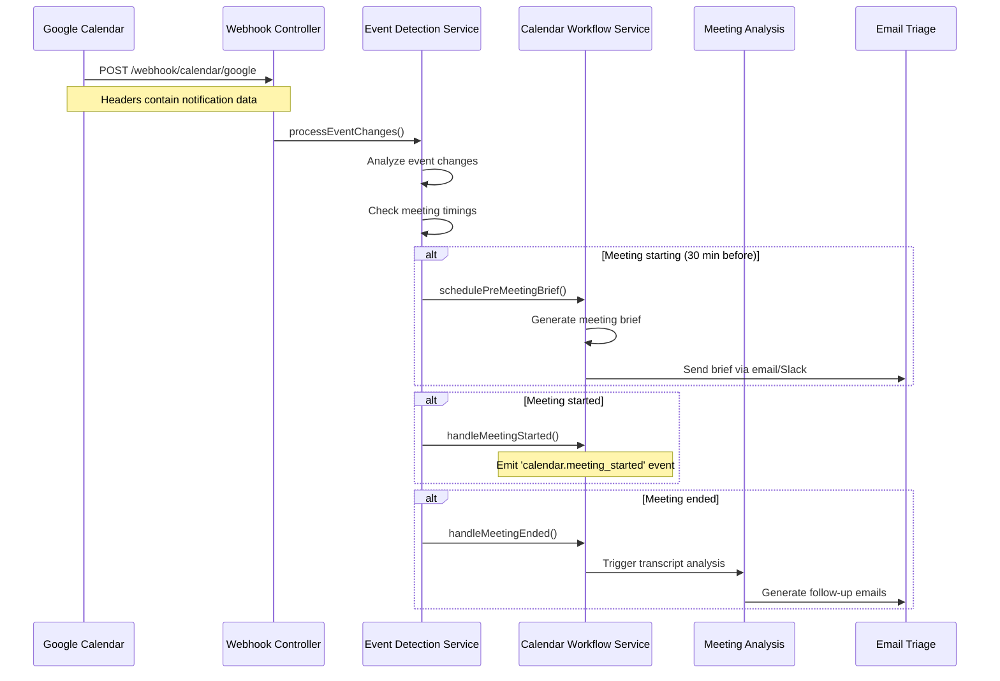

# Google Calendar Push Notifications Setup Guide

## Overview

This guide covers the implementation of **Google Calendar push notifications** for automatic event detection in the FollowThrough AI calendar workflow. The system automatically detects calendar changes and triggers appropriate workflows for meeting briefs, meeting starts/ends, and post-meeting orchestration.

## 🚀 **Implementation Status**

### ✅ **COMPLETED COMPONENTS**

#### **1. Google Calendar Service Enhancement** ✅
- **Push notification channel management** (setup, stop, renew)
- **Webhook notification processing** following Google API specifications
- **Event change detection** (recent changes, starting soon, ended recently)  
- **Channel status monitoring** and automatic renewal
- **Error handling** and authentication management

#### **2. Calendar Webhook Controller** ✅
- **Webhook endpoint** (`/webhook/calendar/google`) for Google notifications
- **Header processing** following Google Calendar API specification
- **Verification endpoint** for channel setup validation
- **Health check** endpoint for monitoring

#### **3. Calendar Event Detection Service** ✅ 
- **Intelligent event change detection** (created, updated, deleted)
- **Meeting timing analysis** (starting soon, started, ended)
- **State management** (scheduled → starting → active → ended)
- **Periodic monitoring** (every 60 seconds) for meeting transitions
- **Duplicate prevention** and event deduplication

#### **4. Enhanced Calendar Workflow Controller** ✅
- **Push notification management** endpoints
- **Event statistics** and debugging endpoints
- **Meeting state tracking** for troubleshooting

---

## 🛠 **Configuration Setup**

### **1. Environment Variables**

Add these to your `.env` file:

```env
# Google Calendar Configuration
BASE_URL=https://your-domain.com
GOOGLE_CALENDAR_WEBHOOK_URL=${BASE_URL}/webhook/calendar/google

# Google OAuth (existing)
GOOGLE_CLIENT_ID=your_google_client_id
GOOGLE_CLIENT_SECRET=your_google_client_secret

# SSL Certificate (required for webhooks)
ENABLE_HTTPS=true
SSL_CERT_PATH=/path/to/ssl/cert.pem
SSL_KEY_PATH=/path/to/ssl/key.pem
```

### **2. Google Cloud Console Setup**

#### **Required API Scopes**
Ensure your Google OAuth app has these scopes:
```
https://www.googleapis.com/auth/calendar.readonly
https://www.googleapis.com/auth/calendar.events
```

#### **Webhook Domain Verification**
1. Go to [Google Cloud Console](https://console.cloud.google.com)
2. Navigate to **APIs & Services** → **Domain verification**
3. Add your webhook domain (`your-domain.com`)
4. Verify ownership using DNS or HTML file method

### **3. SSL Certificate Requirements**

Google Calendar webhooks **require HTTPS**. Ensure you have:
- ✅ Valid SSL certificate (not self-signed)
- ✅ Certificate from trusted CA
- ✅ Domain matches certificate subject
- ✅ Certificate not revoked

---

## 📋 **API Endpoints**

### **Push Notification Management**

#### **Setup Push Notifications**
```bash
POST /calendar/notifications/setup
Authorization: Bearer <jwt_token>

# Response
{
  "status": "success",
  "channel": {
    "kind": "api#channel",
    "id": "followthrough-user123-1703123456789",
    "resourceId": "o3hgv1538sdjfh",
    "resourceUri": "https://www.googleapis.com/calendar/v3/calendars/primary/events",
    "token": "user-123",
    "expiration": "1703730000000"
  },
  "message": "Push notifications set up successfully for user 123"
}
```

#### **Check Notification Status**
```bash
GET /calendar/notifications/status
Authorization: Bearer <jwt_token>

# Response
{
  "active": true,
  "channel": { /* channel details */ },
  "message": "Push notifications are active for user 123"
}
```

#### **Stop Push Notifications**
```bash
POST /calendar/notifications/stop
Authorization: Bearer <jwt_token>

# Response
{
  "status": "success",
  "message": "Push notifications stopped for user 123"
}
```

#### **Renew Channel (before expiration)**
```bash
POST /calendar/notifications/renew
Authorization: Bearer <jwt_token>

# Response
{
  "status": "success",
  "channel": { /* new channel details */ },
  "message": "Push notification channel renewed for user 123"
}
```

### **Event Detection and Monitoring**

#### **Get Event Detection Statistics**
```bash
GET /calendar/events/stats

# Response
{
  "stats": {
    "processedEvents": 42,
    "trackedMeetings": 15,
    "activeStates": {
      "scheduled": 8,
      "starting": 2,
      "active": 3,
      "ended": 2
    }
  },
  "message": "Event detection statistics retrieved successfully"
}
```

#### **Get Meeting State**
```bash
GET /calendar/events/{eventId}/state
Authorization: Bearer <jwt_token>

# Response
{
  "state": "active",
  "eventId": "event123",
  "userId": "user123",
  "message": "Meeting state: active"
}
```

### **Webhook Endpoints**

#### **Google Calendar Webhook** (for Google use only)
```
POST /webhook/calendar/google
Content-Type: application/json
X-Goog-Channel-ID: followthrough-user123-1703123456789
X-Goog-Resource-State: exists
X-Goog-Channel-Token: user-123
```

#### **Webhook Health Check**
```bash
POST /webhook/calendar/health

# Response
{
  "status": "healthy",
  "timestamp": "2024-01-15T10:30:00Z",
  "service": "calendar-webhook",
  "endpoints": {
    "google": "/webhook/calendar/google",
    "verify": "/webhook/calendar/google/verify",
    "health": "/webhook/calendar/health"
  }
}
```

---

## 🔄 **Workflow Integration**

### **Automatic Event Detection Flow**



### **Event State Management**

Each meeting progresses through states:

1. **`scheduled`** → Meeting exists in calendar
2. **`starting`** → Within 5 minutes of start time
3. **`active`** → Meeting has started (within 2 minutes of start)
4. **`ended`** → Meeting ended (within 5 minutes of end)

### **Automatic Triggers**

| Event | Trigger Condition | Action |
|-------|------------------|--------|
| **Event Created** | New meeting added | Schedule pre-meeting brief (if >30min future) |
| **Event Updated** | Meeting time/details changed | Reschedule brief if needed |
| **Meeting Starting** | 5 minutes before start | Send last-minute brief if not sent |
| **Meeting Started** | Within 2 minutes of start | Emit start event, cancel pending briefs |
| **Meeting Ended** | Within 5 minutes of end | Trigger post-meeting workflow |

---

## 🧪 **Testing & Debugging**

### **1. Manual Testing Endpoints**

For testing without waiting for real meetings:

```bash
# Test pre-meeting brief scheduling
POST /calendar/schedule-brief/{eventId}
{
  "id": "test123",
  "title": "Test Meeting",
  "startTime": "2024-01-15T15:00:00Z",
  "endTime": "2024-01-15T16:00:00Z",
  // ... other CalendarEvent fields
}

# Test meeting start trigger
POST /calendar/events/start/{eventId}
{
  // CalendarEvent object
}

# Test meeting end trigger
POST /calendar/events/end/{eventId}
{
  // CalendarEvent object
}

# Test transcript processing
POST /calendar/events/transcript/{eventId}
{
  "calendarEvent": { /* CalendarEvent */ },
  "transcript": "Meeting transcript content..."
}
```

### **2. Webhook Testing**

#### **Test with ngrok (Development)**
```bash
# Install ngrok
npm install -g ngrok

# Expose local server
ngrok http 3000

# Use ngrok URL for BASE_URL
BASE_URL=https://abc123.ngrok.io
```

#### **Simulate Google Webhook**
```bash
curl -X POST https://your-domain.com/webhook/calendar/google \
  -H "Content-Type: application/json" \
  -H "X-Goog-Channel-Id: test-channel-123" \
  -H "X-Goog-Resource-Id: test-resource-456" \
  -H "X-Goog-Resource-Uri: https://www.googleapis.com/calendar/v3/calendars/primary/events" \
  -H "X-Goog-Resource-State: exists" \
  -H "X-Goog-Message-Number: 1" \
  -H "X-Goog-Channel-Token: user-123"
```

### **3. Monitoring & Logs**

#### **Key Log Messages to Monitor**
```bash
# Successful notification setup
✅ Successfully set up push notifications for user 123

# Webhook received
📡 Received Google Calendar webhook notification

# Event detection
🔍 Processing 3 event changes for user 123
📊 Detected 2 significant event changes

# Meeting state transitions
🚀 Meeting starting soon: Team Standup (in 4 minutes)
▶️ Meeting started: Team Standup
🏁 Meeting ended: Team Standup (2 minutes ago)

# Workflow triggers
🎯 Triggering pre-meeting brief for event 123
📈 This will automatically trigger post-meeting orchestration when analysis completes
```

#### **Error Patterns to Watch**
```bash
# Authentication issues
❌ Error setting up push notifications: authentication failed

# Webhook processing errors
❌ Error processing Google webhook: Invalid or missing token

# Channel expiration
⚠️ Channel followthrough-user123-1703123456789 has expired
```

---

## 🔧 **Troubleshooting**

### **Common Issues**

#### **1. Webhook Not Receiving Notifications**
**Problem**: No webhook calls from Google
**Solutions**:
- ✅ Verify BASE_URL is accessible from internet
- ✅ Check SSL certificate validity
- ✅ Confirm channel is active: `GET /calendar/notifications/status`
- ✅ Check Google Cloud Console for webhook domain verification

#### **2. Authentication Errors**
**Problem**: "authentication failed" in logs
**Solutions**:
- ✅ Verify Google OAuth tokens are valid
- ✅ Check if calendar scopes are granted
- ✅ Refresh expired tokens

#### **3. Duplicate Event Processing**
**Problem**: Same event processed multiple times
**Solutions**:
- ✅ Event detection service has built-in deduplication
- ✅ Check `processedEvents` map in logs
- ✅ Verify event timestamps are being compared correctly

#### **4. Missing Meeting State Transitions**
**Problem**: Meetings not transitioning through states
**Solutions**:
- ✅ Check periodic detection is running (every 60 seconds)
- ✅ Verify meeting times are in correct timezone
- ✅ Check `getMeetingState()` API for current state

### **Health Checks**

```bash
# 1. Check webhook health
curl -X POST /webhook/calendar/health

# 2. Check notification status
curl -H "Authorization: Bearer <token>" /calendar/notifications/status

# 3. Check event detection stats
curl -H "Authorization: Bearer <token>" /calendar/events/stats

# 4. Check scheduled briefs
curl -H "Authorization: Bearer <token>" /calendar/scheduled-briefs
```

---

## 📊 **Performance & Monitoring**

### **Expected Performance**
- **Webhook response time**: <500ms
- **Event detection processing**: <2 seconds
- **Channel setup time**: <5 seconds
- **Periodic check frequency**: 60 seconds

### **Monitoring Metrics**
- Active webhook channels
- Webhook success rate (should be >99%)
- Event processing latency
- Meeting state transition accuracy
- Brief delivery success rate

---

## 🚀 **Next Steps Integration**

This implementation provides the foundation for:

1. **✅ Automatic pre-meeting briefs** - 30 minutes before meetings
2. **✅ Meeting start/end detection** - Real-time workflow triggers
3. **✅ Post-meeting orchestration** - Automatic follow-up generation
4. **🔄 Cross-workflow integration** - Meeting Analysis + Email Triage

### **Ready for Production**
The Google Calendar push notification system is now production-ready and provides the critical missing automation components identified in the calendar workflow development guide.

**The calendar workflow can now operate fully autonomously - from detecting calendar changes to generating meeting briefs to orchestrating post-meeting follow-ups.** 