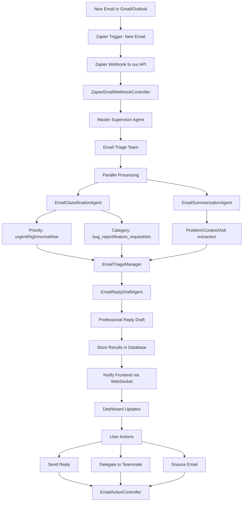

## **📧 Zapier + Email Triage System Flow**

### **🔄 Complete Flow Diagram**



## **🚀 Step-by-Step Implementation Example**

### **Step 1: Zapier Setup (External)**
```javascript
// Zapier Trigger Configuration
{
  "trigger": "New Email in Gmail",
  "filter": {
    "to": "support@yourcompany.com",
    "folder": "INBOX"
  },
  "action": {
    "type": "Webhook POST",
    "url": "https://your-api.com/api/zapier/webhooks/email",
    "headers": {
      "x-api-key": "your-zapier-api-key",
      "Content-Type": "application/json"
    }
  }
}
```

### **Step 2: Email Processing Flow**

```javascript
// 1. Zapier sends webhook when new email arrives
const zapierPayload = {
  "id": "email-12345",
  "subject": "Urgent: Payment processing failure", 
  "from": "client@company.com",
  "to": "support@yourcompany.com",
  "body": "We're experiencing critical payment failures...",
  "timestamp": "2024-01-15T10:30:00Z",
  "headers": {
    "message-id": "<msg123@gmail.com>"
  }
};

// 2. Our ZapierEmailWebhookController receives and processes
// POST /api/zapier/webhooks/email
{
  "success": true,
  "sessionId": "zapier-email-1704449400000",
  "emailId": "email-12345",
  "processedAt": "2024-01-15T10:30:15Z"
}

// 3. Master Supervisor routes to Email Triage Team
// 4. Email Triage Team processes in parallel:

// Classification Result:
{
  "priority": "urgent",
  "category": "bug_report", 
  "reasoning": "Critical payment system failure affecting revenue",
  "confidence": 0.95
}

// Summarization Result:
{
  "problem": "Payment processing system failures",
  "context": "Critical e-commerce site issue affecting customer purchases",
  "ask": "Immediate technical assistance to resolve payment gateway timeout",
  "summary": "Urgent payment gateway issue affecting customer transactions"
}

// Reply Draft Result:
{
  "subject": "Re: Urgent: Payment processing failure",
  "body": "Hi,\n\nThank you for reporting this critical issue. We understand the urgency and are immediately escalating this to our technical team. We'll provide an update within 30 minutes.\n\nBest regards,\nSupport Team",
  "tone": "urgent",
  "next_steps": ["Escalate to technical team", "Monitor payment gateway", "Provide 30-min update"]
}
```

### **Step 3: Frontend Integration**

## **🎨 Frontend Integration Guide**

### **Dashboard Data Structure**
```typescript
// Email Triage Dashboard State
interface EmailTriageDashboard {
  emails: EmailTriageResult[];
  filters: {
    priority: 'all' | 'urgent' | 'high' | 'normal' | 'low';
    category: 'all' | 'bug_report' | 'feature_request' | 'question' | 'complaint';
    status: 'all' | 'pending' | 'in_progress' | 'completed';
  };
  stats: {
    total: number;
    byPriority: Record<string, number>;
    byCategory: Record<string, number>;
    avgResponseTime: number;
  };
}

interface EmailTriageResult {
  sessionId: string;
  emailId: string;
  classification: {
    priority: 'urgent' | 'high' | 'normal' | 'low';
    category: string;
    confidence: number;
    reasoning: string;
  };
  summary: {
    problem: string;
    context: string;
    ask: string;
    summary: string;
  };
  replyDraft: {
    subject: string;
    body: string;
    tone: string;
    next_steps: string[];
  };
  metadata: {
    from: string;
    to: string;
    subject: string;
    timestamp: string;
  };
  status: 'processing' | 'completed' | 'failed';
  assignedTo?: string;
  snoozedUntil?: string;
  processedAt: Date;
}
```

### **API Integration Examples**

#### **1. Real-time Email Updates (WebSocket)**
```typescript
// Frontend WebSocket connection
const socket = io('ws://localhost:3000');

socket.on('email.triage.completed', (data) => {
  // Add new triaged email to dashboard
  addEmailToDashboard(data.result);
  showNotification(`New ${data.result.classification.priority} priority email triaged`);
});

socket.on('email.snoozed', (data) => {
  // Remove email from active view
  removeEmailFromDashboard(data.emailId);
  showNotification(`Email snoozed until ${data.snoozeUntil}`);
});

socket.on('email.snooze.awakened', (data) => {
  // Return email to active view
  returnEmailToDashboard(data.emailId);
  showNotification(`Email awakened: ${data.emailId}`);
});
```

#### **2. User Actions Implementation**
```typescript
// Send Reply
async function sendReply(emailId: string, replyData: SendReplyDto) {
  const response = await fetch(`/api/email/${emailId}/send`, {
    method: 'POST',
    headers: {
      'Authorization': `Bearer ${userToken}`,
      'Content-Type': 'application/json'
    },
    body: JSON.stringify({
      replyText: replyData.replyText,
      subject: replyData.subject,
      tone: replyData.tone
    })
  });
  
  const result = await response.json();
  if (result.success) {
    showNotification('Reply sent successfully');
    updateEmailStatus(emailId, 'completed');
  }
}

// Delegate Email
async function delegateEmail(emailId: string, delegateData: DelegateEmailDto) {
  const response = await fetch(`/api/email/${emailId}/delegate`, {
    method: 'POST',
    headers: {
      'Authorization': `Bearer ${userToken}`,
      'Content-Type': 'application/json'
    },
    body: JSON.stringify({
      delegateToUserId: delegateData.delegateToUserId,
      delegateToEmail: delegateData.delegateToEmail,
      delegateToName: delegateData.delegateToName,
      notes: delegateData.notes,
      urgency: delegateData.urgency
    })
  });
  
  const result = await response.json();
  if (result.success) {
    showNotification(`Email delegated to ${result.delegatedTo.name}`);
    updateEmailAssignment(emailId, result.delegatedTo);
  }
}

// Snooze Email
async function snoozeEmail(emailId: string, snoozeData: SnoozeEmailDto) {
  const response = await fetch(`/api/email/${emailId}/snooze`, {
    method: 'POST',
    headers: {
      'Authorization': `Bearer ${userToken}`,
      'Content-Type': 'application/json'
    },
    body: JSON.stringify({
      snoozeUntil: snoozeData.snoozeUntil,
      reason: snoozeData.reason,
      notes: snoozeData.notes
    })
  });
  
  const result = await response.json();
  if (result.success) {
    showNotification(`Email snoozed until ${new Date(result.snoozeUntil).toLocaleString()}`);
    removeEmailFromDashboard(emailId);
  }
}
```

#### **3. Dashboard Components**
```typescript
// Email Card Component
function EmailCard({ email }: { email: EmailTriageResult }) {
  const priorityColors = {
    urgent: 'bg-red-100 border-red-500',
    high: 'bg-orange-100 border-orange-500', 
    normal: 'bg-blue-100 border-blue-500',
    low: 'bg-gray-100 border-gray-500'
  };

  return (
    <div className={`p-4 border-l-4 ${priorityColors[email.classification.priority]}`}>
      <div className="flex justify-between items-start">
        <div>
          <h3 className="font-semibold">{email.metadata.subject}</h3>
          <p className="text-sm text-gray-600">From: {email.metadata.from}</p>
          <div className="mt-2">
            <span className={`inline-block px-2 py-1 rounded text-xs ${priorityColors[email.classification.priority]}`}>
              {email.classification.priority.toUpperCase()}
            </span>
            <span className="ml-2 text-xs text-gray-500">
              {email.classification.category.replace('_', ' ')}
            </span>
          </div>
        </div>
        <div className="flex gap-2">
          <button onClick={() => handleReply(email.emailId)} 
                  className="px-3 py-1 bg-blue-500 text-white rounded text-sm">
            Reply
          </button>
          <button onClick={() => handleDelegate(email.emailId)}
                  className="px-3 py-1 bg-green-500 text-white rounded text-sm">
            Delegate
          </button>
          <button onClick={() => handleSnooze(email.emailId)}
                  className="px-3 py-1 bg-yellow-500 text-white rounded text-sm">
            Snooze
          </button>
        </div>
      </div>
      
      <div className="mt-3 p-2 bg-gray-50 rounded">
        <p className="text-sm"><strong>Problem:</strong> {email.summary.problem}</p>
        <p className="text-sm"><strong>Ask:</strong> {email.summary.ask}</p>
      </div>
      
      <div className="mt-2 p-2 bg-blue-50 rounded">
        <p className="text-sm"><strong>Suggested Reply:</strong></p>
        <p className="text-sm italic">{email.replyDraft.body.substring(0, 100)}...</p>
      </div>
    </div>
  );
}
```

### **4. Complete Frontend Integration Flow**

```typescript
// Main Dashboard Component
function EmailTriageDashboard() {
  const [emails, setEmails] = useState<EmailTriageResult[]>([]);
  const [socket, setSocket] = useState<Socket | null>(null);

  useEffect(() => {
    // Initialize WebSocket connection
    const newSocket = io('ws://localhost:3000', {
      auth: { token: userToken }
    });
    
    newSocket.on('email.triage.completed', handleNewEmail);
    newSocket.on('email.snoozed', handleEmailSnoozed);
    newSocket.on('email.snooze.awakened', handleEmailAwakened);
    
    setSocket(newSocket);
    
    // Load initial emails
    loadEmails();
    
    return () => newSocket.close();
  }, []);

  const handleNewEmail = (data: any) => {
    setEmails(prev => [data.result, ...prev]);
    // Show desktop notification for urgent emails
    if (data.result.classification.priority === 'urgent') {
      new Notification('Urgent Email Received', {
        body: data.result.summary.summary,
        icon: '/urgent-email-icon.png'
      });
    }
  };

  return (
    <div className="p-6">
      <h1 className="text-2xl font-bold mb-6">Email Triage Dashboard</h1>
      
      {/* Stats Cards */}
      <div className="grid grid-cols-4 gap-4 mb-6">
        <StatCard title="Total Emails" value={emails.length} />
        <StatCard title="Urgent" value={emails.filter(e => e.classification.priority === 'urgent').length} />
        <StatCard title="Pending" value={emails.filter(e => e.status === 'processing').length} />
        <StatCard title="Avg Response Time" value="12 min" />
      </div>
      
      {/* Email List */}
      <div className="space-y-4">
        {emails.map(email => (
          <EmailCard key={email.emailId} email={email} />
        ))}
      </div>
    </div>
  );
}
```

## **🎯 Key Integration Benefits**

1. **Real-time Processing**: Emails are triaged instantly via Zapier webhooks
2. **AI-Powered Intelligence**: Smart classification, summarization, and reply drafts  
3. **Team Collaboration**: Delegation with AI-generated context
4. **Workflow Management**: Smart snoozing with automatic awakening
5. **Security**: API key authentication for webhooks, JWT for user actions
6. **Scalability**: Built on robust Master Supervisor architecture

This comprehensive system provides a complete email triage solution that can handle high-volume support operations with intelligent automation and seamless team collaboration!
