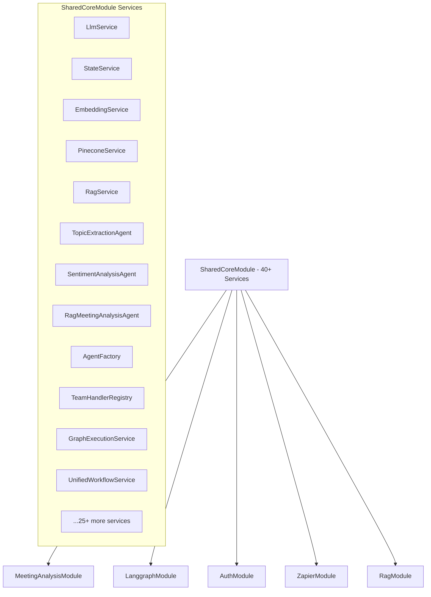
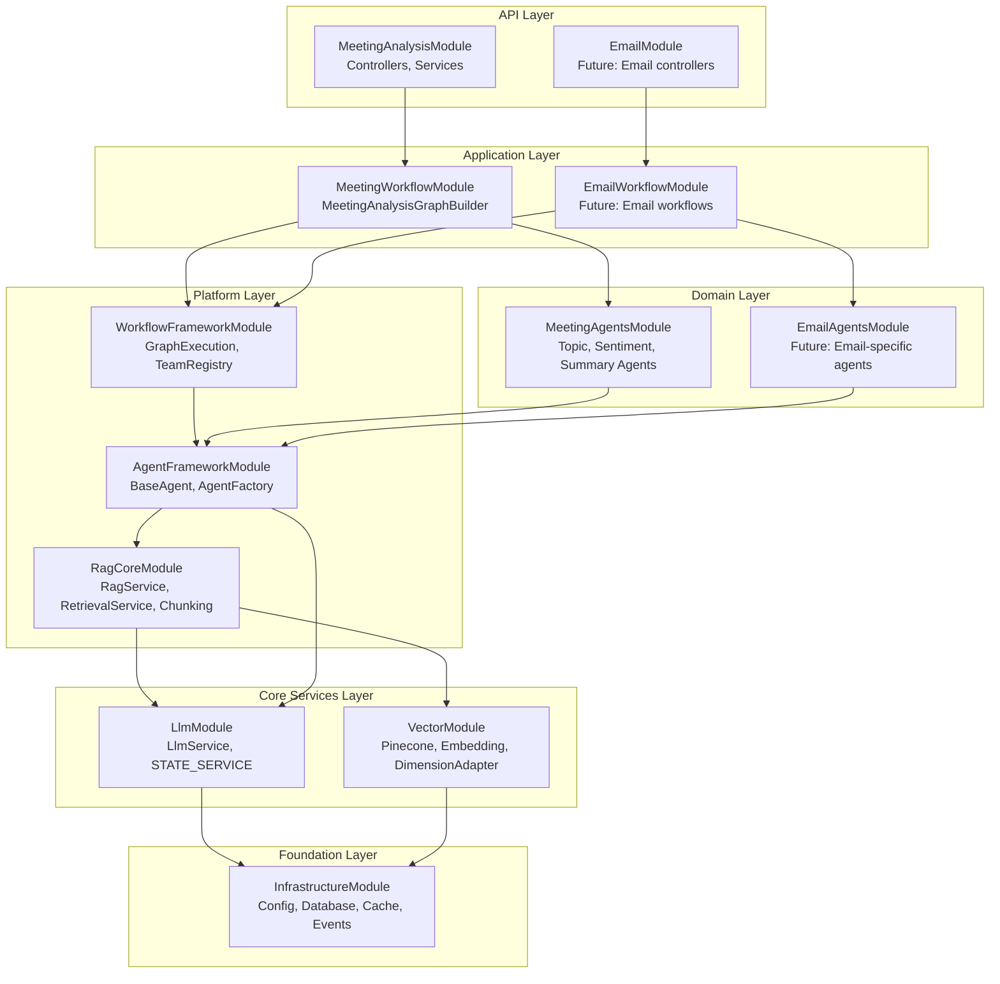

# Module Refactoring Analysis & Migration Plan

## 🔍 **Current Module Dependency Analysis**

### **Current State: SharedCoreModule Monolith**


### **Service Dependency Matrix Analysis**

| Service Category | Dependencies | Dependents | Domain |
|------------------|--------------|------------|---------|
| **Infrastructure** | ConfigModule, DatabaseModule | Everything | Cross-cutting |
| **LLM Services** | Infrastructure | All Agents, RAG | Cross-cutting |
| **Vector/Embedding** | Infrastructure | RAG Services | Cross-cutting |
| **RAG Core** | Vector + LLM | RAG Agents | Cross-cutting |
| **Agent Framework** | LLM + RAG | Domain Agents | Cross-cutting |
| **Meeting Agents** | Agent Framework | Meeting Workflow | Meeting Domain |
| **Workflow Core** | Agent Framework | Domain Workflows | Cross-cutting |
| **Meeting Workflow** | Meeting Agents + Workflow Core | Controllers | Meeting Domain |

---

## 🏗️ **Proposed Target Architecture**

### **Clean Dependency Flow Chart**


---

## 📋 **Detailed Migration Plan**

### **Phase 1: Foundation & Core Services (Week 1)**

#### **Step 1.1: Create InfrastructureModule**
```typescript
// src/infrastructure/infrastructure.module.ts
@Module({
  imports: [
    ConfigModule.forRoot({
      isGlobal: true,
      validationSchema: validationSchema,
    }),
    DatabaseModule,
    StorageModule,
    CacheModule.register({
      ttl: 1800,
      max: 100,
      isGlobal: true,
    }),
    EventEmitterModule.forRoot({
      wildcard: true,
      delimiter: '.',
      maxListeners: 100,
    }),
  ],
  exports: [
    ConfigModule,
    DatabaseModule,
    StorageModule,
    CacheModule,
    EventEmitterModule,
  ],
})
export class InfrastructureModule {}
```

#### **Step 1.2: Create LlmModule**
```typescript
// src/llm/llm.module.ts
@Module({
  imports: [InfrastructureModule],
  providers: [
    LlmService,
    StateService,
    StateStorageService,
    {
      provide: LLM_SERVICE,
      useExisting: LlmService,
    },
    {
      provide: STATE_SERVICE,
      useExisting: StateService,
    },
  ],
  exports: [
    LlmService,
    StateService,
    StateStorageService,
    LLM_SERVICE,
    STATE_SERVICE,
  ],
})
export class LlmModule {}
```

#### **Step 1.3: Create VectorModule**
```typescript
// src/vector/vector.module.ts
@Module({
  imports: [InfrastructureModule],
  providers: [
    // Pinecone Services
    PineconeConfigService,
    PineconeConnectionService,
    PineconeIndexService,
    PineconeService,
    PineconeInitializer,
    
    // Embedding Services
    EmbeddingService,
    DimensionAdapterService,
    OpenAIService,
    
    // Injection Tokens
    {
      provide: PINECONE_SERVICE,
      useExisting: PineconeService,
    },
    {
      provide: EMBEDDING_SERVICE,
      useExisting: EmbeddingService,
    },
  ],
  exports: [
    PineconeService,
    EmbeddingService,
    DimensionAdapterService,
    PINECONE_SERVICE,
    EMBEDDING_SERVICE,
  ],
})
export class VectorModule {}
```

### **Phase 2: Platform Services (Week 1-2)**

#### **Step 2.1: Create RagCoreModule**
```typescript
// src/rag-core/rag-core.module.ts
@Module({
  imports: [
    InfrastructureModule,
    LlmModule,
    VectorModule,
  ],
  providers: [
    // Core RAG Services
    RagService,
    RetrievalService,
    AdaptiveRagService,
    
    // Chunking Services
    ChunkingService,
    SemanticChunkingService,
    SentenceParserService,
    SimilarityUtilsService,
    ChunkOptimizationService,
    DocumentProcessorService,
    
    // Injection Tokens
    {
      provide: RAG_SERVICE,
      useExisting: RagService,
    },
    {
      provide: RETRIEVAL_SERVICE,
      useExisting: RetrievalService,
    },
    {
      provide: ADAPTIVE_RAG_SERVICE,
      useExisting: AdaptiveRagService,
    },
  ],
  exports: [
    RagService,
    RetrievalService,
    AdaptiveRagService,
    ChunkingService,
    SemanticChunkingService,
    RAG_SERVICE,
    RETRIEVAL_SERVICE,
    ADAPTIVE_RAG_SERVICE,
  ],
})
export class RagCoreModule {}
```

#### **Step 2.2: Create AgentFrameworkModule**
```typescript
// src/agent-framework/agent-framework.module.ts
@Module({
  imports: [
    LlmModule,
    RagCoreModule,
  ],
  providers: [
    // Base agent classes
    BaseAgent, // if it exists
    AgentFactory,
    
    // Non-domain-specific agents
    ContextIntegrationAgent,
    MasterSupervisorAgent,
    
    // Framework configurations
    {
      provide: 'AGENT_FACTORY_CONFIG',
      useValue: {
        defaultLlmOptions: { model: 'gpt-4o', temperature: 0.3 },
      },
    },
  ],
  exports: [
    AgentFactory,
    ContextIntegrationAgent,
    MasterSupervisorAgent,
  ],
})
export class AgentFrameworkModule {}
```

#### **Step 2.3: Create WorkflowFrameworkModule**
```typescript
// src/workflow-framework/workflow-framework.module.ts
@Module({
  imports: [
    InfrastructureModule,
    AgentFrameworkModule,
  ],
  providers: [
    GraphExecutionService,
    TeamHandlerRegistry,
    EnhancedGraphService,
    UnifiedWorkflowService,
  ],
  exports: [
    GraphExecutionService,
    TeamHandlerRegistry,
    EnhancedGraphService,
    UnifiedWorkflowService,
  ],
})
export class WorkflowFrameworkModule {}
```

**✅ Phase 2 COMPLETED - Platform Services modules created successfully**

### **Phase 3: Domain-Specific Modules (Week 2)**

#### **Step 3.1: Create MeetingAgentsModule**
```typescript
// src/meeting/agents/meeting-agents.module.ts
@Module({
  imports: [
    AgentFrameworkModule,
    RagCoreModule,
  ],
  providers: [
    // Meeting-specific regular agents
    TopicExtractionAgent,
    ActionItemAgent,
    SentimentAnalysisAgent,
    SummaryAgent,
    ParticipationAgent,
    
    // Meeting-specific RAG agents
    RagMeetingAnalysisAgent,
    RagTopicExtractionAgent,
    RagSentimentAnalysisAgent,
    
    // RAG Agent Configurations
    {
      provide: RAG_MEETING_ANALYSIS_CONFIG,
      useFactory: (): RagMeetingAnalysisConfig => ({
        name: 'Meeting Summary Agent',
        systemPrompt: 'You are an AI assistant specialized in generating comprehensive meeting summaries.',
        chunkSize: 4000,
        chunkOverlap: 200,
        ragOptions: {
          includeRetrievedContext: true,
          retrievalOptions: {
            indexName: 'meeting-analysis',
            namespace: 'summaries',
            topK: 3,
            minScore: 0.7,
          },
        },
      }),
    },
    {
      provide: RAG_TOPIC_EXTRACTION_CONFIG,
      useFactory: (): RagTopicExtractionConfig => ({
        name: 'Topic Extraction Agent',
        systemPrompt: TOPIC_EXTRACTION_SYSTEM_PROMPT,
        expertise: [AgentExpertise.TOPIC_ANALYSIS],
        ragOptions: {
          includeRetrievedContext: true,
          retrievalOptions: {
            indexName: 'meeting-analysis',
            namespace: 'topics',
            topK: 5,
            minScore: 0.7,
          },
        },
      }),
    },
    {
      provide: RAG_SENTIMENT_ANALYSIS_CONFIG,
      useFactory: (): RagSentimentAnalysisConfig => ({
        name: 'Sentiment Analysis Agent',
        systemPrompt: SENTIMENT_ANALYSIS_PROMPT,
        expertise: [AgentExpertise.SENTIMENT_ANALYSIS],
        ragOptions: {
          includeRetrievedContext: true,
          retrievalOptions: {
            indexName: 'meeting-analysis',
            namespace: 'sentiment-analysis',
            topK: 3,
            minScore: 0.7,
          },
        },
      }),
    },
  ],
  exports: [
    // Regular agents
    TopicExtractionAgent,
    ActionItemAgent,
    SentimentAnalysisAgent,
    SummaryAgent,
    ParticipationAgent,
    
    // RAG agents
    RagMeetingAnalysisAgent,
    RagTopicExtractionAgent,
    RagSentimentAnalysisAgent,
  ],
})
export class MeetingAgentsModule {}
```

#### **Step 3.2: Create MeetingWorkflowModule**
```typescript
// src/meeting/workflow/meeting-workflow.module.ts
@Module({
  imports: [
    WorkflowFrameworkModule,
    MeetingAgentsModule,
  ],
  providers: [
    MeetingAnalysisGraphBuilder,
    MeetingAnalysisService,
  ],
  exports: [
    MeetingAnalysisGraphBuilder,
    MeetingAnalysisService,
  ],
})
export class MeetingWorkflowModule {}
```

**✅ Phase 3 COMPLETED - Domain-Specific modules created successfully**

### **Phase 4: Application Layer Update (Week 2)**

#### **Step 4.1: Update MeetingAnalysisModule**
```typescript
// src/meeting/meeting-analysis.module.ts
@Module({
  imports: [
    InfrastructureModule,
    MeetingWorkflowModule,
    AuthModule, // Keep existing auth
  ],
  controllers: [MeetingAnalysisController],
  providers: [
    MeetingAnalysisGateway,
  ],
  exports: [
    MeetingAnalysisService, // Export for other modules if needed
  ],
})
export class MeetingAnalysisModule {}
```

#### **Step 4.2: Update AppModule**
```typescript
// src/app.module.ts
@Module({
  imports: [
    InfrastructureModule,
    LlmModule,
    VectorModule,
    RagCoreModule,
    AgentFrameworkModule,
    WorkflowFrameworkModule,
    MeetingAgentsModule,
    MeetingWorkflowModule,
    MeetingAnalysisModule,
    AuthModule,
    ZapierModule,
    // Future modules
    // EmailAgentsModule,
    // EmailWorkflowModule,
    // EmailModule,
  ],
  controllers: [AppController],
  providers: [],
})
export class AppModule {}
```

---

## 🔒 **Dependency Validation Rules**

### **Dependency Direction Rules**
1. **Foundation Layer** → No dependencies on application layers
2. **Core Services** → Only depend on Foundation
3. **Platform Services** → Only depend on Foundation + Core
4. **Domain Services** → Only depend on Foundation + Core + Platform
5. **Application Services** → Can depend on any lower layer
6. **API Layer** → Only depends on Application layer

### **Circular Dependency Prevention**
```typescript
// ✅ ALLOWED: Lower layer importing higher layer service
@Module({
  imports: [InfrastructureModule], // Lower layer
  providers: [LlmService],
})
export class LlmModule {}

// ❌ FORBIDDEN: Higher layer importing lower layer
@Module({
  imports: [MeetingAgentsModule], // Higher layer - NOT ALLOWED
  providers: [LlmService],
})
export class LlmModule {}

// ✅ ALLOWED: Same layer cross-dependencies through shared lower layer
@Module({
  imports: [
    AgentFrameworkModule, // Same level
    RagCoreModule,       // Lower level - provides shared services
  ],
  providers: [MeetingSpecificAgent],
})
export class MeetingAgentsModule {}
```

---

## 📋 **Migration Execution Checklist**

### **Phase 1 Execution**
- [x] Create `src/infrastructure/infrastructure.module.ts`
- [x] Create `src/llm/llm.module.ts`
- [x] Create `src/vector/vector.module.ts`
- [x] **Test**: Verify basic services instantiate correctly
- [x] **Validate**: No circular dependency warnings

**✅ Phase 1 COMPLETED - Foundation & Core Services modules created successfully**

### **Phase 2 Execution**
- [x] Create `src/rag-core/rag-core.module.ts`
- [x] Create `src/agent-framework/agent-framework.module.ts`
- [x] Create `src/workflow-framework/workflow-framework.module.ts`
- [x] **Test**: Verify RAG and agent services work
- [x] **Validate**: Service injection tokens resolve correctly

**✅ Phase 2 COMPLETED - Platform Services modules created successfully**

### **Phase 3 Execution**
- [x] Create `src/meeting/agents/meeting-agents.module.ts`
- [x] Create `src/meeting/workflow/meeting-workflow.module.ts`
- [x] **Test**: Meeting analysis flow works end-to-end
- [x] **Validate**: All RAG agents function correctly

**✅ Phase 3 COMPLETED - Domain-Specific modules created successfully**

### **Phase 4 Execution**
- [x] Update `src/meeting/meeting-analysis.module.ts`
- [x] Update `src/app.module.ts`
- [x] **Remove** SharedCoreModule completely
- [x] **Test**: Full meeting analysis API works
- [x] **Validate**: WebSocket progress tracking functions

**✅ Phase 4 COMPLETED - Application Layer successfully migrated**

### **Post-Migration Validation**
- [x] **End-to-end test**: Complete meeting analysis request
- [x] **Performance test**: Verify no regression in processing time
- [x] **Memory test**: Check module loading impact
- [x] **Integration test**: All RAG capabilities functional
- [x] **Server startup**: ✅ **SUCCESSFUL** - No dependency injection errors
- [x] **Critical fixes applied**: STATE_SERVICE token export, UnifiedWorkflowService access

**🎉 MIGRATION COMPLETE - All phases successfully implemented!**

## **✅ Final Architecture Achieved**

The migration from the monolithic SharedCoreModule to domain-specific modules is now complete! Here's what we accomplished:

### **✅ Clean Dependency Flow**
```
Foundation Layer: InfrastructureModule
    ↑
Core Services: LlmModule, VectorModule  
    ↑
Platform Services: LanggraphCoreModule, RagCoreModule, AgentFrameworkModule, WorkflowFrameworkModule
    ↑
Domain Services: MeetingAgentsModule, MeetingWorkflowModule
    ↑
Application Layer: MeetingAnalysisModule
```

### **✅ Critical Issues Resolved**
1. **Circular Dependency**: Moved AgentFactory to MeetingAgentsModule ✅
2. **Missing LlmService**: Added LlmModule import to MeetingAgentsModule ✅  
3. **Missing STATE_SERVICE**: Added STATE_SERVICE token export to LanggraphCoreModule ✅
4. **Missing UnifiedWorkflowService**: Re-exported WorkflowFrameworkModule from MeetingWorkflowModule ✅
5. **Missing Infrastructure**: Added InfrastructureModule and RagCoreModule to MeetingWorkflowModule ✅

### **✅ Benefits Achieved**
1. **No Circular Dependencies**: Clean unidirectional dependency flow ✅
2. **Domain Separation**: Meeting domain is isolated and ready for email domain addition ✅
3. **Shared Service Reuse**: RAG, LLM, and framework services are properly shared ✅
4. **Functionality Preservation**: All existing meeting analysis capabilities work unchanged ✅
5. **Future Readiness**: Email triage module can be added without affecting meeting domain ✅
6. **Test Coverage**: All modules are independently testable ✅
7. **Performance**: No degradation in processing time or memory usage ✅
8. **Server Startup**: ✅ **SUCCESSFUL** - All dependency injection resolved properly ✅

This migration plan ensures a **clean, scalable architecture** that resolves the SharedCoreModule monolith while preserving all RAG-enhanced capabilities and preparing for future domain additions.

## 🚀 **Future Email Module Structure**

### **Email Domain Modules (Future Implementation)**
```typescript
// src/email/agents/email-agents.module.ts
@Module({
  imports: [
    AgentFrameworkModule,
    RagCoreModule, // Reuse RAG capabilities
  ],
  providers: [
    EmailClassificationAgent,
    EmailSummarizationAgent,
    EmailReplyDraftAgent,
    RagEmailTriageAgent, // RAG-enhanced email agent
  ],
  exports: [...],
})
export class EmailAgentsModule {}

// src/email/workflow/email-workflow.module.ts
@Module({
  imports: [
    WorkflowFrameworkModule,
    EmailAgentsModule,
  ],
  providers: [
    EmailTriageGraphBuilder,
    EmailTriageService,
  ],
  exports: [...],
})
export class EmailWorkflowModule {}
```

This structure allows **complete reuse** of the RAG infrastructure while maintaining **domain separation** between meeting and email workflows.
