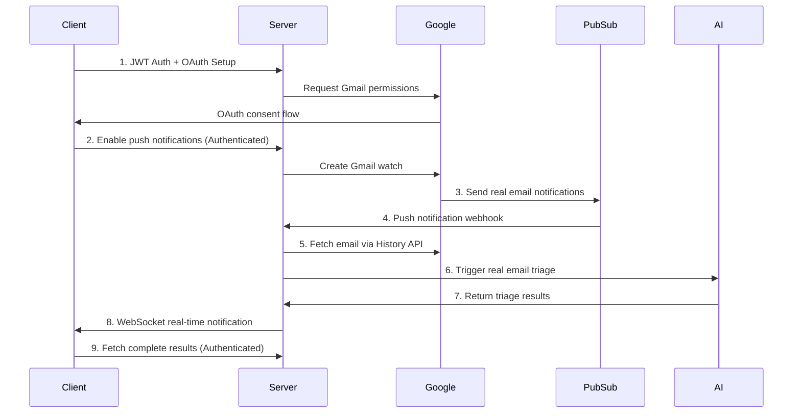

# Client Integration Guide - Production Gmail Push Notifications & Email Triage

Complete guide for integrating client applications with the **production-ready** Gmail Push Notification and Email Triage system.

## 🎯 **Overview**

This **production system** provides:
1. **Real Gmail Push Notifications** - Live notifications when users receive emails via Google Cloud Pub/Sub
2. **AI Email Triage** - Automatic classification, summarization, and reply draft generation using real Gmail data
3. **Real-time Client Notifications** - WebSocket-based live updates for triage results
4. **Secure REST API** - JWT-authenticated endpoints for complete Gmail management
5. **Production Monitoring** - Health checks, error handling, and system diagnostics

## 📋 **Production Integration Flow**



## 📊 **API Types & DTOs Reference**

### **Request DTOs (Client → Server)**

#### **Authentication DTOs**
```typescript
interface LoginRequest {
  email: string;
  password: string;
}

interface AuthenticatedRequest {
  headers: {
    Authorization: string; // "Bearer JWT_TOKEN"
    'Content-Type': 'application/json';
  }
}
```

#### **Gmail Setup DTOs**
```typescript
interface SetupGmailNotificationsDto {
  labelIds?: string[];                    // Optional: ['INBOX', 'IMPORTANT'] 
  labelFilterBehavior?: 'INCLUDE' | 'EXCLUDE'; // Default: 'INCLUDE'
}

// Example request body
const setupRequest: SetupGmailNotificationsDto = {
  labelIds: ['INBOX'],
  labelFilterBehavior: 'INCLUDE'
};
```

#### **Email Triage Test DTO**
```typescript
interface TestEmailTriageDto {
  subject: string;   // Email subject line
  from: string;     // Sender email address
  body: string;     // Email content for AI processing
  to?: string;      // Optional: recipient email (defaults to user's email)
}

// Example request body
const testEmail: TestEmailTriageDto = {
  subject: 'Urgent: Login Issues After Update',
  from: 'customer@example.com',
  body: 'Hi, I need help with my account after the recent update...',
  to: 'support@company.com'
};
```

#### **Notification Subscription DTO**
```typescript
interface NotificationSubscriptionDto {
  webhookUrl?: string;  // Optional: Your webhook endpoint
  email?: string;       // Optional: Email for notifications
}

// Example request body
const subscription: NotificationSubscriptionDto = {
  webhookUrl: 'https://your-app.com/api/triage-webhook',
  email: 'notifications@your-app.com'
};
```

#### **WebSocket Subscription DTO**
```typescript
interface WebSocketSubscribeDto {
  userId: string;          // User ID from JWT token
  emailAddress?: string;   // Optional: specific Gmail address
}

// Example WebSocket emit
socket.emit('subscribe', {
  userId: 'user_123',
  emailAddress: 'user@gmail.com'
});
```

### **Response DTOs (Server → Client)**

#### **Authentication Responses**
```typescript
interface LoginResponse {
  success: boolean;
  token?: string;        // JWT token for authenticated requests
  user?: {
    id: string;
    email: string;
    name?: string;
  };
  error?: string;
}

interface AuthStatusResponse {
  success: boolean;
  oauth: {
    isConnected: boolean;
    userInfo?: {
      googleEmail: string;
      googleUserId: string;
      name?: string;
    };
  };
  notifications: {
    isEnabled: boolean;
    watchInfo?: WatchInfo;
  };
  system: SystemHealthResponse;
  nextSteps: string[];
}
```

#### **Gmail Watch Management Responses**
```typescript
interface WatchInfo {
  watchId: string;              // Gmail watch ID
  historyId: string;           // Last processed history ID
  expiresAt: string;           // ISO date string
  isActive: boolean;           // Watch status
  googleEmail: string;         // Watched Gmail address
  notificationsReceived: number; // Total notifications count
  emailsProcessed: number;     // Total emails processed
  errorCount: number;          // Error count
  lastError?: string;          // Last error message
}

interface SetupNotificationsResponse {
  success: boolean;
  message: string;
  watchInfo?: WatchInfo;
  nextSteps?: string[];
  error?: string;
}

interface DisableNotificationsResponse {
  success: boolean;
  message: string;
  nextSteps?: string[];
}
```

#### **Email Triage Responses**
```typescript
interface EmailTriageResponse {
  success: boolean;
  message: string;
  sessionId?: string;
  result?: {
    status: 'pending' | 'processing' | 'completed' | 'failed';
    sessionId: string;
    isProcessing: boolean;
  };
  testEmail?: {
    id: string;
    body: string;
    metadata: EmailMetadata;
  };
  note?: string;
  error?: string;
}

interface EmailMetadata {
  subject: string;
  from: string;
  to: string;
  date: string;              // ISO date string
  messageId: string;
  gmailSource: boolean;      // true for real Gmail, false for test
  userId: string;
  headers?: Record<string, string>;
  labels?: string[];
}

interface TriageResultResponse {
  success: boolean;
  sessionId: string;
  status: 'pending' | 'processing' | 'completed' | 'failed';
  result?: EmailTriageResult;
  processedAt?: string;      // ISO date string
  error?: string;
  message?: string;
}

interface EmailTriageResult {
  classification: {
    priority: 'urgent' | 'high' | 'normal' | 'low';
    category: 'bug_report' | 'feature_request' | 'support' | 'billing' | 'other';
    reasoning: string;
    confidence: number;      // 0.0 to 1.0
    urgency?: 'immediate' | 'same_day' | 'within_week' | 'when_possible';
  };
  summary: {
    problem: string;         // What the customer is experiencing
    context: string;         // Background information
    ask: string;            // What the customer wants
    summary: string;        // Overall summary
  };
  replyDraft: {
    subject: string;        // Suggested reply subject
    body: string;          // Suggested reply content
    tone: 'professional' | 'friendly' | 'formal' | 'empathetic';
    next_steps: string[];  // Recommended actions
  };
}
```

#### **System Health & Monitoring Responses**
```typescript
interface SystemHealthResponse {
  success: boolean;
  status: 'healthy' | 'unhealthy';
  pubsub: boolean;                    // Pub/Sub connection status
  subscriptions: {
    name: string;
    isHealthy: boolean;
    messageCount?: number;
  }[];
  watches: {
    totalActive: number;
    expiringSoon: number;
    withErrors: number;
    totalNotifications: number;
    totalEmailsProcessed: number;
  };
  timestamp: string;                  // ISO date string
}

interface StatisticsResponse {
  success: boolean;
  watches: {
    totalActive: number;
    expiringSoon: number;
    withErrors: number;
    totalNotifications: number;
    totalEmailsProcessed: number;
  };
  pubsub: {
    name: string;
    isHealthy: boolean;
    messageCount?: number;
  }[];
  timestamp: string;
}

interface PullMessagesResponse {
  success: boolean;
  processed: number;
  notifications?: Array<{
    emailAddress: string;
    historyId: string;
  }>;
  message: string;
}
```

#### **Subscription Management Responses**
```typescript
interface SubscriptionResponse {
  success: boolean;
  message: string;
  subscription?: {
    userId: string;
    webhookUrl?: string;
    email?: string;
    subscribedAt: string;    // ISO date string
    types: string[];         // ['email_triage_completed', 'email_triage_failed']
  };
  note?: string;
}

interface SubscriptionsListResponse {
  success: boolean;
  subscriptions: Array<{
    id: string;
    type: 'webhook' | 'email';
    url?: string;            // For webhook subscriptions
    email?: string;          // For email subscriptions
    events: string[];
    active: boolean;
  }>;
  message?: string;
}
```

### **WebSocket Event Types**

#### **Client → Server Events**
```typescript
// Subscribe to notifications
interface SubscribeEvent {
  userId: string;
  emailAddress?: string;
}

// Unsubscribe from notifications
interface UnsubscribeEvent {
  userId: string;
  emailAddress?: string;
}

// Request connection status
interface StatusRequestEvent {
  // No payload required
}

// Send test notification
interface TestEvent {
  // No payload required
}
```

#### **Server → Client Events**
```typescript
// Connection confirmed
interface ConnectedEvent {
  message: string;
  clientId: string;
  timestamp: string;        // ISO date string
}

// Subscription confirmed
interface SubscribedEvent {
  message: string;
  userId: string;
  emailAddress?: string;
  rooms: string[];          // Subscribed room names
  timestamp: string;
}

// Email triage started
interface TriageStartedEvent {
  type: 'triage.started';
  sessionId: string;
  emailId: string;
  emailAddress: string;
  timestamp: string;
}

// Email triage completed
interface TriageCompletedEvent {
  type: 'triage.completed';
  sessionId: string;
  emailId: string;
  emailAddress: string;
  result: EmailTriageResult;
  timestamp: string;
}

// Email triage failed
interface TriageFailedEvent {
  type: 'triage.failed';
  emailId: string;
  emailAddress: string;
  error: string;
  timestamp: string;
}

// General notification
interface NotificationEvent {
  type: 'email_triage_completed' | 'email_triage_failed' | 'system_alert';
  sessionId?: string;
  emailAddress?: string;
  summary: string;
  timestamp: string;
}

// Connection status response
interface StatusResponseEvent {
  clientId: string;
  connectedClients: number;
  rooms: string[];
  timestamp: string;
}

// Test notification
interface TestNotificationEvent {
  message: string;
  timestamp: string;
}
```

### **Error Response Types**

#### **Standard Error Response**
```typescript
interface ErrorResponse {
  success: false;
  error: {
    message: string;
    code?: string;           // Error code for programmatic handling
    details?: any;           // Additional error details
  };
  timestamp: string;         // ISO date string
}

// Common error codes
type ErrorCode = 
  | 'AUTHENTICATION_FAILED'    // Invalid or expired JWT token
  | 'OAUTH_NOT_CONNECTED'     // Google OAuth not completed
  | 'GMAIL_WATCH_EXISTS'      // Gmail watch already active
  | 'GMAIL_WATCH_NOT_FOUND'   // No Gmail watch found
  | 'TRIAGE_PROCESSING_FAILED' // Email triage processing error
  | 'INVALID_INPUT'           // Request validation failed
  | 'RATE_LIMIT_EXCEEDED'     // Too many requests
  | 'SYSTEM_UNAVAILABLE'      // System health issue
  | 'WEBHOOK_VERIFICATION_FAILED'; // Webhook signature invalid
```

#### **Validation Error Response**
```typescript
interface ValidationErrorResponse {
  success: false;
  error: {
    message: 'Validation failed';
    code: 'INVALID_INPUT';
    details: Array<{
      field: string;           // Field that failed validation
      message: string;         // Validation error message
      value?: any;            // Invalid value (if safe to include)
    }>;
  };
  timestamp: string;
}

// Example validation error
const validationError: ValidationErrorResponse = {
  success: false,
  error: {
    message: 'Validation failed',
    code: 'INVALID_INPUT',
    details: [
      {
        field: 'email',
        message: 'Invalid email format',
        value: 'invalid-email'
      },
      {
        field: 'subject',
        message: 'Subject is required'
      }
    ]
  },
  timestamp: '2024-01-15T10:30:00.000Z'
};
```

### **Usage Examples with Types**

#### **TypeScript Client Implementation**
```typescript
class ProductionGmailClient {
  private baseUrl: string;
  private jwtToken: string;

  constructor(baseUrl: string, jwtToken: string) {
    this.baseUrl = baseUrl;
    this.jwtToken = jwtToken;
  }

  async setupNotifications(
    dto: SetupGmailNotificationsDto = {}
  ): Promise<SetupNotificationsResponse> {
    const response = await fetch(`${this.baseUrl}/gmail/client/setup-notifications`, {
      method: 'POST',
      headers: {
        'Authorization': `Bearer ${this.jwtToken}`,
        'Content-Type': 'application/json'
      },
      body: JSON.stringify(dto)
    });

    if (!response.ok) {
      throw new Error(`Setup failed: ${response.status}`);
    }

    return await response.json();
  }

  async testEmailTriage(
    dto: TestEmailTriageDto
  ): Promise<EmailTriageResponse> {
    const response = await fetch(`${this.baseUrl}/gmail/client/test-triage`, {
      method: 'POST',
      headers: {
        'Authorization': `Bearer ${this.jwtToken}`,
        'Content-Type': 'application/json'
      },
      body: JSON.stringify(dto)
    });

    return await response.json();
  }

  async getSystemHealth(): Promise<SystemHealthResponse> {
    const response = await fetch(`${this.baseUrl}/gmail/client/health`);
    return await response.json();
  }

  async getTriageResult(sessionId: string): Promise<TriageResultResponse> {
    const response = await fetch(
      `${this.baseUrl}/gmail/client/triage-result/${sessionId}`,
      {
        headers: {
          'Authorization': `Bearer ${this.jwtToken}`
        }
      }
    );

    return await response.json();
  }
}
```

#### **WebSocket Event Handling with Types**
```typescript
import { Socket } from 'socket.io-client';

interface TypedSocket extends Socket {
  emit(event: 'subscribe', data: SubscribeEvent): void;
  emit(event: 'unsubscribe', data: UnsubscribeEvent): void;
  emit(event: 'status'): void;
  emit(event: 'test'): void;

  on(event: 'connected', callback: (data: ConnectedEvent) => void): void;
  on(event: 'subscribed', callback: (data: SubscribedEvent) => void): void;
  on(event: 'triage.started', callback: (data: TriageStartedEvent) => void): void;
  on(event: 'triage.completed', callback: (data: TriageCompletedEvent) => void): void;
  on(event: 'triage.failed', callback: (data: TriageFailedEvent) => void): void;
  on(event: 'notification', callback: (data: NotificationEvent) => void): void;
  on(event: 'status.response', callback: (data: StatusResponseEvent) => void): void;
}

// Usage example
const socket = io(`${API_BASE_URL}/gmail-notifications`, {
  auth: { token: jwtToken }
}) as TypedSocket;

socket.on('triage.completed', (data: TriageCompletedEvent) => {
  console.log('Triage completed for email:', data.emailId);
  console.log('Classification:', data.result.classification.category);
  console.log('Priority:', data.result.classification.priority);
  console.log('Summary:', data.result.summary.summary);
});
```

### **🔗 Production API Base URL**
```
https://65fc-2-201-41-78.ngrok-free.app
```

## 🔐 **Authentication Requirements**

**⚠️ IMPORTANT**: All Gmail endpoints now require JWT authentication in production.

### **Getting a JWT Token**
```javascript
// Example login flow to get JWT token
const loginResponse = await fetch(`${API_BASE_URL}/auth/login`, {
  method: 'POST',
  headers: { 'Content-Type': 'application/json' },
  body: JSON.stringify({
    email: 'user@example.com',
    password: 'password'
  })
});

const { token } = await loginResponse.json();
// Store token for authenticated requests
localStorage.setItem('jwt_token', token);
```

### **Making Authenticated Requests**
```javascript
const token = localStorage.getItem('jwt_token');

const authenticatedRequest = async (url, options = {}) => {
  return fetch(url, {
    ...options,
    headers: {
      'Authorization': `Bearer ${token}`,
      'Content-Type': 'application/json',
      ...options.headers
    }
  });
};
```

## 🚀 **Step-by-Step Production Implementation**

### **Step 1: OAuth Setup (Authenticated)**

```javascript
const API_BASE_URL = 'https://65fc-2-201-41-78.ngrok-free.app';

// Get OAuth authorization URL (requires JWT auth)
const authResponse = await authenticatedRequest(`${API_BASE_URL}/gmail/client/auth-url`);
const { authUrl } = await authResponse.json();

// Redirect user to Google OAuth
window.location.href = authUrl;

// After OAuth completion, verify connection
const statusResponse = await authenticatedRequest(`${API_BASE_URL}/gmail/client/status`);
const status = await statusResponse.json();

if (status.oauth.isConnected) {
  console.log('✅ OAuth connected for:', status.oauth.userInfo.googleEmail);
  console.log('📬 Notifications enabled:', status.notifications.isEnabled);
} else {
  console.log('❌ OAuth not connected. Complete OAuth flow first.');
}
```

### **Step 2: Enable Production Gmail Push Notifications**

```javascript
// Enable push notifications for the user's Gmail (authenticated)
const setupResponse = await authenticatedRequest(`${API_BASE_URL}/gmail/client/setup-notifications`, {
  method: 'POST'
});

const setup = await setupResponse.json();

if (setup.success) {
  console.log('✅ Production push notifications enabled');
  console.log('📧 Watching Gmail:', setup.watchInfo.googleEmail);
  console.log('⏰ Expires:', setup.watchInfo.expiresAt);
  console.log('🆔 Watch ID:', setup.watchInfo.watchId);
  
  // Store watch info for monitoring
  localStorage.setItem('gmail_watch', JSON.stringify(setup.watchInfo));
} else {
  console.error('❌ Failed to setup notifications:', setup.message);
}
```

### **Step 3: Connect to Production WebSocket Notifications**

```javascript
import io from 'socket.io-client';

// Connect to production WebSocket
const socket = io(`${API_BASE_URL}/gmail-notifications`, {
  transports: ['websocket'],
  auth: {
    token: localStorage.getItem('jwt_token') // Pass JWT for WebSocket auth
  }
});

// Handle connection
socket.on('connect', () => {
  console.log('✅ Production WebSocket connected:', socket.id);
  
  // Subscribe to real-time notifications for authenticated user
  socket.emit('subscribe', {
    userId: getUserIdFromToken(), // Extract from JWT
    emailAddress: getUserEmailFromStatus() // From OAuth status
  });
});

// Listen for real email triage events
socket.on('triage.started', (data) => {
  console.log('🚀 Real email triage started:', data);
  showNotification(`Processing email: ${data.emailId}`, 'info');
  
  // Update UI to show processing state
  updateEmailStatus(data.emailId, 'processing');
});

socket.on('triage.completed', (data) => {
  console.log('✅ Real email triage completed:', data);
  
  // Display actual triage results from real Gmail
  displayTriageResults(data.result);
  showNotification('Email analysis complete', 'success');
  
  // Update UI with results
  updateEmailStatus(data.emailId, 'completed', data.result);
});

socket.on('triage.failed', (data) => {
  console.log('❌ Email triage failed:', data);
  showNotification(`Triage failed: ${data.error}`, 'error');
  
  // Handle error state
  updateEmailStatus(data.emailId, 'failed', { error: data.error });
});
```

### **Step 4: Handle Production Triage Results**

```javascript
// Function to display real Gmail triage results
function displayTriageResults(result) {
  if (!result) return;
  
  const { classification, summary, replyDraft } = result;
  
  // Display real classification from AI
  if (classification) {
    updateEmailPriority(classification.priority); // urgent, high, normal, low
    updateEmailCategory(classification.category); // bug_report, feature_request, etc.
    updateConfidence(classification.confidence); // AI confidence score
  }
  
  // Display real email summary
  if (summary) {
    showEmailSummary({
      problem: summary.problem,
      context: summary.context,
      ask: summary.ask,
      summary: summary.summary
    });
  }
  
  // Show AI-generated reply draft
  if (replyDraft) {
    showSuggestedReply({
      subject: replyDraft.subject,
      body: replyDraft.body,
      tone: replyDraft.tone,
      nextSteps: replyDraft.next_steps
    });
  }
}

// Function to test with real email processing
async function testRealEmailTriage() {
  const testEmail = {
    subject: 'Production Test: Customer Support Issue',
    from: 'customer@company.com',
    body: 'Hi, I\'m having trouble with my account after the recent update. This is urgent as I need access for an important presentation tomorrow. Can you help?'
  };

  try {
    const response = await authenticatedRequest(`${API_BASE_URL}/gmail/client/test-triage`, {
      method: 'POST',
      body: JSON.stringify(testEmail)
    });
    
    const result = await response.json();
    
    if (result.success) {
      console.log('✅ Real email triage initiated');
      console.log('🆔 Session ID:', result.sessionId);
      return result;
    } else {
      throw new Error(result.message);
    }
  } catch (error) {
    console.error('❌ Real email triage failed:', error.message);
    throw error;
  }
}
```

### **Step 5: Production System Monitoring**

```javascript
// Monitor production system health
async function monitorSystemHealth() {
  try {
    const healthResponse = await fetch(`${API_BASE_URL}/gmail/client/health`);
    const health = await healthResponse.json();
    
    // Update UI with system status
    updateSystemStatus({
      status: health.status,
      activeWatches: health.watches?.totalActive || 0,
      notifications: health.watches?.totalNotifications || 0,
      pubsubConnected: health.pubsub
    });
    
    // Check for issues
    if (health.status !== 'healthy') {
      showAlert('System health issue detected', 'warning');
    }
    
    return health;
  } catch (error) {
    console.error('❌ Health check failed:', error);
    showAlert('Unable to check system health', 'error');
  }
}

// Check for pending messages (troubleshooting)
async function checkPendingMessages() {
  try {
    const response = await authenticatedRequest(`${API_BASE_URL}/gmail/client/process-pull-messages`, {
      method: 'POST'
    });
    
    const result = await response.json();
    
    if (result.processed > 0) {
      console.log(`⚠️ Found ${result.processed} pending messages`);
      showNotification(`Processed ${result.processed} pending emails`, 'info');
    }
    
    return result;
  } catch (error) {
    console.error('❌ Failed to check pending messages:', error);
  }
}
```

## 📡 **Production WebSocket Events Reference**

### **Enhanced Client → Server Events**

| Event | Payload | Description |
|-------|---------|-------------|
| `subscribe` | `{ userId, emailAddress }` | Subscribe to real-time notifications (authenticated) |
| `unsubscribe` | `{ userId, emailAddress }` | Unsubscribe from notifications |
| `test` | `{}` | Send test notification |
| `status` | `{}` | Get connection and subscription status |

### **Production Server → Client Events**

| Event | Description | Payload |
|-------|-------------|---------|
| `connected` | Production connection confirmed | `{ message, clientId, timestamp }` |
| `subscribed` | Subscription confirmed for user | `{ message, userId, emailAddress, rooms }` |
| `triage.started` | Real email triage processing started | `{ sessionId, emailId, emailAddress, timestamp }` |
| `triage.completed` | Real email triage completed with results | `{ sessionId, emailId, result: { classification, summary, replyDraft }, timestamp }` |
| `triage.failed` | Real email triage processing failed | `{ emailId, emailAddress, error, timestamp }` |
| `notification` | General system notification | `{ type, sessionId, summary, timestamp }` |

## 🔧 **Production REST API Reference**

### **Health & Monitoring (Production)**

```bash
# System health check (public)
GET /gmail/client/health

# Detailed system statistics (authenticated)
GET /gmail/client/statistics
Authorization: Bearer JWT_TOKEN

# Test Pub/Sub connection (authenticated)
POST /gmail/client/test-pubsub
Authorization: Bearer JWT_TOKEN
```

### **Gmail Management (All Authenticated)**

```bash
# Get OAuth URL (authenticated)
GET /gmail/client/auth-url
Authorization: Bearer JWT_TOKEN

# Check OAuth and notification status (authenticated)
GET /gmail/client/status
Authorization: Bearer JWT_TOKEN

# Enable push notifications (authenticated)
POST /gmail/client/setup-notifications
Authorization: Bearer JWT_TOKEN

# Disable notifications (authenticated)
DELETE /gmail/client/disable-notifications
Authorization: Bearer JWT_TOKEN

# Renew Gmail watch (authenticated)
POST /gmail/client/renew-watch
Authorization: Bearer JWT_TOKEN
```

### **Testing & Triage (Authenticated)**

```bash
# Test real email triage (authenticated)
POST /gmail/client/test-triage
Authorization: Bearer JWT_TOKEN
Content-Type: application/json
{
  "subject": "Test Email",
  "from": "test@example.com",
  "body": "Email content for AI processing..."
}

# Process pending messages (authenticated)
POST /gmail/client/process-pull-messages
Authorization: Bearer JWT_TOKEN

# Get triage result (authenticated)
GET /gmail/client/triage-result/:sessionId
Authorization: Bearer JWT_TOKEN
```

## 🎨 **Production UI Implementation Examples**

### **React Production Component**

```jsx
import React, { useState, useEffect } from 'react';
import io from 'socket.io-client';

const ProductionEmailTriage = ({ jwtToken, userId, userEmail }) => {
  const [socket, setSocket] = useState(null);
  const [notifications, setNotifications] = useState([]);
  const [isConnected, setIsConnected] = useState(false);
  const [systemHealth, setSystemHealth] = useState(null);

  const API_BASE_URL = 'https://65fc-2-201-41-78.ngrok-free.app';

  useEffect(() => {
    // Connect to production WebSocket with auth
    const newSocket = io(`${API_BASE_URL}/gmail-notifications`, {
      auth: { token: jwtToken }
    });
    
    newSocket.on('connect', () => {
      setIsConnected(true);
      newSocket.emit('subscribe', { userId, emailAddress: userEmail });
    });

    // Handle real triage events
    newSocket.on('triage.started', (data) => {
      setNotifications(prev => [...prev, {
        id: data.sessionId,
        type: 'processing',
        message: `Processing email: ${data.emailId}`,
        timestamp: new Date(data.timestamp)
      }]);
    });

    newSocket.on('triage.completed', (data) => {
      setNotifications(prev => prev.map(notif => 
        notif.id === data.sessionId 
          ? {
              ...notif,
              type: 'completed',
              message: `Email analysis complete`,
              result: data.result,
              classification: data.result.classification?.category,
              priority: data.result.classification?.priority
            }
          : notif
      ));
    });

    newSocket.on('triage.failed', (data) => {
      setNotifications(prev => [...prev, {
        id: Date.now(),
        type: 'error',
        message: `Triage failed: ${data.error}`,
        timestamp: new Date(data.timestamp)
      }]);
    });

    setSocket(newSocket);

    // Monitor system health
    const healthCheck = setInterval(async () => {
      try {
        const response = await fetch(`${API_BASE_URL}/gmail/client/health`);
        const health = await response.json();
        setSystemHealth(health);
      } catch (error) {
        console.error('Health check failed:', error);
      }
    }, 30000); // Check every 30 seconds

    return () => {
      newSocket.disconnect();
      clearInterval(healthCheck);
    };
  }, [jwtToken, userId, userEmail]);

  const testRealTriage = async () => {
    const testEmail = {
      subject: 'Production Test: Support Request',
      from: 'customer@example.com',
      body: 'I need help with my account settings. This is urgent.'
    };

    try {
      const response = await fetch(`${API_BASE_URL}/gmail/client/test-triage`, {
        method: 'POST',
        headers: {
          'Authorization': `Bearer ${jwtToken}`,
          'Content-Type': 'application/json'
        },
        body: JSON.stringify(testEmail)
      });

      const result = await response.json();
      if (result.success) {
        console.log('✅ Test triage initiated:', result.sessionId);
      }
    } catch (error) {
      console.error('❌ Test failed:', error);
    }
  };

  return (
    <div className="production-email-triage">
      <div className="status-bar">
        <span className={`connection-status ${isConnected ? 'connected' : 'disconnected'}`}>
          {isConnected ? '🟢 Connected' : '🔴 Disconnected'}
        </span>
        {systemHealth && (
          <span className="system-health">
            System: {systemHealth.status} | 
            Watches: {systemHealth.watches?.totalActive || 0} | 
            Notifications: {systemHealth.watches?.totalNotifications || 0}
          </span>
        )}
      </div>
      
      <button onClick={testRealTriage} disabled={!isConnected}>
        Test Real Email Triage
      </button>
      
      <div className="notifications">
        {notifications.map((notif) => (
          <div key={notif.id} className={`notification ${notif.type}`}>
            <div className="message">{notif.message}</div>
            <div className="timestamp">{notif.timestamp.toLocaleTimeString()}</div>
            {notif.result && (
              <div className="triage-result">
                <div>Category: {notif.classification}</div>
                <div>Priority: {notif.priority}</div>
                <div>Summary: {notif.result.summary?.summary}</div>
              </div>
            )}
          </div>
        ))}
      </div>
    </div>
  );
};

export default ProductionEmailTriage;
```

## 🔒 **Production Security Features**

### **1. JWT Authentication**
```javascript
// All Gmail endpoints require valid JWT token
const headers = {
  'Authorization': `Bearer ${jwtToken}`,
  'Content-Type': 'application/json'
};
```

### **2. User Data Isolation**
```javascript
// Each user only sees their own Gmail data
// No access to other users' emails or triage results
```

### **3. Webhook Signature Verification**
```javascript
// Server verifies all Pub/Sub webhook signatures
// Prevents unauthorized push notifications
```

### **4. Rate Limiting & Validation**
```javascript
// API endpoints have rate limiting
// Input validation prevents malicious data
```

## 🚨 **Production Error Handling**

```javascript
class ProductionEmailTriageClient {
  constructor(jwtToken, baseUrl) {
    this.jwtToken = jwtToken;
    this.baseUrl = baseUrl;
    this.retryCount = 0;
    this.maxRetries = 3;
  }
  
  async authenticatedRequest(endpoint, options = {}) {
    try {
      const response = await fetch(`${this.baseUrl}${endpoint}`, {
        ...options,
        headers: {
          'Authorization': `Bearer ${this.jwtToken}`,
          'Content-Type': 'application/json',
          ...options.headers
        }
      });

      if (response.status === 401) {
        throw new Error('Authentication failed - token expired');
      }

      if (!response.ok) {
        throw new Error(`Request failed: ${response.status} ${response.statusText}`);
      }

      return await response.json();
    } catch (error) {
      if (this.retryCount < this.maxRetries) {
        this.retryCount++;
        console.log(`Retrying... (${this.retryCount}/${this.maxRetries})`);
        await new Promise(resolve => setTimeout(resolve, 2000));
        return this.authenticatedRequest(endpoint, options);
      }
      
      throw error;
    }
  }

  async setupNotifications() {
    try {
      return await this.authenticatedRequest('/gmail/client/setup-notifications', {
        method: 'POST'
      });
    } catch (error) {
      console.error('❌ Setup failed:', error.message);
      throw error;
    }
  }
}
```

## 🎯 **Production Testing Guide**

### **1. Automated Production Test**
```bash
# Run comprehensive production test with your JWT token
node test-production-gmail-flow.js YOUR_JWT_TOKEN
```

### **2. Manual Production Testing**
```bash
# Test OAuth status
curl -H "Authorization: Bearer YOUR_TOKEN" \
  https://65fc-2-201-41-78.ngrok-free.app/gmail/client/status

# Setup notifications
curl -X POST -H "Authorization: Bearer YOUR_TOKEN" \
  https://65fc-2-201-41-78.ngrok-free.app/gmail/client/setup-notifications

# Test real email triage
curl -X POST -H "Authorization: Bearer YOUR_TOKEN" \
  -H "Content-Type: application/json" \
  -d '{"subject":"Test","from":"test@example.com","body":"Test email"}' \
  https://65fc-2-201-41-78.ngrok-free.app/gmail/client/test-triage
```

### **3. Production Health Monitoring**
```javascript
// Continuous health monitoring
setInterval(async () => {
  const health = await fetch(`${API_BASE_URL}/gmail/client/health`);
  const status = await health.json();
  
  if (status.status !== 'healthy') {
    console.error('🚨 System health issue:', status);
    alertDevTeam(status);
  }
}, 60000); // Check every minute
```

## 🚀 **Production Deployment Checklist**

### **Environment Setup:**
- ✅ **Google Cloud Pub/Sub** configured with push endpoint
- ✅ **OAuth2 credentials** with Gmail API access
- ✅ **JWT authentication** configured
- ✅ **Database** with proper indexes
- ✅ **WebSocket CORS** configured for client domains

### **Client Requirements:**
- ✅ **JWT token management** for authentication
- ✅ **WebSocket reconnection** logic
- ✅ **Error handling** for API failures
- ✅ **Health monitoring** implementation
- ✅ **User feedback** for triage results

## 📞 **Production Support**

For production integration issues:

1. **Check JWT Authentication**: Ensure valid token is included in all requests
2. **Monitor System Health**: Use `/gmail/client/health` endpoint
3. **Review Server Logs**: Check for authentication and processing errors
4. **Test WebSocket**: Verify real-time connection is established
5. **Validate OAuth**: Ensure Gmail OAuth is properly completed

## 🚀 **Next Steps**

1. **Test the Complete Flow**: Run the test script to verify all fixes
2. **Monitor Production Logs**: Watch for the new log patterns
3. **Configure Push Subscription**: Ensure Google Cloud push endpoint is set up
4. **Update Client Integration**: Use the enhanced WebSocket events
5. **Monitor Performance**: Track email processing times and success rates

## 🧪 **Testing the WebSocket Fix**

### **Comprehensive Test Script**

We've provided a complete test script to verify the WebSocket notification system:

```bash
# Install dependencies (if needed)
npm install axios socket.io-client

# Run the comprehensive test
./test-websocket-fix-flow.js YOUR_JWT_TOKEN
```

This test script will:
- ✅ Verify WebSocket connection and subscription
- ✅ Check Gmail OAuth and watch status  
- ✅ Force process pending Pub/Sub messages
- ✅ Simulate push notification processing
- ✅ Trigger real email triage
- ✅ Monitor all WebSocket events in real-time
- ✅ Provide detailed success/failure analysis

### **Enhanced Debugging Endpoints**

New testing endpoints for debugging:

```bash
# Test push notification simulation
curl -X POST -H "Authorization: Bearer YOUR_JWT_TOKEN" \
  ${API_BASE_URL}/gmail/client/test-push-notification

# Force process pending messages  
curl -X POST -H "Authorization: Bearer YOUR_JWT_TOKEN" \
  ${API_BASE_URL}/gmail/client/force-process-pending
```

### **Expected Log Patterns**

After the fix, server logs should show:

```
🔔 PUSH NOTIFICATION RECEIVED: message-id
📬 Gmail notification decoded for: user@gmail.com, historyId: 12345
🔄 Processing Gmail notification for: user@gmail.com
✅ Found active watch: watch-id for email: user@gmail.com  
📧 Fetching new emails from history ID 12344 to 12345
📬 Found 1 new emails for processing
🚀 Starting triage for email: email-id - "Subject Line"
🎯 Triggering email triage for email email-id
📡 Emitting triage.started event for session: session-id
✅ Email triage initiated for email-id, session: session-id
```

---

**🎉 Production Gmail Push Notification System Ready!**

The system now processes real Gmail emails with AI-powered triage, provides secure authentication, and delivers real-time results to your client applications! 