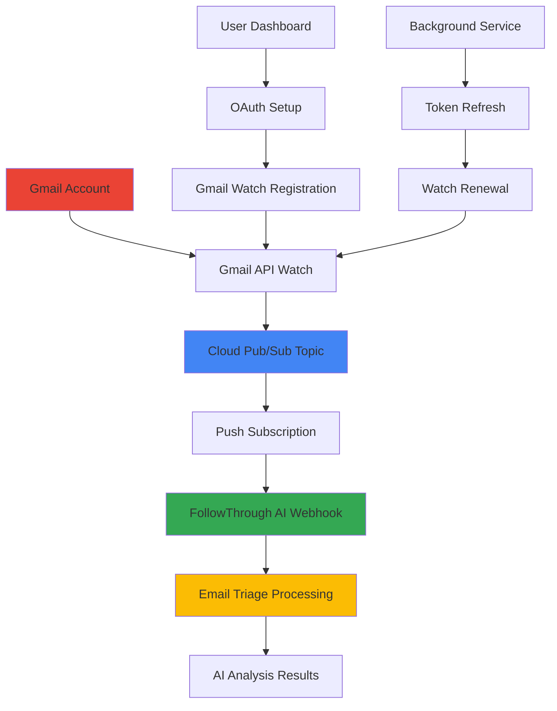

# 📧 Gmail Push Notifications Integration Plan

## 🎯 **Project Overview**

**Objective**: Replace Zapier-based email triggers with native Gmail Push Notifications using Google Cloud Pub/Sub for real-time email triage automation.

**Current State**: Zapier webhook-based email processing  
**Target State**: Direct Gmail API push notifications → Cloud Pub/Sub → FollowThrough AI processing

**Key Benefits**:
- ⚡ **Real-time processing** (seconds vs minutes)
- 💰 **Cost reduction** (no Zapier subscription fees)
- 🔒 **Enhanced security** (direct Google API integration)
- 📊 **Better reliability** (Google's infrastructure)
- 🎛️ **Full control** over email processing pipeline

---

## 🏗️ **Architecture Overview**

### **Current Flow (Zapier)**
```
Gmail → Zapier Trigger → Webhook → FollowThrough AI
```

### **Target Flow (Google Pub/Sub)**
```
Gmail → Gmail API Watch → Cloud Pub/Sub → Push Webhook → FollowThrough AI
```

### **Detailed Architecture**


---

## 📋 **Phase 1: Google Cloud Pub/Sub Setup**

### **1.1 Google Cloud Project Configuration**

**Prerequisites**:
- [ ] Google Cloud Project with billing enabled
- [ ] Gmail API enabled
- [ ] Cloud Pub/Sub API enabled
- [ ] Service account with appropriate permissions

**Required APIs**:
```
- Gmail API (gmail.googleapis.com)
- Cloud Pub/Sub API (pubsub.googleapis.com)
- Cloud Resource Manager API (cloudresourcemanager.googleapis.com)
```

**Service Account Permissions**:
```
- Pub/Sub Admin (pubsub.admin)
- Pub/Sub Editor (pubsub.editor)
- Gmail API access (via OAuth scopes)
```

### **1.2 Pub/Sub Topic and Subscription Setup**

**Topic Configuration**:
```yaml
Topic Name: gmail-notifications
Project: your-project-id
Message Retention: 7 days
Schema: None (JSON messages)
```

**Push Subscription Configuration**:
```yaml
Subscription Name: gmail-push-subscription
Topic: gmail-notifications
Delivery Type: Push
Endpoint URL: https://your-domain.com/api/gmail/webhooks/push
Acknowledgment Deadline: 60 seconds
Message Retention: 7 days
Retry Policy: Exponential backoff (min: 10s, max: 600s)
```

**Pull Subscription Configuration** (Backup):
```yaml
Subscription Name: gmail-pull-subscription
Topic: gmail-notifications
Delivery Type: Pull
Acknowledgment Deadline: 60 seconds
```

### **1.3 Authentication & Authorization**

**Service Account Setup**:
- Create service account for Pub/Sub operations
- Generate and securely store service account key
- Grant `gmail-api-push@system.gserviceaccount.com` publish rights to topic

**OAuth Scope Updates**:
```typescript
// Add to existing scopes in GoogleOAuthService
const requiredScopes = [
  // ... existing scopes
  'https://www.googleapis.com/auth/gmail.readonly',
  'https://www.googleapis.com/auth/gmail.modify', // For watch operations
  'https://www.googleapis.com/auth/pubsub', // If needed for topic management
];
```

---

## 📋 **Phase 2: Gmail Watch Management Service**

### **2.1 Gmail Watch Service Architecture**

**New Service**: `GmailWatchService`
- Manage Gmail watch subscriptions per user
- Handle watch renewal (7-day expiration)
- Track watch status and history IDs
- Integrate with existing OAuth service

**Database Schema Updates**:
```typescript
// New collection: gmail_watches
interface GmailWatch {
  userId: ObjectId;
  watchId: string;
  historyId: string;
  topicName: string;
  labelIds: string[];
  labelFilterBehavior: 'INCLUDE' | 'EXCLUDE';
  expiresAt: Date;
  isActive: boolean;
  createdAt: Date;
  updatedAt: Date;
  lastRenewalAt: Date;
  errorCount: number;
  lastError?: string;
}
```

### **2.2 Watch Lifecycle Management**

**Watch Creation Flow**:
1. User completes OAuth authorization
2. System automatically creates Gmail watch
3. Store watch metadata in database
4. Set up renewal scheduler

**Watch Renewal Strategy**:
- Renew every 24 hours (recommended by Google)
- Background job checks for expiring watches
- Automatic retry on renewal failures
- Alert on consecutive failures

**Error Handling**:
- Invalid grant → Trigger OAuth re-authorization
- Quota exceeded → Implement exponential backoff
- Topic not found → Recreate topic and subscription

### **2.3 User Management Integration**

**OAuth Controller Updates**:
```typescript
// Add to existing GoogleOAuthController
@Post('setup-email-notifications')
@UseGuards(AuthGuard('jwt'))
async setupEmailNotifications(@Req() req: AuthenticatedRequest) {
  // Create Gmail watch for user
  // Configure notification preferences
  // Return setup status
}

@Get('email-notification-status')
@UseGuards(AuthGuard('jwt'))
async getEmailNotificationStatus(@Req() req: AuthenticatedRequest) {
  // Return watch status, expiry, error state
}

@Delete('disable-email-notifications')
@UseGuards(AuthGuard('jwt'))
async disableEmailNotifications(@Req() req: AuthenticatedRequest) {
  // Stop Gmail watch
  // Clean up subscriptions
}
```

---

## 📋 **Phase 3: Webhook Processing Service**

### **3.1 Gmail Webhook Controller**

**New Controller**: `GmailWebhookController`
```typescript
@Controller('api/gmail/webhooks')
export class GmailWebhookController {
  // Handle push notifications from Pub/Sub
  @Post('push')
  async handlePushNotification(@Body() pubsubMessage: PubSubMessage)
  
  // Handle pull notifications (backup method)
  @Post('pull')
  async processPullNotifications()
  
  // Webhook verification endpoint
  @Get('verify')
  async verifyWebhook(@Query() params: VerificationParams)
}
```

### **3.2 Message Processing Pipeline**

**Pub/Sub Message Structure**:
```typescript
interface PubSubMessage {
  message: {
    data: string; // Base64-encoded Gmail notification
    messageId: string;
    publishTime: string;
    attributes?: Record<string, string>;
  };
  subscription: string;
}

interface GmailNotification {
  emailAddress: string;
  historyId: string;
}
```

**Processing Flow**:
1. **Receive Pub/Sub notification**
2. **Decode and validate message**
3. **Extract email address and history ID**
4. **Fetch email changes using Gmail API**
5. **Filter for new emails only**
6. **Trigger email triage workflow**
7. **Acknowledge Pub/Sub message**

### **3.3 Gmail History Processing**

**History API Integration**:
```typescript
// Fetch changes since last known history ID
const historyResponse = await gmail.users.history.list({
  userId: 'me',
  startHistoryId: lastKnownHistoryId,
  historyTypes: ['messageAdded'],
  labelId: 'INBOX'
});

// Process new messages
for (const history of historyResponse.data.history) {
  for (const messageAdded of history.messagesAdded) {
    await this.processNewEmail(messageAdded.message);
  }
}
```

---

## 📋 **Phase 4: Integration with Existing Email Triage**

### **4.1 Unified Email Processing**

**Update Existing Services**:
- Modify `UnifiedWorkflowService` to handle Gmail-sourced emails
- Update email triage DTOs for Gmail API data structure
- Ensure compatibility with existing AI processing pipeline

**Email Data Transformation**:
```typescript
// Transform Gmail API message to existing email format
interface GmailToEmailTransform {
  transformGmailMessage(gmailMessage: gmail_v1.Schema$Message): ZapierEmailPayload;
  extractEmailMetadata(gmailMessage: gmail_v1.Schema$Message): EmailMetadata;
  handleAttachments(gmailMessage: gmail_v1.Schema$Message): AttachmentData[];
}
```

### **4.2 Processing Flow Integration**

**Enhanced Email Triage Input**:
```typescript
const emailTriageInput = {
  type: "email_triage",
  source: "gmail_push", // vs "zapier_webhook"
  emailData: {
    id: gmailMessage.id,
    threadId: gmailMessage.threadId,
    body: extractedBody,
    metadata: {
      subject: extractedSubject,
      from: extractedFrom,
      to: extractedTo,
      timestamp: gmailMessage.internalDate,
      labels: gmailMessage.labelIds,
      gmailSource: true,
      historyId: currentHistoryId,
    },
  },
  sessionId: `gmail-${gmailMessage.id}-${Date.now()}`,
};
```

### **4.3 Response Handling**

**Auto-Reply Integration**:
- Use Gmail API to send replies instead of SMTP
- Maintain thread context with proper threading
- Apply Gmail labels based on AI classification
- Update email status in Gmail (mark as read, archive, etc.)

---

## 📋 **Phase 5: Monitoring & Reliability**

### **5.1 Health Monitoring**

**Watch Health Checks**:
- Monitor watch expiration status
- Track notification delivery rates
- Alert on processing failures
- Dashboard for watch management

**Metrics to Track**:
```typescript
interface GmailIntegrationMetrics {
  activeWatches: number;
  notificationsReceived: number;
  processingLatency: number;
  errorRate: number;
  watchRenewalSuccess: number;
  emailsProcessed: number;
}
```

### **5.2 Error Recovery**

**Failure Scenarios & Recovery**:
1. **Watch Expiration**: Auto-renewal with exponential backoff
2. **OAuth Token Expiry**: Automatic refresh or user re-auth
3. **Pub/Sub Delivery Failure**: Pull subscription fallback
4. **Processing Errors**: Dead letter queue and manual review
5. **Gmail API Quota**: Rate limiting and queuing

**Dead Letter Queue**:
- Failed messages sent to DLQ after max retries
- Manual processing interface for failed emails
- Alerting for DLQ accumulation

### **5.3 Backup Processing**

**Pull Subscription Fallback**:
- Background job polls pull subscription
- Processes messages if push delivery fails
- Ensures no email notifications are lost

**Periodic Sync**:
- Daily sync to catch any missed notifications
- Compare local history ID with Gmail
- Process any gaps in email coverage

---

## 📋 **Phase 6: User Experience & Management**

### **6.1 User Dashboard Integration**

**Gmail Integration Settings**:
```typescript
// New dashboard section
interface GmailIntegrationSettings {
  isEnabled: boolean;
  watchStatus: 'active' | 'expired' | 'error' | 'disabled';
  lastNotification: Date;
  emailsProcessed: number;
  notificationPreferences: {
    labelFilters: string[];
    excludeSpam: boolean;
    excludePromotions: boolean;
    includeAttachments: boolean;
  };
}
```

**User Controls**:
- Enable/disable email notifications
- Configure label filters (INBOX, IMPORTANT, etc.)
- Set processing preferences
- View notification history and status

### **6.2 Setup Wizard**

**Guided Setup Flow**:
1. **OAuth Authorization** (existing)
2. **Gmail Permission Grant** (watch setup)
3. **Notification Preferences** (labels, filters)
4. **Test Email Processing** (send test email)
5. **Confirmation & Monitoring** (setup complete)

### **6.3 Troubleshooting Interface**

**Admin Dashboard**:
- View all user watches and their status
- Manually trigger watch renewal
- Process failed notifications
- Monitor system health metrics

---

## 📋 **Phase 7: Security & Compliance**

### **7.1 Security Considerations**

**Webhook Security**:
- Verify Pub/Sub message authenticity
- Implement request signing validation
- Rate limiting on webhook endpoints
- IP allowlisting for Google services

**Data Privacy**:
- Minimal email content storage
- Encryption of sensitive data
- GDPR compliance for EU users
- User consent for email processing

### **7.2 Access Control**

**Permission Management**:
- Granular OAuth scopes
- User-controlled data access
- Audit logging for email access
- Secure token storage and rotation

---

## 📋 **Implementation Timeline**

### **Week 1-2: Infrastructure Setup**
- [ ] Google Cloud Pub/Sub configuration
- [ ] Service account and permissions setup
- [ ] Database schema updates
- [ ] Basic webhook endpoint creation

### **Week 3-4: Gmail Watch Service**
- [ ] GmailWatchService implementation
- [ ] Watch lifecycle management
- [ ] OAuth controller updates
- [ ] Database integration

### **Week 5-6: Webhook Processing**
- [ ] Pub/Sub message handling
- [ ] Gmail History API integration
- [ ] Email data transformation
- [ ] Integration with existing triage system

### **Week 7-8: User Experience**
- [ ] Dashboard integration
- [ ] Setup wizard implementation
- [ ] User preference management
- [ ] Testing and debugging

### **Week 9-10: Monitoring & Reliability**
- [ ] Health monitoring implementation
- [ ] Error recovery mechanisms
- [ ] Backup processing systems
- [ ] Performance optimization

### **Week 11-12: Security & Launch**
- [ ] Security hardening
- [ ] Compliance verification
- [ ] Load testing
- [ ] Production deployment

---

## 📊 **Success Metrics**

### **Technical Metrics**:
- **Notification Latency**: < 5 seconds from email receipt
- **Processing Success Rate**: > 99.5%
- **Watch Uptime**: > 99.9%
- **Error Recovery Time**: < 1 minute

### **Business Metrics**:
- **User Adoption**: % of users enabling Gmail notifications
- **Cost Reduction**: Savings vs Zapier subscription
- **Processing Volume**: Emails processed per day
- **User Satisfaction**: Feedback on real-time processing

---

## 🚀 **Migration Strategy**

### **Parallel Operation Phase**:
1. **Deploy Gmail push notifications** alongside existing Zapier
2. **A/B test** with subset of users
3. **Compare performance** and reliability
4. **Gradually migrate** users from Zapier to Gmail push

### **Zapier Deprecation**:
1. **Announce migration timeline** to users
2. **Provide migration tools** and documentation
3. **Support both systems** during transition
4. **Complete Zapier shutdown** after full migration

---

## 🔧 **Technical Considerations**

### **Rate Limiting**:
- Gmail API: 1 billion quota units per day
- Pub/Sub: 10,000 messages per second
- Watch creation: 1 request per second per user

### **Scalability**:
- Horizontal scaling of webhook processors
- Database sharding for large user bases
- Pub/Sub topic partitioning if needed

### **Cost Optimization**:
- Efficient message processing to minimize Pub/Sub costs
- Batch processing where possible
- Optimal watch renewal frequency

---

This comprehensive plan provides a roadmap for implementing Gmail push notifications to replace Zapier, offering better performance, cost efficiency, and user control while maintaining the existing email triage functionality. 