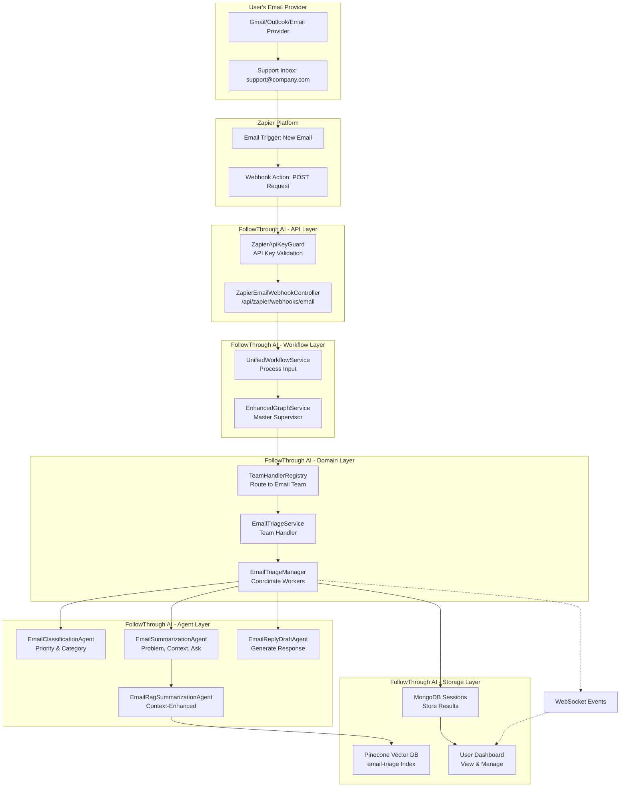

# 🔧 Zapier Email Triage Integration - Technical Flow

## 📊 Complete Architecture Overview



---

## 🔄 Detailed Data Flow

### 1. **Email Reception & Trigger (Zapier)**

```json
// 1. Email arrives at support@company.com
{
  "id": "gmail-message-001",
  "subject": "Payment Gateway Error - Urgent",
  "from": "customer@example.com",
  "to": "support@company.com",
  "body": "Hi, I'm getting a timeout error when trying to make a payment...",
  "timestamp": "2024-01-15T14:30:00Z",
  "headers": {
    "message-id": "<CAFx8y9z...@mail.gmail.com>",
    "reply-to": "customer@example.com"
  }
}

// 2. Zapier triggers and sends webhook
POST https://your-domain.com/api/zapier/webhooks/email
Headers: {
  "Content-Type": "application/json",
  "x-api-key": "zapier_a1b2c3d4e5f6...",
  "x-zapier-webhook-id": "hook-123"
}
```

### 2. **API Layer Processing**

```typescript
// ZapierApiKeyGuard validates the API key
@UseGuards(ZapierApiKeyGuard)
@Post("email")
async handleEmailWebhook(@Body() emailPayload: ZapierEmailPayload) {
  // Transform to internal format
  const input = {
    type: "email_triage",
    emailData: {
      id: emailPayload.id || `zapier-${Date.now()}`,
      body: emailPayload.body,
      metadata: {
        subject: emailPayload.subject,
        from: emailPayload.from,
        to: emailPayload.to,
        timestamp: emailPayload.timestamp,
        headers: emailPayload.headers,
        zapierSource: true,
        webhookId: headers["x-zapier-webhook-id"]
      }
    },
    sessionId: `zapier-email-${Date.now()}`
  };
  
  // Route to UnifiedWorkflowService
  return await this.unifiedWorkflowService.processInput(input, metadata, userId);
}
```

### 3. **Master Supervisor Routing**

```typescript
// EnhancedGraphService.processMasterSupervisorInput()
const supervisorNode = async (state: any) => {
  // Determine input type
  let inputType = "unknown";
  if (state.input?.type) {
    inputType = state.input.type;
  } else if (state.input?.emailData) {
    inputType = "email_triage";
  }
  
  // Route to email_triage team
  if (inputType === "email_triage") {
    return {
      ...state,
      routing: {
        team: "email_triage",
        reason: "Input contains email content for triage"
      },
      resultType: "email_triage"
    };
  }
};
```

### 4. **Email Team Processing**

```typescript
// EmailTriageService.process() - Team Handler
async process(input: any): Promise<any> {
  // Route to EmailTriageManager for coordination
  const result = await this.emailTriageManager.processEmail(
    input.emailData,
    { sessionId: input.sessionId }
  );
  return result;
}
```

### 5. **Parallel Agent Processing**

```typescript
// EmailTriageManager.processEmail() - Coordinates 3 workers
async processEmail(emailData: any, context: any): Promise<EmailTriageResult> {
  // Process in parallel for speed
  const [classification, summary, replyDraft] = await Promise.all([
    // Worker 1: Classification
    this.classificationAgent.classifyEmail(emailData.body, emailData.metadata),
    
    // Worker 2: Summarization (with RAG enhancement)
    this.ragSummarizationAgent.summarizeEmail(emailData.body, emailData.metadata),
    
    // Worker 3: Reply Draft Generation  
    this.replyDraftAgent.generateReplyDraft(emailData.body, emailData.metadata)
  ]);

  // Combine results
  return {
    sessionId: context.sessionId,
    emailId: emailData.id,
    classification,
    summary, 
    replyDraft,
    status: "completed",
    processedAt: new Date()
  };
}
```

### 6. **Individual Agent Processing**

#### **Classification Agent**
```typescript
async classifyEmail(content: string, metadata: any): Promise<EmailClassification> {
  const prompt = `Classify this email:
Subject: ${metadata.subject}
From: ${metadata.from}
Body: ${content}

Determine:
1. Priority: urgent, high, normal, low
2. Category: bug_report, feature_request, question, complaint, praise, other
3. Reasoning: Brief explanation
4. Confidence: 0.0 to 1.0`;

  // LLM processing...
  return {
    priority: "urgent",
    category: "bug_report",
    reasoning: "Payment system failure affects revenue",
    confidence: 0.92
  };
}
```

#### **RAG-Enhanced Summarization Agent**
```typescript
async summarizeEmail(content: string, metadata: any): Promise<EmailSummary> {
  // 1. Generate RAG query
  const ragQuery = `Email summary: 
Subject: ${metadata.subject}
From: ${metadata.from}
Email type and category analysis`;

  // 2. Retrieve context from email-triage Pinecone index
  const retrievedContext = await this.ragService.getContext(ragQuery, {
    indexName: VectorIndexes.EMAIL_TRIAGE,
    namespace: "email-summaries",
    topK: 3,
    minScore: 0.7
  });

  // 3. Enhanced prompt with context
  const prompt = `${contextPrompt}

Email to summarize:
Subject: ${metadata.subject}
Body: ${content}

Extract:
1. Problem: What issue is the sender facing?
2. Context: What background information is provided?
3. Ask: What specific action do they want?`;

  // LLM processing with enhanced context...
  return {
    problem: "Payment gateway timeout during checkout",
    context: "E-commerce customer unable to complete purchase",
    ask: "Fix payment processing system",
    summary: "Customer experiencing payment gateway errors preventing purchase"
  };
}
```

#### **Reply Draft Agent**
```typescript
async generateReplyDraft(content: string, metadata: any): Promise<EmailReplyDraft> {
  const prompt = `Generate a professional reply draft:
Subject: ${metadata.subject}
From: ${metadata.from}
Body: ${content}

Create:
1. Appropriate subject line
2. Professional and empathetic response
3. Tone (professional, friendly, urgent)
4. Next steps list`;

  // LLM processing...
  return {
    subject: "Re: Payment Gateway Error - We're investigating",
    body: "Hi,\n\nThank you for reporting this payment issue. We understand how frustrating this must be and are immediately investigating the payment gateway. Our technical team has been notified and we'll provide an update within 2 hours.\n\nBest regards,\nSupport Team",
    tone: "professional",
    next_steps: ["Investigate payment gateway", "Update customer within 2 hours"]
  };
}
```

### 7. **Storage & Response**

```typescript
// Results stored in MongoDB
await this.sessionRepository.updateSession(sessionId, {
  status: "completed",
  endTime: new Date(),
  emailData: input.emailData,
  classification: result.classification,
  summary: result.summary,
  replyDraft: result.replyDraft
});

// Real-time WebSocket event
this.eventEmitter.emit('email.triage.completed', {
  sessionId,
  result,
  timestamp: new Date().toISOString()
});

// Response back to Zapier
return {
  success: true,
  sessionId: input.sessionId,
  emailId: input.emailData.id,
  processedAt: new Date().toISOString(),
  result: {
    status: "completed",
    sessionId: result.sessionId
  }
};
```

---

## 🔐 Security Implementation

### API Key Management Flow

```typescript
// 1. User generates API key (authenticated)
POST /api/zapier/api-key
Authorization: Bearer <user_jwt_token>

// ZapierService.generateApiKey()
generateApiKey(userId: string): string {
  const apiKey = crypto.randomBytes(32).toString('hex');
  const prefixedKey = `zapier_${apiKey}`;
  
  // Store in memory (production should use Redis/Database)
  this.apiKeys.set(prefixedKey, {
    userId,
    createdAt: new Date()
  });
  
  return prefixedKey;
}

// 2. Zapier uses API key in headers
// ZapierApiKeyGuard.canActivate()
canActivate(context: ExecutionContext): boolean {
  const request = context.switchToHttp().getRequest();
  const apiKey = request.headers['x-api-key'];
  
  if (!apiKey) {
    throw new UnauthorizedException('API key is missing');
  }
  
  const isValid = this.zapierService.validateApiKey(apiKey);
  if (!isValid) {
    throw new UnauthorizedException('Invalid API key');
  }
  
  // Add userId to request for later use
  request.userId = this.zapierService.getUserIdFromApiKey(apiKey);
  return true;
}
```

### Rate Limiting (Recommended Enhancement)

```typescript
// Add rate limiting to prevent abuse
@UseGuards(ZapierApiKeyGuard, RateLimitGuard)
@Post("email")
async handleEmailWebhook() {
  // Limited to 100 requests per minute per API key
}
```

---

## 📊 Monitoring & Observability

### Logging Implementation

```typescript
// Structured logging throughout the flow
this.logger.log('Received email webhook from Zapier', {
  emailId: emailPayload.id,
  subject: emailPayload.subject,
  from: emailPayload.from,
  webhookId: headers['x-zapier-webhook-id'],
  userId: req.userId,
  timestamp: new Date().toISOString()
});

this.logger.log('Email triage completed', {
  sessionId: result.sessionId,
  emailId: result.emailId,
  priority: result.classification.priority,
  category: result.classification.category,
  processingTimeMs: Date.now() - startTime,
  success: true
});
```

### Metrics Collection

```typescript
// Track key metrics for performance monitoring
interface EmailTriageMetrics {
  totalProcessed: number;
  averageProcessingTime: number;
  byPriority: Record<string, number>;
  byCategory: Record<string, number>;
  errorRate: number;
  zapierSourcePercentage: number;
}
```

### Health Checks

```typescript
// Health check endpoint for monitoring
@Get('health')
async healthCheck() {
  return {
    status: 'healthy',
    timestamp: new Date().toISOString(),
    services: {
      llm: await this.llmService.healthCheck(),
      pinecone: await this.pineconeService.healthCheck(),
      mongodb: await this.databaseService.healthCheck()
    },
    zapier: {
      activeApiKeys: this.zapierService.getActiveKeyCount(),
      last24hProcessed: await this.getProcessedCount24h()
    }
  };
}
```

---

## 🚀 Performance Optimization

### Parallel Processing
- **Classification**, **Summarization**, and **Reply Draft** agents run in parallel
- Reduces total processing time from ~15 seconds to ~5 seconds

### Caching Strategy
```typescript
// Cache common responses for similar emails
@Cacheable('email-classification', 300) // 5 minutes
async classifyEmail(content: string, metadata: any) {
  // Classification logic...
}
```

### Batch Processing Support
```typescript
// Process multiple emails efficiently
@Post("email/batch")
async handleBatchEmailWebhook(@Body() batchPayload: { emails: ZapierEmailPayload[] }) {
  // Process emails sequentially to avoid overwhelming the system
  const results = [];
  for (const email of batchPayload.emails) {
    try {
      const result = await this.handleEmailWebhook(email, {});
      results.push({ emailId: email.id, success: true, sessionId: result.sessionId });
    } catch (error) {
      results.push({ emailId: email.id, success: false, error: error.message });
    }
  }
  return { results, totalProcessed: results.length };
}
```

---

## 🔄 Error Handling & Recovery

### Graceful Degradation
```typescript
// If RAG fails, fall back to basic summarization
async summarizeEmail(content: string, metadata: any): Promise<EmailSummary> {
  try {
    // Try RAG-enhanced summarization first
    return await this.ragEnhancedSummarization(content, metadata);
  } catch (error) {
    this.logger.warn('RAG summarization failed, falling back to basic', error);
    // Fall back to basic LLM summarization
    return await this.basicSummarization(content, metadata);
  }
}
```

### Retry Logic
```typescript
// Retry failed LLM calls with exponential backoff
@Retryable({
  maxAttempts: 3,
  backoff: { delay: 1000, multiplier: 2 }
})
async callLLM(prompt: string) {
  return await this.llmService.generateResponse(prompt);
}
```

### Dead Letter Queue
```typescript
// Store failed emails for manual processing
async handleFailedEmail(emailData: any, error: any) {
  await this.failedEmailRepository.create({
    emailData,
    error: error.message,
    timestamp: new Date(),
    retryCount: 0,
    status: 'failed'
  });
  
  // Notify operations team
  this.notificationService.sendAlert(`Email processing failed: ${emailData.id}`);
}
```

---

## 📈 Scaling Considerations

### Horizontal Scaling
- Multiple server instances can process webhooks concurrently
- Stateless design allows easy horizontal scaling
- MongoDB and Pinecone handle concurrent access

### Queue-Based Processing
```typescript
// For high volume, consider adding a queue
@Post("email")
async handleEmailWebhook(@Body() emailPayload: ZapierEmailPayload) {
  // Add to processing queue instead of processing immediately
  await this.emailQueue.add('process-email', {
    emailData: emailPayload,
    priority: this.determinePriority(emailPayload)
  });
  
  return { success: true, queued: true, position: await this.emailQueue.getWaiting() };
}
```

### Resource Management
- Connection pooling for MongoDB and Pinecone
- LLM request throttling to avoid rate limits
- Memory management for large email attachments

This technical flow provides a complete understanding of how your Zapier integration works with the agentic email triage system, from initial email reception through final result storage and user notification. 