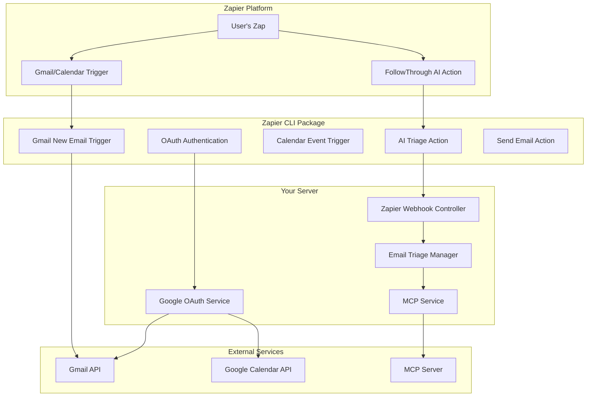

# 🚀 Zapier CLI TypeScript Package Development Plan

## 📋 **Overview**

This plan outlines creating a Zapier CLI TypeScript package that integrates with your existing:
- **Google OAuth Gmail/Calendar access** 
- **MCP (Model Context Protocol) server**
- **AI agent workflow system**
- **Email triage and meeting analysis capabilities**

## 📁 **Project Structure**

**Recommended Location**: `zapier-packages/` (root level)

```
followthrough-server/
├── zapier-packages/
│   ├── followthrough-ai-integration/          # Main Zapier package
│   │   ├── src/
│   │   │   ├── authentication/
│   │   │   │   ├── oauth.ts                   # Google OAuth handling
│   │   │   │   ├── api-key.ts                 # API key management
│   │   │   │   └── index.ts
│   │   │   ├── triggers/
│   │   │   │   ├── new-email.ts               # Gmail new email trigger
│   │   │   │   ├── new-calendar-event.ts      # Calendar event trigger
│   │   │   │   ├── email-matching-search.ts   # Filtered email trigger
│   │   │   │   └── index.ts
│   │   │   ├── actions/
│   │   │   │   ├── send-email.ts              # Send email via Gmail
│   │   │   │   ├── create-calendar-event.ts   # Create calendar event
│   │   │   │   ├── trigger-email-triage.ts    # Trigger AI email triage
│   │   │   │   ├── trigger-meeting-analysis.ts # Trigger meeting analysis
│   │   │   │   └── index.ts
│   │   │   ├── creates/
│   │   │   │   ├── draft-reply.ts             # Create draft reply
│   │   │   │   ├── task-from-email.ts         # Create task from email
│   │   │   │   └── index.ts
│   │   │   ├── searches/
│   │   │   │   ├── find-emails.ts             # Search emails
│   │   │   │   ├── find-events.ts             # Search calendar events
│   │   │   │   └── index.ts
│   │   │   ├── utils/
│   │   │   │   ├── api-client.ts              # API client for your server
│   │   │   │   ├── mcp-client.ts              # MCP server communication
│   │   │   │   ├── google-client.ts           # Google API utilities
│   │   │   │   ├── validators.ts              # Input validation
│   │   │   │   └── index.ts
│   │   │   ├── types/
│   │   │   │   ├── email.ts                   # Email type definitions
│   │   │   │   ├── calendar.ts                # Calendar type definitions
│   │   │   │   ├── ai-response.ts             # AI response types
│   │   │   │   └── index.ts
│   │   │   └── index.ts                       # Main package entry
│   │   ├── test/
│   │   │   ├── authentication/
│   │   │   ├── triggers/
│   │   │   ├── actions/
│   │   │   └── utils/
│   │   ├── package.json
│   │   ├── tsconfig.json
│   │   ├── .zapierapprc                       # Zapier CLI config
│   │   └── README.md
│   └── shared/                                # Shared utilities
│       ├── types/
│       ├── constants/
│       └── utils/
├── src/                                       # Your existing server code
└── ...
```

## 🎯 **Integration Architecture**

### **Current System Integration Points**

1. **Google OAuth Service** (`src/integrations/google/services/google-oauth.service.ts`)
   - Already handles Gmail/Calendar OAuth
   - Provides authenticated clients
   - Manages token refresh

2. **MCP Service** (`src/mcp/mcp.service.ts`)
   - Multi-server MCP client
   - Tool execution across servers
   - Gmail/Outlook/Zapier MCP server support

3. **Email Triage System** (`src/email/workflow/email-triage.manager.ts`)
   - AI-powered email classification
   - RAG-enhanced summarization
   - Reply draft generation

4. **Zapier Webhook Controllers** (`src/zapier/email-webhook.controller.ts`)
   - API key authentication
   - Webhook processing
   - Integration with Master Supervisor

### **New Zapier Package Integration Flow**



## 🔧 **Implementation Phases**

### **Phase 1: Project Setup & Authentication (Week 1)**

#### 1.1 Initialize Zapier CLI Package

```bash
# Create the package directory
mkdir -p zapier-packages/followthrough-ai-integration
cd zapier-packages/followthrough-ai-integration

# Initialize Zapier app
zapier init . --template=typescript

# Install additional dependencies
npm install @google-cloud/gmail googleapis @modelcontextprotocol/sdk axios
npm install -D @types/node typescript ts-node
```

#### 1.2 Configure Authentication

**OAuth 2.0 Setup** (`src/authentication/oauth.ts`):
```typescript
import { Bundle, ZObject } from 'zapier-platform-core';

// OAuth configuration that integrates with your existing Google OAuth
export const authentication = {
  type: 'oauth2',
  oauth2Config: {
    authorizeUrl: 'https://your-domain.com/oauth/google/authorize',
    getAccessToken: {
      url: 'https://your-domain.com/oauth/google/token',
      method: 'POST',
      headers: {
        'Content-Type': 'application/x-www-form-urlencoded',
      },
      body: {
        grant_type: 'authorization_code',
        client_id: '{{process.env.GOOGLE_CLIENT_ID}}',
        client_secret: '{{process.env.GOOGLE_CLIENT_SECRET}}',
        code: '{{bundle.inputData.code}}',
        redirect_uri: '{{bundle.inputData.redirect_uri}}',
      },
    },
    refreshAccessToken: {
      url: 'https://your-domain.com/oauth/google/refresh',
      method: 'POST',
      headers: {
        'Content-Type': 'application/x-www-form-urlencoded',
      },
      body: {
        grant_type: 'refresh_token',
        refresh_token: '{{bundle.authData.refresh_token}}',
      },
    },
    scope: [
      'https://www.googleapis.com/auth/gmail.readonly',
      'https://www.googleapis.com/auth/gmail.send',
      'https://www.googleapis.com/auth/calendar.readonly',
      'https://www.googleapis.com/auth/calendar.events',
    ].join(' '),
    autoRefresh: true,
  },
  test: {
    url: 'https://your-domain.com/oauth/google/test',
    method: 'GET',
    headers: {
      Authorization: 'Bearer {{bundle.authData.access_token}}',
    },
  },
  connectionLabel: '{{userInfo.email}}',
};
```

### **Phase 2: Triggers Implementation (Week 2)**

#### 2.1 Gmail New Email Trigger

**File**: `src/triggers/new-email.ts`
```typescript
import { Bundle, ZObject } from 'zapier-platform-core';
import { GoogleClient } from '../utils/google-client';

interface EmailTrigger {
  id: string;
  subject: string;
  from: string;
  to: string;
  body: string;
  timestamp: string;
  headers: Record<string, string>;
}

const performList = async (z: ZObject, bundle: Bundle): Promise<EmailTrigger[]> => {
  const googleClient = new GoogleClient(z, bundle);
  
  // Get recent emails using your existing Google OAuth integration
  const emails = await googleClient.getRecentEmails({
    maxResults: 10,
    query: bundle.inputData.query || 'is:unread',
  });
  
  return emails.map(email => ({
    id: email.id,
    subject: email.subject,
    from: email.from,
    to: email.to,
    body: email.body,
    timestamp: email.timestamp,
    headers: email.headers,
  }));
};

const performSubscribe = async (z: ZObject, bundle: Bundle) => {
  // Set up Gmail push notifications via your server
  const response = await z.request({
    url: 'https://your-domain.com/api/gmail/subscribe',
    method: 'POST',
    headers: {
      Authorization: `Bearer ${bundle.authData.access_token}`,
    },
    body: {
      targetUrl: bundle.targetUrl,
      query: bundle.inputData.query,
    },
  });
  
  return response.data;
};

export default {
  key: 'new_email',
  noun: 'Email',
  display: {
    label: 'New Email',
    description: 'Triggers when a new email is received in Gmail.',
  },
  operation: {
    type: 'hook',
    performSubscribe,
    performUnsubscribe: async (z: ZObject, bundle: Bundle) => {
      // Cleanup subscription
      await z.request({
        url: `https://your-domain.com/api/gmail/unsubscribe/${bundle.subscribeData.id}`,
        method: 'DELETE',
        headers: {
          Authorization: `Bearer ${bundle.authData.access_token}`,
        },
      });
    },
    performList,
    sample: {
      id: 'email-123',
      subject: 'Test Email',
      from: 'sender@example.com',
      to: 'recipient@example.com',
      body: 'This is a test email body.',
      timestamp: '2024-01-15T10:30:00Z',
      headers: {},
    },
    outputFields: [
      { key: 'id', label: 'Email ID' },
      { key: 'subject', label: 'Subject' },
      { key: 'from', label: 'From' },
      { key: 'to', label: 'To' },
      { key: 'body', label: 'Body' },
      { key: 'timestamp', label: 'Timestamp' },
    ],
  },
};
```

#### 2.2 Calendar Event Trigger

**File**: `src/triggers/new-calendar-event.ts`
```typescript
import { Bundle, ZObject } from 'zapier-platform-core';
import { GoogleClient } from '../utils/google-client';

const performList = async (z: ZObject, bundle: Bundle) => {
  const googleClient = new GoogleClient(z, bundle);
  
  const events = await googleClient.getRecentCalendarEvents({
    maxResults: 10,
    timeMin: new Date(Date.now() - 24 * 60 * 60 * 1000).toISOString(),
  });
  
  return events.map(event => ({
    id: event.id,
    summary: event.summary,
    description: event.description,
    start: event.start,
    end: event.end,
    attendees: event.attendees,
    location: event.location,
  }));
};

export default {
  key: 'new_calendar_event',
  noun: 'Calendar Event',
  display: {
    label: 'New Calendar Event',
    description: 'Triggers when a new calendar event is created.',
  },
  operation: {
    type: 'polling',
    perform: performList,
    sample: {
      id: 'event-123',
      summary: 'Team Meeting',
      description: 'Weekly team sync',
      start: '2024-01-15T10:00:00Z',
      end: '2024-01-15T11:00:00Z',
      attendees: ['user1@example.com', 'user2@example.com'],
      location: 'Conference Room A',
    },
  },
};
```

### **Phase 3: Actions Implementation (Week 3)**

#### 3.1 AI Email Triage Action

**File**: `src/actions/trigger-email-triage.ts`
```typescript
import { Bundle, ZObject } from 'zapier-platform-core';
import { ApiClient } from '../utils/api-client';

interface EmailTriageResult {
  sessionId: string;
  classification: {
    priority: 'urgent' | 'high' | 'normal' | 'low';
    category: string;
    confidence: number;
  };
  summary: {
    problem: string;
    context: string;
    ask: string;
  };
  replyDraft: {
    subject: string;
    body: string;
    tone: string;
  };
}

const perform = async (z: ZObject, bundle: Bundle): Promise<EmailTriageResult> => {
  const apiClient = new ApiClient(z, bundle);
  
  // Send email to your existing email triage webhook
  const response = await apiClient.post('/api/zapier/webhooks/email', {
    id: bundle.inputData.emailId,
    subject: bundle.inputData.subject,
    from: bundle.inputData.from,
    to: bundle.inputData.to,
    body: bundle.inputData.body,
    timestamp: bundle.inputData.timestamp,
    headers: bundle.inputData.headers || {},
    userId: bundle.authData.userId,
  });
  
  return response.data.result;
};

export default {
  key: 'trigger_email_triage',
  noun: 'Email Triage',
  display: {
    label: 'Trigger AI Email Triage',
    description: 'Analyzes an email using AI for priority, category, and generates a reply draft.',
  },
  operation: {
    perform,
    inputFields: [
      { key: 'emailId', label: 'Email ID', required: true },
      { key: 'subject', label: 'Subject', required: true },
      { key: 'from', label: 'From', required: true },
      { key: 'to', label: 'To', required: true },
      { key: 'body', label: 'Body', required: true },
      { key: 'timestamp', label: 'Timestamp' },
      { key: 'headers', label: 'Headers', type: 'object' },
    ],
    sample: {
      sessionId: 'zapier-email-1704449400000',
      classification: {
        priority: 'high',
        category: 'bug_report',
        confidence: 0.89,
      },
      summary: {
        problem: 'Payment processing failure',
        context: 'E-commerce checkout issue',
        ask: 'Fix payment gateway',
      },
      replyDraft: {
        subject: 'Re: Payment Issue - We\'re investigating',
        body: 'Hi, thank you for reporting this issue...',
        tone: 'professional',
      },
    },
  },
};
```

#### 3.2 Send Email Action

**File**: `src/actions/send-email.ts`
```typescript
import { Bundle, ZObject } from 'zapier-platform-core';
import { GoogleClient } from '../utils/google-client';

const perform = async (z: ZObject, bundle: Bundle) => {
  const googleClient = new GoogleClient(z, bundle);
  
  const emailData = {
    to: bundle.inputData.to,
    subject: bundle.inputData.subject,
    body: bundle.inputData.body,
    isHtml: bundle.inputData.isHtml || false,
    inReplyTo: bundle.inputData.inReplyTo,
    references: bundle.inputData.references,
  };
  
  const result = await googleClient.sendEmail(emailData);
  
  return {
    id: result.id,
    threadId: result.threadId,
    labelIds: result.labelIds,
    snippet: result.snippet,
  };
};

export default {
  key: 'send_email',
  noun: 'Email',
  display: {
    label: 'Send Email',
    description: 'Sends an email via Gmail.',
  },
  operation: {
    perform,
    inputFields: [
      { key: 'to', label: 'To', required: true },
      { key: 'subject', label: 'Subject', required: true },
      { key: 'body', label: 'Body', required: true },
      { key: 'isHtml', label: 'Is HTML', type: 'boolean' },
      { key: 'inReplyTo', label: 'In Reply To' },
      { key: 'references', label: 'References' },
    ],
  },
};
```

### **Phase 4: Utility Classes (Week 4)**

#### 4.1 API Client

**File**: `src/utils/api-client.ts`
```typescript
import { Bundle, ZObject } from 'zapier-platform-core';

export class ApiClient {
  private baseUrl: string;
  private z: ZObject;
  private bundle: Bundle;

  constructor(z: ZObject, bundle: Bundle) {
    this.z = z;
    this.bundle = bundle;
    this.baseUrl = process.env.FOLLOWTHROUGH_API_URL || 'https://your-domain.com';
  }

  async post(endpoint: string, data: any) {
    return this.z.request({
      url: `${this.baseUrl}${endpoint}`,
      method: 'POST',
      headers: {
        'Content-Type': 'application/json',
        'Authorization': `Bearer ${this.bundle.authData.access_token}`,
        'x-api-key': this.bundle.authData.apiKey,
      },
      body: data,
    });
  }

  async get(endpoint: string, params?: any) {
    const url = new URL(`${this.baseUrl}${endpoint}`);
    if (params) {
      Object.keys(params).forEach(key => 
        url.searchParams.append(key, params[key])
      );
    }

    return this.z.request({
      url: url.toString(),
      method: 'GET',
      headers: {
        'Authorization': `Bearer ${this.bundle.authData.access_token}`,
        'x-api-key': this.bundle.authData.apiKey,
      },
    });
  }
}
```

#### 4.2 MCP Client

**File**: `src/utils/mcp-client.ts`
```typescript
import { Bundle, ZObject } from 'zapier-platform-core';
import { ApiClient } from './api-client';

export class MCPClient {
  private apiClient: ApiClient;

  constructor(z: ZObject, bundle: Bundle) {
    this.apiClient = new ApiClient(z, bundle);
  }

  async executeEmailTriage(emailData: any) {
    return this.apiClient.post('/api/mcp/execute-tool', {
      toolName: 'gmail__process_email',
      params: emailData,
    });
  }

  async executeMeetingAnalysis(meetingData: any) {
    return this.apiClient.post('/api/mcp/execute-tool', {
      toolName: 'calendar__analyze_meeting',
      params: meetingData,
    });
  }

  async getAvailableTools() {
    return this.apiClient.get('/api/mcp/tools');
  }
}
```

## 🚀 **Deployment & Distribution**

### **Phase 5: Testing & Publishing (Week 5)**

#### 5.1 Local Testing

```bash
# Test the package locally
cd zapier-packages/followthrough-ai-integration
zapier test

# Test specific triggers/actions
zapier test --grep "new_email"
zapier test --grep "trigger_email_triage"
```

#### 5.2 Environment Configuration

**File**: `.env` (for development)
```bash
# Zapier CLI Configuration
ZAPIER_DEPLOY_KEY=your_zapier_deploy_key

# FollowThrough AI API
FOLLOWTHROUGH_API_URL=https://your-domain.com
FOLLOWTHROUGH_API_KEY=your_api_key

# Google OAuth (same as your server)
GOOGLE_CLIENT_ID=your_google_client_id
GOOGLE_CLIENT_SECRET=your_google_client_secret

# MCP Server URLs
GMAIL_MCP_SERVER=https://your-domain.com/mcp/gmail
CALENDAR_MCP_SERVER=https://your-domain.com/mcp/calendar
```

#### 5.3 Publishing to Zapier

```bash
# Deploy to Zapier platform
zapier push

# Promote to production
zapier promote 1.0.0

# Make public (optional)
zapier convert
```

## 🎯 **Integration Benefits**

### **For Users**
1. **Zero-Code Setup**: Connect Gmail/Calendar to AI agents without technical knowledge
2. **Real-time Processing**: Instant email triage and meeting analysis
3. **Automated Workflows**: Set up complex automation chains
4. **Professional Responses**: AI-generated reply drafts maintain consistency

### **For Your Platform**
1. **Increased Adoption**: Zapier's 6M+ users can discover your AI capabilities
2. **Reduced Support**: Self-service integration reduces support tickets
3. **Data Collection**: Understand user workflows and improve AI models
4. **Revenue Growth**: More integrations = more usage = more revenue

## 📈 **Success Metrics**

- **Integration Installs**: Track Zapier app installations
- **Active Zaps**: Monitor how many Zaps are actively using your triggers/actions
- **API Usage**: Measure increased API calls from Zapier integrations
- **User Retention**: Track if Zapier users have higher retention rates
- **Feature Adoption**: See which AI features are most popular via Zapier

## 🔄 **Maintenance & Updates**

### **Ongoing Tasks**
1. **Monitor API Changes**: Keep up with Google API updates
2. **Zapier Platform Updates**: Adapt to new Zapier CLI features
3. **User Feedback**: Iterate based on user requests and issues
4. **Performance Optimization**: Monitor and optimize API response times
5. **Security Updates**: Regular security audits and dependency updates

This comprehensive plan provides a complete roadmap for creating a production-ready Zapier CLI TypeScript package that seamlessly integrates with your existing Google OAuth, MCP server, and AI agent architecture! 🚀 