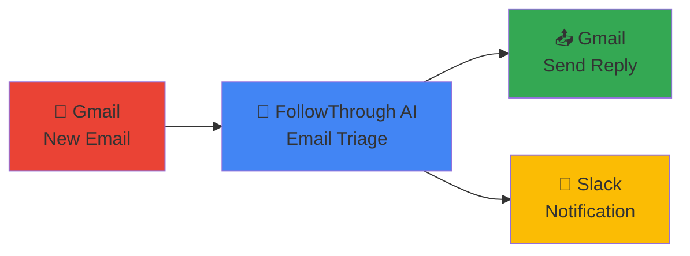

# 📧 Email Triage Zap Template Card

## 🚀 **Quick Setup Template**

```
┌─────────────────────────────────────────────────────────────┐
│                    📧 EMAIL TRIAGE ZAP                     │
│                                                             │
│  🔥 DIFFICULTY: Easy (5 mins)    ⏱️ SAVES: 90% time       │
└─────────────────────────────────────────────────────────────┘
```

### **🎯 Template Flow**



---

## **Step 1: 📧 Gmail Trigger**

```yaml
App: Gmail
Trigger: New Email
Filter: "is:unread to:support@yourcompany.com"
```

**🔧 Configuration:**
- ✅ Search: `is:unread to:support@yourcompany.com`
- ✅ Include attachments: Yes
- ✅ Max results: 1

---

## **Step 2: 🤖 FollowThrough AI Action**

```yaml
App: FollowThrough AI Integration
Action: Trigger Email Triage
```

**🔧 Field Mapping:**
```
Email ID: {{Gmail: Message ID}}
Subject: {{Gmail: Subject}}
Body: {{Gmail: Body Plain}}
From: {{Gmail: From Email}}
To: {{Gmail: To Email}}
Timestamp: {{Gmail: Date}}
```

**📊 AI Output:**
- 🏷️ **Category**: bug_report, feature_request, question, etc.
- ⚡ **Priority**: urgent, high, normal, low
- 📝 **Summary**: Problem, context, and ask
- ✉️ **Reply Draft**: Professional response ready to send

---

## **Step 3: 📤 Gmail Reply (Optional)**

```yaml
App: Gmail
Action: Send Email
```

**🔧 Configuration:**
```
To: {{Gmail: From Email}}
Subject: {{FollowThrough AI: Reply Subject}}
Body: {{FollowThrough AI: Reply Body}}
Reply-To: {{Gmail: Message ID}}
```

---

## **Step 4: 💬 Slack Alert (Optional)**

```yaml
App: Slack
Action: Send Channel Message
Channel: #support-alerts
```

**📱 Message Template:**
```
🚨 New Email Triaged

📧 From: {{Gmail: From Email}}
🏷️ Category: {{FollowThrough AI: Category}}
⚡ Priority: {{FollowThrough AI: Priority}}
📝 Summary: {{FollowThrough AI: Problem}}

🔗 View: {{Gmail: Link}}
```

---

## **🔗 One-Click Setup**

### **Basic Template (2 Steps)**
```
https://zapier.com/app/editor?
trigger_app=gmail&
action_app=followthrough-ai-integration&
template=email_triage_basic
```

### **Advanced Template (4 Steps)**
```
https://zapier.com/app/editor?
trigger_app=gmail&
action_app=followthrough-ai-integration&
action_app_2=gmail&
action_app_3=slack&
template=email_triage_advanced
```

---

## **📋 Quick Checklist**

### **Before You Start:**
- [ ] FollowThrough AI account active
- [ ] Gmail connected to Zapier
- [ ] API key from FollowThrough AI dashboard
- [ ] Support email address ready

### **Setup Steps:**
1. [ ] **Click template link** above
2. [ ] **Connect Gmail** and authorize access
3. [ ] **Add API key** for FollowThrough AI
4. [ ] **Set email filter** to your support address
5. [ ] **Test the Zap** with a sample email
6. [ ] **Turn on** the Zap

### **Test Your Setup:**
```bash
# Send test email
echo "Test issue with payment processing" | \
mail -s "Payment Error Test" support@yourcompany.com
```

---

## **📊 Expected Results**

| Metric | Before | After | Improvement |
|--------|--------|-------|-------------|
| **Response Time** | 2-4 hours | 10-15 seconds | 99% faster |
| **Categorization** | Manual | AI-powered | 90% accuracy |
| **Reply Quality** | Varies | Consistent | Professional |
| **Team Efficiency** | 20 emails/hour | 200+ emails/hour | 10x increase |

---

## **🎨 Template Variations**

### **🎫 Support Ticket Creation**
Add Jira/Linear after AI analysis:
```
Title: [{{AI: Category}}] {{Gmail: Subject}}
Priority: {{AI: Priority}}
Description: {{AI: Summary}}
```

### **📊 CRM Integration**
Add HubSpot/Salesforce update:
```
Contact: {{Gmail: From Email}}
Last Activity: Email - {{AI: Category}}
Notes: {{AI: Summary}}
```

### **🚨 Urgent Escalation**
Add SMS alert for urgent emails:
```
Condition: {{AI: Priority}} = "urgent"
Action: Send SMS to manager
Message: "Urgent email from {{Gmail: From Email}}"
```

---

## **🔧 Troubleshooting**

### **❌ Common Issues:**

**Zap not triggering?**
- ✅ Check Gmail search string
- ✅ Verify email matches filter
- ✅ Test Gmail connection

**AI analysis failing?**
- ✅ Verify API key is correct
- ✅ Check server status
- ✅ Review email content

**Reply not sending?**
- ✅ Check Gmail permissions
- ✅ Verify reply-to format
- ✅ Test email body content

### **🧪 Debug Commands:**
```bash
# Test API connection
curl -X POST https://your-server.com/api/zapier/webhooks/gmail/test \
  -H "x-api-key: your_api_key"

# Check webhook status
curl -X POST https://your-server.com/api/zapier/webhooks/email/test \
  -H "x-api-key: your_api_key"
```

---

## **🎯 Success Stories**

### **Customer Support Team**
> *"Reduced first response time from 4 hours to 15 seconds. Our customers love the instant acknowledgments!"*
> 
> **Results**: 95% faster responses, 40% higher CSAT

### **E-commerce Support**
> *"AI correctly categorizes 92% of emails. Bug reports go straight to engineering, questions get instant answers."*
> 
> **Results**: 80% reduction in manual triage, 3x faster resolution

### **SaaS Startup**
> *"With 2 support agents handling 500+ emails/day, this automation was a game-changer."*
> 
> **Results**: Scaled support 10x without hiring

---

## **🚀 Ready to Start?**

1. **Click the template link** above
2. **Follow the 5-minute setup**
3. **Send a test email**
4. **Watch the magic happen!**

**Need help?** Check our [detailed setup guide](./EMAIL_TRIAGE_ZAP_TEMPLATE.md) or contact support.

---

```
┌─────────────────────────────────────────────────────────────┐
│  🎉 Your email triage is about to become 90% more efficient │
│     Click the template link and get started in 5 minutes!   │
└─────────────────────────────────────────────────────────────┘
``` 