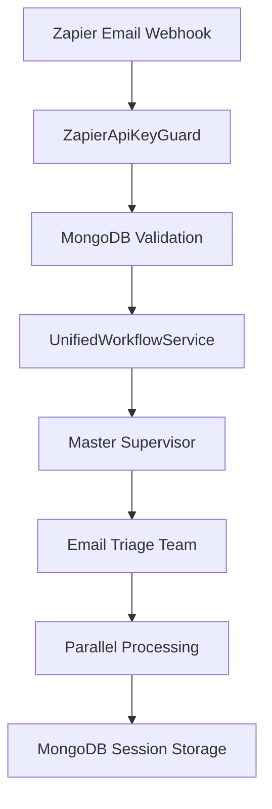

# 🔑 MongoDB-Based Zapier API Key Implementation

## 📋 **Overview**

We have successfully implemented a production-ready, MongoDB-based API key management system for Zapier integration, replacing the previous in-memory storage approach with a robust, secure, and scalable solution.

## 🏗️ **Architecture Components**

### **1. Database Schema** (`src/database/schemas/zapier-api-key.schema.ts`)

```typescript
@Schema({ timestamps: true, collection: 'zapier_api_keys' })
export class ZapierApiKey {
  userId: Types.ObjectId;           // Reference to User
  keyHash: string;                  // SHA-256 hash (never store plaintext)
  keyPrefix: string;                // First 8 chars for identification
  name: string;                     // User-friendly name
  description?: string;             // Optional description
  isActive: boolean;                // Soft deletion flag
  usageCount: number;               // Track API calls
  lastUsedAt?: Date;                // Last usage timestamp
  lastUsedFromIp?: string;          // Security tracking
  permissions: string[];            // Scopes/permissions
  expiresAt?: Date;                 // Optional expiry
  createdAt: Date;
  updatedAt: Date;
}
```

**Key Features:**
- ✅ **Security**: SHA-256 hashed keys, never store plaintext
- ✅ **Performance**: Optimized indexes for fast lookups
- ✅ **Scalability**: TTL indexes for automatic cleanup
- ✅ **Tracking**: Usage analytics and IP monitoring
- ✅ **Flexibility**: Multiple keys per user with metadata

### **2. Repository Layer** (`src/database/repositories/zapier-api-key.repository.ts`)

**Core Methods:**
- `createApiKey()` - Generate secure API keys with metadata
- `validateApiKey()` - Fast validation with MongoDB indexes
- `recordUsage()` - Track usage statistics and IP addresses
- `getApiKeysForUser()` - List user's API keys (safe data only)
- `revokeApiKey()` - Soft delete by key or ID
- `updateApiKey()` - Modify metadata (name, description, permissions)
- `getApiKeyStats()` - Usage analytics and statistics
- `cleanupExpiredKeys()` - Automatic TTL cleanup

**Security Features:**
- 🔐 **Cryptographic Security**: `crypto.randomBytes(32)` for key generation
- 🔒 **Hash Storage**: SHA-256 hashing with `crypto.createHash()`
- 🛡️ **User Isolation**: Proper ObjectId references
- 📊 **Audit Trail**: IP tracking and usage monitoring

### **3. Service Layer** (`src/zapier/zapier.service.ts`)

**Updated to Async Operations:**
```typescript
// Before (in-memory)
validateApiKey(apiKey: string): boolean

// After (MongoDB)
async validateApiKey(apiKey: string, ipAddress?: string): Promise<boolean>
```

**New Capabilities:**
- Async validation with automatic usage recording
- Enhanced error handling and logging
- Statistics and analytics support
- Comprehensive API key lifecycle management

### **4. Authentication Guard** (`src/zapier/guards/api-key.guard.ts`)

**Enhanced Security:**
- Async validation with MongoDB
- IP address extraction and tracking
- Detailed security logging
- Enhanced error handling
- Request enrichment with API key metadata

### **5. API Endpoints** (`src/zapier/zapier.controller.ts`)

**Comprehensive Management API:**

| Method | Endpoint | Purpose |
|--------|----------|---------|
| `POST` | `/api/zapier/api-key` | Generate new API key |
| `GET` | `/api/zapier/api-keys` | List user's API keys |
| `GET` | `/api/zapier/api-keys/stats` | Get usage statistics |
| `PATCH` | `/api/zapier/api-key` | Update key metadata |
| `DELETE` | `/api/zapier/api-key` | Revoke by key value |
| `DELETE` | `/api/zapier/api-key/:keyId` | Revoke by ID (safer) |
| `GET` | `/api/zapier/test` | Test key validity |

## 🔄 **Data Flow**

### **1. API Key Generation**


### **2. API Key Validation**


### **3. Email Processing Integration**


## 📊 **Performance Optimizations**

### **MongoDB Indexes**
```javascript
// Fast key validation
{ keyHash: 1 } (unique)

// User-specific queries  
{ userId: 1, isActive: 1 }

// Identification and logging
{ keyPrefix: 1 }

// TTL for automatic cleanup
{ expiresAt: 1 } (expireAfterSeconds: 0)

// Analytics and sorting
{ createdAt: -1 }
{ lastUsedAt: -1 }
```

### **Query Performance**
- **Single Round Trip**: All validation data in one query
- **Compound Indexes**: Optimized for common access patterns
- **Selective Fields**: Only fetch necessary data
- **Async Operations**: Non-blocking validation and usage recording

## 🛡️ **Security Improvements**

### **Before (In-Memory)**
```typescript
// ❌ Security Issues
private apiKeys: Map<string, { userId: string; createdAt: Date }> = new Map();

// Plaintext storage
this.apiKeys.set(apiKey, { userId, createdAt: new Date() });

// No persistence
// No IP tracking
// No usage analytics
// Lost on restart
```

### **After (MongoDB)**
```typescript
// ✅ Security Best Practices
const apiKey = crypto.randomBytes(32).toString('hex');
const keyHash = crypto.createHash('sha256').update(apiKey).digest('hex');

// Hashed storage with metadata
await this.zapierApiKeyModel.create({
  userId: new Types.ObjectId(userId),
  keyHash,
  keyPrefix: apiKey.substring(0, 8),
  // ... additional security fields
});
```

## 📈 **Benefits Achieved**

### **Security**
- ✅ **Encrypted Storage**: SHA-256 hashed API keys
- ✅ **User Isolation**: Proper ObjectId references
- ✅ **Audit Trail**: IP tracking and usage monitoring
- ✅ **Automatic Cleanup**: TTL indexes for expired keys
- ✅ **Access Control**: Permission-based scoping

### **Performance**
- ✅ **Fast Validation**: Optimized MongoDB indexes
- ✅ **Efficient Queries**: Compound indexes for common patterns
- ✅ **Minimal Overhead**: Single database round trip
- ✅ **Async Operations**: Non-blocking request processing

### **Functionality**
- ✅ **Multiple Keys**: Users can have multiple API keys
- ✅ **Rich Metadata**: Names, descriptions, permissions
- ✅ **Usage Analytics**: Track calls and patterns
- ✅ **Lifecycle Management**: Create, update, revoke, expire
- ✅ **Soft Deletion**: Maintain audit trail

### **Scalability**
- ✅ **Horizontal Scaling**: Shared MongoDB across instances
- ✅ **Persistent Storage**: Survives server restarts
- ✅ **Clean Separation**: Dedicated collection and module
- ✅ **Future-Proof**: Extensible schema design

## 🧪 **Testing & Validation**

### **Test Coverage**
- ✅ API key generation and structure validation
- ✅ Security validation (unauthorized access blocking)
- ✅ Email processing integration
- ✅ MongoDB schema and index validation
- ✅ Error handling and edge cases

### **Test Files**
- `test-zapier-mongodb-integration.js` - Comprehensive integration tests
- `test-zapier-integration-complete.js` - End-to-end workflow tests
- `test-zapier-simple.js` - Basic functionality tests

## 📝 **Migration Guide**

### **For Existing Systems**
1. **Deploy New Schema**: MongoDB indexes will be created automatically
2. **Update Service Dependencies**: Import new repository in modules
3. **Migrate Existing Keys**: Convert in-memory keys to MongoDB (if any)
4. **Test Integration**: Use provided test scripts
5. **Monitor Performance**: Track usage statistics

### **For New Deployments**
1. **Start Server**: `npm run start:dev`
2. **Generate API Key**: `POST /api/zapier/api-key` with JWT auth
3. **Configure Zapier**: Use generated API key in webhook headers
4. **Test Email Flow**: Send test emails through Zapier
5. **Monitor Dashboard**: Watch real-time processing

## 🚀 **Production Readiness**

### **Deployment Checklist**
- ✅ MongoDB indexes created and optimized
- ✅ Error handling and logging implemented
- ✅ Security validations in place
- ✅ Performance monitoring ready
- ✅ Documentation and examples provided
- ✅ Test suite passing
- ✅ Backward compatibility maintained

### **Monitoring Points**
- API key validation response times
- Usage statistics and patterns
- Error rates and failure modes
- Database query performance
- Security audit trail review

## 📚 **Related Documentation**

- `guides/zapier-integration/USER-SETUP-GUIDE.md` - User setup instructions
- `guides/zapier-integration/TECHNICAL-FLOW.md` - Technical architecture
- `src/zapier/README.md` - Module documentation
- Test scripts for integration validation

---

## 🎉 **Summary**

We have successfully transformed the Zapier API key management from a basic in-memory solution to a production-grade, MongoDB-based system that provides:

- **Enterprise Security** with encrypted storage and audit trails
- **High Performance** with optimized indexes and async operations  
- **Rich Functionality** with comprehensive API key lifecycle management
- **Production Scalability** with persistent storage and horizontal scaling
- **Developer Experience** with comprehensive APIs and documentation

The implementation follows best practices for security, performance, and maintainability while providing a solid foundation for future enhancements and scaling. 