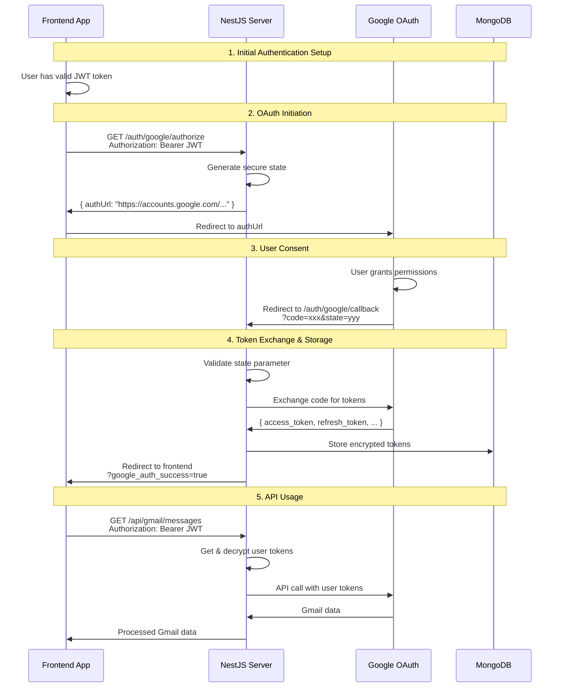

# 🌐 Google OAuth Client Integration Guide

## 📋 Overview

This guide explains how the frontend client integrates with our server-side Google OAuth implementation. The key principle is **server-side token management** - all sensitive tokens remain on the server, and the client communicates through secure API endpoints.

## 🔄 Complete OAuth Flow



---

## 🎯 Frontend Implementation

```typescript
// src/components/GoogleOAuthButton.tsx
import React, { useState, useEffect } from 'react';
import { GoogleOAuthService } from '../services/googleOAuthService';
import { useAuth } from '../hooks/useAuth'; // Your JWT auth hook

interface GoogleConnectionStatus {
  isConnected: boolean;
  googleEmail?: string;
  expiresAt?: string;
  needsRefresh?: boolean;
}

export const GoogleOAuthButton: React.FC = () => {
  const { userToken } = useAuth(); // Get JWT token
  const [connectionStatus, setConnectionStatus] = useState<GoogleConnectionStatus>({
    isConnected: false
  });
  const [loading, setLoading] = useState(false);
  const [error, setError] = useState<string | null>(null);

  const googleOAuthService = new GoogleOAuthService();

  // Check connection status on component mount
  useEffect(() => {
    checkConnectionStatus();
  }, [userToken]);

  // Handle OAuth callback results (check URL params)
  useEffect(() => {
    const urlParams = new URLSearchParams(window.location.search);
    
    if (urlParams.get('google_auth_success')) {
      const email = urlParams.get('email');
      console.log('Google OAuth successful!', { email });
      
      // Clear URL params and refresh status
      window.history.replaceState({}, '', window.location.pathname);
      checkConnectionStatus();
    } else if (urlParams.get('google_auth_error')) {
      const errorType = urlParams.get('google_auth_error');
      setError(`OAuth failed: ${errorType}`);
      window.history.replaceState({}, '', window.location.pathname);
    }
  }, []);

  const checkConnectionStatus = async () => {
    if (!userToken) return;

    try {
      setLoading(true);
      const status = await googleOAuthService.getGoogleConnectionStatus(userToken);
      setConnectionStatus(status);
    } catch (error) {
      console.error('Failed to check Google connection:', error);
      setError('Failed to check connection status');
    } finally {
      setLoading(false);
    }
  };

  const handleConnectGoogle = async () => {
    if (!userToken) {
      setError('Please log in first');
      return;
    }

    try {
      setLoading(true);
      setError(null);
      
      // This will redirect to Google's consent screen
      await googleOAuthService.initiateGoogleOAuth(userToken);
    } catch (error) {
      console.error('Google OAuth initiation failed:', error);
      setError('Failed to initiate Google OAuth');
      setLoading(false);
    }
  };

  const handleDisconnectGoogle = async () => {
    if (!userToken) return;

    try {
      setLoading(true);
      const success = await googleOAuthService.revokeGoogleAccess(userToken);
      
      if (success) {
        setConnectionStatus({ isConnected: false });
      } else {
        setError('Failed to disconnect Google account');
      }
    } catch (error) {
      console.error('Google disconnect failed:', error);
      setError('Failed to disconnect Google account');
    } finally {
      setLoading(false);
    }
  };

  const handleTestConnection = async () => {
    if (!userToken) return;

    try {
      setLoading(true);
      const result = await googleOAuthService.testGoogleConnection(userToken);
      
      if (result.success) {
        alert(`Google connection works! Email: ${result.testResult?.email}`);
      } else {
        setError(`Connection test failed: ${result.error}`);
      }
    } catch (error) {
      console.error('Connection test failed:', error);
      setError('Connection test failed');
    } finally {
      setLoading(false);
    }
  };

  if (loading) {
    return (
      <div className="flex items-center space-x-2">
        <div className="animate-spin rounded-full h-4 w-4 border-b-2 border-blue-600"></div>
        <span>Loading...</span>
      </div>
    );
  }

  return (
    <div className="space-y-4">
      {error && (
        <div className="bg-red-50 border border-red-200 rounded-md p-3">
          <p className="text-red-800 text-sm">{error}</p>
          <button 
            onClick={() => setError(null)}
            className="text-red-600 underline text-sm mt-1"
          >
            Dismiss
          </button>
        </div>
      )}

      {connectionStatus.isConnected ? (
        <div className="bg-green-50 border border-green-200 rounded-md p-4">
          <div className="flex items-center justify-between">
            <div>
              <h3 className="text-green-800 font-medium">Google Connected</h3>
              {connectionStatus.googleEmail && (
                <p className="text-green-700 text-sm mt-1">
                  Email: {connectionStatus.googleEmail}
                </p>
              )}
              {connectionStatus.expiresAt && (
                <p className="text-green-600 text-xs mt-1">
                  Expires: {new Date(connectionStatus.expiresAt).toLocaleString()}
                </p>
              )}
            </div>
            <div className="space-x-2">
              <button
                onClick={handleTestConnection}
                className="bg-blue-600 text-white px-3 py-1 rounded text-sm hover:bg-blue-700"
              >
                Test
              </button>
              <button
                onClick={handleDisconnectGoogle}
                className="bg-red-600 text-white px-3 py-1 rounded text-sm hover:bg-red-700"
              >
                Disconnect
              </button>
            </div>
          </div>
        </div>
      ) : (
        <div className="bg-gray-50 border border-gray-200 rounded-md p-4">
          <div className="flex items-center justify-between">
            <div>
              <h3 className="text-gray-800 font-medium">Google Not Connected</h3>
              <p className="text-gray-600 text-sm mt-1">
                Connect your Google account to access Gmail and Calendar
              </p>
            </div>
            <button
              onClick={handleConnectGoogle}
              className="bg-blue-600 text-white px-4 py-2 rounded hover:bg-blue-700 flex items-center space-x-2"
            >
              <svg className="w-4 h-4" viewBox="0 0 24 24">
                <path fill="currentColor" d="M22.56 12.25c0-.78-.07-1.53-.2-2.25H12v4.26h5.92c-.26 1.37-1.04 2.53-2.21 3.31v2.77h3.57c2.08-1.92 3.28-4.74 3.28-8.09z"/>
                <path fill="currentColor" d="M12 23c2.97 0 5.46-.98 7.28-2.66l-3.57-2.77c-.98.66-2.23 1.06-3.71 1.06-2.86 0-5.29-1.93-6.16-4.53H2.18v2.84C3.99 20.53 7.7 23 12 23z"/>
                <path fill="currentColor" d="M5.84 14.09c-.22-.66-.35-1.36-.35-2.09s.13-1.43.35-2.09V7.07H2.18C1.43 8.55 1 10.22 1 12s.43 3.45 1.18 4.93l2.85-2.22.81-.62z"/>
                <path fill="currentColor" d="M12 5.38c1.62 0 3.06.56 4.21 1.64l3.15-3.15C17.45 2.09 14.97 1 12 1 7.7 1 3.99 3.47 2.18 7.07l3.66 2.84c.87-2.6 3.3-4.53 6.16-4.53z"/>
              </svg>
              <span>Connect Google</span>
            </button>
          </div>
        </div>
      )}
    </div>
  );
};
```

### 3. Using Google APIs Through Server

```typescript
// src/services/gmailService.ts
export class GmailService {
  private baseURL = process.env.REACT_APP_API_URL || 'http://localhost:3000';

  /**
   * Get Gmail messages (server proxies to Google API)
   */
  async getGmailMessages(
    userJwtToken: string, 
    options: {
      query?: string;
      maxResults?: number;
      pageToken?: string;
    } = {}
  ): Promise<any> {
    try {
      const params = new URLSearchParams();
      if (options.query) params.append('query', options.query);
      if (options.maxResults) params.append('maxResults', options.maxResults.toString());
      if (options.pageToken) params.append('pageToken', options.pageToken);

      const response = await fetch(`${this.baseURL}/api/gmail/messages?${params}`, {
        method: 'GET',
        headers: {
          'Authorization': `Bearer ${userJwtToken}`,
          'Content-Type': 'application/json',
        },
      });

      if (!response.ok) {
        if (response.status === 401) {
          throw new Error('Google authentication required. Please reconnect your Google account.');
        }
        throw new Error(`Failed to get Gmail messages: ${response.status}`);
      }

      return await response.json();
    } catch (error) {
      console.error('Gmail API call failed:', error);
      throw error;
    }
  }

  /**
   * Send email via Gmail (server proxies to Google API)
   */
  async sendEmail(
    userJwtToken: string,
    emailData: {
      to: string;
      subject: string;
      body: string;
      isHtml?: boolean;
    }
  ): Promise<{ messageId: string }> {
    try {
      const response = await fetch(`${this.baseURL}/api/gmail/send`, {
        method: 'POST',
        headers: {
          'Authorization': `Bearer ${userJwtToken}`,
          'Content-Type': 'application/json',
        },
        body: JSON.stringify({
          to: emailData.to,
          subject: emailData.subject,
          [emailData.isHtml ? 'htmlBody' : 'textBody']: emailData.body,
        }),
      });

      if (!response.ok) {
        throw new Error(`Failed to send email: ${response.status}`);
      }

      return await response.json();
    } catch (error) {
      console.error('Email send failed:', error);
      throw error;
    }
  }
}
```

---

## 🔧 Server-Side API Endpoints

You'll need to create these protected endpoints that use the Google OAuth integration:

```typescript
// src/api/gmail.controller.ts
import { Controller, Get, Post, Body, Query, UseGuards, Req } from '@nestjs/common';
import { AuthGuard } from '@nestjs/passport';
import { GoogleAuthGuard } from '../integrations/google/guards/google-auth.guard';
import { GmailService } from '../integrations/google/services/gmail.service';

@Controller('api/gmail')
@UseGuards(AuthGuard('jwt'), GoogleAuthGuard) // Requires both JWT and Google OAuth
export class GmailController {
  constructor(private readonly gmailService: GmailService) {}

  @Get('messages')
  async getMessages(
    @Req() req: any,
    @Query('query') query?: string,
    @Query('maxResults') maxResults?: number,
    @Query('pageToken') pageToken?: string,
  ) {
    const userId = req.user.id;
    
    return this.gmailService.getMessages(userId, {
      query,
      maxResults: maxResults ? parseInt(maxResults.toString()) : 20,
      pageToken,
    });
  }

  @Post('send')
  async sendEmail(
    @Req() req: any,
    @Body() emailData: {
      to: string;
      subject: string;
      textBody?: string;
      htmlBody?: string;
    }
  ) {
    const userId = req.user.id;
    
    return this.gmailService.sendEmail(userId, emailData);
  }

  @Get('unread')
  async getUnreadEmails(@Req() req: any) {
    const userId = req.user.id;
    return this.gmailService.getUnreadEmails(userId, 50);
  }
}
```

---

## 🔑 Key Points

### Security Benefits
1. **No Token Exposure**: Client never sees Google tokens
2. **Server-Side Validation**: All Google API calls validated server-side
3. **Automatic Refresh**: Server handles token refresh transparently
4. **JWT Protection**: All endpoints require valid JWT authentication

### User Experience
1. **Seamless Flow**: One-click connection to Google
2. **Automatic Handling**: No manual token management required
3. **Error Recovery**: Clear error messages and retry options
4. **Status Visibility**: Always know connection status

### API Usage
1. **Proxy Pattern**: Client calls server, server calls Google
2. **Consistent Interface**: Standard REST API regardless of OAuth complexity
3. **Error Handling**: Server translates Google errors to meaningful messages
4. **Performance**: Server-side caching and optimization

---

## 🚀 Integration Workflow

1. **User Authentication**: User logs in and gets JWT token
2. **OAuth Initiation**: Client calls `/auth/google/authorize` with JWT
3. **User Consent**: User grants permissions on Google's screen
4. **Callback Processing**: Server handles callback and stores encrypted tokens
5. **API Access**: Client makes normal API calls, server uses stored tokens
6. **Background Management**: Server automatically refreshes tokens as needed

The beauty of this approach is that the client treats Google integration like any other API - just include the JWT token, and the server handles all the OAuth complexity! 🎯 