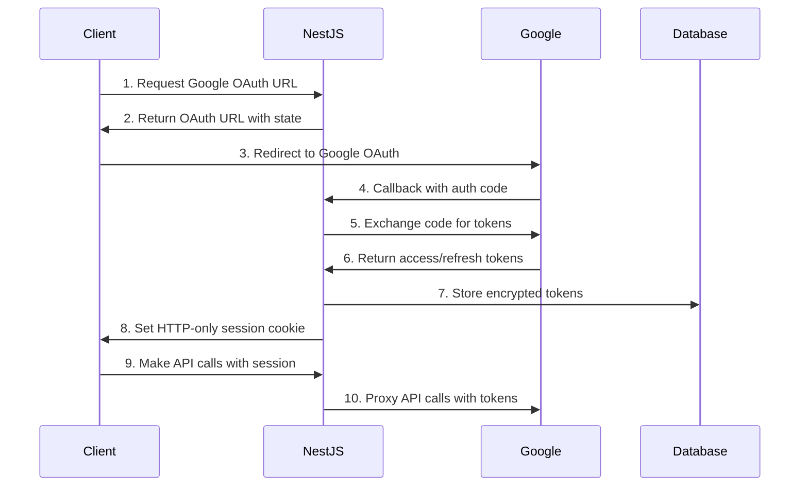

## 🔒 **Why Server-Side OAuth is Better**

1. **Security**: Client secrets never exposed to browser
2. **Token Management**: Centralized, encrypted token storage
3. **Session Control**: HTTP-only cookies prevent XSS attacks
4. **API Proxying**: Server validates and proxies Google API calls
5. **Refresh Logic**: Automatic token refresh without client involvement
## 📋 **Architecture Flow**



## 🏗️ **Detailed Implementation Plan**

### **Phase 1: NestJS Backend Setup**

#### 1. **Google OAuth Module Structure**
```typescript
// src/auth/google/google-oauth.module.ts
@Module({
  imports: [ConfigModule, DatabaseModule],
  controllers: [GoogleOAuthController],
  providers: [GoogleOAuthService, TokenService],
  exports: [GoogleOAuthService],
})
export class GoogleOAuthModule {}
```

#### 2. **Database Schema**
```typescript
// User Google Tokens Entity
@Entity('user_google_tokens')
export class UserGoogleTokens {
  @PrimaryGeneratedColumn()
  id: number;

  @Column()
  userId: string;

  @Column({ type: 'text' }) // Encrypted
  accessToken: string;

  @Column({ type: 'text', nullable: true }) // Encrypted
  refreshToken?: string;

  @Column()
  expiresAt: Date;

  @Column()
  scope: string;

  @Column()
  googleUserId: string;

  @Column()
  googleEmail: string;

  @CreateDateColumn()
  createdAt: Date;

  @UpdateDateColumn()
  updatedAt: Date;
}
```

#### 3. **Google OAuth Service**
```typescript
// src/auth/google/google-oauth.service.ts
@Injectable()
export class GoogleOAuthService {
  private readonly oauth2Client: OAuth2Client;

  constructor(
    private configService: ConfigService,
    private tokenService: TokenService,
  ) {
    this.oauth2Client = new OAuth2Client(
      this.configService.get('GOOGLE_CLIENT_ID'),
      this.configService.get('GOOGLE_CLIENT_SECRET'),
      this.configService.get('GOOGLE_REDIRECT_URI'),
    );
  }

  // Generate OAuth URL
  generateAuthUrl(userId: string): string {
    const state = this.generateSecureState(userId);
    
    return this.oauth2Client.generateAuthUrl({
      access_type: 'offline',
      scope: [
        'https://www.googleapis.com/auth/gmail.readonly',
        'https://www.googleapis.com/auth/gmail.send',
        'https://www.googleapis.com/auth/calendar.readonly',
        'https://www.googleapis.com/auth/calendar.events',
        'https://www.googleapis.com/auth/userinfo.email',
        'https://www.googleapis.com/auth/userinfo.profile',
      ],
      state,
      prompt: 'consent',
    });
  }

  // Handle OAuth callback
  async handleCallback(code: string, state: string) {
    const userId = this.validateState(state);
    const { tokens } = await this.oauth2Client.getToken(code);
    
    // Get user info
    this.oauth2Client.setCredentials(tokens);
    const userInfo = await this.getUserInfo();
    
    // Store tokens securely
    await this.tokenService.storeTokens(userId, tokens, userInfo);
    
    return { success: true, userId };
  }

  // Refresh tokens
  async refreshTokens(userId: string) {
    const tokenData = await this.tokenService.getTokens(userId);
    this.oauth2Client.setCredentials({
      refresh_token: tokenData.refreshToken,
    });
    
    const { credentials } = await this.oauth2Client.refreshAccessToken();
    await this.tokenService.updateTokens(userId, credentials);
    
    return credentials;
  }
}
```

#### 4. **OAuth Controller**
```typescript
// src/auth/google/google-oauth.controller.ts
@Controller('auth/google')
export class GoogleOAuthController {
  constructor(
    private googleOAuthService: GoogleOAuthService,
    private sessionService: SessionService,
  ) {}

  @Get('authorize')
  @UseGuards(JwtAuthGuard)
  async authorize(@Req() req, @Res() res) {
    const userId = req.user.id;
    const authUrl = this.googleOAuthService.generateAuthUrl(userId);
    
    return res.json({ authUrl });
  }

  @Get('callback')
  async callback(
    @Query('code') code: string,
    @Query('state') state: string,
    @Res() res,
  ) {
    try {
      const result = await this.googleOAuthService.handleCallback(code, state);
      
      // Create session cookie
      const sessionToken = await this.sessionService.createSession(
        result.userId,
        { googleConnected: true }
      );
      
      res.cookie('session', sessionToken, {
        httpOnly: true,
        secure: process.env.NODE_ENV === 'production',
        sameSite: 'lax',
        maxAge: 7 * 24 * 60 * 60 * 1000, // 7 days
      });
      
      return res.redirect(
        `${process.env.CLIENT_URL}/dashboard?google_auth_success=true`
      );
    } catch (error) {
      return res.redirect(
        `${process.env.CLIENT_URL}/dashboard?google_auth_error=token_exchange_failed`
      );
    }
  }

  @Get('status')
  @UseGuards(JwtAuthGuard)
  async getStatus(@Req() req) {
    const userId = req.user.id;
    const isConnected = await this.googleOAuthService.isConnected(userId);
    const userInfo = isConnected 
      ? await this.googleOAuthService.getGoogleUserInfo(userId)
      : null;
    
    return {
      isConnected,
      userInfo,
    };
  }

  @Delete('revoke')
  @UseGuards(JwtAuthGuard)
  async revoke(@Req() req) {
    const userId = req.user.id;
    await this.googleOAuthService.revokeAccess(userId);
    return { success: true };
  }
}
```

#### 5. **Google API Proxy Controllers**
```typescript
// src/integrations/gmail/gmail.controller.ts
@Controller('integrations/gmail')
@UseGuards(JwtAuthGuard, GoogleAuthGuard)
export class GmailController {
  constructor(private gmailService: GmailService) {}

  @Get('messages')
  async getMessages(@Req() req, @Query() query) {
    const userId = req.user.id;
    return this.gmailService.getMessages(userId, query);
  }

  @Post('send')
  async sendEmail(@Req() req, @Body() emailData) {
    const userId = req.user.id;
    return this.gmailService.sendEmail(userId, emailData);
  }
}

// src/integrations/calendar/calendar.controller.ts
@Controller('integrations/calendar')
@UseGuards(JwtAuthGuard, GoogleAuthGuard)
export class CalendarController {
  constructor(private calendarService: CalendarService) {}

  @Get('events')
  async getEvents(@Req() req, @Query() query) {
    const userId = req.user.id;
    return this.calendarService.getEvents(userId, query);
  }
}
```

