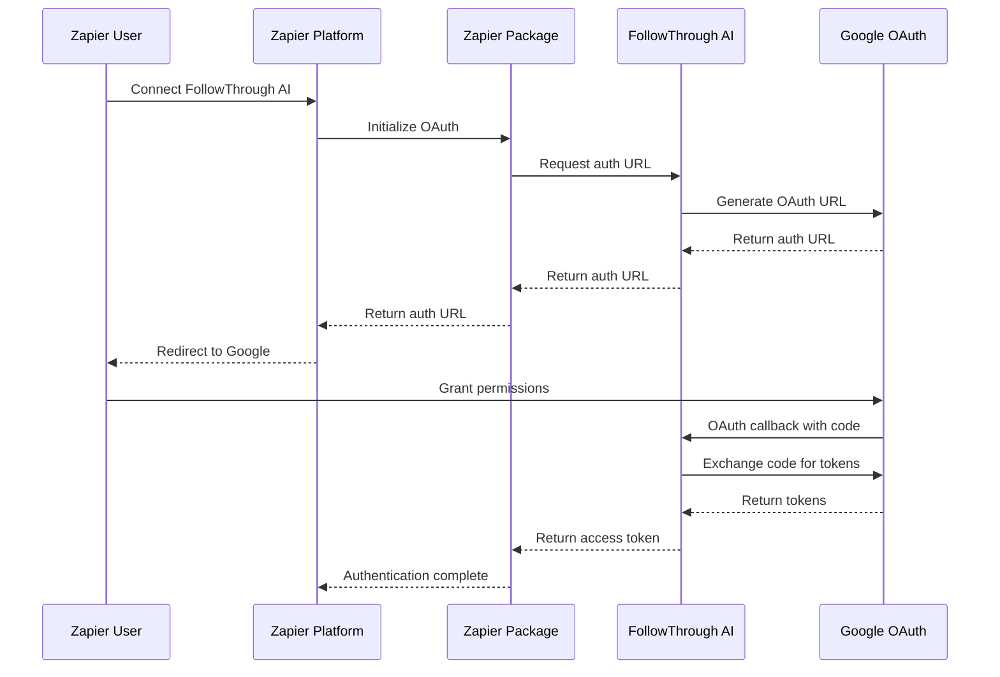
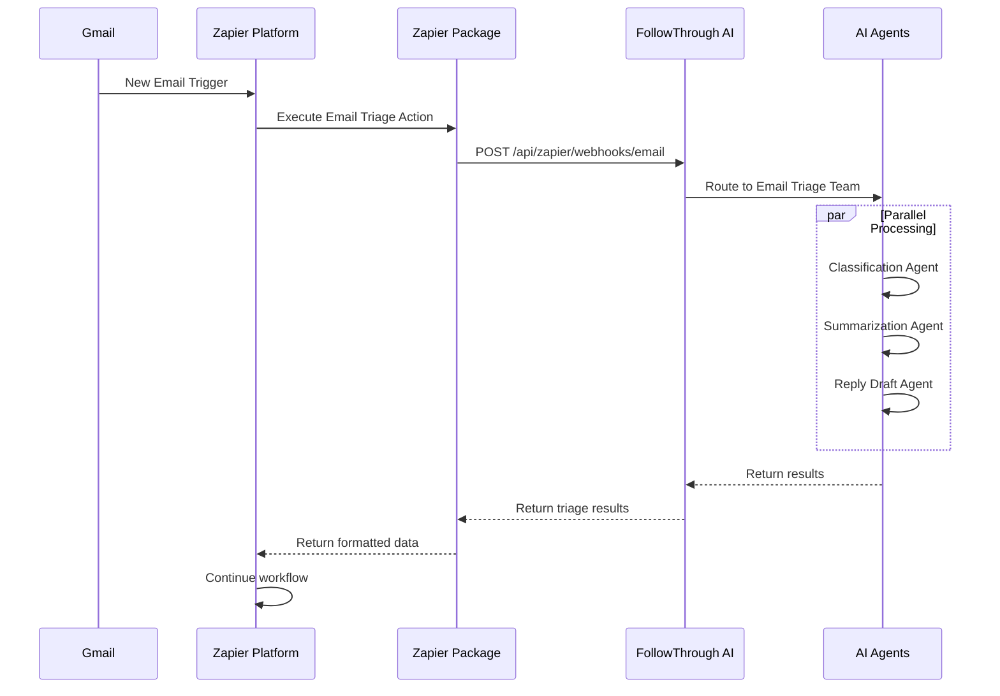

# FollowThrough AI - Zapier Integration

A TypeScript-based Zapier CLI package that integrates FollowThrough AI's email triage and meeting analysis capabilities with Gmail and Google Calendar through Google OAuth.

## 🚀 Features

### Triggers
- **New Email**: Triggers when a new email is received in Gmail
- **New Calendar Event**: Triggers when a new calendar event is created
- **Email Matching Search**: Triggers for emails matching specific Gmail search queries

### Actions
- **Trigger AI Email Triage**: Analyzes emails for priority, category, and generates reply drafts
- **Trigger Meeting Analysis**: Analyzes calendar events and generates insights
- **Send Email**: Sends emails via Gmail
- **Create Calendar Event**: Creates new calendar events

### Creates
- **Draft Reply**: Creates AI-generated email reply drafts
- **Task from Email**: Converts emails into actionable tasks

### Searches
- **Find Emails**: Search Gmail messages
- **Find Events**: Search calendar events

## 📋 Prerequisites

- Node.js 18+ and npm 8+
- Zapier CLI installed globally: `npm install -g zapier-platform-cli`
- FollowThrough AI server running with Google OAuth configured
- Google Cloud Console project with Gmail and Calendar APIs enabled

## 🛠️ Development Setup

### 1. Install Dependencies

```bash
cd zapier-packages/followthrough-ai-integration
npm install
```

### 2. Environment Configuration

Create a `.env` file:

```bash
# Zapier CLI Configuration
ZAPIER_DEPLOY_KEY=your_zapier_deploy_key

# FollowThrough AI API
FOLLOWTHROUGH_API_URL=https://your-domain.com
FOLLOWTHROUGH_API_KEY=your_api_key

# Google OAuth (same as your server)
GOOGLE_CLIENT_ID=your_google_client_id.apps.googleusercontent.com
GOOGLE_CLIENT_SECRET=your_google_client_secret

# MCP Server URLs (optional)
GMAIL_MCP_SERVER=https://your-domain.com/mcp/gmail
CALENDAR_MCP_SERVER=https://your-domain.com/mcp/calendar
```

### 3. Build the Package

```bash
npm run build
```

### 4. Test Locally

```bash
# Run all tests
npm test

# Test specific trigger/action
zapier test --grep "new_email"
zapier test --grep "trigger_email_triage"

# Debug mode
npm run dev
```

## 🔧 Integration Architecture

### Authentication Flow



### Email Triage Flow



## 📦 Package Structure

```
src/
├── authentication/           # OAuth 2.0 configuration
│   └── index.ts
├── triggers/                # Zapier triggers
│   ├── new-email.ts
│   ├── new-calendar-event.ts
│   └── email-matching-search.ts
├── actions/                 # Zapier actions
│   ├── trigger-email-triage.ts
│   ├── trigger-meeting-analysis.ts
│   ├── send-email.ts
│   └── create-calendar-event.ts
├── creates/                 # Zapier creates
│   ├── draft-reply.ts
│   └── task-from-email.ts
├── searches/                # Zapier searches
│   ├── find-emails.ts
│   └── find-events.ts
├── utils/                   # Utility classes
│   ├── api-client.ts        # FollowThrough AI API client
│   ├── google-client.ts     # Google API wrapper
│   ├── mcp-client.ts        # MCP server client
│   └── validators.ts        # Input validation
├── types/                   # TypeScript definitions
│   ├── email.ts
│   ├── calendar.ts
│   └── ai-response.ts
└── index.ts                 # Main package entry
```

## 🔐 Security Features

- **OAuth 2.0**: Secure Google authentication via your server
- **API Key Authentication**: Additional layer for FollowThrough AI API
- **Token Encryption**: Tokens encrypted and stored securely on your server
- **Automatic Token Refresh**: Handles token expiration transparently
- **Request Validation**: Input validation and sanitization

## 🚀 Deployment

### 1. Build and Validate

```bash
npm run build
npm run validate
```

### 2. Deploy to Zapier

```bash
# Push to Zapier platform
npm run push

# Promote to production
zapier promote 1.0.0
```

### 3. Make Public (Optional)

```bash
# Convert to public app
zapier convert
```

## 📊 Usage Examples

### Example 1: Email Triage Automation

**Trigger**: New Email in Gmail (filtered by `to:support@company.com`)
**Action**: Trigger AI Email Triage
**Result**: Email classified as "urgent bug_report" with reply draft generated

### Example 2: Meeting Analysis Workflow

**Trigger**: New Calendar Event
**Action**: Trigger Meeting Analysis
**Result**: Meeting analyzed for action items and follow-ups

### Example 3: Automated Reply System

**Trigger**: New Email Matching Search (`is:unread label:support`)
**Action 1**: Trigger AI Email Triage
**Action 2**: Send Email (using generated reply draft)
**Result**: Automated professional responses to support emails

## 🔧 Customization

### Adding New Triggers

1. Create new file in `src/triggers/`
2. Implement trigger interface
3. Add to `src/index.ts`
4. Test and deploy

### Adding New Actions

1. Create new file in `src/actions/`
2. Implement action interface
3. Add to `src/index.ts`
4. Test and deploy

### Custom API Endpoints

Modify `src/utils/api-client.ts` to add new endpoints:

```typescript
async customEndpoint(data: any): Promise<any> {
  return this.post('/api/custom/endpoint', data);
}
```

## 🐛 Troubleshooting

### Common Issues

1. **Authentication Failed**
   - Check Google OAuth credentials
   - Verify FollowThrough AI API key
   - Ensure server is accessible

2. **Trigger Not Firing**
   - Check Gmail search query syntax
   - Verify webhook subscription
   - Check Zapier task history

3. **Action Timeout**
   - Increase timeout in Zapier settings
   - Check server response times
   - Verify API endpoints

### Debug Mode

```bash
# Enable debug logging
npm run dev

# Check Zapier logs
zapier logs
```

## 📈 Monitoring

### Key Metrics

- **Trigger Success Rate**: Monitor trigger execution success
- **Action Response Time**: Track API response times
- **Error Rate**: Monitor failed requests
- **User Adoption**: Track active Zaps using the integration

### Logging

All requests and errors are logged with structured data:

```typescript
z.console.log('Email triage completed', {
  emailId: 'email-123',
  priority: 'urgent',
  category: 'bug_report',
  processingTime: '2.3s'
});
```

## 🤝 Contributing

1. Fork the repository
2. Create a feature branch
3. Make changes and add tests
4. Submit a pull request

## 📄 License

MIT License - see LICENSE file for details

## 🆘 Support

- **Documentation**: [FollowThrough AI Docs](https://docs.followthrough.ai)
- **API Reference**: [API Documentation](https://api.followthrough.ai/docs)
- **Support Email**: support@followthrough.ai
- **Zapier Platform**: [Zapier Developer Docs](https://platform.zapier.com/docs)

---

**Built with ❤️ by the FollowThrough AI team** 